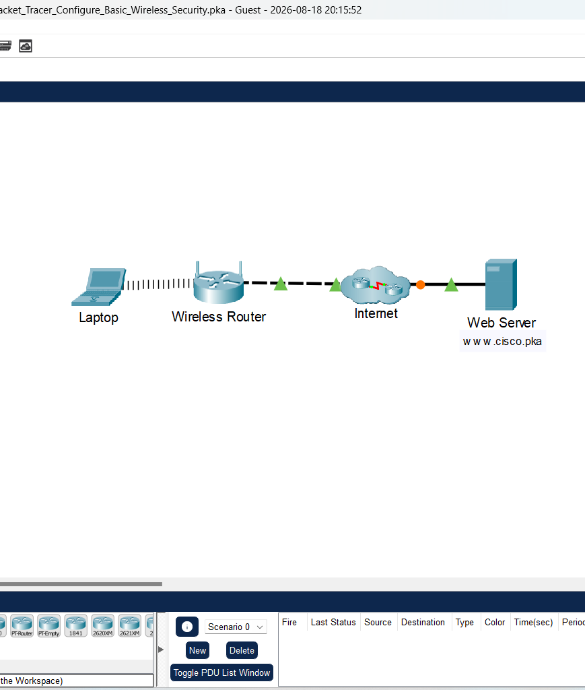
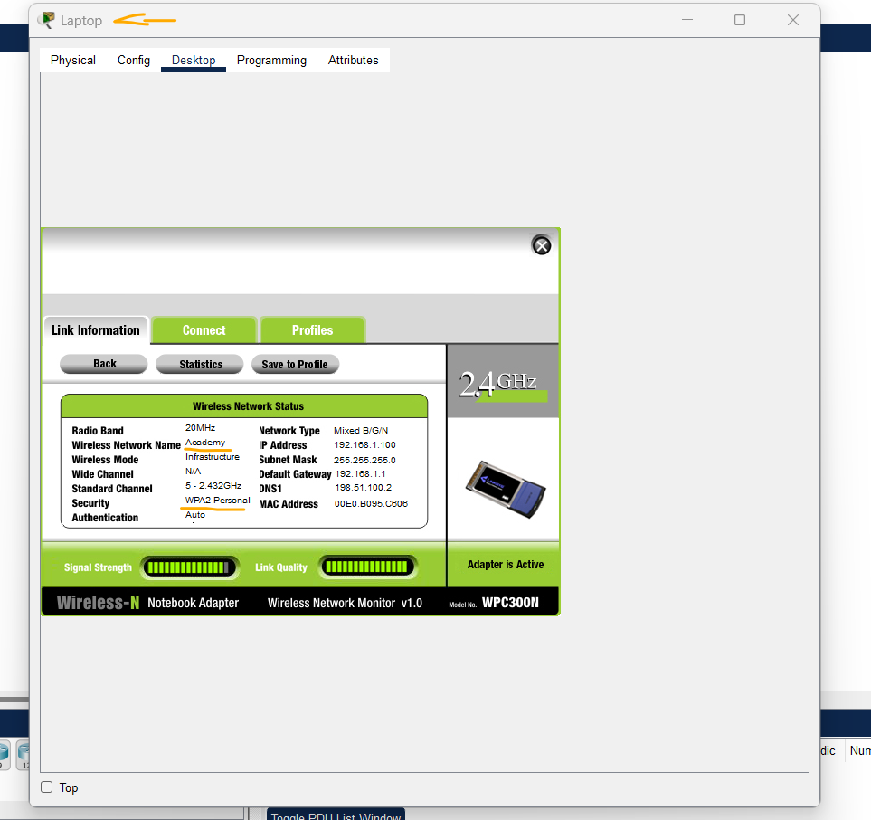
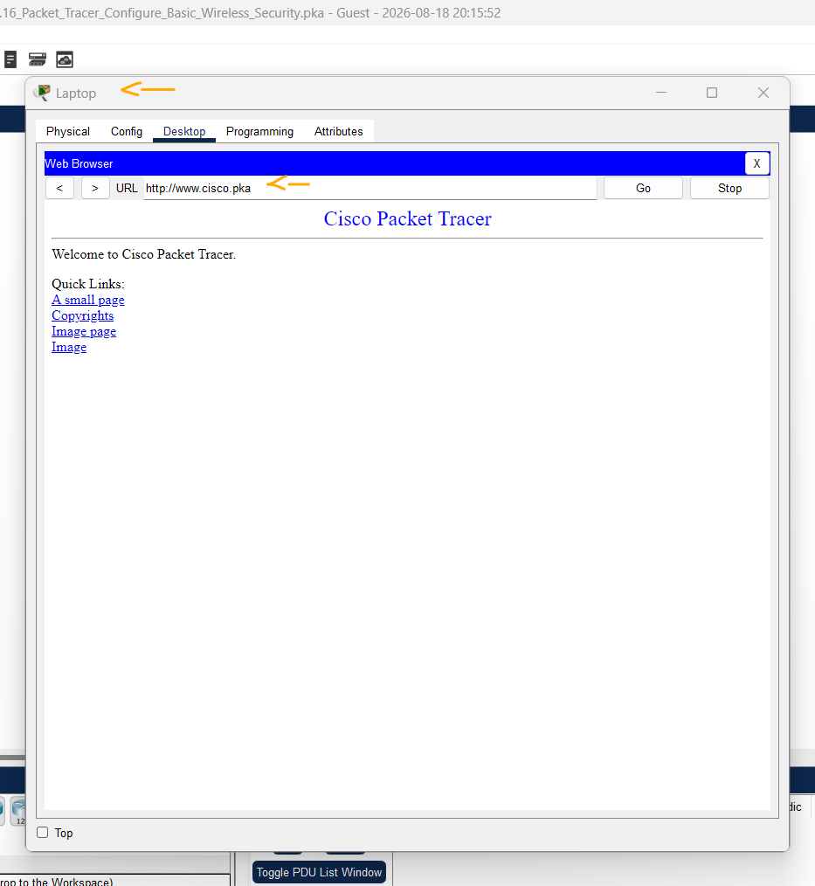

# Packet Tracer - Configurando Segurança Básica em Redes sem Fios   

### Cisco: <a href="../../../">cisco   </a>
### Cisco Networking Academy: cna   </a>
### Training Category: <a href="../../../pkt/">pkt</a>
### Software/Subject: network   </a>
### Course: <a href="./">pkt_077 (Packet Tracer - Configurando Segurança Básica em Redes sem Fios)   </a>

---

### Theme:
- Network

### Used Tools:
- Operating System (OS): 
  - Windows 11 
- Cloud Services:
  - Google Drive 
- Language:
  - HTML   
  - Markdown   
- Integrated Development Environment (IDE) and Text Editor:
  - Visual Studio Code (VS Code)   
- Versioning: 
  - Git   
- Repository:
  - GitHub   
- Network:
  - Cisco Packet Tracer   

---

<h3><a name="item00">Course Strcuture:</a></h3>

1. <a href="#item01">Parte 1: Verificar conectividade</a> 
2. <a href="#item02">Parte 2: Configurar segurança básica sem fio.</a> 
3. <a href="#item03">Parte 3: Atualizar as configurações sem fio no Laptop.</a> 
4. <a href="#item04">Parte 4: Verificar conectividade.</a> 

---

### Objective:
Esta atividade teve como objetivo realizar a configuração básica de autenticação da rede wireless de 2,4 GHz do roteador, utilizando o modo de segurança WPA2-Personal, indicado para redes domésticas, e a criptografia AES, além da definição de uma senha para autenticação dos dispositivos. Em seguida, foi estabelecida a conexão de um dispositivo à rede wireless por meio da senha configurada e realizado o acesso a um servidor web, a fim de comprovar a conectividade com a Internet.

### Folder Structure:
- [README.md](./README.md): Este documento de README, escrito em **Markdown**, com o conteúdo do laboratório.
- [0-aux](./0-aux/): Pasta auxiliar com imagens utilizadas na construção dos arquivos de README desse curso.

### Development:

<a name="item01"><h4>1. Parte 1: Verificar conectividade</h4></a>[Back to summary](#item00)

A imagem 01 mostra a topologia inicial.

<figure>
     
    <figcaption>Imagem 01.</figcaption>
</figure>
 

- a. Acesse Desktop > Web Browser no laptop.
- b. Digite "www.cisco.pka" na barra de endereço (URL). A página Web deve aparecer.
  - `www.cisco.pka`.

<a name="item02"><h4>2. Parte 2: Configurar segurança básica sem fio.</h4></a>[Back to summary](#item00)

- a. Digite "192.168.1.1" na barra de endereço do navegador para acessar o roteador sem fio. Insira admin como nome de usuário e senha.
  - `192.168.1.1` -> `admin` -> `admin`.
- b. Click no menu "Wireless". Selecione Segurança Wireless no menu.
- c. O modo de segurança está desativado no momento. Para rede de 2,4 GHz, altere o modo de segurança para WPA2 Pessoal. Para as redes de 5 GHz, você pode deixá-las como desativadas.
- d. no campo Passphrase, digite Network123.
  - `Network123`.
- e. Role para baixo até a parte inferior da página e clique em Salvar configurações. Feche o web browser.

<a name="item03"><h4>3. Parte 3: Atualizar as configurações sem fio no Laptop.</h4></a>[Back to summary](#item00)

- a. Clique em PC Wireless na guia Desktop.
- b. Clique na guia conectar. Selecione a Academia e clique em Conectar.
- c. Digite Network123 como a chave pré-compartilhada. Clique Conectar.
  - `Network123`.
- d. Feche a janela PC Wireless.

A imagem 02 exibe o laptop conectado à rede wireless de 2,4 GHz, após a autenticação realizada por meio da senha previamente configurada no roteador.

<figure>
     
    <figcaption>Imagem 02.</figcaption>
</figure>
 

<a name="item04"><h4>4. Parte 4: Observe o tráfego entre o cliente e o servidor Web.</h4></a>[Back to summary](#item00)

- a. Acesse o Web Browser.
- b. Digite "www.cisco.pka" na URL. A página Web deve aparecer assim que a configuração básica da rede sem fio for adicionada.
  - `www.cisco.pka`.
c. Se você não conseguir acessar a página da web, verifique as configurações sem fio no roteador sem fio e no laptop. Se não for possível acessar a página Web, verifique as configurações da rede sem fio no roteador sem fio e no laptop.

A imagem 03 demonstra que o acesso ao servidor web foi realizado com sucesso, comprovando que o laptop estava devidamente conectado à rede e possuía acesso à Internet.

<figure>
     
    <figcaption>Imagem 03.</figcaption>
</figure>
 