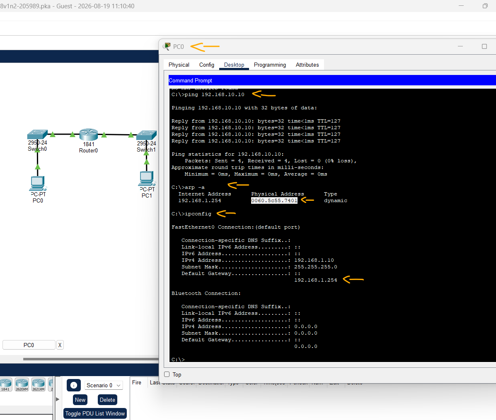

# Networking Essentials (Fundamentos de Redes) - Módulo 14 - Exam - Q10   

### Cisco: <a href="../../../">cisco   </a>
### Cisco Networking Academy: cna   </a>
### Training Category: <a href="../../../pkt/">pkt</a>
### Software/Subject: network   </a>
### Course: <a href="./">pkt_079 (Networking Essentials (Fundamentos de Redes) - Módulo 14 - Exam - Q10)   </a>

---

### Theme:
- Network

### Used Tools:
- Operating System (OS): 
  - Cisco Internetwork Operating System (Cisco IOS)   
  - Windows 11 
- Cloud Services:
  - Google Drive 
- Language:
  - HTML   
  - Markdown   
- Integrated Development Environment (IDE) and Text Editor:
  - Visual Studio Code (VS Code)   
- Versioning: 
  - Git   
- Repository:
  - GitHub   
- Network:
  - arp   
  - Cisco Packet Tracer   
  - ipconfig   
  - ping   

---

<h3><a name="item00">Course Strcuture:</a></h3>

1. <a href="#item01">Networking Essentials (Fundamentos de Redes) - Módulo 14 - Exam - Q10</a> 

---

### Objective:
O objetivo deste PTSA foi identificar o endereço MAC do gateway padrão do PC0.

### Folder Structure:
- [README.md](./README.md): Este documento de README, escrito em **Markdown**, com o conteúdo do laboratório.
- [0-aux](./0-aux/): Pasta auxiliar com imagens utilizadas na construção dos arquivos de README desse curso.

### Development:

<a name="item01"><h4>1. Networking Essentials (Fundamentos de Redes) - Módulo 14 - Exam - Q10</h4></a>[Back to summary](#item00)

- a. Execute um ping de PC0 para PC1.
  - `ping 192.168.10.10` -> `arp -a` -> `ipconfig`.
- a. Identifique o endereço MAC do gateway padrão para PC0.
  - `192.168.1.254` -> `0060.5c55.7401`.

A imagem 01 exibe o endereço MAC do gateway padrão do PC0.

<figure>
     
    <figcaption>Imagem 01.</figcaption>
</figure>
 