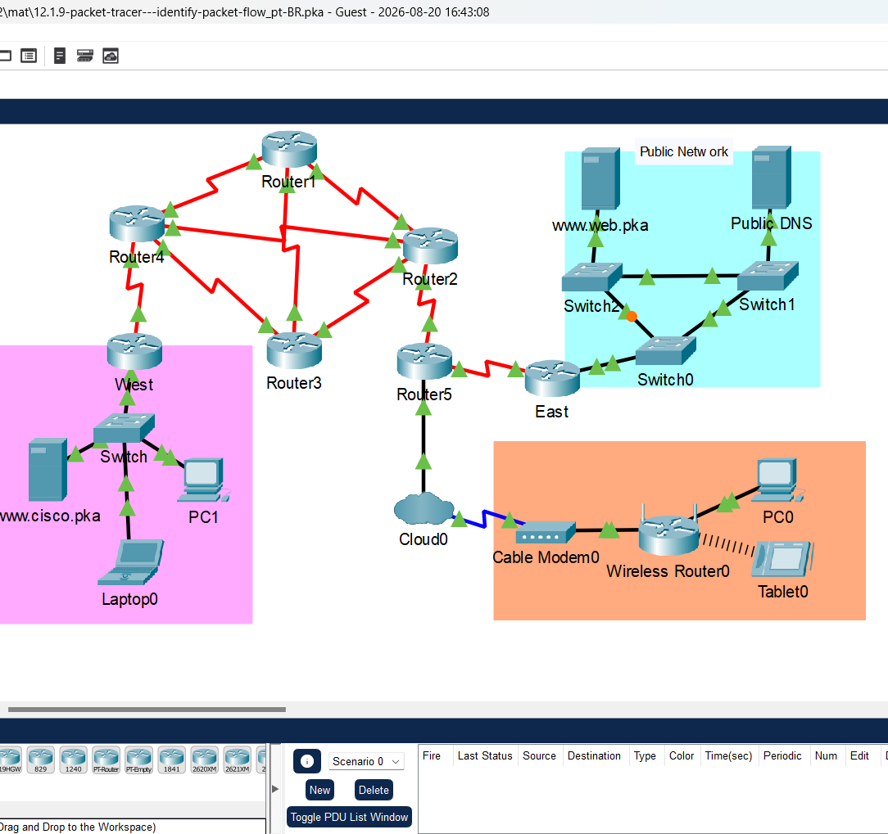
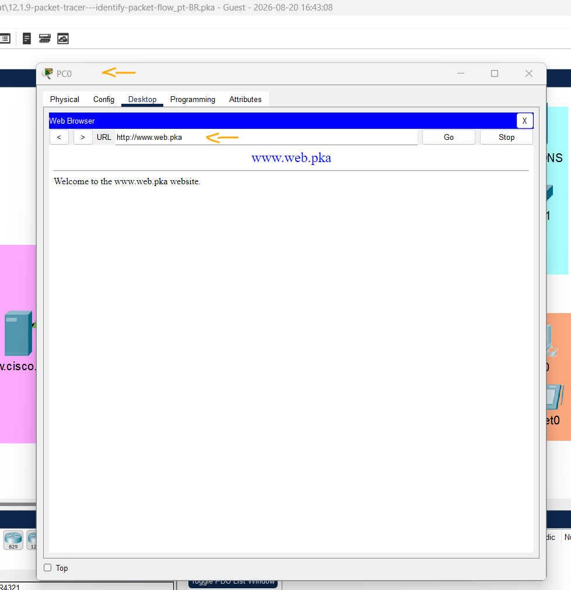
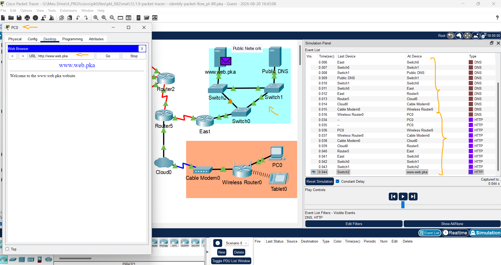
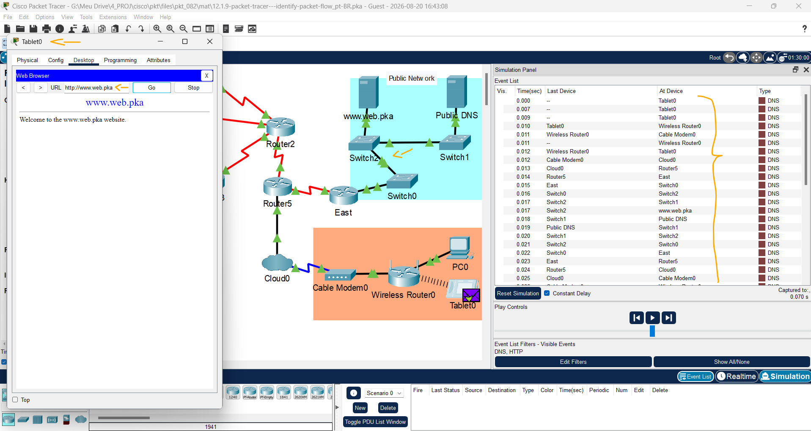
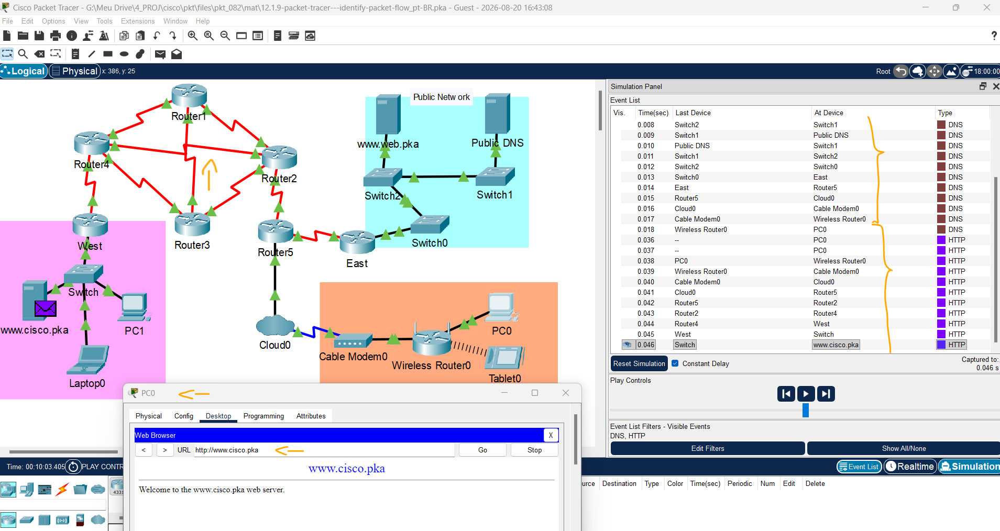
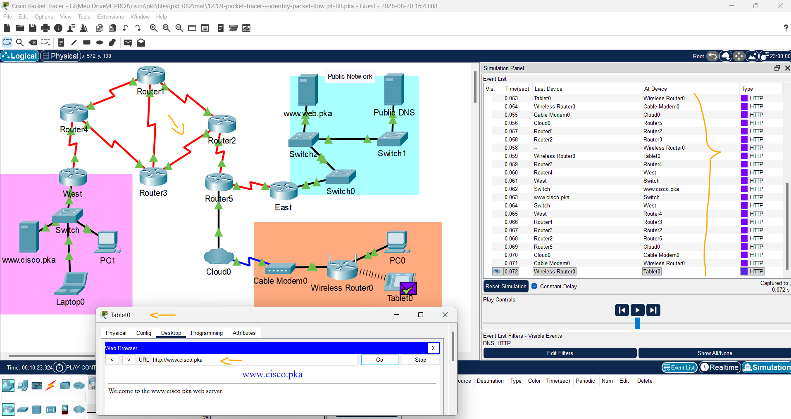
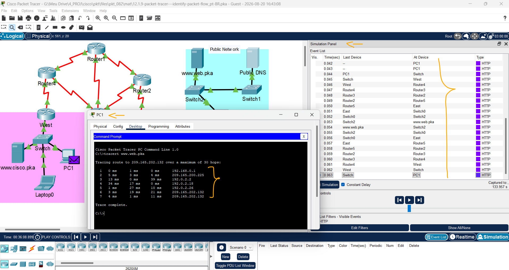

# Packet Tracer - Identificar Fluxo   

### Cisco: <a href="../../../">cisco   </a>
### Cisco Networking Academy: cna   </a>
### Training Category: <a href="../../../pkt/">pkt</a>
### Software/Subject: network   </a>
### Course: <a href="./">pkt_082 (Packet Tracer - Identificar Fluxo)   </a>

---

### Theme:
- Network

### Used Tools:
- Operating System (OS): 
  - Windows 11 
- Cloud Services:
  - Google Drive 
- Language:
  - HTML   
  - Markdown   
- Integrated Development Environment (IDE) and Text Editor:
  - Visual Studio Code (VS Code)   
- Versioning: 
  - Git   
- Repository:
  - GitHub   
- Network:
  - Cisco Packet Tracer   
  - ping   
  - Trace Route (tracert)   

---

<h3><a name="item00">Course Strcuture:</a></h3>

1. <a href="#item01">Parte 1: Verificação de Conectividade</a> 
2. <a href="#item02">Parte 2: Topologia de rede remota de LAN</a> 
3. <a href="#item03">Parte 3: Topologia de rede WAN</a> 
  3.1 <a href="#item03.01">Etapa 1: PC0 para sites.</a> 
  3.2 <a href="#item03.02">Etapa 2: PC1 para sites.</a> 

---

### Objective:
O objetivo desta atividade foi analisar o fluxo de pacotes em diferentes topologias de rede (LAN e WAN) e observar como alterações na topologia podem modificar o caminho percorrido pelo tráfego.

### Folder Structure:
- [README.md](./README.md): Este documento de README, escrito em **Markdown**, com o conteúdo do laboratório.
- [0-aux](./0-aux/): Pasta auxiliar com imagens utilizadas na construção dos arquivos de README desse curso.

### Development:

<a name="item01"><h4>1. Parte 1: Verificação de Conectividade</h4></a>[Back to summary](#item00)

A imagem 01 mostra a topologia inicial.

<figure>
     
    <figcaption>Imagem 01.</figcaption>
</figure>
 

Nesta parte, você verificará se pode acessar as outras redes a partir de dispositivos na Rede Doméstica.

- a. Clique no PC0. Selecione a guia Desktop e abra o navegador da web. 
- b. No campo URL, digite www.cisco.pka e pressione Ir. Certifique-se de usar o domínio.pka, não o domínio.com. Ele deve ser bem-sucedido. Você pode clicar em Avanço rápido Time para acelerar o processo. 
  - `www.cisco.pka`.
- c. Repita isso para www.web.pka. Ele deve ser bem-sucedido. 
  - `www.web.pka`.
- d. Saia do navegador da Web quando terminar.

A imagem 02 comprova o acesso do PC0 aos servidores web.

<figure>
     
    <figcaption>Imagem 02.</figcaption>
</figure>
 

<a name="item02"><h4>2. Parte 2: Topologia de rede remota de LAN</h4></a>[Back to summary](#item00)

Nesta parte, você usará o modo de simulação no Packet Tracer para observar como os pacotes fluem através de uma rede LAN remota. 

- a. Mude para o modo Simulação (Shift + S). Clique em Mostrar tudo / nenhum para limpar todos os filtros da lista de eventos selecionados. 
- b. Clique em Editar Filtros. Selecione DNS na guia IPv4 e HTTP na guia Diversos. 
- c. Abra um navegador da web no PC0. Digite www.web.pka e pressione Go.
  - `www.web.pka`.
- c. Preveja o caminho do pacote para resolver www.web.pka para um endereço IP. Grave sua previsão.
  - O caminho previsto para a resolução do nome de domínio www.web.pka em um endereço IP foi: PC0 → Wireless Router0 → Cable Modem0 → Cloud0 → Router5 → East → Switch0 → Switch1 → Public DNS.
- d. Clique em Capturar/Encaminhar até que a página da Web seja exibida no PC0 para exibir o fluxo de pacotes. Clique em Exibir eventos anteriores quando solicitado pela caixa de diálogo Buffer Completo. Depois que o endereço IP foi resolvido, qual caminho os pacotes HTTP viajaram para exibir a página da Web? Registre suas observações.
  - Após a resolução do endereço IP, observou-se que os pacotes HTTP percorreram o seguinte caminho para exibir a página web: PC0 → Wireless Router0 → Cable Modem0 → Cloud0 → Router5 → East → Switch0 → Switch1 → Switch2 → servidor web.pka.
- e. Mude para o modo em tempo real (Shift + R). Clique no ícone X no painel de ferramentas direito para selecionar a ferramenta Excluir. Remova o link entre o Switch0 e o Switch 1 da Rede Pública para simular um link quebrado. Após 30 segundos, a rede aprenderá sobre o link quebrado. Você pode clicar em Avanço rápido para acelerar o processo. 
- f. Selecione a ferramenta Seta acima da ferramenta Excluir para desmarcar Excluir.
- g. Mude para o modo Simulação (Shift + S). Abra um navegador da Web no Tablet0 e navegue até www.web.pka. Você pode clicar em Captura/Reprodução Automática para que o Rastreador de Pacotes encaminhe os pacotes sem sua interação. Você também pode mover o controle deslizante de 
reprodução para a direita para acelerar o encaminhamento de pacotes. Com um link quebrado na LAN, como o caminho mudou? Grave sua observação. 
  - Esta LAN (Public Network) possuía um caminho alternativo entre o Switch0 e o Switch2, que permaneceu em espera até a interrupção do enlace entre o Switch0 e o Switch1. Após a falha, o tráfego foi redirecionado automaticamente pelo caminho redundante. Dessa forma, o novo percurso para a resolução de nomes foi: Tablet0 → Wireless Router0 → Cable Modem0 → Cloud0 → Router5 → East → Switch0 → Switch2 → Switch1 → Public DNS.

As imagens 03 e 04 mostram o fluxo do tráfego nos dois momentos analisados.

<figure>
     
    <figcaption>Imagem 03.</figcaption>
</figure>
 

<figure>
     
    <figcaption>Imagem 04.</figcaption>
</figure>
 

<a name="item03"><h4>3. Parte 3: Topologia de rede WAN</h4></a>[Back to summary](#item00)

<a name="item03.01"><h4>3.1 Etapa 1: PC0 para sites.</h4></a>[Back to summary](#item00)

- a. Permanecendo no modo Simulação, abra um navegador da Web no PC0. Digite www.cisco.pka e pressione Go.
  - `www.cisco.pka`.
- a. Preveja o caminho do pacote para resolver www.cisco.pka para um endereço IP. Record your prediction.
  - O caminho previsto para a resolução do nome www.cisco.pka foi: PC0 → Wireless Router0 → Cable Modem0 → Cloud0 → Router5 → East → Switch0 → Switch2 → Switch1 → Public DNS, pois o servidor DNS estava localizado na rede pública.
- b. Clique em Capturar / Encaminhar até que a página da web seja exibida no PC0 para visualizar o fluxo do pacote. Clique em Exibir eventos anteriores quando solicitado pela caixa de diálogo Buffer cheio. 
- b. Depois que o endereço IP foi resolvido, qual caminho os pacotes HTTP viajaram para exibir a página da web? Registre suas observações.
  - Após a resolução do nome, os pacotes HTTP seguiram o caminho: PC0 → Wireless Router0 → Cable Modem0 → Cloud0 → Router5 → Router2 → Router4 → West → Switch → Servidor Web (cisco.pka).
- c. Mude para o modo de tempo real (Shift + R). Remova o link entre o Roteador 4 e o Roteador 2 da topologia para simular um caminho inacessível. Os roteadores estão usando o EIGRP (Enhanced Interior Gateway Routing Protocol) para ajustar dinamicamente as tabelas de roteamento para contabilizar o link excluído.
- d. Mude para o modo Simulação (Shift + S). Abra um navegador da Web no Tablet0 e navegue até www.cisco.pka.
  - `www.cisco.pka`.
- d. Com um link quebrado na WAN, como o caminho mudaria? Grave sua observação.
  - O caminho até o servidor DNS permaneceu o mesmo, pois ele estava localizado na rede pública. Já o caminho até o servidor Web foi alterado para: Tablet0 → Wireless Router0 → Cable Modem0 → Cloud0 → Router5 → Router2 → Router3 → Router4 → West → Switch → Servidor Web (cisco.pka).
- e. Mude para o modo de tempo real (Shift + R).

As imagens 05 e 06 mostram o fluxo do tráfego nos dois momentos analisados.

<figure>
     
    <figcaption>Imagem 05.</figcaption>
</figure>
 

<figure>
     
    <figcaption>Imagem 06.</figcaption>
</figure>
 

<a name="item03.02"><h4>3.2 Etapa 2: PC1 para sites.</h4></a>[Back to summary](#item00)

- a. Clique em PC1 > Desktop e abra um prompt de comando.
- b. Digite tracert www.web.pka no comando.
  - `tracert www.web.pka`.
- c. Corresponda os endereços IP nos resultados do tracert aos dispositivos na topologia. Passe o mouse sobre os roteadores na topologia para exibir os endereços IP das interfaces nos roteadores.

#### Tabela 1 — Fluxo do Tráfego

| Salto | Dispositivo     | Interface    | Endereço IP                         |
|:-----:|:---------------:|:------------:|:-----------------------------------:|
|   1   | West            | G0/1         | 192.168.0.1                         |
|   2   | Router4         | S0/1/1       | 209.165.200.225                     |
|   3   | Router3         | S0/0/0       | 192.0.2.2                           |
|   4   | Router2         | S0/0/1       | 192.0.2.18                          |
|   5   | Router5         | S0/1/1       | 192.0.2.26                          |
|   6   | East            | G0/1 (NAT)   | 209.165.202.132 / 192.168.2.1       |
|   7   | www.web.pka     | G0 (NAT)     | 209.165.202.132 / 192.168.2.254     |

- c. Se o pop-up não permanecer ativo o tempo suficiente, você poderá acessar os endereços IP do roteador da seguinte maneira: Clique no roteador > CLI > pressione Enter. Agora digite o comando show ip interface brief para obter uma listagem das interfaces e endereços IP.
  - `show ip interface brief`.
- c. A conversão de endereço de rede (NAT) é usada para traduzir o endereço IP www.web.pka privado de 192.168.2.254 para um endereço IPv4 roteável de 209.165.202.132. No resultado tracert, a primeira linha de endereço IPv4 de 209.165.202.132 é para a interface G0/1 do Leste. A segunda linha do endereço IPv4 de 209.165.202.132 exibe o endereço IPv4 público do servidor Web.
- d. Mude para o modo Simulação (Shift + S). Abra o navegador da Web no PC1 e digite www.web.pka como o URL. Clique em Go.
  - `www.web.pka`.
- e. Clique em Capturar/ Encaminhar para carregar a página da Web. Compare os resultados do tracert com os resultados da simulação dos pacotes HTTP. Registre suas observações.
  - Os saltos observados foram os mesmos. No modo Simulação, primeiro ocorre a resolução do nome para obter o endereço IP e, em seguida, os pacotes HTTP são encaminhados até o servidor Web. No tracert, a resolução do nome ocorre antes do rastreamento da rota até o endereço IP de destino.

A imagem 07 mostra o rastreamento da rota realizado no modo Simulação e com a ferramenta tracert.

<figure>
     
    <figcaption>Imagem 07.</figcaption>
</figure>
 