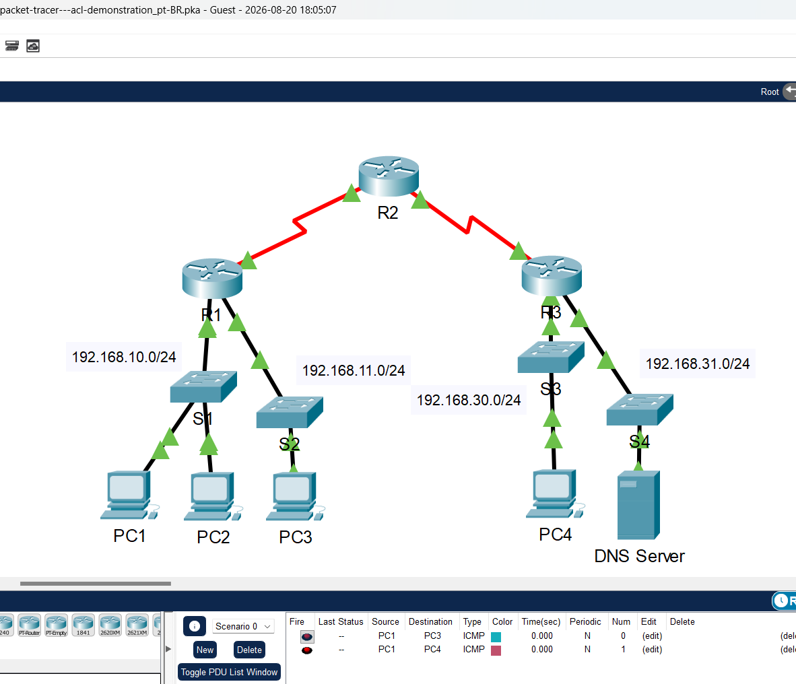
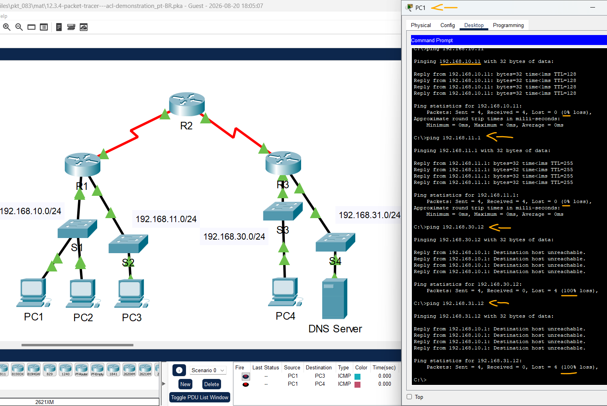
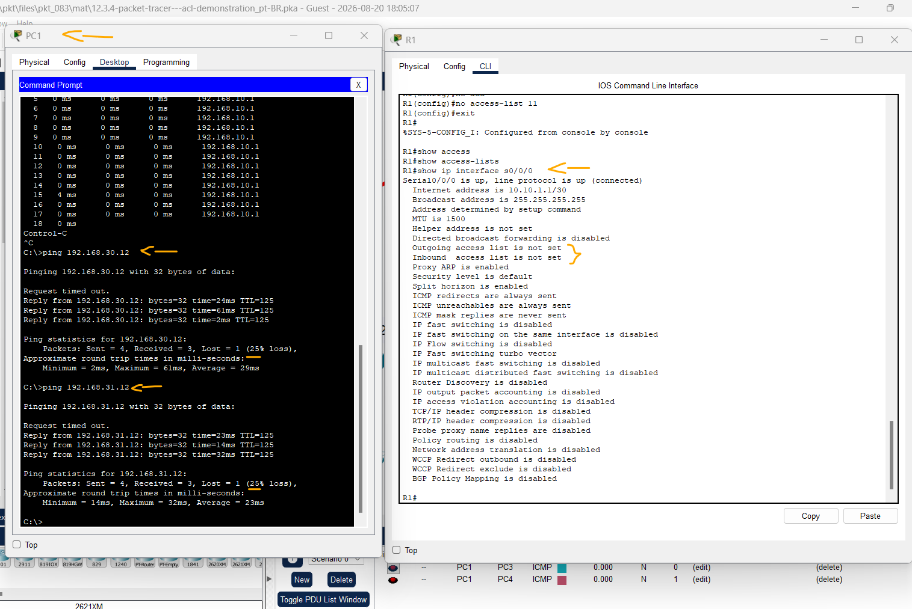

# Packet Tracer – Demonstração de lista de controle de acesso   

### Cisco: <a href="../../../">cisco   </a>
### Cisco Networking Academy: cna   </a>
### Training Category: <a href="../../../pkt/">pkt</a>
### Software/Subject: network   </a>
### Course: <a href="./">pkt_083 (Packet Tracer – Demonstração de lista de controle de acesso)   </a>

---

### Theme:
- Network

### Used Tools:
- Operating System (OS): 
  - Cisco Internetwork Operating System (Cisco IOS)   
  - Windows 11 
- Cloud Services:
  - Google Drive 
- Language:
  - HTML   
  - Markdown   
- Integrated Development Environment (IDE) and Text Editor:
  - Visual Studio Code (VS Code)   
- Versioning: 
  - Git   
- Repository:
  - GitHub   
- Network:
  - Cisco Packet Tracer   
  - ping   
  - Trace Route (tracert)   

---

<h3><a name="item00">Course Strcuture:</a></h3>

1. <a href="#item01">Parte 1: Verificar a conectividade local e testar a lista de controle de acesso</a> 
  1.1 <a href="#item01.01">Etapa 1: Execute o ping nos dispositivos na rede local para verificar a conectividade.</a> 
  1.2 <a href="#item01.02">Etapa 2: Execute o ping nos dispositivos em redes remotas para testar a funcionalidade da </a> 
2. <a href="#item02">Parte 2: Remover a lista de controle de acesso e repetir o teste</a> 
  2.1 <a href="#item02.01">Etapa 1: Use comandos show para investigar a configuração de ACL.</a> 
  2.2 <a href="#item02.02">Etapa 2: Remova a lista de acesso 11 da configuração.</a> 

---

### Objective:
O objetivo desta atividade foi compreender o funcionamento das ACLs de rede no controle do tráfego entre dispositivos, analisando a conectividade entre diferentes redes com e sem a aplicação de uma ACL responsável pelo bloqueio do tráfego.

### Folder Structure:
- [README.md](./README.md): Este documento de README, escrito em **Markdown**, com o conteúdo do laboratório.
- [0-aux](./0-aux/): Pasta auxiliar com imagens utilizadas na construção dos arquivos de README desse curso.

### Development:

<a name="item01"><h4>1. Parte 1: Verificar a conectividade local e testar a lista de controle de acesso</h4></a>[Back to summary](#item00)

A imagem 01 mostra a topologia inicial.

<figure>
     
    <figcaption>Imagem 01.</figcaption>
</figure>
 

<a name="item01.01"><h4>1.1 Etapa 1: Execute o ping nos dispositivos na rede local para verificar a conectividade.</h4></a>[Back to summary](#item00)

- a. Do prompt de comando de PC1, execute ping para PC2.
  - `ping 192.168.10.11`.
- b. Do prompt de comando de PC1, execute ping para PC3.
  - `ping 192.168.11.1`.
- b. Os pings tiveram êxito?
  - Sim. Os pings foram realizados com sucesso para ambos os PCs.

<a name="item01.02"><h4>1.2 ACL.</h4></a>[Back to summary](#item00)

- a. Do prompt de comando de PC1, execute ping para PC4.
  - `ping 192.168.30.12`.
- b. Do prompt de comando de PC1, execute ping para Servidor DNS. 
  - `ping 192.168.31.12`.
- b. Por que o ping falhou? (Dica: use o modo de simulação ou visualize as configurações do roteador para investigar.)
  - Através do tracert, foi identificado que os pacotes são interrompidos no roteador R1. Como a atividade envolve ACLs, provavelmente existe uma ACL configurada no R1 bloqueando o acesso aos dispositivos da outra rede.

A imagem 02 exibe os pings realizados para os quatros dispositivos.

<figure>
     
    <figcaption>Imagem 02.</figcaption>
</figure>
 

<a name="item02"><h4>2. Parte 2: Remover a lista de controle de acesso e repetir o teste</h4></a>[Back to summary](#item00)

<a name="item02.01"><h4>2.1 Etapa 1: Use comandos show para investigar a configuração de ACL.</h4></a>[Back to summary](#item00)

- a. Use os comandos show run e show access-lists para exibir as ACLs configuradas atualmente. Para ver rapidamente as ACLs atuais, use show access-lists. Insira o comando show access-lists, seguido por um espaço e um ponto de interrogação (?) para exibir as opções disponíveis: 
  - `enable` -> `show run` -> `show access-lists` -> `show access-lists ?`.
- a. Se você souber o número ou o nome da ACL, poderá filtrar ainda mais a saída de show. No entanto, R1 tem somente uma ACL; portanto, o comando show access-lists será suficiente.
  - `show access-lists`.
- a. A primeira linha de ACL impede pacotes oriundos da rede 192.168.10.0/24, que inclui Internet Control Message Protocol (ICMP) echoes (solicitações de ping). A segunda linha da ACL permite todo o tráfego ip restante de qualquer origem para atravessar o roteador.
- b. Para uma ACL afetar a operação do roteador, ela deve ser aplicada a uma interface em uma direção específica. Neste cenário, a ACL é usada para filtrar o tráfego em uma interface. Portanto, todo o tráfego saindo da interface de R1 especificada será inspecionado contra ACL 11. 
- b. Embora você possa visualizar as informações de IP com o comando show ip interface, pode ser mais eficiente em algumas situações, simplesmente usar o comando show run.
- b. Usando um ou ambos os comandos, a que interface é aplicada a ACL?
  - A ACL 11 está aplicada à interface S0/0/0 do roteador R1, na direção de saída. Essa interface está conectada ao R2, que encaminha o tráfego para o R3, responsável pelas redes 192.168.30.0/24 e 192.168.31.0/24, destinos para os quais o ping falha.

<a name="item02.02"><h4>2.2 Etapa 2: Remova a lista de acesso 11 da configuração.</h4></a>[Back to summary](#item00)

Você pode remover as ACLs da configuração executando o comando no access-list [number of the ACL]. O comando no access-list exclui todas as ACLs configuradas no roteador. O comando no access-list [number of the ACL] remove apenas uma ACL específica.

- a. Na interface Serial0/0/0, remova a lista de acesso 11, anteriormente aplicada à interface como um filtro de saída:
  - `configure terminal` -> `interface s0/0/0` -> `no ip access-group 11 out`.
- b. No modo de configuração global, remova a ACL inserindo o seguinte comando:
  - `no access-list 11`.
- c. Verifique se PC1 agora pode executar ping do Servidor DNS e PC4.
  - `ping 192.168.30.12` -> `ping 192.168.31.12`.

A imagem 03 mostra mostra a remoção da ACL 11 da interface S0/0/0 do R1, permitindo o sucesso dos testes de conectividade via ping às redes remotas anteriormente inacessíveis.

<figure>
     
    <figcaption>Imagem 03.</figcaption>
</figure>
 