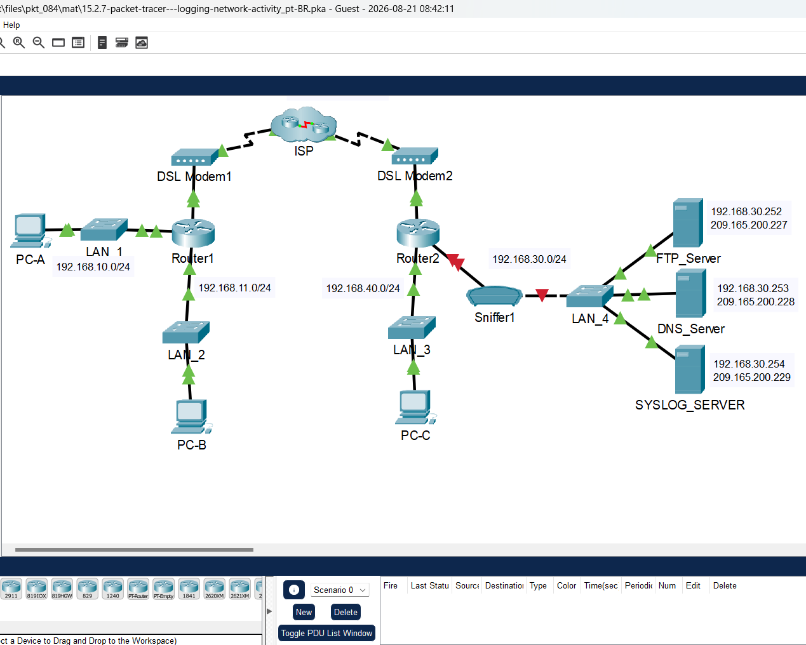
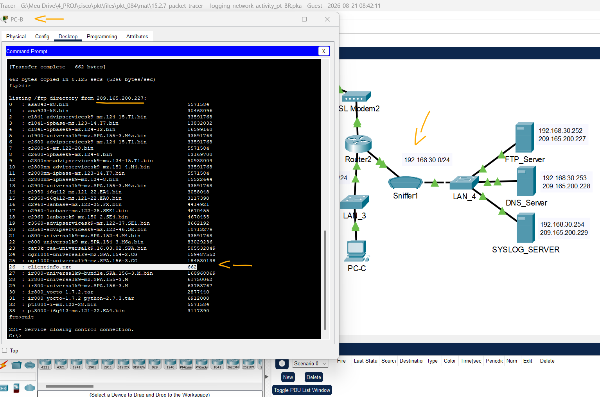
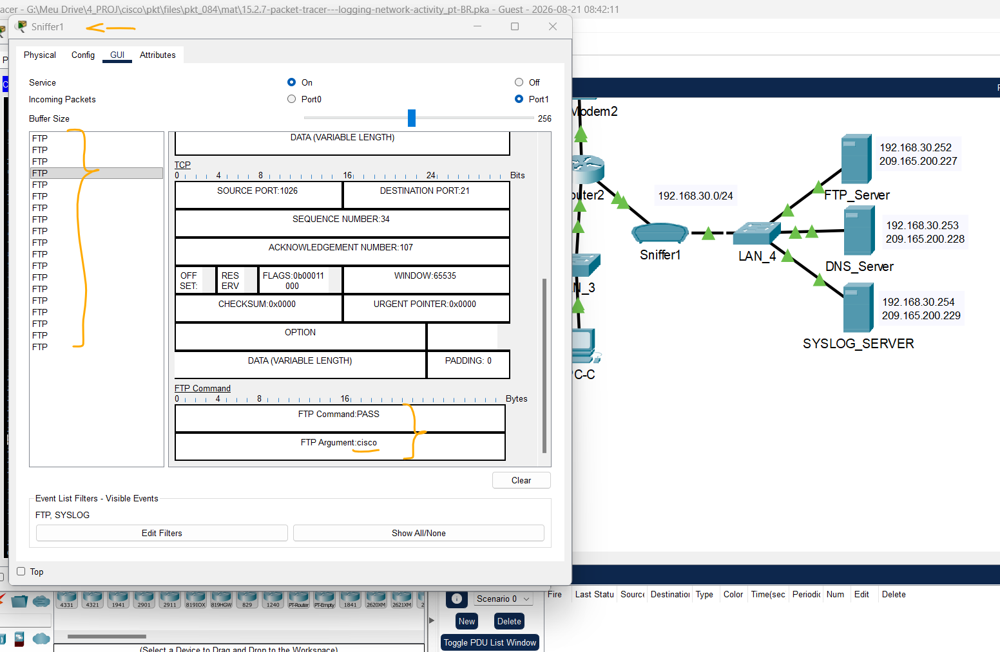
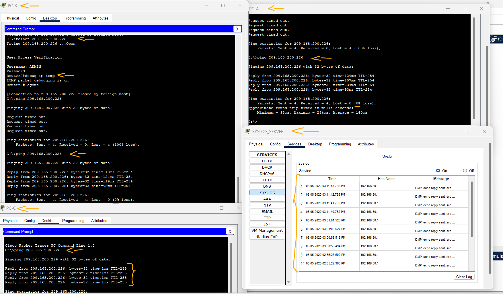

# Packet Tracer - Registrando atividade de rede   

### Cisco: <a href="../../../">cisco   </a>
### Cisco Networking Academy: cna   </a>
### Training Category: <a href="../../../pkt/">pkt</a>
### Software/Subject: network   </a>
### Course: <a href="./">pkt_084 (Packet Tracer - Registrando atividade de rede)   </a>

---

### Theme:
- Network

### Used Tools:
- Operating System (OS): 
  - Cisco Internetwork Operating System (Cisco IOS)   
  - Windows 11 
- Cloud Services:
  - Google Drive 
- Language:
  - HTML   
  - Markdown   
- Integrated Development Environment (IDE) and Text Editor:
  - Visual Studio Code (VS Code)   
- Versioning: 
  - Git   
- Repository:
  - GitHub   
- Network:
  - Cisco Packet Tracer   
  - ping   

---

<h3><a name="item00">Course Strcuture:</a></h3>

1. <a href="#item01">Parte 1: Crie tráfego de FTP.</a> 
  1.1 <a href="#item01.01">Etapa 1: Ative o dispositivo de analise.</a> 
  1.2 <a href="#item01.02">Etapa 2: Conecte-se remotamente ao servidor FTP.</a> 
  1.3 <a href="#item01.03">Etapa 3: Faça o upload de um arquivo para o servidor FTP.</a> 
2. <a href="#item02">Parte 2: Investigar o tráfego de FTP</a> 
3. <a href="#item03">Parte 3: Ver mensagens no syslog</a> 
  3.1 <a href="#item03.01">Etapa 1: Conecte-se remotamente ao Roteador 2.</a> 
  3.2 <a href="#item03.02">Etapa 2: Gerar e exibir as mensagens do syslog.</a> 

---

### Objective:
Esta atividade teve como objetivo capturar e analisar o tráfego dos protocolos FTP e ICMP entre diferentes redes, utilizando um Sniffer e um servidor Syslog.

### Folder Structure:
- [README.md](./README.md): Este documento de README, escrito em **Markdown**, com o conteúdo do laboratório.
- [0-aux](./0-aux/): Pasta auxiliar com imagens utilizadas na construção dos arquivos de README desse curso.

### Development:

<a name="item01"><h4>1. Parte 1: Crie tráfego de FTP.</h4></a>[Back to summary](#item00)

A imagem 01 mostra a topologia inicial.

<figure>
     
    <figcaption>Imagem 01.</figcaption>
</figure>
 

<a name="item01.01"><h4>1.1 Etapa 1: Ative o dispositivo de analise.</h4></a>[Back to summary](#item00)

- a. Clique no dispositivo sniffer Sniffer1. 
- b. Vá para a guia Físico e ative a alimentação do sniffer. 
- c. Vá para a guia GUI e ative o serviço sniffer. 
- d. Os pacotes FTP e syslog que entram no sniffer do Roteador 2 estão sendo monitorados. 

<a name="item01.02"><h4>1.2 Etapa 2: Conecte-se remotamente ao servidor FTP.</h4></a>[Back to summary](#item00)

- a. Clique em PC-B e vá para a área de trabalho. 
- b. Clique em Prompt de comando. No prompt de comando, abra uma sessão FTP com FTP_SERVER usando seu endereço IP público. A ajuda com a linha de comando está disponível digitando ? no prompt.
  - `ftp 209.165.200.227`.
- c. Digite o nome de usuário cisco e a senha cisco para autenticar com o FTP_Server.
  - `cisco` -> `cisco`.

<a name="item01.03"><h4>1.3 Etapa 3: Faça o upload de um arquivo para o servidor FTP.</h4></a>[Back to summary](#item00)

- a. No prompt ftp>, digite o comando dir para visualizar os arquivos atuais armazenados no servidor FTP remoto. 
  - `dir`.
- b. Faça upload do arquivo clientinfo.txt para o servidor FTP digitando o comando put clientinfo.txt. 
  - `put clientinfo.txt`.
- c. No prompt ftp>, digite o comando dir e verifique se o arquivo clientinfo.txt está agora no servidor FTP.
  - `dir`.
- d. Digite quit no prompt FTP para fechar a sessão.
  - `quit`.

A imagem 02 mostra que o Sniffer1 foi ativado e que o arquivo solicitado foi enviado para o servidor FTP pelo PC-B.

<figure>
     
    <figcaption>Imagem 02.</figcaption>
</figure>
 

<a name="item02"><h4>2. Parte 2: Investigar o tráfego de FTP</h4></a>[Back to summary](#item00)

- a. Clique no dispositivo Sniffer1 e, em seguida, clique na guia GUI. 
- b. Clique em alguns dos primeiros pacotes FTP na sessão. Certifique-se de rolar para baixo para exibir as informações do protocolo da camada de aplicativo nos detalhes do pacote de cada um. (Isso pressupõe que esta seja a sua primeira sessão de FTP. Se você tiver aberto outras sessões, limpe a janela e repita o processo de login e transferência de arquivos.) 
- b. Qual é a vulnerabilidade de segurança apresentada pelo FTP? 
  - O FTP transmite dados sem criptografia, ou seja, em texto claro. Essa vulnerabilidade permite que informações sensíveis, como nome de usuário e senha, sejam interceptadas por terceiros. No Sniffer, foi possível visualizar claramente essas credenciais durante a sessão FTP.
- b. O que deve ser feito para mitigar essa vulnerabilidade?
  - Para mitigar essa vulnerabilidade, deve-se utilizar protocolos seguros, como SFTP ou FTPS, que realizam a criptografia dos dados transmitidos, protegendo informações sensíveis contra interceptação durante a comunicação.

A imagem 03 comprova que, no quarto pacote, foi possível visualizar na camada de aplicação a senha utilizada na autenticação, que era "cisco". O terceiro pacote continha o nome de usuário. Os dois primeiros pacotes correspondem a uma tentativa anterior de autenticação malsucedida, devido ao uso de uma senha incorreta.

<figure>
     
    <figcaption>Imagem 03.</figcaption>
</figure>
 

<a name="item03"><h4>3. Parte 3: Ver mensagens no syslog</h4></a>[Back to summary](#item00)

<a name="item03.01"><h4>3.1 Etapa 1: Conecte-se remotamente ao Roteador 2.</h4></a>[Back to summary](#item00)

- a. Da linha de comando PC-B, telnet para Roteador 2.
  - `telnet 209.165.200.226`.
- b. Use o nome de usuário ADMIN e senha CISCO para autenticação.
  - `ADMIN` -> `CISCO`.
- c. Digite os seguintes comandos no prompt do roteador: 
  - `debug ip icmp`.
d. Digite logout no prompt para fechar a sessão Telnet.
  - `logout`.

<a name="item03.02"><h4>3.2 Etapa 2: Gerar e exibir as mensagens do syslog.</h4></a>[Back to summary](#item00)

- a. Clique no dispositivo SYSLOG_SERVER e vá para a guia Serviços. 
- b. Clique no serviço SYSLOG. Verifique se o serviço está ativado. As mensagens do Syslog aparecerão aqui. 
- c. Vá para o host PC-B e abra a guia Área de trabalho. 
- d. Abra o prompt de comando e ping Router2.
  - `ping 209.165.200.226`.
- e. Vá para o host PC-A e abra a guia Área de Trabalho. 
- f. Vá para o Prompt de Comando e ping Router2.
  - `ping 209.165.200.226`.
- g. No servidor syslog investigue as mensagens registradas. 
- h. Deve haver quatro mensagens de PC-A e quatro PC-B. Você pode dizer quais respostas de eco são para PC-A e PC-B a partir dos endereços de destino? Explique.
  - Não é possível distinguir diretamente quais respostas de eco são destinadas ao PC-A ou ao PC-B apenas pelos endereços de destino dessas mensagens. As respostas do Router2 têm como destino o endereço 209.165.200.225, pertencente ao Router1, que as encaminha ao respectivo PC, pois atua como gateway padrão de ambos.
- i. Ping Router2 a partir do PC-C.
  - `ping 209.165.200.226`.
- i. Qual será o endereço de destino para as respostas? 
  - Acredito que o endereço de destino das respostas deveria ser 192.168.40.2, correspondente ao PC-C, que está na mesma rede que o Router2. No entanto, isso não foi observado. No Syslog, o endereço de destino das respostas continuou sendo 209.165.200.225, correspondente à interface do Router1, o que não era esperado, já que o PC-C não está diretamente conectado ao Router1.

A imagem 04 evidência os registros capturados pelo servidor Syslog após execução dos pings pelos três PCs.

<figure>
     
    <figcaption>Imagem 04.</figcaption>
</figure>
 
