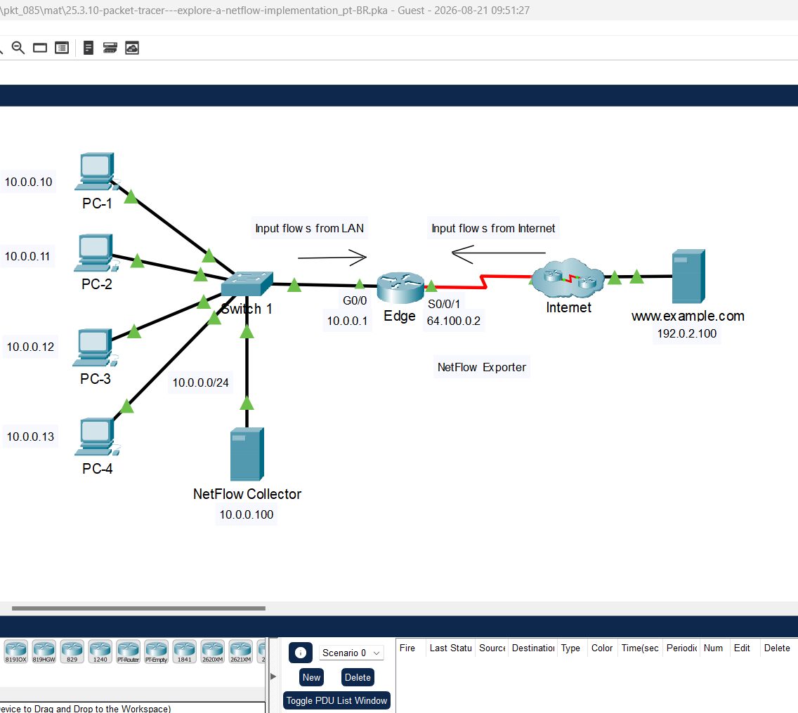
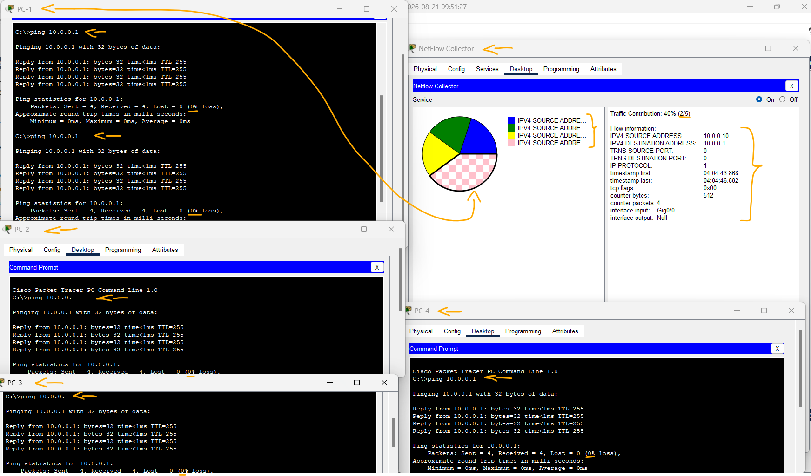
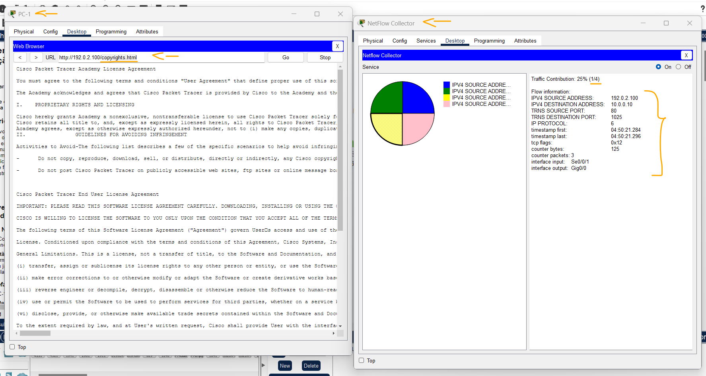
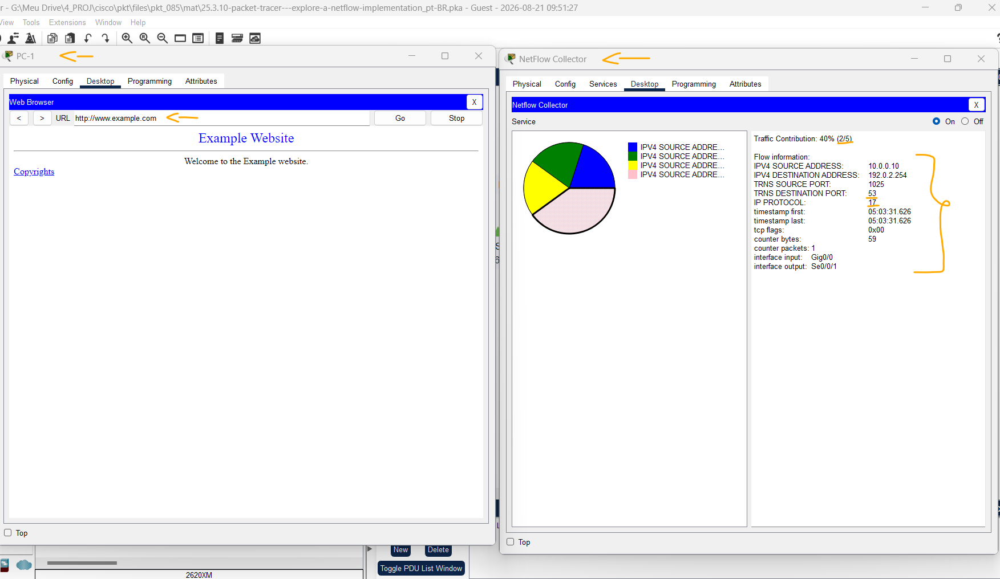

# Packet Tracer — Explore uma implementação NetFlow   

### Cisco: <a href="../../../">cisco   </a>
### Cisco Networking Academy: cna   </a>
### Training Category: <a href="../../../pkt/">pkt</a>
### Software/Subject: network   </a>
### Course: <a href="./">pkt_085 (Packet Tracer — Explore uma implementação NetFlow)   </a>

---

### Theme:
- Network

### Used Tools:
- Operating System (OS): 
  - Windows 11 
- Cloud Services:
  - Google Drive 
- Language:
  - HTML   
  - Markdown   
- Integrated Development Environment (IDE) and Text Editor:
  - Visual Studio Code (VS Code)   
- Versioning: 
  - Git   
- Repository:
  - GitHub   
- Network:
  - Cisco Packet Tracer   
  - NetFlow   
  - ping   

---

<h3><a name="item00">Course Strcuture:</a></h3>

1. <a href="#item01">Parte 1: Observar registros de fluxo NetFlow - Uma direção</a> 
  1.1 <a href="#item01.01">Etapa 1: Open the NetFlow collector.</a> 
  1.2 <a href="#item01.02">Etapa 2: Ping o default gateway a partir do PC-1.</a> 
  1.3 <a href="#item01.03">Etapa 3: Crie tráfego adicional.</a> 
2. <a href="#item02">Parte 2: Observe os registros NetFlow para uma sessão que entra e sai do coletor</a> 
  2.1 <a href="#item02.01">Etapa 1: Acesse o servidor Web por endereço IP.</a> 
  2.2 <a href="#item02.02">Etapa 2: Acesse o Servidor Web por URL.</a> 

---

### Objective
O objetivo desta atividade foi demonstrar o funcionamento do NetFlow, utilizado para o monitoramento de fluxos de tráfego de rede. Foram analisados tanto os fluxos de tráfego interno da LAN quanto aqueles que atravessam a borda da rede, observando como são registrados e apresentados pelo coletor NetFlow.

### Folder Structure:
- [README.md](./README.md): Este documento de README, escrito em **Markdown**, com o conteúdo do laboratório.
- [0-aux](./0-aux/): Pasta auxiliar com imagens utilizadas na construção dos arquivos de README desse curso.

### Development:

<a name="item01"><h4>1. Parte 1: Observar registros de fluxo NetFlow - Uma direção</h4></a>[Back to summary](#item00)

A imagem 01 mostra a topologia inicial.

<figure>
     
    <figcaption>Imagem 01.</figcaption>
</figure>
 

<a name="item01.01"><h4>1.1 Etapa 1: Open the NetFlow collector.</h4></a>[Back to summary](#item00)

- a. No NetFlow Collector, clique na guia Desktop. Clique no ícone Netflow Collector.
- b. Clique no botão de opção Ligado para ativar o coletor conforme necessário. Posicione e dimensione a janela para que ela fique visível a partir da janela de topologia do Packet Tracer 

<a name="item01.02"><h4>1.2 Etapa 2: Ping o default gateway a partir do PC-1.</h4></a>[Back to summary](#item00)

- a. Clique em PC-1. 
- b. Abra a guia Desktop e clique no icone Command Prompt.
- c. Digite o comando ping para testar a conectividade com o gateway padrão em 10.0.0.1. 
  - `ping 10.0.0.1`.
- d. Após um breve atraso, a tela NetFlow Collector exibirá um gráfico de pizza. Observação: O primeiro conjunto de pings pode não ser enviado ao NetFlow Collector porque o processo ARP deve primeiro resolver endereços IP e MAC. Se após 30 segundos, um gráfico de pizza não aparecer, faça o ping no gateway padrão novamente.
- e. Clique no gráfico de pizza ou na entrada de legenda para exibir os detalhes do registro de fluxo.
- f. O registro de fluxo terá entradas semelhantes às da tabela abaixo. Seus carimbos de data/hora serão diferentes. 
  - Traffic Contribution: Esta é a proporção de todo o tráfego representado por esse fluxo.
  - IPV4 SOURCE ADDRESS: Este é o endereço IP de origem dos pacotes do fluxo.
  - IPV4 DESTINATION ADDRESS: Este é o endereço IP de destino dos pacotes do fluxo.
  - TRNS SOURCE PORT: Esta é a porta de origem da camada de transporte. O valor é 0 porque este é um fluxo ICMP.
  - TRNS DESTINATION PORT: Esta é a porta de destino da camada de transporte. O valor é 0 porque este é um fluxo ICMP.
  - PROTOCOL IP: Identifica o protocolo da Camada 4, normalmente 1 para ICMP, 6 para TCP e 17 para UDP.
  - timestamp first: É o carimbo de data/hora correspondente ao início do fluxo.
  - timestamp last: É o carimbo de data/hora correspondente ao último pacote no fluxo.
  - tcp flags: É o valor dos flags TCP. Neste caso, nenhuma sessão TCP foi envolvida porque o protocolo é ICMP.
  - counter bytes: É o número de bytes presentes no fluxo.
  - counter packtes: É o número de pacotes presentes no fluxo.
  - interface input: É a interface do Flow exporter que coletou o fluxo na direção de entrada, ou seja, na interface do dispositivo de monitoramento.
  - interface output: É a interface do Flow exporter que coletou o fluxo na direção de saída, ou seja, fora da interface do dispositivo de monitoramento. O valor é “Nulo” porque este era um ping direcionado à própria interface de entrada.

#### Tabela 1 — Dados de Fluxo NetFlow

| Entrada                  | Valor        |
|:------------------------:|:------------:|
| Traffic Contribution     | 100% (1/1)   |
| IPV4 SOURCE ADDRESS      | 10.0.0.10    |
| IPV4 DESTINATION ADDRESS | 10.0.0.1     |
| TRNS SOURCE PORT         | 0            |
| TRNS DESTINATION PORT    | 0            |
| PROTOCOL IP              | 1            |
| First Timestamp          | 04:04:43.868 |
| Timestamp                | 04:04:46.882 |
| TCP Flags                | 0x00         |
| Byte Counter             | 512          |
| Packet Counter           | 4            |
| Input Interface          | Gig0/0       |
| Output Interface         | Null         |

- f. Nesse caso, o fluxo representa o ping ICMP do host 10.0.0.10 para 10.0.0.1. Quatro pacotes de ping estavam no fluxo. Os pacotes inseridos na interface G0/0 do exportador. 
- f. Observação: Nesta atividade, o roteador de borda foi configurado como um NetFlow Flow exporter. A interface LAN é configurada para monitorar fluxos que entram na rede local. A interface serial foi configurada para coletar fluxos que entram na internet. Isto foi feito para simplificar esta atividade. 
- f. Para ver o tráfego que corresponde a uma sessão bidirecional completa, o NetFlow Flow exporter precisaria ser configurado para coletar fluxos que entram e saem de uma rede. 

<a name="item01.03"><h4>1.3 Etapa 3: Crie tráfego adicional.</h4></a>[Back to summary](#item00)

- a. Clique no PC-2 > Desktop.
- b. Abra um prompt de comando e execute ping no gateway padrão 10.0.0.1.
  - `ping 10.0.0.1`.
- b. O que você espera ver nos registros de fluxo do NetFlow collector?
  - Espero que um novo fluxo seja registrado, correspondente ao tráfego ICMP entre o PC-2 e seu gateway padrão (10.0.0.1).
- b. As estatísticas do registro de fluxo existente serão alteradas ou um novo fluxo aparecerá no gráfico de pizza? 
  - Um novo fluxo deverá aparecer no gráfico de pizza, pois o tráfego gerado pelo PC-2 possui características diferentes do fluxo existente.
- c. Retorne ao PC-1 e repita o ping para o gateway.
  - `ping 10.0.0.1`.
- c. Como esse tráfego será representado? Como um novo segmento no gráfico de pizza ou ele modificará os valores no registro de fluxo existente?
  - O tráfego será contabilizado no registro de fluxo existente, pois o PC-1 está realizando o mesmo tipo de tráfego (ICMP) para o mesmo destino (10.0.0.1). Assim, os valores desse fluxo serão atualizados no gráfico de pizza, em vez de aparecer um novo segmento.
- d. Emita pings de PC-3 e PC-4 para o endereço de gateway padrão.
  - `ping 10.0.0.1`.
- d. O que deve acontecer com a tela no coletor de fluxo?
  - Os pings de PC-3 e PC-4 gerarão novos registros de fluxo no coletor, que serão adicionados às estatísticas apresentadas no gráfico de pizza.

A imagem 02 exibe o gráfico de pizza do coletor NetFlow com quatro fluxos, sendo o primeiro, referente ao PC-1, ligeiramente maior por ter recebido duas contribuições de tráfego.

<figure>
     
    <figcaption>Imagem 02.</figcaption>
</figure>
 

<a name="item02"><h4>2. Parte 2: Observe os registros NetFlow para uma sessão que entra e sai do coletor</h4></a>[Back to summary](#item00)

O NetFlow exporter foi configurado para coletar fluxos que saem da LAN e entram no roteador pela Internet.

<a name="item02.01"><h4>2.1 Etapa 1: Acesse o servidor Web por endereço IP.</h4></a>[Back to summary](#item00)

Antes de continuar, ligue o NetFlow Collector para limpar os fluxos.

- a. Clique na guia NetFlow Collector > Physical. 
- b. Clique no botão de energia vermelho para desligar o servidor. Em seguida, clique nele novamente para ligar o servidor novamente. (Observação: talvez seja necessário rolar ou diminuir o zoom.)
- c. No NetFlow Collector, clique na guia Desktop.
- d. Clique no ícone Netflow Collector. Clique no botão de opção “On” para ativar o coletor. Feche a janela NetFlow Collector. 
- e. Antes de acessar um servidor Web a partir do PC-1, prever quantos fluxos haverá no gráfico de pizza? Explique.
  - Haverá dois fluxos no gráfico do NetFlow: um correspondente ao tráfego do PC-1 para o servidor Web na WAN e outro referente ao tráfego de retorno do servidor Web para a LAN.
- e. A partir do seu conhecimento de protocolos de rede e NetFlow, preveja os valores para as solicitações de página da Web que saem da LAN.

#### Tabela 2 — Campos de Registro Netflow (Solicitação da LAN para o Servidor Web)

| Campo de Registro     | Valor       |
|:---------------------:|:-----------:|
| Endereço IP de origem | 10.0.0.10   |
| Endereço IP de destino| 192.0.2.100 |
| Porta de origem       | 1025-5000   |
| Porta de destino      | 80          |
| Interface de entrada  | Edge G0/0   |
| Interface de saída    | Edge S0/0/1 |

- e. Preveja os valores para a resposta da página da Web que entra no roteador do exportador NetFlow a partir da Internet.

#### Tabela 3 — Campos de Registro Netflow (Resposta do Servidor Web para a LAN)

| Campo de Registro     | Valor       |
|:---------------------:|:-----------:|
| Endereço IP de origem | 192.0.2.100 |
| Endereço IP de destino| 10.0.0.10   |
| Porta de origem       | 80          |
| Porta de destino      | 1025-5000   |
| Interface de entrada  | Edge S0/0/1 |
| Interface de saída    | Edge G0/0   |

- f. Clique no PC-1 > Desktop. Feche a janela do prompt de comando, se necessário. Clique no ícone do navegador da web.
- g. No Navegador da Web para PC-1, digite 192.0.2.100 e clique em Ir. A página Web do site de exemplo será exibida. 
  - `192.0.2.100`.
- h. Após um pequeno atraso, um novo gráfico de pizza aparecerá no coletor NetFlow. Você verá pelo menos dois segmentos de pizza para a solicitação HTTP e resposta. Talvez você veja um terceiro segmento se o cache ARP para PC-1 expirou.
- i. Clique em cada segmento de pizza HTTP para exibir o registro e verificar suas previsões. 
- j. Clique no link para a página Direitos autorais. O que aconteceu? Explique. (Dica: compare o número da porta no host para os fluxos.)
  - Surgiram mais dois fluxos, semelhantes aos anteriores, mas com a porta de origem dinâmica alterada para 1026. Isso ocorreu porque o acesso a uma nova URL (copyrights.html) gerou uma nova conexão HTTP com o servidor.
- j. Compare os fluxos. Além do carimbo de data/hora óbvio, endereço IP de origem e destino, porta e interfaces, diferenças, o que mais é diferente entre os fluxos de solicitação e resposta?
  - Além dos endereços IP, portas, interfaces e carimbos de data/hora, os fluxos apresentam diferenças nos contadores e, principalmente, nas flags TCP. Na solicitação, a flag é 0x02 (SYN), enquanto na resposta é 0x12 (SYN, ACK).

A imagem 03 mostra o gráfico de pizza do coletor NetFlow com quatro fluxos, correspondentes a dois pares de comunicação HTTP.

<figure>
     
    <figcaption>Imagem 03.</figcaption>
</figure>
 

<a name="item02.02"><h4>2.2 Etapa 2: Acesse o Servidor Web por URL.</h4></a>[Back to summary](#item00)

- a. Reinicie o NetFlow Collector para limpar os fluxos. 
- b. Ative o serviço Coletor de fluxo de rede. 
- c. Antes de acessar o servidor Web por sua URL. O que você acha que verá na exibição do NetFlow collector? 
  - Haverá quatro fluxos no coletor NetFlow: dois referentes à comunicação HTTP com o servidor Web e dois relacionados à resolução de nomes via DNS.
- d. Em PC-1, insira www.example.com no campo URL e pressione Ir. 
  - `www.example.com`.
- e. Depois que os fluxos forem exibidos, inspecione cada registro de fluxo. Quais valores você vê para o campo de protocolo IP do registro de fluxo? O que significam esses valores?
  - Dois fluxos apresentam o protocolo IP 6, correspondente ao TCP, utilizado na comunicação HTTP. Os outros dois apresentam o protocolo IP 17, correspondente ao UDP, utilizado na resolução DNS. A solicitação DNS possui duas contribuições de tráfego, enquanto os demais fluxos possuem apenas uma.

A imagem 04 apresenta o gráfico de pizza do coletor NetFlow com os respectivos fluxos de tráfego registrados.

<figure>
     
    <figcaption>Imagem 04.</figcaption>
</figure>
 