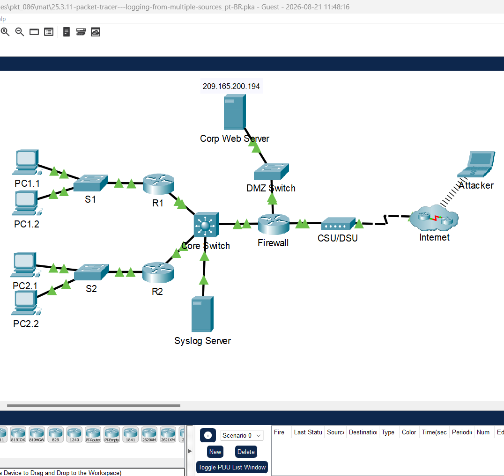
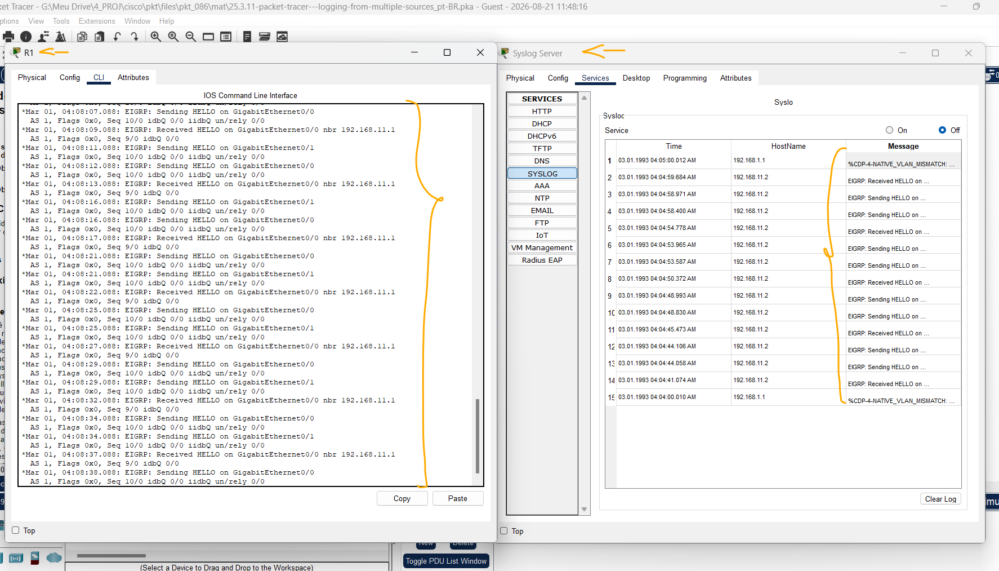
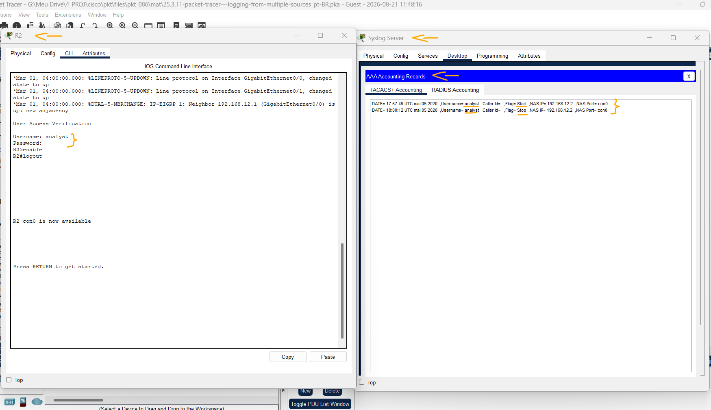
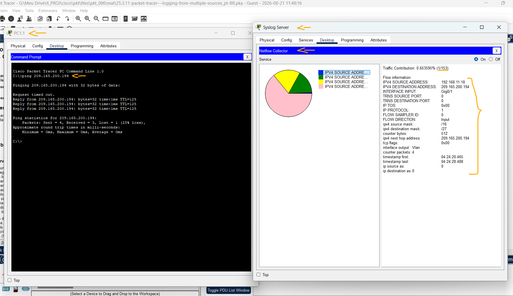

# Packet Tracer - Registro de Várias Origens   

### Cisco: <a href="../../../">cisco   </a>
### Cisco Networking Academy: cna   </a>
### Training Category: <a href="../../../pkt/">pkt</a>
### Software/Subject: network   </a>
### Course: <a href="./">pkt_086 (Packet Tracer - Registro de Várias Origens)   </a>

---

### Theme:
- Network

### Used Tools:
- Operating System (OS): 
  - Cisco Internetwork Operating System (Cisco IOS)   
  - Windows 11 
- Cloud Services:
  - Google Drive 
- Language:
  - HTML   
  - Markdown   
- Integrated Development Environment (IDE) and Text Editor:
  - Visual Studio Code (VS Code)   
- Versioning: 
  - Git   
- Repository:
  - GitHub   
- Network:
  - Cisco Packet Tracer   
  - NetFlow   
  - ping   

---

<h3><a name="item00">Course Strcuture:</a></h3>

1. <a href="#item01">Parte 1: Usar syslog para capturar arquivos de log de vários dispositivos de rede</a> 
  1.1 <a href="#item01.01">Etapa 1: O servidor syslog</a> 
  1.2 <a href="#item01.02">Etapa 2: Ativar o Syslog.</a> 
2. <a href="#item02">Parte 2: Observe o registro de acesso do usuário AAA</a> 
3. <a href="#item03">Parte 3: Observar as informações do NetFlow</a> 
4. <a href="#item04">Reflexão</a> 

---

### Objective:
O objetivo desta atividade foi capturar e analisar diferentes tipos de registros utilizando as ferramentas Syslog, AAA e NetFlow, centralizadas em um único servidor. A atividade permitiu observar quais informações são registradas por cada ferramenta e como esses dados são apresentados.

### Folder Structure:
- [README.md](./README.md): Este documento de README, escrito em **Markdown**, com o conteúdo do laboratório.
- [0-aux](./0-aux/): Pasta auxiliar com imagens utilizadas na construção dos arquivos de README desse curso.

### Development:

<a name="item01"><h4>1. Parte 1: Usar syslog para capturar arquivos de log de vários dispositivos de rede</h4></a>[Back to summary](#item00)

A imagem 01 mostra a topologia inicial.

<figure>
     
    <figcaption>Imagem 01.</figcaption>
</figure>
 

<a name="item01.01"><h4>1.1 Etapa 1: O servidor syslog</h4></a>[Back to summary](#item00)

O Syslog é um sistema de mensagens projetado para suportar o registro remoto. Os clientes Syslog enviam entradas de log para um servidor syslog. O servidor syslog concentra e armazena entradas de log. O Packet Tracer suporta operações básicas de syslog e pode ser usado para demonstração. A rede inclui um servidor syslog e clientes syslog. R1, R2, Core Switch e o Firewall são clientes syslog. Esses dispositivos são 
configurados para enviar suas entradas de log para o servidor syslog. O servidor syslog coleta as entradas de log e permite que elas sejam lidas. 

As entradas de log são categorizadas por sete níveis de gravidade. Níveis mais baixos representam eventos mais graves. Os níveis são: emergências (0), alertas (1), críticos (2), erros (3), avisos (4), notificações (5), informativos (6) e depuração (7). Os clientes Syslog podem ser configurados para enviar entradas de log para servidores syslog com base no nível de gravidade.

- a. Clique no servidor Syslog para abrir sua janela. 
- b. Selecione a guia Serviços e selecione SYSLOG na lista de serviços mostrada à esquerda.  
- c. Clique em On para ativar o serviço Syslog. 
- d. Entradas de syslog provenientes de clientes syslog serão mostradas na janela à direita. Atualmente, não há entradas. 
- e. Mantenha esta janela aberta e visível e passe para a Etapa 2.

<a name="item01.02"><h4>1.2 Etapa 2: Ativar o Syslog.</h4></a>[Back to summary](#item00)

Os dispositivos já estão configurados para enviar mensagens de log para o servidor syslog, mas o Rastreador de Pacotes suporta somente o log para o nível de gravidade de depuração com syslog. Devido a isso, devemos gerar mensagens de nível de depuração (nível 7) para que possam ser enviadas para o servidor syslog.

- a. Clique em R1> guia CLI.  
- b. Pressione Enter para obter um prompt de comando e digite o comando enable.
  - `enable`.
- c. Insira o comando debug eigrp packets para habilitar a depuração do EIGRP. O console de linha de comando irá preencher imediatamente com mensagens de depuração.
  - `debug eigrp packets` (`no debug eigrp packets`).
- d. Retorne à janela Servidor Syslog. Verifique se as entradas de log aparecem no servidor syslog. 
- e. Depois que algumas mensagens forem registradas, clique no botão de opção para desligar o serviço syslog. Quais são algumas das informações incluídas nas mensagens do syslog que estão sendo exibidas pelo Servidor Syslog? 
  - As mensagens do Syslog exibem informações sobre o protocolo e o evento registrado, incluindo a interface utilizada, o tipo de mensagem, o endereço IP do vizinho EIGRP, o número do AS e informações de sequência dos pacotes. Também são registradas mensagens do CDP relacionadas à incompatibilidade da VLAN nativa.
- f. Feche a janela do dispositivo R1.

A imagem 02 apresenta alguns dos registros de log capturados pelo servidor Syslog.

<figure>
     
    <figcaption>Imagem 02.</figcaption>
</figure>
 

<a name="item02"><h4>2. Parte 2: Observe o registro de acesso do usuário AAA</h4></a>[Back to summary](#item00)

Outro tipo importante de log está relacionado ao acesso do usuário. Ter registros de logins de usuários é crucial para solução de problemas e análise de tráfego. O Cisco IOS suporta autenticação, autorização e contabilidade (AAA). Com o AAA, é possível não apenas delegar a tarefa de validação do usuário a um servidor externo, mas também registrar atividades.

TACACS+ é um protocolo projetado para permitir autenticação remota através de um servidor centralizado.

O Packet Tracer oferece suporte básico AAA e TACACS+. R2 também é configurado como um servidor TACACS+. R2 perguntará ao servidor se esse usuário é válido verificando nome de usuário e senha, e concederá ou negará acesso com base na resposta. O servidor armazena as credenciais do usuário e também é capaz de registrar transações de login do usuário. Siga as etapas abaixo para fazer login no R2 e exibir as entradas de log relacionadas a esse login: 

- a. Clique no servidor Syslog para abrir sua janela. 
- b. Selecione a guia Área de trabalho e selecione Contabilidade AAA. Deixe essa janela aberta. 
- c. Clique em R2 > CLI. 
- d. Pressione Enter para obter um prompt de comando. R2 pedirá nome de usuário e senha antes de conceder acesso à CLI. Insira as seguintes credenciais de usuário: analista e cyberops como nome de usuário e senha, respectivamente.
  - `analyst` -> `cyberops` -> `enable`.
- e. Retorne à janela Registros de Contabilidade AAA do Servidor Syslog. Quais informações estão na entrada de log?
  - As informações presentes no registro são: timestamp, nome de usuário, Caller ID, flag, endereço IP do NAS e porta do NAS.
- f. Em R2, digite o comando logout.
  - `logout`.
- f. O que aconteceu na janela de contabilidade da AAA?
  - Surgiu um segundo registro, semelhante ao primeiro, diferindo apenas no timestamp e no valor da flag, que passou de start para stop. Isso indica o início e o encerramento, respectivamente, da sessão de acesso ao roteador R2.

A imagem 03 mostra os logs de contabilidade AAA armazenados pelo servidor Syslog.

<figure>
     
    <figcaption>Imagem 03.</figcaption>
</figure>
 

<a name="item03"><h4>3. Parte 3: Observar as informações do NetFlow</h4></a>[Back to summary](#item00)

Na topologia, o servidor Syslog também é um coletor NetFlow. O firewall é configurado como um exportador NetFlow. 

- a. Clique no Servidor Syslog para abrir sua janela. Feche a janela Registros Contábeis AAA. 
- b. Na guia Área de Trabalho, selecione Coletor de Fluxo de Rede. Os serviços de coletor NetFlow devem ser ativados. 
- c. De qualquer PC, execute ping no Corp Web Server em 209.165.200.194. Após um breve atraso, o gráfico de pizza será atualizado para mostrar o novo fluxo de tráfego.
  - `ping 209.165.200.194`.
- c. Observação: os gráficos de pizza exibidos variam de acordo com o tráfego na rede. Outros fluxos de pacotes, como tráfego relacionado ao EIGRP, estão sendo enviados entre dispositivos. O NetFlow está capturando esses pacotes e exportando estatísticas para o NetFlow Collector. Quanto mais tempo o NetFlow tiver permissão para ser executado em uma rede, mais estatísticas de tráfego serão capturadas.

A imagem 04 exibe o gráfico de pizza do coletor NetFlow com os fluxos capturados, incluindo o fluxo referente ao ping realizado no servidor Web, representado por uma pequena fatia devido à sua única contribuição de tráfego.

<figure>
     
    <figcaption>Imagem 04.</figcaption>
</figure>
 

<a name="item04"><h4>4. Reflexão</h4></a>[Back to summary](#item00)

- a. Embora as ferramentas apresentadas nesta atividade sejam úteis, cada uma tem seu próprio serviço e pode precisar rodar em dispositivos totalmente diferentes. Uma maneira melhor, explorada mais tarde no curso, é que todas as informações de registro sejam concentradas em uma única ferramenta, permitindo fácil referência cruzada e recursos poderosos de pesquisa. As plataformas SIEM (Security Information and Event 
Management, gerenciamento de eventos e informações de segurança) podem coletar arquivos de log e outras informações de diversas fontes e integrar as informações para acesso por uma única ferramenta.