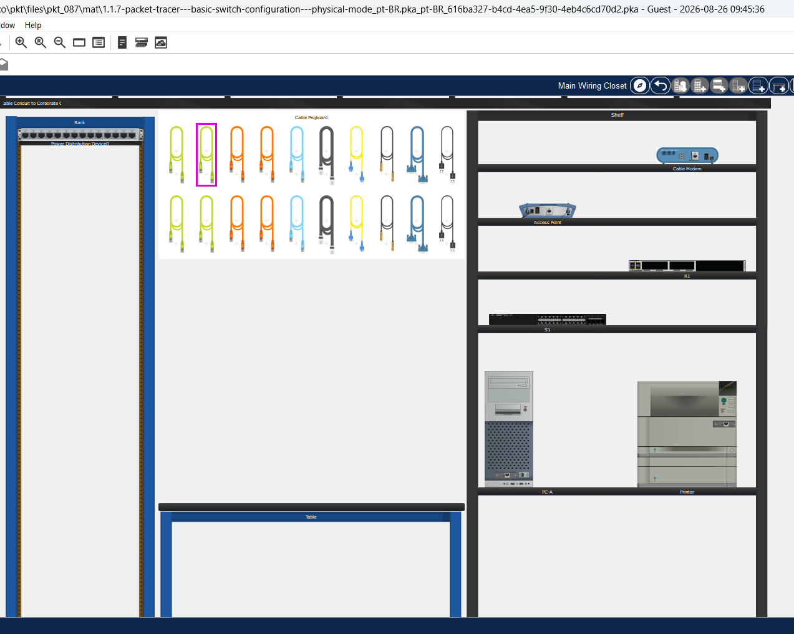
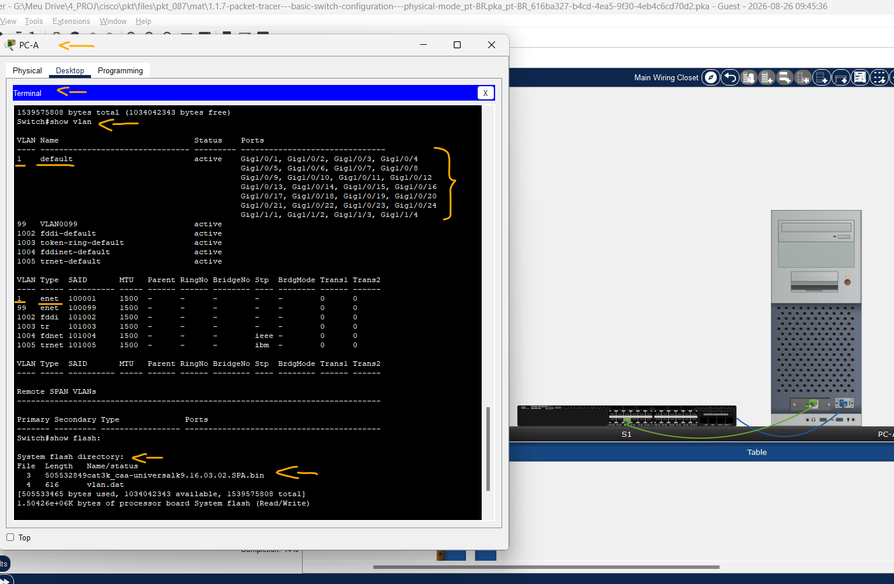
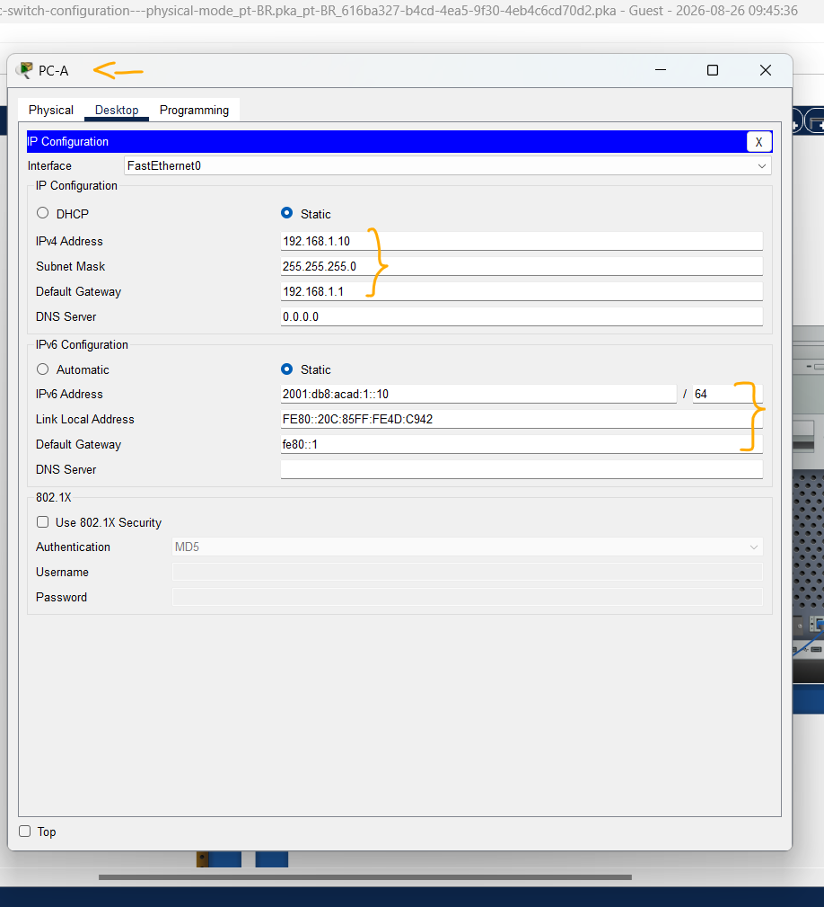
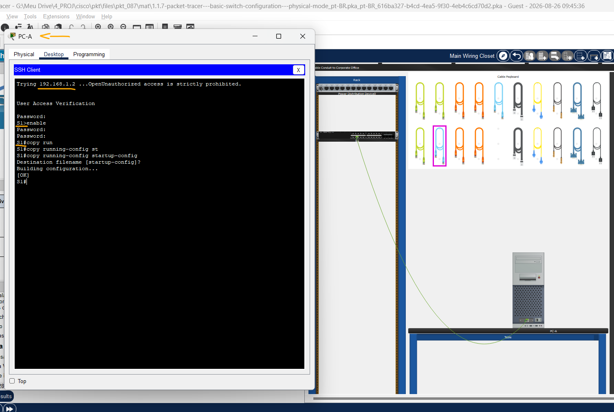

# Packet Tracer - Configuração Básica do Switch - Modo Físico   

### Cisco: <a href="../../../">cisco   </a>
### Cisco Networking Academy: cna   </a>
### Training Category: <a href="../../../pkt/">pkt</a>
### Software/Subject: network   </a>
### Course: <a href="./">pkt_087 (Packet Tracer - Configuração Básica do Switch - Modo Físico)   </a>

---

### Theme:
- Network

### Used Tools:
- Operating System (OS): 
  - Windows 11 
- Cloud Services:
  - Google Drive 
- Language:
  - HTML   
  - Markdown   
- Integrated Development Environment (IDE) and Text Editor:
  - Visual Studio Code (VS Code)   
- Versioning: 
  - Git   
- Repository:
  - GitHub   
- Network:
  - Cisco Packet Tracer   

---

<h3><a name="item00">Course Strcuture:</a></h3>

1. <a href="#item01">Parte 1: Cabear a rede e verificar a configuração padrão do switch</a> 
  1.1 <a href="#item01.01">Etapa 1: Cabeie a rede conforme mostrado na topologia.</a> 
  1.2 <a href="#item01.02">Etapa 2: Verifique a configuração de switch padrão.</a> 
2. <a href="#item02">Parte 2: Definir configurações básicas do dispositivo de rede</a> 
  2.1 <a href="#item02.01">Etapa 1: Definir as configurações básicas do switch.</a> 
  2.2 <a href="#item02.02">Etapa 2: Configurar um endereço IP no PC-A.</a> 
3. <a href="#item03">Parte 3: Verificar e Testar a Conectividade da Rede</a> 
  3.1 <a href="#item03.01">Etapa 1: Exiba a configuração do switch.</a> 
  3.2 <a href="#item03.02">Etapa 2: Teste a conectividade de ponta a ponta com ping.</a> 
  3.3 <a href="#item03.03">Etapa 3: Teste e verifique o gerenciamento remoto de S1.</a> 
  3.4 <a href="#item03.04">Etapa 4: Implante o switch S1 na rede de produção.</a> 
4. <a href="#item04">Perguntas para reflexão</a> 

---

### Objective:
O objetivo desta atividade foi implementar e configurar uma rede doméstica com acesso à Internet para quatro dispositivos finais, realizando o cabeamento da rede local por meio de cabos coaxial e de par trançado, a configuração do serviço DHCP no roteador para distribuição automática de endereços IP e a configuração da rede sem fio utilizando o padrão de segurança WPA2.

### Folder Structure:
- [README.md](./README.md): Este documento de README, escrito em **Markdown**, com o conteúdo do laboratório.
- [0-aux](./0-aux/): Pasta auxiliar com imagens utilizadas na construção dos arquivos de README desse curso.

### Development:

<a name="item01"><h4>1. Parte 1: Cabear a rede e verificar a configuração padrão do switch</h4></a>[Back to summary](#item00)

A imagem 01 mostra a topologia inicial.

<figure>
     
    <figcaption>Imagem 01.</figcaption>
</figure>
 

Na Parte 1, você configurará a topologia de rede e verificará as configurações padrão do switch.

<a name="item01.01"><h4>1.1 Etapa 1: Cabeie a rede conforme mostrado na topologia.</h4></a>[Back to summary](#item00)

- a. Da prateleira, clique e arraste o interruptor S1 e coloque-o no lado esquerdo da mesa. 
- b. Da prateleira, clique e arraste o dispositivo PC-A e coloque-o no lado direito da mesa. Ligue o PC-A. 
- c. Conecte um cabo de console do dispositivo PC-A para o switch S1, segundo as indicações da topologia. Não conecte ainda o cabo Ethernet do PC-A. 
- d. Na guia Desktop do PC-A, use o Terminal para conectar ao interruptor. Por que você deve usar uma conexão de console para configurar inicialmente o switch? 
  - 
- Por que não é possível conectar-se ao switch via Telnet ou SSH? 
  - 

<a name="item01.02"><h4>1.2 Etapa 2: Verifique a configuração de switch padrão.</h4></a>[Back to summary](#item00)

Nesta Etapa, você examinará as configurações de switch padrão, como a configuração em execução no switch, as informações do IOS, as propriedades de interface, as informações de VLAN e a memória flash. 

Você pode acessar todos os comandos IOS do switch no modo EXEC privilegiado. O acesso ao modo EXEC privilegiado deve ser restrito por proteção de senha a fim de evitar a utilização não autorizada, já que fornece acesso direto ao modo de configuração global e aos comandos usados para configurar os parâmetros operacionais. Você definirá senhas posteriormente nesta atividade. 

O conjunto de comandos do modo EXEC privilegiado inclui os comandos contidos no modo EXEC do usuário, assim como o comando configure por meio do qual se obtém acesso aos modos de comando restantes. Use o comando enable para entrar no modo EXEC privilegiado.

- a. Considerando que o switch não tinha um arquivo de configuração armazenado em uma memória de acesso aleatório não volátil (NVRAM), uma conexão de console utilizando o Tera Term ou outro programa emulador de terminal direciona você para o prompt do modo EXEC do usuário no switch com um prompt do Switch>. Use o comando enable para entrar no modo EXEC privilegiado. Observe que o prompt mudou na configuração para refletir o modo EXEC privilegiado. 
- b. Verifique se há um arquivo de configuração padrão vazio no switch ao emitir o comando show running-config do modo EXEC privilegiado. Examine o arquivo de configuração atual em execução. Quantas interfaces GigabiteEthernet o switch tem?
  - 
- Qual é a faixa de valores mostrados nas linhas VTY?
  - 
- c. Examine o arquivo de configuração de inicialização na NVRAM. 
  - `show startup-config`.
- c. Por que aparece essa mensagem?
  - 
- d. Examine as características do SVI para a VLAN 1.
  - `show interface vlan1`.
- d. Existe algum endereço IP atribuído à VLAN 1?
  - 
- d. Qual é o endereço MAC do SVI? As respostas variam.
  - 
- d. Essa interface está ativa?
  - 
- e. Examine as propriedades IP do SVI VLAN 1.
  - `show ip interface vlan1`.
- e. Qual saída você vê?
  - 
- f. Conecte um cabo Ethernet do PC-A a Gigabitethernet1/0/6 no switch. Espere até que o switch e o PC negociem os parâmetros duplex e de velocidade. Examine as propriedades IP do SVI VLAN 1. Qual saída você vê?
  - 
- g. Digite configuração global e habilite a interface SVI VLAN 1. 
- h. Examine as propriedades IP do SVI VLAN 1. Qual saída você vê?
  - 
- i. Examine as informações da versão do Cisco IOS do switch. 
  - `show version`.
- i. Qual é a versão do IOS Cisco que o switch está executando?
  - 
- i. Qual é o nome do arquivo de imagem do sistema?
  - 
- i. Qual é o endereço MAC base desse switch?
  - 
- j. Examine as propriedades padrão da interface GigabitEthernet1/0/6 usada pelo PC-A.
  - `show interface gig1/0/6`.
- j. A interface está ativa ou inativa?
  - 
- j. Que evento faria uma interface cair?
  - 
- j. Qual é o endereço MAC da interface?
  - 
- j. Qual é a configuração de velocidade e de duplex da interface?
  - 
- k. Examine as configurações de VLAN padrão do switch.
  - `show vlan`.
- k. Qual é o nome padrão da VLAN 1?
  - 
- k. Quais portas estão na VLAN 1?
  - 
- k. A VLAN 1 está ativa?
  - 
- k. Qual é o tipo da VLAN default?
  - 
- l. Examine a memória flash. Emita um dos seguintes comandos para examinar o conteúdo do diretório da memória flash.
  - `show flash:` -> `dir flash:`.
- l. Os arquivos têm uma extensão de arquivo, como .bin, no final do nome de arquivo. Os diretórios não têm uma extensão de arquivo. Qual é o nome do arquivo da imagem do IOS Cisco?
  - 

A imagem 02 exibe as conexões devidamente estabelecidas e a TV em funcionamento.

<figure>
     
    <figcaption>Imagem 02.</figcaption>
</figure>
 

<a name="item02"><h4>2. Parte 2: Definir configurações básicas do dispositivo de rede</h4></a>[Back to summary](#item00)

Na Parte 2, você define as configurações básicas para o switch e o computador.

<a name="item02.01"><h4>2.1 Etapa 1: Definir as configurações básicas do switch.</h4></a>[Back to summary](#item00)

- a. Copie a seguinte configuração básica e cole-a no S1 no modo de configuração global. 
  - `no ip domain-lookup` -> `hostname S1` -> `service password-encryption` -> `enable secret class`.
  - `banner motd #Unauthorized access is strictly prohibited.#`.
- b. Defina o endereço IP SVI do switch. Isso permite o gerenciamento remoto do switch. Antes que você possa gerenciar remotamente o S1 do PC-A, você deve atribuir um endereço IP ao switch. A configuração padrão em um switch tem o gerenciamento do switch controlado por meio da 
VLAN 1. No entanto, uma prática recomendada para a configuração básica do switch consiste em alterar a VLAN de gerenciamento para uma VLAN diferente da VLAN 1. Para fins de gerenciamento, utilize a VLAN 99. A seleção da VLAN 99 é arbitrária e não significa que você deva utilizá-la sempre.
- b. Primeiro, crie a nova VLAN 99 no switch. Em seguida, configure o endereço IP do switch para 192.168.1.2 com uma máscara de sub-rede de 255.255.255.0 na VLAN 99 da interface virtual interna. O endereço IPv6 também pode ser configurado na interface SVI. Use os endereços IPv6 listados na Tabela de Endereçamento. Observe que a interface VLAN 99 está no estado inativo apesar de você ter inserido o comando no shutdown. A interface está atualmente inativa porque nenhuma porta de switch está atribuída à VLAN 99. 
  - 
- c. Atribua todas as portas do usuário à VLAN 99. Para estabelecer a conectividade entre o host e o switch, as portas usadas pelo host devem estar na mesma VLAN que o switch. Após alguns segundos, a VLAN 99 aparece porque ao menos uma porta ativa (F0/6 com o PC-A conectado) está, agora, atribuída à VLAN 99.
- d. Emita o comando show vlan brief para verificar se todas as portas estão na VLAN 99.
- e. Configure o gateway padrão de S1. Se não houver nenhum gateway padrão configurado, o switch não poderá ser gerenciado de uma rede remota que esteja a uma distância maior do que a de um roteador. Embora esta atividade não inclua um gateway IP externo, considere que você, eventualmente, conectará a LAN a um roteador para acesso externo. Supondo que a interface da LAN no roteador seja 192.168.1.1, configure o gateway padrão para o switch.
- f. O acesso à porta do console também deve ser restrito com uma senha. Use cisco como a senha de login do console nesta atividade. A configuração padrão é permitir todas as conexões de console, sem necessidade de senha. Para evitar que as mensagens do console interrompam os comandos, utilize a opção logging synchronous. 
  - `line console 0` -> `logging synchronous`.
- g. Configure as linhas virtuais terminais (vty) para que o switch permita o acesso Telnet. Se você não configurar uma senha vty, não poderá  acessar o switch via telnet.
  - 
- g. Por que o comando login é necessário?
  - 

<a name="item02.02"><h4>2.2 Etapa 2: Configurar um endereço IP no PC-A.</h4></a>[Back to summary](#item00)

Atribua o endereço IP e a máscara de sub-rede ao PC como mostrado na Tabela de Endereçamento. Uma versão sumarizada de procedimento está descrita aqui. Um gateway padrão não é necessário para esta topologia; no entanto, você pode inserir 192.168.1.1 e fe80::1 para simular um roteador conectado ao S1.

- a. Navegue até a Área de Trabalho. 
- b. Clique em configuração IP. 
- c. Verifique se o botão radial Configuração de IP estático está selecionado. 
- d. Endereço, Máscara de sub-rede e Gateway padrão. 
- e. Verifique se o botão radial Configuração IPv6 estático está selecionado. 
- f. Digite o endereço IPv6, o prefixo, e o gateway padrão.
- g. Clique no X para fechar a janela configuração IP. 

A imagem 03 apresenta a última configuração realizada no roteador sem fio, correspondente à definição do modo de segurança da rede, do método de criptografia e da senha de acesso para a rede sem fio de 2,4 GHz.

<figure>
     
    <figcaption>Imagem 03.</figcaption>
</figure>
 

<a name="item03"><h4>3. Parte 3: Verificar e Testar a Conectividade da Rede</h4></a>[Back to summary](#item00)

Na Parte 3, você verificará e documentará a configuração do switch, testará a conectividade de ponta a ponta entre o PC-A e o S1 e testará o recurso de gerenciamento remoto do switch.

<a name="item03.01"><h4>3.1 Etapa 1: Exiba a configuração do switch.</h4></a>[Back to summary](#item00)

Use a conexão do console no PC-A para exibir e verificar a configuração do switch. O comando show run exibe a configuração em execução, integralmente, uma página por vez. Use a barra de espaços para percorrer as páginas.

- a. Um exemplo de configuração é apresentado. As configurações que você definiu estão destacadas em amarelo. As outras configuração são padrão do IOS.
  - `show run`.
- b. Verifique as configurações da VLAN 99 de gerenciamento.
  - `show interface vlan 99`.
- b. Qual é a largura de banda nessa interface?
  - 
- b. Qual é o estado da VLAN 99?
  - 
- b. Qual é o estado da linha do protocolo?
  - 

<a name="item03.02"><h4>3.2 Etapa 2: Teste a conectividade de ponta a ponta com ping.</h4></a>[Back to summary](#item00)

- a. Verifique que o PC-A pode pingar o endereço IPv4 e IPv6 para S1.
  - `ping 192.168.1.2` -> `ping 2001:db8:acad:1::2`.
- a. Como o PC-A precisa solucionar o endereço MAC do S1 por meio do ARP, o tempo do primeiro pacote pode expirar. Se os resultados do ping continuam falhando, identifique e solucione os problemas das configurações básicas do dispositivo. Verifique os cabos e o endereçamento lógico.

<a name="item03.03"><h4>3.3 Etapa 3: Teste e verifique o gerenciamento remoto de S1.</h4></a>[Back to summary](#item00)

Agora você usará o Telnet para acessar remotamente o switch. Neste laboratório, o PC-A e o S1 se encontram lado a lado. Em uma rede de produção, o switch pode estar em um wiring closet no andar superior enquanto o PC de gerenciamento está no andar térreo. Nesta Etapa, você usará o Telnet para acessar remotamente o switch S1 por meio do endereço de gerenciamento do SVI. O Telnet não é um protocolo seguro; entretanto, você o utilizará para testar o acesso remoto. Com o Telnet, todas as informações, inclusive senhas e comandos, são enviadas através da sessão em texto não criptografado. Nos laboratórios subsequentes, você usará o SSH para acessar remotamente os dispositivos de rede.

- a. Abra a guia Área de trabalho no PC-A. 
- b. Role para baixo na lista de aplicativos e clique no cliente Telnet/SSH. 
- c. Ajuste o tipo de conexão como telnet. 
- d. Incorpore o endereço de gerenciamento SVI para conectar ao S1 e o clique conectar. 
- e. Após inserir a senha cisco, você estará no prompt do modo EXEC do usuário. Acesse o modo EXEC privilegiado utilizando o comando enable e fornecendo a senha class. 
- f. Salvar a configuração.
  - `copy running-config startup-config`.
- g. Digite exit para finalizar a sessão Telnet. Clique em Não para o pop-up.
  - `exit`.

<a name="item03.04"><h4>3.4 Etapa 4: Implante o switch S1 na rede de produção.</h4></a>[Back to summary](#item00)

Agora você instalará o switch S1 na rede de produção e desconectará o cabo do console. Telnet será usado para acessar remotamente o interruptor e concluir toda a configuração e verificação adicionais. Nos laboratórios subsequentes, você usará o SSH para acessar remotamente os dispositivos de rede.

- a. Mova o switch S1 para o Rack.
- b. Clique com o botão direito do mouse no switch S1 e selecione Inspecionar.
- c. Clique e arraste o cabo do console para a placa de peg.

<a name="item04"><h4>4. Perguntas para reflexão</h4></a>[Back to summary](#item00)

- a. Por que é necessário configurar a senha de vty para o switch?
  - 
- b. Por que mudar a VLAN 1 padrão para um número de VLAN diferente?
  - 
- c. Como você pode impedir que senhas sejam enviadas em texto simples?
  - 

A imagem 04 evidência que todos os três dispositivos conseguiram receber IP via DHCP e se conectar a Internet acessando o servidor web.

<figure>
     
    <figcaption>Imagem 04.</figcaption>
</figure>
 
