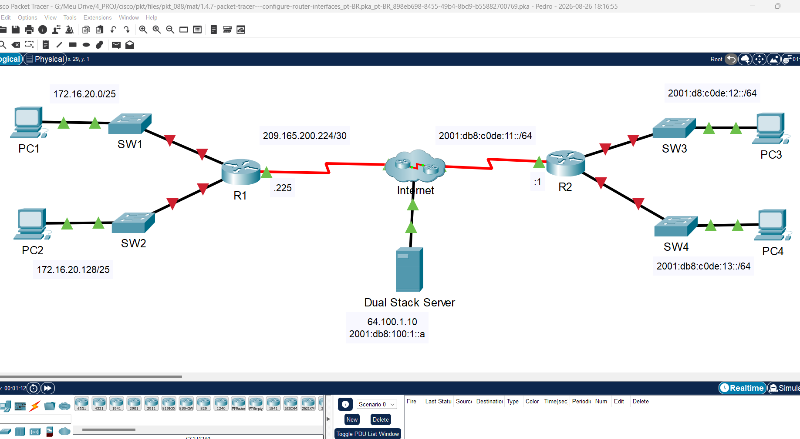
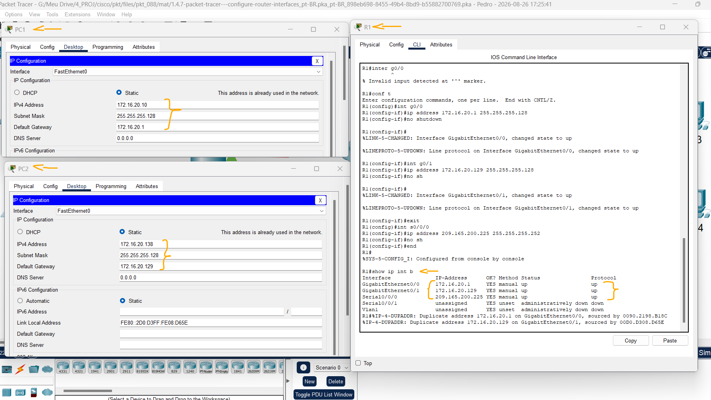
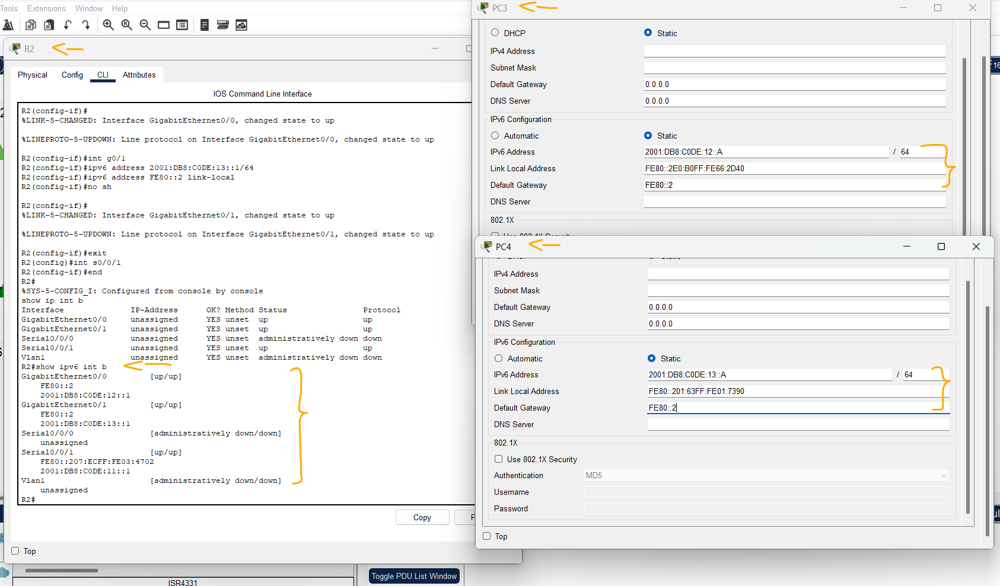
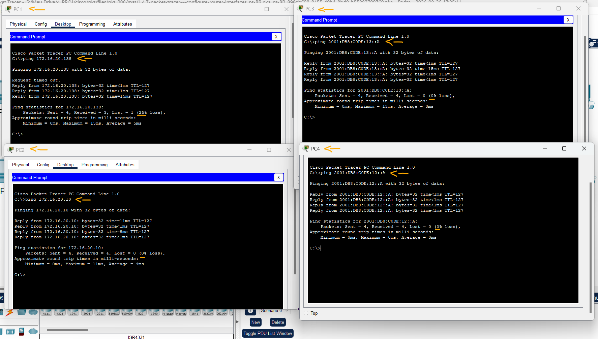

# Packet Tracer – Configurar Interfaces de Roteador   

### Cisco: <a href="../../../">cisco   </a>
### Cisco Networking Academy: cna   </a>
### Training Category: <a href="../../../pkt/">pkt</a>
### Software/Subject: network   </a>
### Course: <a href="./">pkt_088 (Packet Tracer – Configurar Interfaces de Roteador)   </a>

---

### Theme:
- Network

### Used Tools:
- Operating System (OS): 
  - Cisco Internetwork Operating System (Cisco IOS)   
  - Windows 11 
- Cloud Services:
  - Google Drive 
- Language:
  - HTML   
  - Markdown   
- Integrated Development Environment (IDE) and Text Editor:
  - Visual Studio Code (VS Code)   
- Versioning: 
  - Git   
- Repository:
  - GitHub   
- Network:
  - Cisco Packet Tracer   
  - ping   

---

<h3><a name="item00">Course Strcuture:</a></h3>

1. <a href="#item01">Parte 1: Configurar o endereçamento IPv4 e verificar a conectividade</a> 
  1.1 <a href="#item01.01">Etapa 1: Atribua endereços IPv4 a R1 e aos dispositivos LAN.</a> 
  1.2 <a href="#item01.02">Etapa 2: Verifique a conectividade.</a> 
2. <a href="#item02">Parte 2: Configurar o endereçamento IPv6 e verificar a conectividade</a> 
  2.1 <a href="#item02.01">Etapa 1: Atribua endereços IPv6 a R2 e aos dispositivos LAN.</a> 
  2.2 <a href="#item02.02">Etapa 2: Verifique a conectividade.</a> 

---

### Objective:
O objetivo desta atividade foi configurar o endereçamento IPv4 e IPv6 em diferentes redes e, posteriormente, verificar a conectividade entre os hosts por meio de testes de comunicação.

### Folder Structure:
- [README.md](./README.md): Este documento de README, escrito em **Markdown**, com o conteúdo do laboratório.
- [0-aux](./0-aux/): Pasta auxiliar com imagens utilizadas na construção dos arquivos de README desse curso.

### Development:

<a name="item01"><h4>1. Parte 1: Configurar o endereçamento IPv4 e verificar a conectividade</h4></a>[Back to summary](#item00)

A imagem 01 mostra a topologia inicial.

<figure>
     
    <figcaption>Imagem 01.</figcaption>
</figure>
 

#### Tabela 1 — Planejamento de Endereçamento IPv4 e IPv6

| Dispositivo | Interface |      Tipo IP      | Endereço IP         | Prefixo | Gateway Padrão |
|:-----------:|:---------:|:-----------------:|:-------------------:|:-------:|:--------------:|
| R1          | G0/0      | IPv4              | 172.16.20.1         | /25     | N/A            |
| R1          | G0/1      | IPv4              | 172.16.20.129       | /25     | N/A            |
| R1          | S0/0/0    | IPv4              | 209.165.200.225     | /30     | N/A            |
| PC1         | NIC       | IPv4              | 172.16.20.10        | /25     | 172.16.20.1    |
| PC2         | NIC       | IPv4              | 172.16.20.138       | /25     | 172.16.20.129  |
| R2          | G0/0      | IPv6              | 2001:DB8:C0DE:12::1 | /64     | N/A            |
| R2          | G0/0      | IPv6 (Link Local) | FE80::2             | /64     | N/A            |
| R2          | G0/1      | IPv6              | 2001:DB8:C0DE:13::1 | /64     | N/A            |
| R2          | G0/1      | IPv6 (Link Local) | FE80::2             | /64     | N/A            |
| R2          | S0/0/1    | IPv6              | 2001:DB8:C0DE:11::1 | /64     | N/A            |
| PC3         | NIC       | IPv6              | 2001:DB8:C0DE:12::A | /64     | FE80::2        |
| PC4         | NIC       | IPv6              | 2001:DB8:C0DE:13::A | /64     | FE80::2        |

<a name="item01.01"><h4>1.1 Etapa 1: Atribua endereços IPv4 a R1 e aos dispositivos LAN.</h4></a>[Back to summary](#item00)

- a. Consultando a Tabela de Endereçamento, configure o endereçamento IP para interfaces LAN R1, PC1 e PC2. A interface serial já foi configurada.
  - `cisco` -> `enable` -> `class` -> `configure terminal`.
  - R1-G0/0: `interface g0/0` -> `ip address 172.16.20.1 255.255.255.128` -> `no shutdown` -> `exit`.
  - R1-G0/1: `interface g0/1` -> `ip address 172.16.20.129 255.255.255.128` -> `no shutdown` -> `exit`.
  - R1-S0/0/0: `interface s0/0/0` -> `ip address 209.165.200.225 255.255.255.252` -> `no shutdown` -> `exit`.
  - `exit` -> `show ip interface brief`.
  - PC1: `172.16.20.10` -> `255.255.255.128` -> `172.16.20.1`.
  - PC2: `172.16.20.138` -> `255.255.255.128` -> `172.16.20.129`.

A imagem 02 mostra o endereçamento IPv4 configurado nos dispositivos dessa pilha.

<figure>
     
    <figcaption>Imagem 02.</figcaption>
</figure>
 

<a name="item01.02"><h4>1.2 Etapa 2: Verifique a conectividade.</h4></a>[Back to summary](#item00)

- a. PC1 e PC2 devem conseguir fazer ping entre si e o Servidor de Pilha Dupla.
  - PC1-PC2: `ping 172.16.20.138`.
  - PC2-PC1: `ping 172.16.20.10`.

<a name="item02"><h4>2. Parte 2: Configurar o endereçamento IPv6 e verificar a conectividade</h4></a>[Back to summary](#item00)

<a name="item02.01"><h4>2.1 Etapa 1: Atribua endereços IPv6 a R2 e aos dispositivos LAN.</h4></a>[Back to summary](#item00)

- a. Consultando a Tabela de Endereçamento, configure o endereçamento IP para interfaces LAN R2, PC3 e PC4. A interface serial já foi configurada.
  - `cisco` -> `enable` -> `class` -> `configure terminal`.
  - R2-G0/0: `interface g0/0` -> `ipv6 address 2001:DB8:C0DE:12::1/64` -> `ipv6 address FE80::2 link-local` -> `no shutdown` -> `exit`.
  - R2-G0/1: `interface g0/1` -> `ipv6 address 2001:DB8:C0DE:13::1/64` -> `ipv6 address FE80::2 link-local` -> `no shutdown` -> `exit`.
  - R2-S0/0/0: `interface s0/0/1` -> `ipv6 address 2001:DB8:C0DE:11::1/64` -> `no shutdown` -> `exit`.
  - `exit` -> `show ip interface brief`.
  - PC3: `2001:DB8:C0DE:12::A` -> `64` -> `FE80::2`.
  - PC4: `2001:DB8:C0DE:13::A` -> `64` -> `FE80::2`.

A imagem 03 exibe o endereçamento IPv6 configurado nos dispositivos dessa pilha.

<figure>
     
    <figcaption>Imagem 03.</figcaption>
</figure>
 

<a name="item02.02"><h4>2.2 Etapa 2: Verifique a conectividade.</h4></a>[Back to summary](#item00)

- a. PC3 e PC4 deve poder executar ping um ao outro e o Servidor de Pilha Dupla.
  - PC3-PC4: `ping 2001:DB8:C0DE:13::A`.
  - PC4-PC3: `ping 2001:DB8:C0DE:12::A`.

A imagem 04 mostra mostra a remoção da ACL 11 da interface S0/0/0 do R1, permitindo o sucesso dos testes de conectividade via ping às redes remotas anteriormente inacessíveis.

<figure>
     
    <figcaption>Imagem 04.</figcaption>
</figure>
 