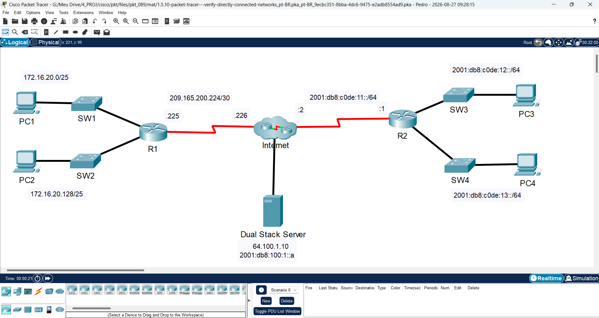
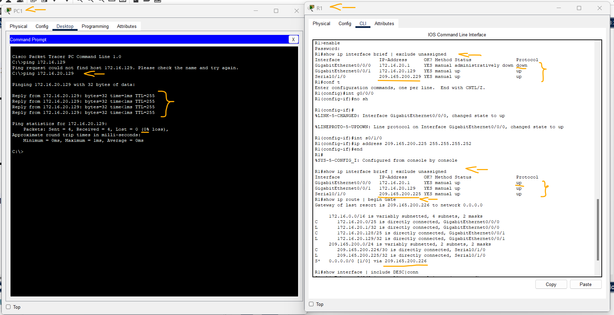
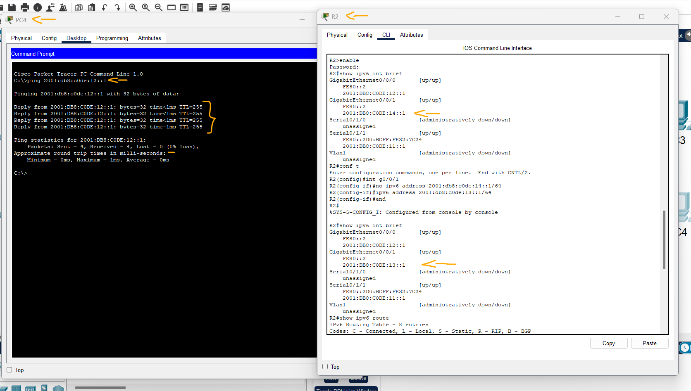

# Packet Tracer - Verificar redes diretamente conectadas   

### Cisco: <a href="../../../">cisco   </a>
### Cisco Networking Academy: cna   </a>
### Training Category: <a href="../../../pkt/">pkt</a>
### Software/Subject: network   </a>
### Course: <a href="./">pkt_089 (Packet Tracer - Verificar redes diretamente conectadas)   </a>

---

### Theme:
- Network

### Used Tools:
- Operating System (OS): 
  - Cisco Internetwork Operating System (Cisco IOS)   
  - Windows 11 
- Cloud Services:
  - Google Drive 
- Language:
  - HTML   
  - Markdown   
- Integrated Development Environment (IDE) and Text Editor:
  - Visual Studio Code (VS Code)   
- Versioning: 
  - Git   
- Repository:
  - GitHub   
- Network:
  - Cisco Packet Tracer   
  - ping   

---

<h3><a name="item00">Course Strcuture:</a></h3>

1. <a href="#item01">Parte 1: Verifique redes IPv4 diretamente conectadas</a> 
  1.1 <a href="#item01.01">Etapa 1: Verifique os endereços IPv4 e o status da porta em R1.</a> 
  1.2 <a href="#item01.02">Etapa 2: Verifique a conectividade.</a> 
2. <a href="#item02">Parte 2: Verifique redes IPv6 diretamente conectadas</a> 
  2.1 <a href="#item02.01">Etapa 1: Verifique os endereços IPv6 e o status da porta no R2.</a> 
  2.2 <a href="#item02.02">Etapa 2: Verifique a conectividade.</a> 

---

### Objective:
Esta atividade teve como objetivo corrigir os endereçamentos IPv4 e IPv6 configurados incorretamente nas interfaces de dois roteadores de redes distintas, além de verificar a conectividade entre os hosts de cada rede e analisar as rotas diretamente conectadas presentes nas tabelas de roteamento dos roteadores.

### Folder Structure:
- [README.md](./README.md): Este documento de README, escrito em **Markdown**, com o conteúdo do laboratório.
- [0-aux](./0-aux/): Pasta auxiliar com imagens utilizadas na construção dos arquivos de README desse curso.

### Development:

<a name="item01"><h4>1. Parte 1: Verifique redes IPv4 diretamente conectadas</h4></a>[Back to summary](#item00)

A imagem 01 mostra a topologia inicial.

<figure>
     
    <figcaption>Imagem 01.</figcaption>
</figure>
 

<a name="item01.01"><h4>1.1 Etapa 1: Verifique os endereços IPv4 e o status da porta em R1.</h4></a>[Back to summary](#item00)

- a. Verifique o status das interfaces configuradas filtrando a saída.
  - `cisco` -> `enable` -> `class`.
  - `show ip interface brief | exclude unassigned`.
- b. Com base na saída, corrija todos os problemas de status da porta que você vê.
- c. Consulte a Tabela de Endereços e verifique os endereços IP configurados em R1. Faça quaisquer correções no endereçamento, se necessário. 
  - `configure terminal` -> `interface g0/0/0` -> `no shutdown` -> `exit`.
  - `interface s0/1/0` -> `ip address 209.165.200.225 255.255.255.252` -> `end`. 
- d. Exiba a tabela de roteamento filtrando para iniciar a saída na palavra Gateway. Observação: os termos usados para filtrar a saída podem ser encurtados para corresponder ao texto, desde que a correspondência seja exclusiva. Por exemplo, Gateway, Gate e Ga terão o mesmo efeito. G 
não vai. A filtragem diferencia maiúsculas de minúsculas.
  - `show ip route | begin Gate`.
- d. Qual é o gateway do endereço de último recurso?
  - O gateway de último recurso é o endereço 209.165.200.226, correspondente à interface Serial0/1/0 do roteador.
- e. Exibir informações de interface e filtro para Descrição ou conectado. Observação: Ao usar incluir ou excluir várias pesquisas podem ser realizadas separando as strings de pesquisa com um símbolo de pipe ( | ).
  - `show interface | include DESC|conn`.
- e. Qual é o ID do Circuito exibido da sua saída?
  - Nenhum ID de Circuito é exibido na saída apresentada. Acredito que essa questão não é referente a este comando.
- f. Exiba informações de interface específicas para G0/0/0 filtrando para duplex.
  - `show interface g0/0/0 | include duplex`.
- f. Qual é a configuração duplex, a velocidade e o tipo de mídia?
  - A interface está configurada em full-duplex, com velocidade de 100 Mb/s e tipo de mídia RJ45.

<a name="item01.02"><h4>1.2 Etapa 2: Verifique a conectividade.</h4></a>[Back to summary](#item00)

- a. PC1 e PC2 devem conseguir fazer ping entre si e o Servidor de Pilha Dupla. Caso contrário, verifique o 
status das interfaces e as atribuições de endereço IP.
  - PC1-PC2: `ping 172.16.20.129`.

A imagem 02 mostra que as configurações das interfaces necessárias foram corrigidas, incluindo o endereçamento IPv4, e que o teste de conectividade entre os dois hosts da rede foi realizado com sucesso.

<figure>
     
    <figcaption>Imagem 02.</figcaption>
</figure>
 

<a name="item02"><h4>2. Parte 2: Verifique redes IPv6 diretamente conectadas</h4></a>[Back to summary](#item00)

<a name="item02.01"><h4>2.1 Etapa 1: Verifique os endereços IPv6 e o status da porta no R2.</h4></a>[Back to summary](#item00)

- a. Verifique o status das interfaces configuradas.
  - `cisco` -> `enable` -> `class`.
  - `show ipv6 int brief`.
- a. Qual é o status das interfaces configuradas?
  - As três interfaces utilizadas estão no estado up/up, indicando que estão ativas e operacionais, não sendo necessário ativá-las manualmente.
- b. Consulte a Tabela de Endereçamento e faça quaisquer correções no endereçamento conforme necessário. Observação: Ao alterar um endereço IPv6, é necessário remover o endereço incorreto, uma vez que uma interface é capaz de suportar várias redes IPv6.
  - `configure terminal` -> `interface g0/0/1` -> `no ipv6 address 2001:db8:c0de:14::1/64`.
- b. Configure o endereço correto na interface.
  - `ipv6 address 2001:db8:c0de:13::1/64` -> `end`.
- c. Exibe as tabelas de roteamento IPv6. Observação: os comandos de filtragem não funcionam atualmente com os comandos IPv6.
  - `show ipv6 route`.
- d. Exibir todo o endereçamento IPv6 configurado em interfaces filtrando a saída do running-config. Filtre a saída no R2 para ipv6 ou interface.
  - `sh run | include ipv6|interface`.
- d. Quantos endereços são configurados em cada interface Gigabit?
  - São configurados dois endereços IPv6 em cada interface GigabitEthernet: um endereço global unicast (GUA) e um endereço link-local (LLA).

<a name="item02.02"><h4>2.2 Etapa 2: Verifique a conectividade.</h4></a>[Back to summary](#item00)

- a. PC3 e PC4 deve poder executar ping um ao outro e o Servidor de Pilha Dupla. Caso contrário, verifique o status da interface e as atribuições de endereço IPv6.
  - PC4-PC3: `ping 2001:db8:c0de:12::1`.

A imagem 03 evidencia a correção do endereçamento IPv6 em uma das interfaces que apresentava uma configuração incorreta, bem como a confirmação da conectividade por meio de um teste de ping.

<figure>
     
    <figcaption>Imagem 03.</figcaption>
</figure>
 