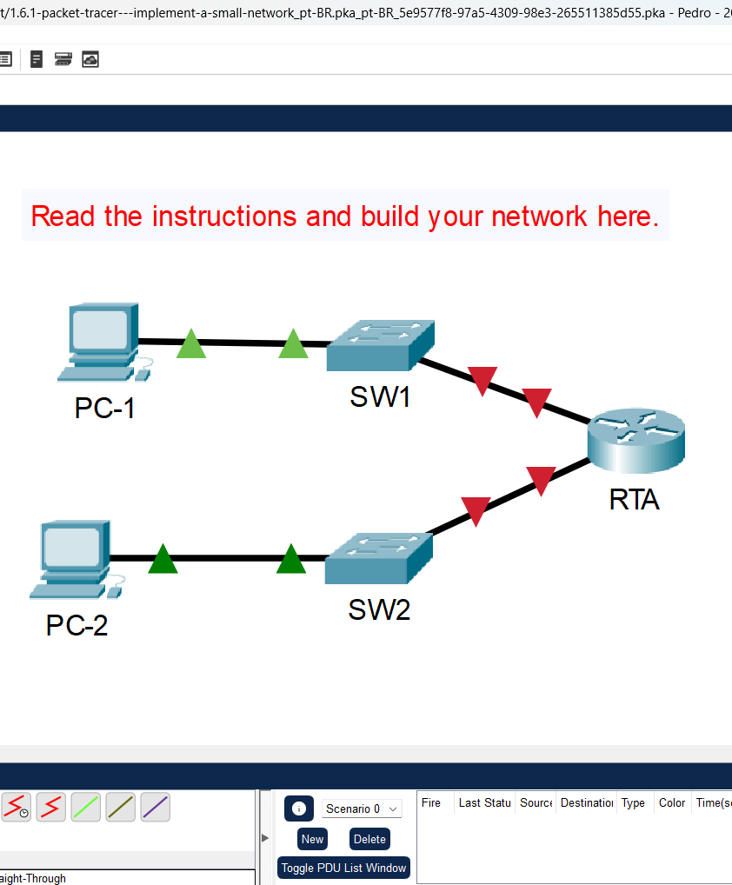
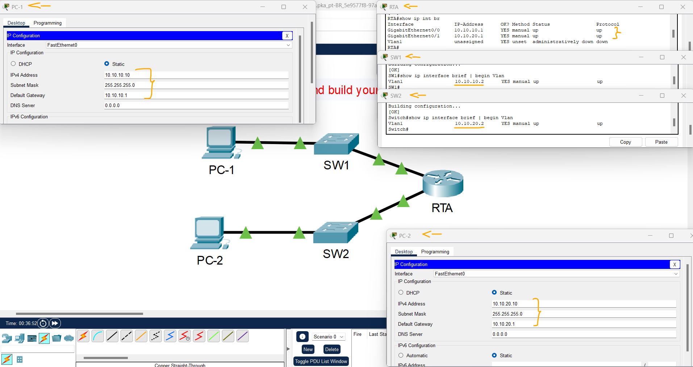
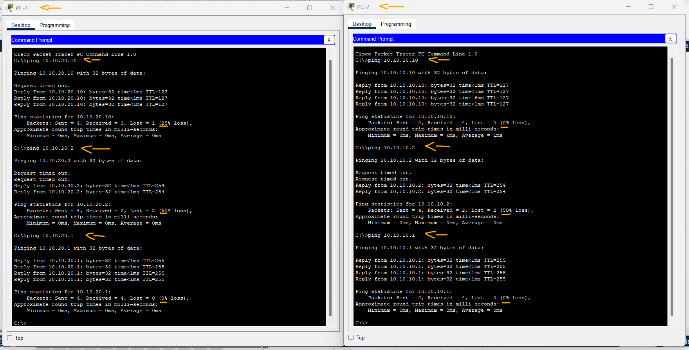

# Packet Tracer - Implementar uma Rede Pequena   

### Cisco: <a href="../../../">cisco   </a>
### Cisco Networking Academy: cna   </a>
### Training Category: <a href="../../../pkt/">pkt</a>
### Software/Subject: network   </a>
### Course: <a href="./">pkt_090 (Packet Tracer - Implementar uma Rede Pequena)   </a>

---

### Theme:
- Network

### Used Tools:
- Operating System (OS): 
  - Cisco Internetwork Operating System (Cisco IOS)   
  - Windows 11 
- Cloud Services:
  - Google Drive 
- Language:
  - HTML   
  - Markdown   
- Integrated Development Environment (IDE) and Text Editor:
  - Visual Studio Code (VS Code)   
- Versioning: 
  - Git   
- Repository:
  - GitHub   
- Network:
  - Cisco Packet Tracer   
  - ping   

---

<h3><a name="item00">Course Strcuture:</a></h3>

1. <a href="#item01">Parte 1: Criar a Topologia de Rede</a> 
  1.1 <a href="#item01.01">Etapa 1: Obtenha os dispositivos necessários.</a> 
  1.2 <a href="#item01.02">Etapa 2: Nomear o dispositivo.</a> 
  1.3 <a href="#item01.03">Etapa 3: Conectar os Dispositivos.</a> 
2. <a href="#item02">Parte 2: Configurar os Dispositivos</a> 
  2.1 <a href="#item02.01">Etapa 1: Configurar o roteador.</a> 
  2.2 <a href="#item02.02">Etapa 2: Configurar o switch SW1 e SW2.</a> 
  2.3 <a href="#item02.03">Etapa 3: Configurar os hosts.</a> 

---

### Objective:
O objetivo desta atividade foi construir uma pequena rede do zero, composta por um roteador e duas sub-redes, cada uma contendo um switch configurado com uma VLAN e um PC conectado.

### Folder Structure:
- [README.md](./README.md): Este documento de README, escrito em **Markdown**, com o conteúdo do laboratório.
- [0-aux](./0-aux/): Pasta auxiliar com imagens utilizadas na construção dos arquivos de README desse curso.

### Development:

<a name="item01"><h4>1. Parte 1: Criar a Topologia de Rede</h4></a>[Back to summary](#item00)

<a name="item01.01"><h4>1.1 Etapa 1: Obtenha os dispositivos necessários.</h4></a>[Back to summary](#item00)

- a. Clique no ícone Dispositivos de Rede na barra de ferramentas inferior. 
- b. Clique no ícone do roteador no submenu. 
- c. Localize o ícone do roteador 1941. Clique e arraste o ícone do roteador 1941 para a área de topologia. 
- d. Clique na entrada do switch no submenu. 
- e. Localize o ícone do switch 2960. Clique e arraste o ícone do switch 2960 para a área de topologia. 
- f. Repita a etapa acima para que haja dois switches 2960 na área de topologia.
- g. Clique no ícone End Devices. 
- h. Localize o ícone do PC. Arraste dois PCs para a área de topologia. 
- i. Organize os dispositivos em um layout com o qual você pode trabalhar clicando e arrastando.

<a name="item01.02"><h4>1.2 Etapa 2: Nomear o dispositivo.</h4></a>[Back to summary](#item00)

Os dispositivos têm nomes padrão que você precisará alterar. Você nomeará os dispositivos como mostrado na Tabela de Endereçamento. Você está alterando os nomes de exibição dos dispositivos. Este é o rótulo de texto que aparece abaixo de cada dispositivo. Seus nomes de exibição devem corresponder exatamente às informações na Tabela de Endereçamento. Se um nome de exibição não corresponder, você não será marcado para a configuração do dispositivo.

- a. Clique no nome de exibição do dispositivo que está abaixo do ícone do dispositivo. Um campo de texto deve aparecer com um ponto de inserção intermitente. Se a janela de configuração do dispositivo for exibida, feche-a e tente novamente, clicando um pouco mais longe do ícone do dispositivo. 
- b. Substitua o nome de exibição atual pelo nome de exibição apropriado na Tabela de Endereçamento. 
- c. Repita até que todos os dispositivos sejam nomeados.

<a name="item01.03"><h4>1.3 Etapa 3: Conectar os Dispositivos.</h4></a>[Back to summary](#item00)

- a. Clique no ícone de conexões de raio laranja na barra de ferramentas inferior. 
- b. Localize o ícone do cabo direto de cobre. Parece uma linha diagonal preta sólida. 
- c. Para ligar o dispositivo, clique no ícone de cabo de cobre e, em seguida, clique no primeiro dispositivo que pretende ligar. Selecione a porta correta e clique no segundo dispositivo. Selecione a porta correta e os dispositivos serão conectados. 
- d. Conecte os dispositivos conforme especificado na tabela abaixo.

A imagem 01 apresenta a topologia de rede construída.

<figure>
     
    <figcaption>Imagem 01.</figcaption>
</figure>
 

<a name="item02"><h4>2. Parte 2: Configurar os Dispositivos</h4></a>[Back to summary](#item00)

Registre o endereçamento do PC e os endereços de gateway na tabela de endereçamento. Você pode usar qualquer endereço disponível na rede para PC-1 e PC-2.

<a name="item02.01"><h4>2.1 Etapa 1: Configurar o roteador.</h4></a>[Back to summary](#item00)

- a. Defina as configurações básicas. Nome do host, conforme mostrado na Tabela de Endereçamento. 
  - `enable` -> `configure terminal` -> `hostname RTA`.
- a. Configure o Ciscoenpa55 como a senha criptografada.
  - `enable secret Ciscoenpa55`.
- a. Configure o Ciscolinepa55 como a senha nas linhas. Todas as linhas devem aceitar conexões.
  - `line console 0` -> `password Ciscolinepa55` -> `login` -> `exit`.
  - `line vty 0 15` -> `password Ciscolinepa55` -> `login` -> `exit`.
- a. Configure uma mensagem apropriada do banner do dia.
  - `banner motd #Unauthorized access is strictly prohibited.#`.
- b. Defina as configurações da interface. Addressing. Descrições nas interfaces.
  - `interface g0/0` -> `description Link to g0/0` -> `ip address 10.10.10.1 255.255.255.0` -> `no shutdown` -> `exit`.
  - `interface g0/1` -> `description Link to g0/1` -> `ip address 10.10.20.1 255.255.255.0` -> `no shutdown` -> `end`.
- b. Salve sua configuração.
  - `copy running-config startup-config`.

<a name="item02.02"><h4>2.2 Etapa 2: Configurar o switch SW1 e SW2.</h4></a>[Back to summary](#item00)

- a. Configure a interface de gerenciamento padrão para que ela aceite conexões pela rede de hosts locais e remotos. Use os valores na tabela de endereçamento.
  - `enable` -> `configure terminal`.
  - SW1: `interface vlan1` -> `ip address 10.10.10.2 255.255.255.0` -> `no shutdown` -> `exit`.
  - SW2: `interface vlan1` -> `ip address 10.10.20.2 255.255.255.0` -> `no shutdown` -> `exit`.
- b. Configure uma senha criptografada usando o valor na etapa 1a acima. 
  - `enable secret Ciscoenpa55`.
- c. Configure todas as linhas para aceitar conexões usando a senha da etapa 1a acima.
  - `line console 0` -> `password Ciscolinepa55` -> `login` -> `exit`.
  - `line vty 0 15` -> `password Ciscolinepa55` -> `login` -> `exit`.
- d. Configure os switches para que eles possam enviar dados para hosts em redes remotas.
  - SW1: `ip default-gateway 10.10.10.1`.
  - SW2: `ip default-gateway 10.10.20.1`.
- e. Salve sua configuração.
  - `copy running-config startup-config`.

<a name="item02.03"><h4>2.3 Etapa 3: Configurar os hosts.</h4></a>[Back to summary](#item00)

- a. Configurar endereçamento nos hosts.
  - PC-1: `10.10.10.10` -> `255.255.255.0` -> `10.10.10.1`.
  - PC-2: `10.10.20.10` -> `255.255.255.0` -> `10.10.20.1`.
- b. Se suas configurações estiverem concluídas, você deverá ser capaz de executar ping em todos os dispositivos na topologia.
  - PC-1 - PC-2: `ping 10.10.20.10`.
  - PC-1 - SW2: `ping 10.10.20.2`.
  - PC-1 - RTA-G0/1: `ping 10.10.20.1`.
  - PC-2 - PC-1: `ping 10.10.10.10`.
  - PC-2 - SW1: `ping 10.10.10.2`.
  - PC-2 - RTA-G0/0: `ping 10.10.10.1`.

A imagem 02 exibe todos os dispositivos com seus respectivos endereçamentos IP configurados.

<figure>
     
    <figcaption>Imagem 02.</figcaption>
</figure>
 

A imagem 03 comprova que a existência de conectividade entre os dispositivos dessa rede.

<figure>
     
    <figcaption>Imagem 03.</figcaption>
</figure>
 