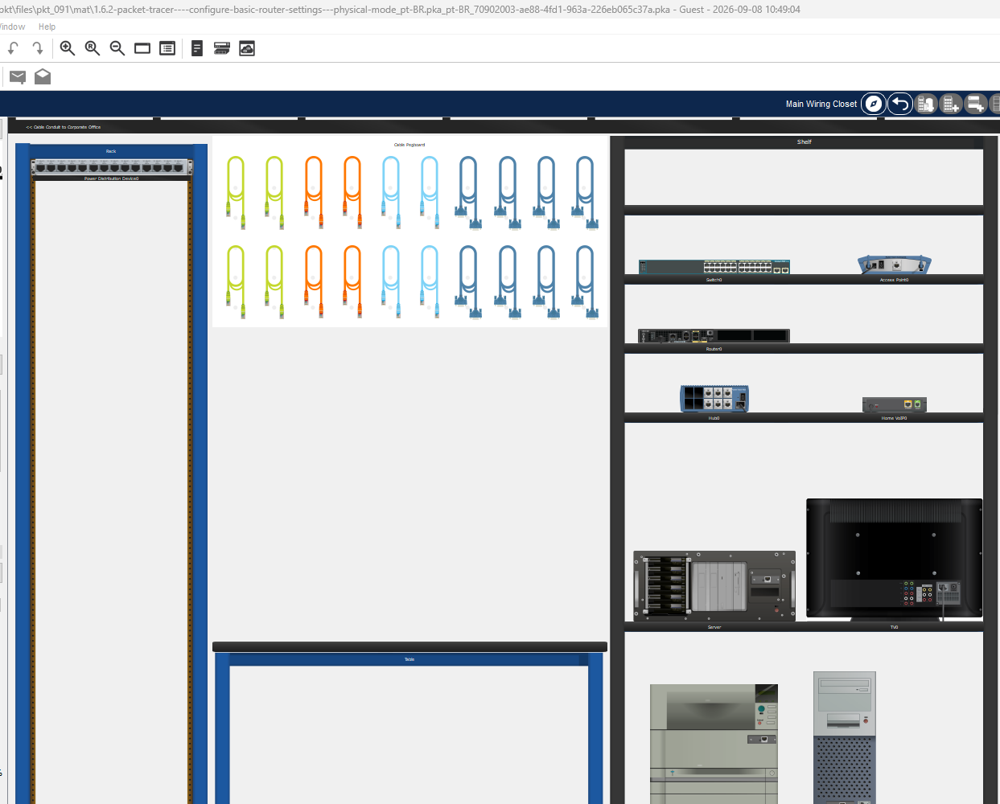
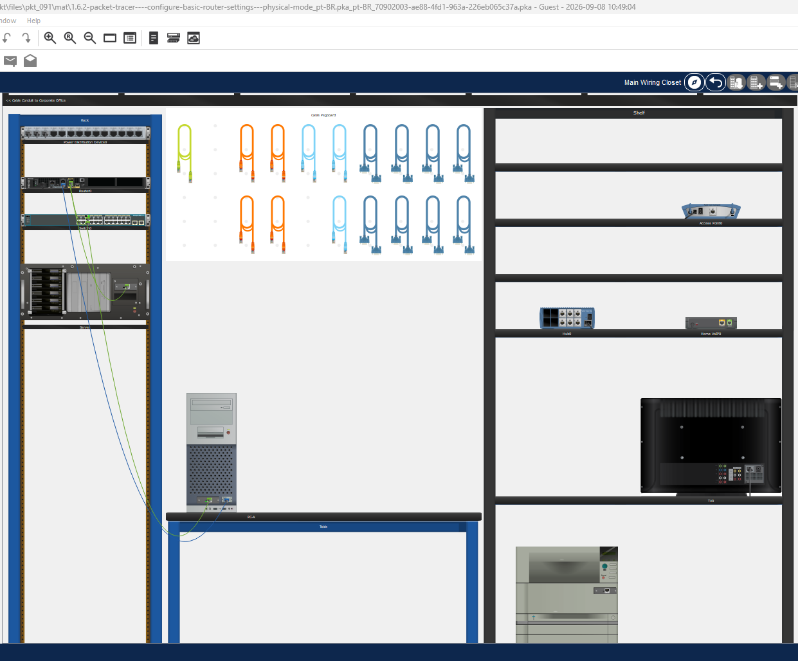
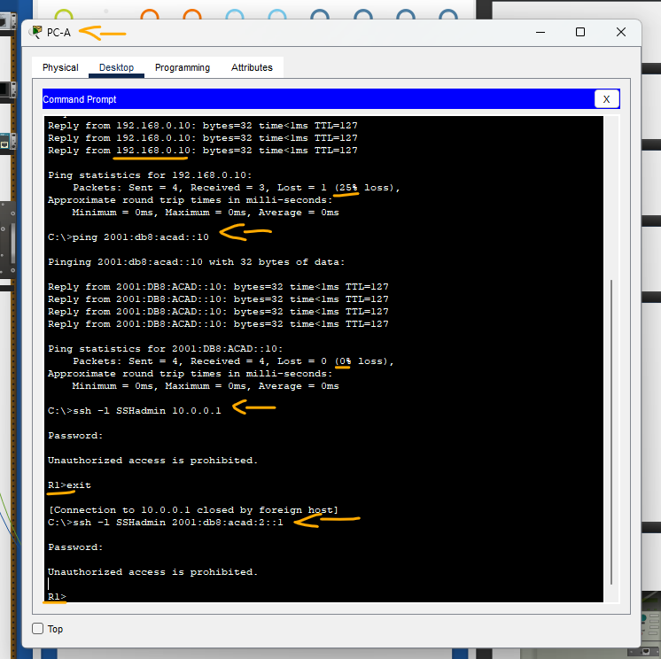
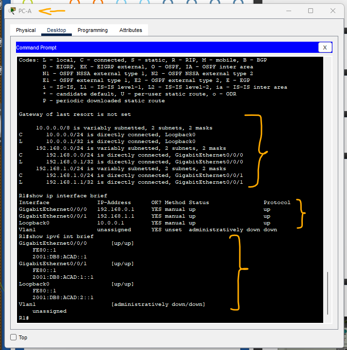

# Packet Tracer - Configurações Básicas do Roteador - Modo Físico   

### Cisco: <a href="../../../">cisco   </a>
### Cisco Networking Academy: cna   </a>
### Training Category: <a href="../../../pkt/">pkt</a>
### Software/Subject: network   </a>
### Course: <a href="./">pkt_091 (Packet Tracer - Configurações Básicas do Roteador - Modo Físico)   </a>

---

### Theme:
- Network

### Used Tools:
- Operating System (OS): 
  - Cisco Internetwork Operating System (Cisco IOS)   
  - Windows 11 
- Cloud Services:
  - Google Drive 
- Language:
  - HTML   
  - Markdown   
- Integrated Development Environment (IDE) and Text Editor:
  - Visual Studio Code (VS Code)   
- Versioning: 
  - Git   
- Repository:
  - GitHub   
- Network:
  - Cisco Packet Tracer   
  - ping   

---

<h3><a name="item00">Course Strcuture:</a></h3>

1. <a href="#item01">Parte 1: Configurar a Topologia e Inicializar os Dispositivos</a> 
  1.1 <a href="#item01.01">Etapa 1: Cabeie a rede conforme mostrado na topologia.</a> 
  1.2 <a href="#item01.02">Etapa 2: Inicialize e recarregue o roteador e o switch.</a> 
2. <a href="#item02">Parte 2: Configurar dispositivos e verificar a conectividade</a> 
  2.1 <a href="#item02.01">Etapa 1: Configure as interfaces do PC.</a> 
  2.2 <a href="#item02.02">Etapa 2: Configurar o roteador.</a> 
  2.3 <a href="#item02.03">Etapa 3: Verificar a conectividade da rede.</a> 
3. <a href="#item03">Parte 3: Exibir Informações do Roteador</a> 
  3.1 <a href="#item03.01">Etapa 1: Estabeleça uma sessão SSH com o R1.</a> 
  3.2 <a href="#item03.02">Etapa 2: Recupere informações importantes de hardware e software.</a> 
  3.3 <a href="#item03.03">Etapa 3: Exiba a configuração de inicialização.</a> 
  3.4 <a href="#item03.04">Etapa 4: Exiba a tabela de roteamento no roteador.</a> 
  3.5 <a href="#item03.05">Etapa 5: Exiba uma lista de sumarização das interfaces no roteador.</a> 
4. <a href="#item04">Perguntas para reflexão</a> 

---

### Objective:
O objetivo desta atividade foi realizar a configuração básica de um roteador, conectando dois hosts por meio de interfaces distintas, e posteriormente estabelecer um acesso remoto ao dispositivo utilizando o protocolo SSH, a fim de verificar e validar as configurações realizadas.

### Folder Structure:
- [README.md](./README.md): Este documento de README, escrito em **Markdown**, com o conteúdo do laboratório.
- [0-aux](./0-aux/): Pasta auxiliar com imagens utilizadas na construção dos arquivos de README desse curso.

### Development:

<a name="item01"><h4>1. Parte 1: Configurar a Topologia e Inicializar os Dispositivos</h4></a>[Back to summary](#item00)

A imagem 01 mostra a topologia inicial.

<figure>
     
    <figcaption>Imagem 01.</figcaption>
</figure>
 

<a name="item01.01"><h4>1.1 Etapa 1: Cabeie a rede conforme mostrado na topologia.</h4></a>[Back to summary](#item00)

- a. Clique e arraste o Cisco 4321 ISR, o Cisco 2960 Switch, e o servidor da prateleira para o Rack. 
- b. Clique e arraste o PC da prateleira para a tabela. 
- c. Ligar os dispositivos conforme especificado no diagrama de topologia. Use cabos retos de cobre para conexões de rede. 
- d. Do PC, conecte um cabo de console ao Cisco 4321 ISR.
- e. Ligue o Cisco 4321 ISR, o PC-A, e o server. O botão liga/desliga para Servidor está no canto inferior direito. O switch 2960 deve ligar automaticamente.

<a name="item01.02"><h4>1.2 Etapa 2: Inicialize e recarregue o roteador e o switch.</h4></a>[Back to summary](#item00)

A imagem 02 apresenta todos os dispositivos alocados, conectados e ligados.

<figure>
     
    <figcaption>Imagem 02.</figcaption>
</figure>
 

<a name="item02"><h4>2. Parte 2: Configurar dispositivos e verificar a conectividade</h4></a>[Back to summary](#item00)

<a name="item02.01"><h4>2.1 Etapa 1: Configure as interfaces do PC.</h4></a>[Back to summary](#item00)

- a. Configure o endereço IP, a máscara de sub-rede e as definições do gateway padrão em PC-A.
  - `192.168.1.10` -> `255.255.255.0` -> `192.168.1.1`.
  - `2001:db8:acad:1::10` -> `64` -> `fe80::1`.
- b. Configure as configurações de endereço IP, máscara de sub-rede e gateway padrão no Servidor.
  - `192.168.0.10` -> `255.255.255.0` -> `192.168.0.1`.
  - `2001:db8:acad::10` -> `64` -> `fe80::1`.

<a name="item02.02"><h4>2.2 Etapa 2: Configurar o roteador.</h4></a>[Back to summary](#item00)

- a. Use o console para se conectar ao roteador e ative o modo EXEC privilegiado.
  - `enable`.
- b. Entre no modo de configuração. 
  - `configure terminal`.
- c. Atribua um nome de dispositivo ao roteador. 
  - `hostname R1`.
- d. Defina o nome de domínio do roteador como ccna-lab.com.
  - `ip domain-name ccna-lab.com`.
- d0. Desative a pesquisa do DNS para evitar que o roteador tente converter comandos inseridos incorretamente como se fossem nomes de host.
  - `no ip domain-lookup`.
- e. Criptografe as senhas de texto sem formatação.
  - `service password-encryption`.
- f. Configure o sistema para exigir uma senha mínima de 12 caracteres.
  - `security passwords min-length 12`.
- g. Configure o nome de usuário SSHadmin com uma senha criptografada de 55Hadm!n2020.
  - `username SSHadmin secret 55Hadm!n2020`.
- h. Gerar um conjunto de chaves criptográficas com um módulo de 1024 bits.
  - `crypto key generate rsa` -> `1024`.
- i. Atribuam $cisco!PRIV* como a senha exec privilegiada.
  - `enable secret $cisco!PRIV*`.
- j. Atribua $cisco!!CON* como a senha do console. Configure sessões para desconectar após quatro minutos de inatividade e habilite o login.
  - `line console 0` -> `password $cisco!!CON*` -> `login` -> `exec-timeout 4 0` -> `exit`.
- k. Atribua $cisco!!VTY* como a senha vty. A próxima etapa é configurar as linhas vty. para aceitar apenas as conexões ssh. Configure sessões para desconectar após quatro minutos de inatividade e habilite o login usando o banco de dados local.
  - `line vty 0 15` -> `password $cisco!!VTY*` -> `transport input ssh` -> `exec-timeout 4 0` -> `login local` -> `exit`.
- l. Crie um banner para avisar às pessoas que o acesso não autorizado é proibido.
  - `banner motd #Unauthorized access is prohibited.#`.
- m. Ative o roteamento IPv6. 
  - `ipv6 unicast-routing`.
- n. Configure todas as três interfaces no roteador com as informações de endereçamento IPv4 e IPv6 da tabela de endereçamento acima. Configure todas as três interfaces com descrições. Ative as três interfaces.
  - `interface g0/0/0` -> `Description Link to Server` -> `ip address 192.168.0.1 255.255.255.0` -> `ipv6 address 2001:db8:acad::1/64` -> `ipv6 address fe80::1 link-local` -> `no shutdown` -> `exit`.
  - `interface g0/0/1` -> `Description Link to Switch` -> `ip address 192.168.1.1 255.255.255.0` -> `ipv6 address 2001:db8:acad:1::1/64` -> `ipv6 address fe80::1 link-local` -> `no shutdown` -> `exit`.
  - `interface loopback 0` -> `Description Loopback Interface` -> `ip address 10.0.0.1 255.255.255.0` -> `ipv6 address 2001:db8:acad:2::1/64` -> `ipv6 address fe80::1 link-local` -> `no shutdown` -> `exit`.
- n. O roteador não deve permitir logins vty por dois minutos se três tentativas de login com falha ocorrerem dentro de 60 segundos.
  - `login block-for 120 attempts 3 within 60` -> `exit`.
- o. Configure o relógio do roteador.
  - `clock set 11:08:00 08 Sep 2026`.
- p. Salve a configuração atual no arquivo de configuração inicial.
  - `copy running-config startup-config`.
- p. Qual seria o resultado de se recarregar o roteador antes de concluir o comando copy running-config startup-config?
  - Se o roteador for recarregado antes do `copy running-config startup-config`, todas as alterações feitas na configuração atual (running-config) serão perdidas, pois não foram salvas na startup-config.

<a name="item02.03"><h4>2.2 Etapa 3: Verificar a conectividade da rede.</h4></a>[Back to summary](#item00)

- a. Usando a linha de comando no PC-A, pingue os endereços IPv4 e IPv6 para o servidor.
  - `ping 192.168.0.10` -> `ping 2001:db8:acad::10`.
- a. Os pings foram bem-sucedidos?
  - Sim. Os pings foram bem-sucedidos utilizando tanto o IPv4 quanto o IPv6.
- b. A partir do PC-A, acesse remotamente o R1 usando o cliente Telnet/SSH. Usando o cliente Telnet/SSH no PC-A, abra uma sessão SSH ao endereço IPv4 da interface de loopback R1. Assegure-se de que o tipo de conexão esteja ajustado ao SSH e use SSHAdmin como o nome de usuário. Quando solicitado, digite a senha 55Hadm!n2020. 
  - `ssh -l SSHadmin 10.0.0.1` -> `55Hadm!n2020`.
- b. O acesso remoto foi bem-sucedido?
  - Sim. O acesso remoto ao R1 foi realizado com sucesso utilizando o protocolo SSH e o usuário SSHAdmin.
- c. Usando o cliente Telnet/SSH no PC-A, abra uma sessão SSH ao endereço do IPv6 da interface de loopback R1. Assegure-se de que o tipo de conexão esteja ajustado ao SSH e use SSHAdmin como o nome de usuário. Quando solicitado, digite a senha 55Hadm!n2020.
  - `ssh -l SSHadmin 2001:db8:acad:2::1` -> `55Hadm!n2020`.
- c. O acesso remoto foi bem-sucedido?
  - Sim. O acesso remoto ao R1 também foi realizado com sucesso utilizando o protocolo SSH através do endereço IPv6.
- c. Por que o protocolo Telnet é considerado um risco à segurança?
  - O Telnet não utiliza criptografia, transmitindo os dados em texto claro, o que permite que informações, como credenciais de acesso, sejam interceptadas e visualizadas.

A imagem 03 mostra ambos os acessos remotos realizados com sucesso.

<figure>
     
    <figcaption>Imagem 03.</figcaption>
</figure>
 

<a name="item03"><h4>3. Parte 3: Exibir Informações do Roteador</h4></a>[Back to summary](#item00)

Na Parte 3, você usará comandos show de uma sessão SSH para recuperar informações do roteador.

<a name="item03.01"><h4>3.1 Etapa 1: Estabeleça uma sessão SSH com o R1.</h4></a>[Back to summary](#item00)

- a. Usando o cliente Telnet/SSH no PC-A, abra uma sessão SSH ao endereço do IPv6 da interface de loopback R1 e entre como SSHadmin com a senha 55Hadm!n2020.
  - `ssh -l SSHadmin 2001:db8:acad:2::1` -> `55Hadm!n2020`.

<a name="item03.02"><h4>3.2 Etapa 2: Recupere informações importantes de hardware e software.</h4></a>[Back to summary](#item00)

- a. Use o comando show version para responder às perguntas sobre o roteador. 
  - `show version`.
- a. Qual é o nome da imagem do IOS que o roteador está executando?
  - O nome da imagem é isr4300-universalk9.03.16.05.S.155-3.S5-ext.SPA.bin.
- a. Quanta memória de acesso aleatório não volátil (NVRAM) o roteador tem?
  - Cerca de 32 MB.
- a. Quanta memória Flash o roteador tem?
  - Cerca de 3,2 GB.
- b. Os comandos show frequentemente apresentam várias telas de saída. A filtragem de saída permite que o usuário exiba determinadas seções da saída. Para habilitar o comando de filtragem, insira uma barra vertical (|) após um comando show, seguida de um parâmetro de filtragem e uma expressão de filtragem. Você pode associar a saída na declaração de filtragem usando a palavra-chave include para exibir todas as linhas da saída que contêm a expressão de filtragem. Filtre o comando show version, usando show version | include register para responder às perguntas a seguir. 
  - `show version | include register`. 
- b. Que seria o processo de inicialização para o roteador no recarregamento seguinte se o registro de configuração era 0x2142?
  - O roteador ignoraria a configuração de inicialização armazenada na NVRAM e iniciaria sem carregar o startup-config, entrando no modo de configuração inicial (Setup). Já o registro de configuração 0x2102 é o valor normal, no qual o startup-config é carregado normalmente.

<a name="item03.03"><h4>3.3 Etapa 3: Exiba a configuração de inicialização.</h4></a>[Back to summary](#item00)

- a. Use o comando show startup-config no roteador para responder às perguntas a seguir.
  - `enable` -> `$cisco!PRIV*`.
  - `show startup-config`.
- a. Como as senhas são apresentadas na saída?
  - As senhas são apresentadas de forma criptografada.
- b. Use o comando show running-config | section vty.
  - `show running-config | section vty`.
- Qual é o resultado do uso desse comando?
  - Esse comando exibe apenas a seção da configuração referente às linhas VTY.

<a name="item03.04"><h4>3.4 Etapa 4: Exiba a tabela de roteamento no roteador.</h4></a>[Back to summary](#item00)

- a. Use o comando show ip route no roteador para responder às perguntas a seguir.
  - `show ip route`.
- a. Qual código é usado na tabela de roteamento para indicar uma rede diretamente conectada?
  - O código utilizado para uma rede diretamente conectada é a letra C.
- a. Quantas entradas de rotas são codificadas com um código C na tabela de roteamento?
  - Nesta tabela de roteamento, existem 3 rotas diretamente conectadas.

<a name="item03.05"><h4>3.5 Etapa 5: Exiba uma lista de sumarização das interfaces no roteador.</h4></a>[Back to summary](#item00)

- a. Use o comando show ip interface brief no roteador para responder à pergunta a seguir.
  - `show ip interface brief`.
- a. Qual comando alterou o status das portas Gigabit Ethernet de administrativamente inoperante (inativa) para operante?
  - O comando `no shutdown` habilitou administrativamente a interface.
- b. Use o comando show ipv6 int brief para verificar as configurações de IPv6 no R1.
  - `show ipv6 int brief`.
- b. Qual é o significado da parte [up/up] da saída?
  - Indica que a interface está ativa tanto na camada física quanto no protocolo de linha (camada de enlace).
c. No Servidor, altere sua configuração para que ele não tenha mais um endereço IPv6 estático. Emita o comando ipconfig no Servidor para examinar a configuração IPv6.
  - `ipconfig`.
- c. Qual é o endereço IPv6 atribuído ao Servidor?
  - O endereço de IPv6 atribuído foi `2001:DB8:ACAD:0:207:ECFF:FEA5:6286`.
- c. Qual é o endereço padrão atribuído ao Servidor? 
  - O default gateway é `FE80::1` e `192.168.0.1`.
- c. Faça um ping a partir do PC-B (Servidor) no endereço de gateway padrão do link local do R1.
  - `ping fe80::1`.
- c. O ping foi bem sucedido?
  - Sim. O ping obteve sucesso.
- c. Faça um ping a partir do PC-B no endereço unicast IPv6 do R1 2001:db8:acad::1.
  - `ping 2001:db8:acad::1`.
- c. O ping foi bem sucedido?
  - Sim. O ping teve êxito.

A imagem 04 apresenta a verificação das interfaces IPv4 e IPv6, realizada por meio do acesso remoto à interface Loopback do R1 a partir do PC-A, além da tabela de roteamento.

<figure>
     
    <figcaption>Imagem 04.</figcaption>
</figure>
 

<a name="item04"><h4>4. Perguntas para reflexão</h4></a>[Back to summary](#item00)

- a. Buscando solucionar um problema de conectividade de rede, um técnico suspeita de que uma interface não foi habilitada. Que comando show o técnico pode usar para solucionar esse problema?
  - Os comandos `show ip interface brief` ou `show ipv6 interface brief`, que permitem verificar rapidamente o status das interfaces e identificar se estão desativadas.
- b. Buscando solucionar um problema de conectividade de rede, um técnico suspeita de que uma máscara de sub-rede incorreta foi atribuída a uma interface. Que comando show o técnico pode usar para solucionar esse problema?
  - O comando `show running-config`, que permite verificar a máscara de sub-rede configurada em cada interface.