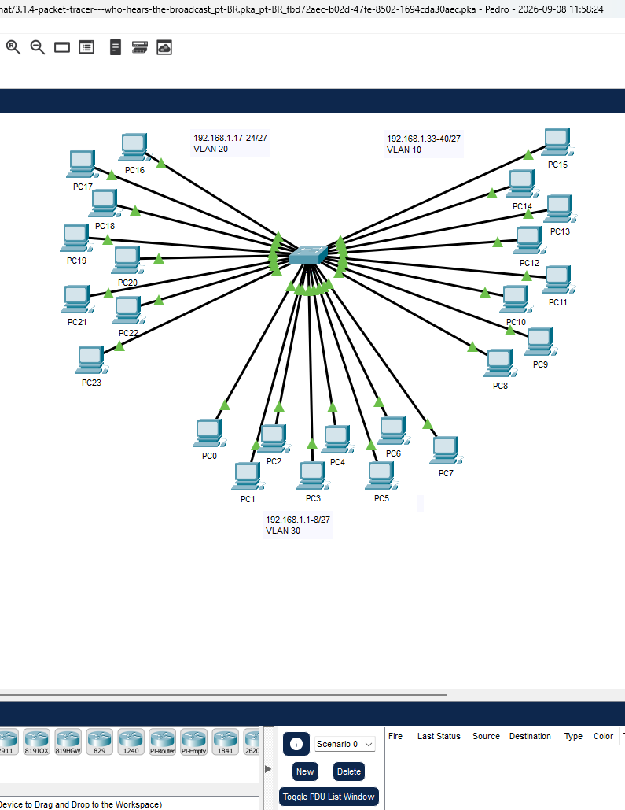
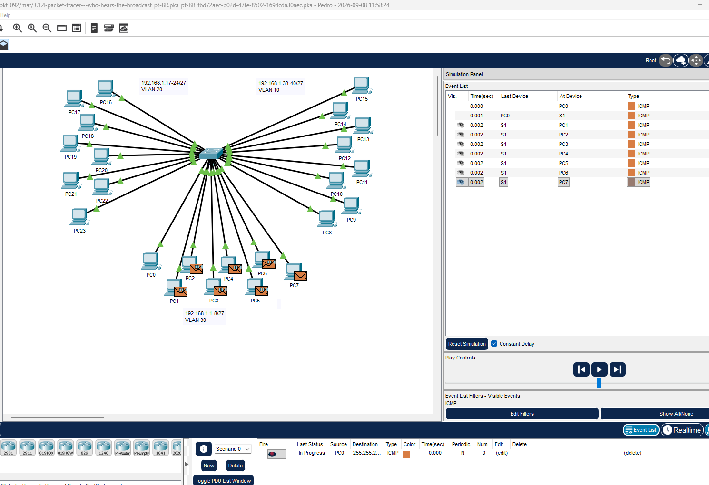

# Packet Tracer – Quem ouve o broadcast?   

### Cisco: <a href="../../../">cisco   </a>
### Cisco Networking Academy: cna   </a>
### Training Category: <a href="../../../pkt/">pkt</a>
### Software/Subject: network   </a>
### Course: <a href="./">pkt_092 (Packet Tracer – Quem ouve o broadcast?)   </a>

---

### Theme:
- Network

### Used Tools:
- Operating System (OS): 
  - Windows 11 
- Cloud Services:
  - Google Drive 
- Language:
  - HTML   
  - Markdown   
- Integrated Development Environment (IDE) and Text Editor:
  - Visual Studio Code (VS Code)   
- Versioning: 
  - Git   
- Repository:
  - GitHub   
- Network:
  - Cisco Packet Tracer   
  - ping   

---

<h3><a name="item00">Course Strcuture:</a></h3>

1. <a href="#item01">Parte 1: Use ping para gerar tráfego.</a> 
2. <a href="#item02">Parte 2: Gere e examine o tráfego de broadcast em uma implementação de VLAN.</a> 
3. <a href="#item03">Perguntas para reflexão</a> 

---

### Objective:
Esta atividade teve como objetivo compreender como os domínios de broadcast podem ser construídos em switches de camada 2 por meio do uso de VLANs, bem como entender como o tráfego é encaminhado dentro desses domínios.

### Folder Structure:
- [README.md](./README.md): Este documento de README, escrito em **Markdown**, com o conteúdo do laboratório.
- [0-aux](./0-aux/): Pasta auxiliar com imagens utilizadas na construção dos arquivos de README desse curso.

### Development:

<a name="item01"><h4>1. Parte 1: Use ping para gerar tráfego.</h4></a>[Back to summary](#item00)

A imagem 01 mostra a topologia inicial.

<figure>
     
    <figcaption>Imagem 01.</figcaption>
</figure>
 

- a. Clique em PC0 e clique em guia Desktop > Command Prompt. 
- b. Insira o comando ping 192.168.1.8. O ping deve ser bem-sucedido. Diferentemente de uma LAN, uma VLAN é um domínio de broadcast criado por switches. Usando o 
modo Simulation do Packet Tracer, faça ping dos dispositivos finais na sua própria VLAN. Com base na sua observação, responda às perguntas na Etapa 2.
  - `ping 192.168.1.8`.

<a name="item02"><h4>2. Parte 2: Gere e examine o tráfego de broadcast em uma implementação de VLAN.</h4></a>[Back to summary](#item00)

- a. Mude para o modo Simulation. 
- b. Clique em Edit Filters no painel Simulation. Desmarque a caixa de seleção Show All/None. Marque a caixa de seleção ICMP.
- c. Clique na ferramenta Adicionar PDU Complexo, representado pelo ícone de envelope aberto na barra de ferramentas à direita.
- d. Passe o cursor do mouse sobre a topologia e o ponteiro do mouse mudará para um envelope com um sinal de mais (+).
- e. Clique em PC0 para atuar como a origem dessa mensagem de teste e a janela de diálogo Create Complex PDU será aberta. Insira os seguintes valores: 
  - Endereço IP de destino: 255.255.255.255 (endereço de broadcast) 
  - Sequence Number (Número de Sequência): 1 
  - Disparo único por hora: 0 
  - Nas configurações da PDU, o padrão para Select Application: (Selecionar Aplicação) é PING. Cite pelo menos outras três aplicações disponíveis para uso.
    - Além do PING, estão disponíveis aplicações como HTTP, FTP e DNS para a criação de PDUs.
- f. Clique em Create PDU (Criar PDU). Este pacote broadcast de teste será exibido na Simulation Panel Event List. Ele também aparece na janela PDU List (Lista de PDUs). É a primeira PDU do Cenário 0. 
- g. Clique duas vezes em Capture/Forward (Capturar/Encaminhar). O que aconteceu com o pacote?
  - O pacote foi enviado em broadcast, sendo encaminhado apenas aos dispositivos da VLAN 30, correspondentes aos hosts de 0 a 7.
- h. Repita esse processo para PC8 e PC16.
  - O mesmo comportamento ocorreu com os outros dois PCs: o PC8, pertencente à VLAN 10, e o PC16, pertencente à VLAN 20, tiveram seus pacotes enviados em broadcast apenas para os dispositivos pertencentes às respectivas VLANs.

A imagem 02 comprova o broadcast enviado pelo PC0, sendo encaminhado apenas aos dispositivos pertencentes à VLAN 30.

<figure>
     
    <figcaption>Imagem 02.</figcaption>
</figure>
 

<a name="item03"><h4>3. Perguntas para reflexão</h4></a>[Back to summary](#item00)

- a. Se um PC na VLAN 10 envia uma mensagem de broadcast, quais dispositivos a receberão? 
  - Apenas os dispositivos pertencentes à VLAN 10, correspondentes ao intervalo de 8 a 15, exceto o dispositivo que originou a transmissão.
- b. Se um PC na VLAN 20 envia uma mensagem de broadcast, quais dispositivos a receberão? 
  - Apenas os dispositivos pertencentes à VLAN 20, correspondentes ao intervalo de 16 a 23, exceto o dispositivo que originou a transmissão.
- c. Se um PC na VLAN 30 envia uma mensagem de broadcast, quais dispositivos a receberão?
  - Apenas os dispositivos pertencentes à VLAN 30, correspondentes ao intervalo de 0 a 7, exceto o dispositivo que originou a transmissão.
- d. O que acontece com um quadro enviado de um PC na VLAN 10 para um PC na VLAN 30?
  - O quadro não será encaminhado diretamente entre as VLANs, pois cada VLAN possui um domínio de broadcast separado. Para que a comunicação entre a VLAN 10 e a VLAN 30 ocorra, é necessário um dispositivo de camada 3, como um roteador ou switch multicamada.
- e. Quais portas no switch se acendem, se um PC conectado à porta 11 envia uma mensagem unicast para um PC conectado à porta 13? 
  - Apenas as portas 11 e 13, pois o quadro unicast é encaminhado diretamente entre os dois dispositivos pertencentes à mesma VLAN.
- f. Quais portas no switch se acendem, se um PC conectado à porta 2 envia uma mensagem unicast para um PC conectado à porta 23?
  - Apenas a porta 2, pois os dispositivos estão em VLANs diferentes, impedindo que o quadro seja encaminhado diretamente ao destino.
- g. Com relação às portas, o que são os domínios de colisão no switch?
  - Cada porta do switch representa um domínio de colisão separado, evitando que as transmissões em uma porta causem colisões nas demais.
- h. Com relação às portas, o que são os domínios de broadcast no switch?
  - Todas as portas pertencentes à mesma VLAN fazem parte do mesmo domínio de broadcast. O broadcast é encaminhado apenas para as portas da mesma VLAN.