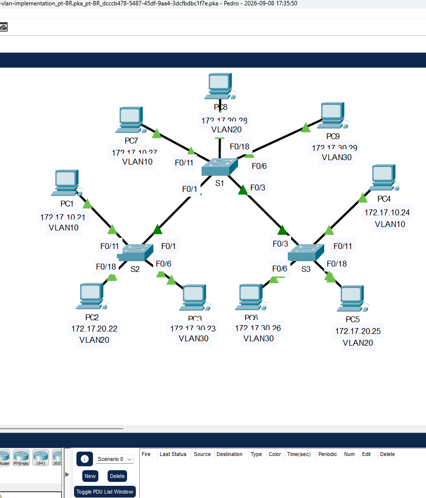
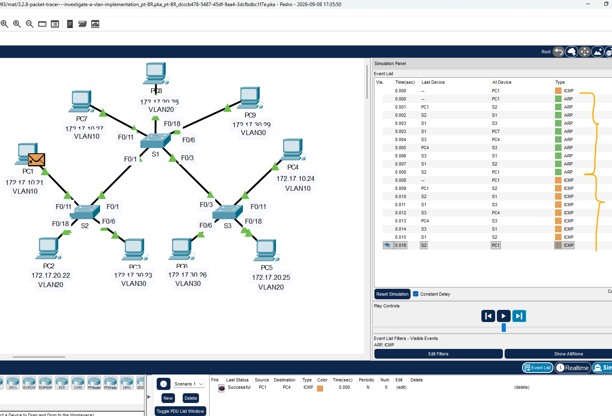
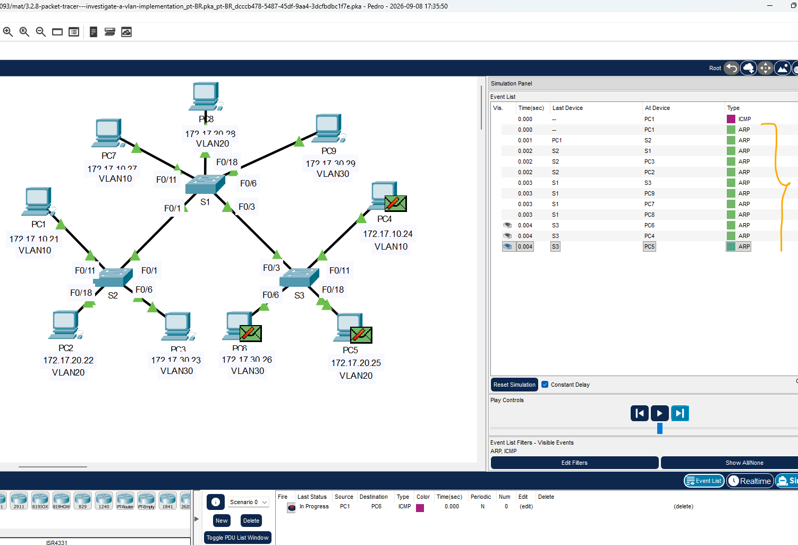

# Packet Tracer - Investigação de uma implementação de VLAN   

### Cisco: <a href="../../../">cisco   </a>
### Cisco Networking Academy: cna   </a>
### Training Category: <a href="../../../pkt/">pkt</a>
### Software/Subject: network   </a>
### Course: <a href="./">pkt_093 (Packet Tracer - Investigação de uma implementação de VLAN)   </a>

---

### Theme:
- Network

### Used Tools:
- Operating System (OS): 
  - Cisco Internetwork Operating System (Cisco IOS)   
  - Windows 11 
- Cloud Services:
  - Google Drive 
- Language:
  - HTML   
  - Markdown   
- Integrated Development Environment (IDE) and Text Editor:
  - Visual Studio Code (VS Code)   
- Versioning: 
  - Git   
- Repository:
  - GitHub   
- Network:
  - Cisco Packet Tracer   
  - ping   

---

<h3><a name="item00">Course Strcuture:</a></h3>

1. <a href="#item01">Parte 1: Observar o tráfego de broadcast em uma implementação de VLAN</a> 
  1.1 <a href="#item01.01">Etapa 1: Faça ping de PC1 para PC6.</a> 
  1.2 <a href="#item01.02">Etapa 2: Faça ping de PC1 para PC4.</a> 
2. <a href="#item02">Parte 2: Observe o tráfego de transmissões sem VLANs</a> 
  2.1 <a href="#item02.01">Etapa 1: Limpe as configurações em todos os três switches e exclua o banco de dados da VLAN.</a> 
  2.2 <a href="#item02.02">Etapa 2: Recarregue os switches.</a> 
  2.3 <a href="#item02.03">Etapa 3: Clique em Capture / Forward para enviar solicitações ARP e pings.</a> 
3. <a href="#item03">Perguntas para reflexão</a> 

---

### Objective:
O objetivo desta atividade foi compreender como as VLANs podem separar e criar diferentes domínios de broadcast na camada de enlace, analisando o comportamento do tráfego em topologias com e sem VLANs.

### Folder Structure:
- [README.md](./README.md): Este documento de README, escrito em **Markdown**, com o conteúdo do laboratório.
- [0-aux](./0-aux/): Pasta auxiliar com imagens utilizadas na construção dos arquivos de README desse curso.

### Development:

<a name="item01"><h4>1. Parte 1: Observar o tráfego de broadcast em uma implementação de VLAN</h4></a>[Back to summary](#item00)

A imagem 01 mostra a topologia inicial.

<figure>
     
    <figcaption>Imagem 01.</figcaption>
</figure>
 

<a name="item01.01"><h4>1.1 Etapa 1: Faça ping de PC1 para PC6.</h4></a>[Back to summary](#item00)

- a. Aguarde todas as luzes de link acenderem em verde. Para acelerar esse processo, clique em Tempo de avanço rápido localizado na barra de ferramentas inferior. 
- b. Clique na guia Simulation e use a ferramenta Add Simple PDU. Clique em PC1 e, em seguida, clique em PC6.
- c. Clique no botão Capture / Forward para seguir o processo na ordem. Observe as solicitações ARP à medida que atravessam a rede. Quando a janela Buffer Full for exibida, clique no botão View Previous Events. Os pings foram bem-sucedidos? Explique.
  - Não. Os pings não foram bem-sucedidos porque o PC1 pertence à VLAN 10, enquanto o PC6 pertence à VLAN 30. Como estão em VLANs diferentes, não há comunicação direta entre eles sem um dispositivo de camada 3.
- c. Examine o Painel de simulação, para onde S3 enviou o pacote depois de recebê-lo?
  -  O switch S3 enviou o pacote para o PC4, que pertence à VLAN 10.
- d. Na operação normal, quando um switch recebe um quadro de broadcast em uma de suas portas, ele encaminha o quadro para todas as outras portas. Notar que S2 envia apenas a solicitação ARP de F0/1 a S1. Observe também que S3 envia apenas a solicitação ARP de F0/11 para PC4. PC1 e PC4 pertencem à VLAN 10. PC6 pertence à VLAN 30. Como o tráfego de broadcast está contido dentro da VLAN, PC6 nunca recebe a solicitação ARP do PC1. Como PC4 não é o destino, ele descarta a solicitação ARP. O ping de PC1 falha porque PC1 nunca recebe uma resposta ARP.

<a name="item01.02"><h4>1.2 Etapa 2: Faça ping de PC1 para PC4.</h4></a>[Back to summary](#item00)

- a. Clique no botão Novo na guia suspensa Cenário 0. Agora, clique no ícone Add Simple PDU no lado direito do Packet Tracer e faça ping de PC1 para PC4. 
- b. Clique no botão Capture / Forward para seguir o processo na ordem. Observe as solicitações ARP à medida que atravessam a rede. Quando a janela Buffer Full for exibida, clique no botão View Previous Events. Os pings foram bem-sucedidos? Explique.
  - Sim, os pings foram bem-sucedidos, pois o PC1 e o PC4 pertencem à mesma VLAN, a VLAN 10.
- c. Examine o Painel de simulação. Quando o pacote atingiu S1, por que ele também encaminha o pacote para PC7?
  - Porque o S2 encaminhou um quadro ARP em broadcast para o S1. Como o endereço MAC do PC4 ainda não era conhecido, foi necessário realizar a resolução do endereço IP para o endereço MAC. Por isso, o S1 encaminhou o quadro para os demais dispositivos da VLAN 10, incluindo o PC7.

A imagem 02 apresenta o tráfego realizado com sucesso entre dispositivos pertencentes à mesma VLAN.

<figure>
     
    <figcaption>Imagem 02.</figcaption>
</figure>
 

<a name="item02"><h4>2. Parte 2: Observe o tráfego de transmissões sem VLANs</h4></a>[Back to summary](#item00)

<a name="item02.01"><h4>2.1 Etapa 1: Limpe as configurações em todos os três switches e exclua o banco de dados da VLAN.</h4></a>[Back to summary](#item00)

- a. Volte ao modo de Tempo real. Abrir a janela de configuração.
- b. Exclua a configuração de inicialização em todos os três switches. Que comando é usado para apagar a configuração de inicialização dos switches?
  - `enable` -> `erase startup-config`.
- b. Onde o arquivo VLAN é armazenado nos switches?
  - O arquivo VLAN é armazenado na memória Flash, no arquivo vlan.dat.
- c. Exclua o arquivo da VLAN de todos os 3 switches. Que comando exclui o arquivo VLAN armazenado nos switches?
  - `delete flash:vlan.dat`.

<a name="item02.02"><h4>2.2 Etapa 2: Recarregue os switches.</h4></a>[Back to summary](#item00)

- a. Use o comando reload no modo EXEC privilegiado para redefinir todos os comutadores. Aguarde até o link estar completamente verde. Para acelerar esse processo, clique em Avançar o tempo localizado na barra de ferramentas amarela na parte inferior.
  - `reload`.

<a name="item02.03"><h4>2.3 Etapa 3: Clique em Capture / Forward para enviar solicitações ARP e pings.</h4></a>[Back to summary](#item00)

- a. Após o reload dos switches e depois que as luzes de link ficarem verdes novamente, a rede estará pronta para encaminhar o ARP e executar ping do tráfego. 
- b. Selecione Cenário 0 na guia suspensa para retornar ao Cenário 0. 
- c. No modo de Simulation, clique no botão Capture/Forward para percorrer o processo. Observe que os switches agora encaminham as solicitações ARP de todas as portas, exceto a porta na qual a solicitação ARP foi recebida. Essa ação padrão de switches é o motivo pelo qual as VLANs podem melhorar o desempenho de rede. O tráfego de broadcast é contido em cada VLAN. Quando a janela Buffer Full for exibida, clique no botão View Previous Events.

A imagem 03 apresenta parte do comportamento do tráfego broadcast após a remoção das configurações de VLAN.

<figure>
     
    <figcaption>Imagem 03.</figcaption>
</figure>
 

<a name="item03"><h4>3. Perguntas para reflexão</h4></a>[Back to summary](#item00)

- a. Se um PC na VLAN 10 envia uma mensagem de broadcast, quais dispositivos a receberão?
  - Todos os dispositivos pertencentes à VLAN 10, exceto o dispositivo que originou o tráfego: PC4, PC7 e PC1.
- b. Se um PC na VLAN 20 envia uma mensagem de broadcast, quais dispositivos a receberão?
  - Todos os dispositivos pertencentes à VLAN 20, exceto o dispositivo que originou o tráfego: PC5, PC8 e PC2.
- c. Se um PC na VLAN 30 envia uma mensagem de broadcast, quais dispositivos a receberão?
  - Todos os dispositivos pertencentes à VLAN 30, exceto o dispositivo que originou o tráfego: PC6, PC9 e PC3.
- d. O que acontece com um quadro enviado de um PC na VLAN 10 para um PC na VLAN 30?
  - O quadro não será encaminhado diretamente ao destino, pois os dispositivos pertencem a VLANs diferentes. Para que haja comunicação entre eles, é necessário um dispositivo de camada 3, como um roteador ou switch multicamada.
- e. Com relação às portas, o que são os domínios de colisão no switch?
  - Cada porta do switch representa um domínio de colisão separado, evitando que as transmissões em uma porta causem colisões nas demais.
- f. Com relação às portas, o que são os domínios de broadcast no switch?
  - Todas as portas pertencentes à mesma VLAN fazem parte do mesmo domínio de broadcast. O broadcast é encaminhado apenas para as portas da mesma VLAN.