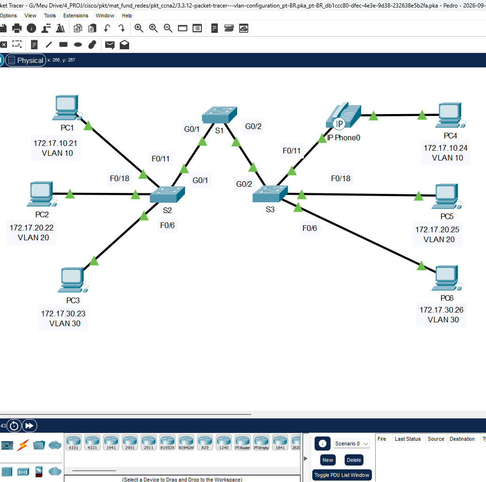
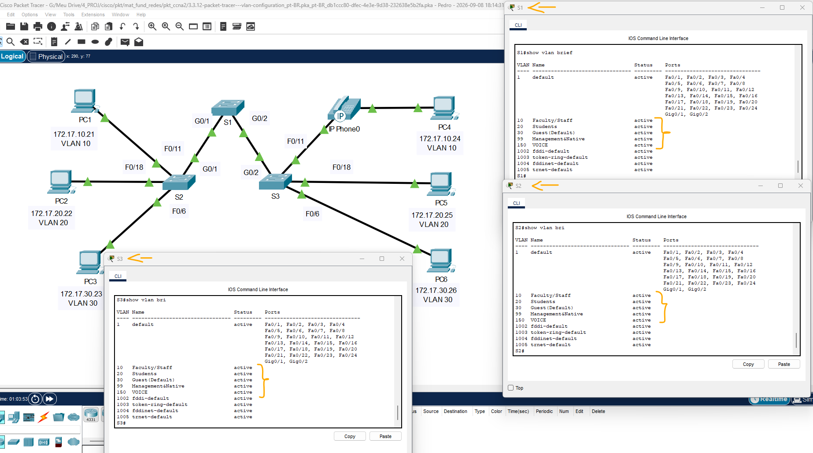
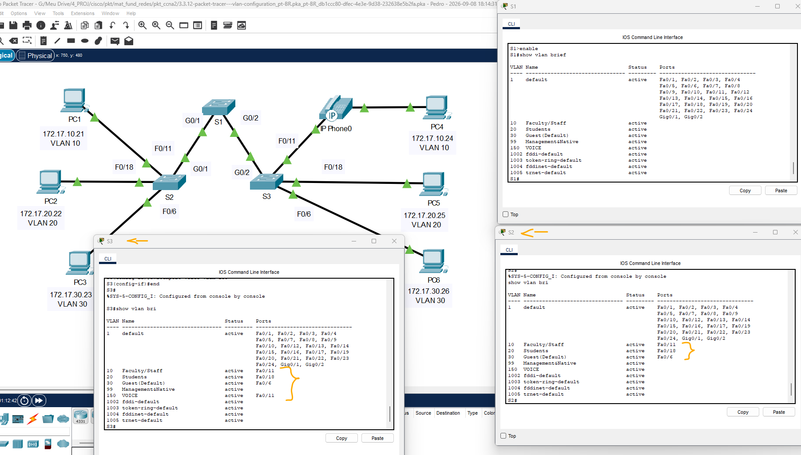
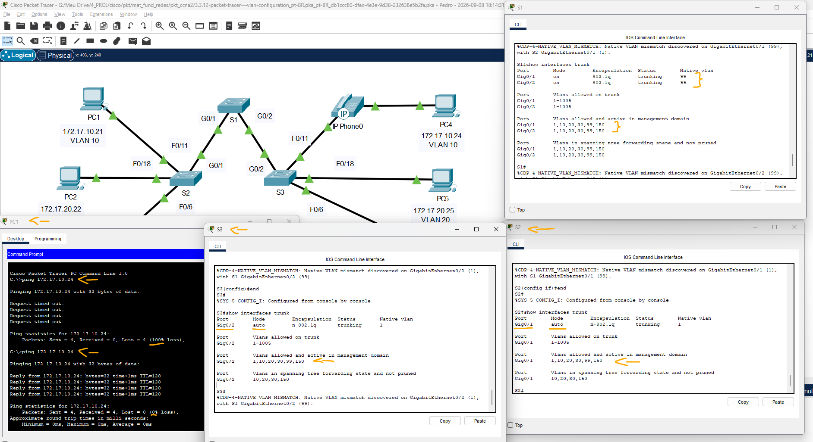

# Packet Tracer - Configuração de VLAN   

### Cisco: <a href="../../../">cisco   </a>
### Cisco Networking Academy: cna   </a>
### Training Category: <a href="../../../pkt/">pkt</a>
### Software/Subject: network   </a>
### Course: <a href="./">pkt_094 (Packet Tracer - Configuração de VLAN)   </a>

---

### Theme:
- Network

### Used Tools:
- Operating System (OS): 
  - Cisco Internetwork Operating System (Cisco IOS)   
  - Windows 11 
- Cloud Services:
  - Google Drive 
- Language:
  - HTML   
  - Markdown   
- Integrated Development Environment (IDE) and Text Editor:
  - Visual Studio Code (VS Code)   
- Versioning: 
  - Git   
- Repository:
  - GitHub   
- Network:
  - Cisco Packet Tracer   
  - ping   

---

<h3><a name="item00">Course Strcuture:</a></h3>

1. <a href="#item01">Parte 1: Verificar a configuração padrão da VLAN</a> 
  1.1 <a href="#item01.01">Etapa 1: Exibir as VLANs atuais.</a> 
  1.2 <a href="#item01.02">Etapa 2: Verifique a conectividade entre os PCs na mesma rede.</a> 
2. <a href="#item02">Parte 2: Configurar as VLANs</a> 
  2.1 <a href="#item02.01">Etapa 1: Criar e nomear VLANs no S1.</a> 
  2.2 <a href="#item02.02">Etapa 2: Verifique a configuração da VLAN.</a> 
  2.3 <a href="#item02.03">Etapa 3: Crie as VLANs em S2 e S3.</a> 
  2.4 <a href="#item02.04">Etapa 4: Verifique a configuração da VLAN.</a> 
3. <a href="#item03">Parte 3: Atribuir VLANs às portas</a> 
  3.1 <a href="#item03.01">Etapa 1: Atribuir VLANs às portas ativas no S2.</a> 
  3.2 <a href="#item03.02">Etapa 2: Atribuir VLANs às portas ativas no S2.</a> 
  3.3 <a href="#item03.03">Etapa 3: Atribua a VLAN de VOZ a FastEthernet 0/11 no S3.</a> 
  3.4 <a href="#item03.04">Etapa 4: Verificar a perda de conectividade.</a> 

---

### Objective:
O objetivo desta atividade foi implementar uma topologia de VLANs em uma pequena rede composta por três switches, configurando as portas de interligação como trunk para permitir o transporte das VLANs entre os switches e a comunicação entre dispositivos pertencentes à mesma VLAN.

### Folder Structure:
- [README.md](./README.md): Este documento de README, escrito em **Markdown**, com o conteúdo do laboratório.
- [0-aux](./0-aux/): Pasta auxiliar com imagens utilizadas na construção dos arquivos de README desse curso.

### Development:

<a name="item01"><h4>1. Parte 1: Verificar a configuração padrão da VLAN</h4></a>[Back to summary](#item00)

A imagem 01 mostra a topologia inicial.

<figure>
     
    <figcaption>Imagem 01.</figcaption>
</figure>
 

<a name="item01.01"><h4>1.1 Etapa 1: Exibir as VLANs atuais.</h4></a>[Back to summary](#item00)

- a. Em S1, emita o comando que exibe todas as VLANs configuradas. Por padrão, todas as interfaces são atribuídas à VLAN 1.
  - `enable` -> `show vlan` -> `show vlan brief`.

<a name="item01.02"><h4>1.2 Etapa 2: Verifique a conectividade entre os PCs na mesma rede.</h4></a>[Back to summary](#item00)

- a. Observe que cada PC pode executar ping no outro PC que compartilha a mesma sub-rede.
  - PC1 pode realizar ping em PC4
  - PC2 pode realizar ping em PC5
  - PC3 pode realizar ping em PC6
  - Pings para hosts em outras redes falham.
- a. Quais os benefícios que as VLANs podem fornecer à rede?
  - As VLANs permitem segmentar a rede em diferentes domínios de broadcast, melhorando o desempenho, a segurança e o gerenciamento da rede, além de reduzir o tráfego de broadcast desnecessário.

<a name="item02"><h4>2. Parte 2: Configurar as VLANs</h4></a>[Back to summary](#item00)

<a name="item02.01"><h4>2.1 Etapa 1: Criar e nomear VLANs no S1.</h4></a>[Back to summary](#item00)

- a. Crie as seguintes VLANs. Os nomes diferenciam maiúsculas e minúsculas e devem corresponder exatamente ao requisito:
- a. VLAN 10: Docentes
  - `enable` -> `configure terminal`.
  - `vlan 10` -> `name Faculty/Staff`.
- b. Crie os VLANS restantes.
- b. VLAN 20: Alunos
  - `vlan 20` -> `name Students`.
- b. VLAN 30: Convidado (Padrão)
  - `vlan 30` -> `name Guest(Default)`.
- b. VLAN 99: Gerência&Nativo
  - `vlan 99` -> `name Management&Native`.
- b. VLAN 150: VOZ
  - `vlan 150` -> `name VOICE` -> `end`.

<a name="item02.02"><h4>2.2 Etapa 2: Verifique a configuração da VLAN.</h4></a>[Back to summary](#item00)

- a. Qual comando exibe somente o nome da VLAN, o status, e as portas associadas em um switch?
  - `show vlan brief`.

<a name="item02.03"><h4>2.3 Etapa 3: Crie as VLANs em S2 e S3.</h4></a>[Back to summary](#item00)

- a. VLAN 10: Docentes
  - `enable` -> `configure terminal`.
  - `vlan 10` -> `name Faculty/Staff`.
- a. VLAN 20: Alunos
  - `vlan 20` -> `name Students`.
- a. VLAN 30: Convidado (Padrão)
  - `vlan 30` -> `name Guest(Default)`.
- a. VLAN 99: Gerência&Nativo
  - `vlan 99` -> `name Management&Native`.
- a. VLAN 150: VOZ
  - `vlan 150` -> `name VOICE` -> `end`.

<a name="item02.04"><h4>2.4 Etapa 4: Verifique a configuração da VLAN.</h4></a>[Back to summary](#item00)

- `show vlan brief`.

A imagem 02 exibe as cinco VLANs configuradas nos três switches.

<figure>
     
    <figcaption>Imagem 02.</figcaption>
</figure>
 

<a name="item03"><h4>3. Parte 3: Atribuir VLANs às portas</h4></a>[Back to summary](#item00)

<a name="item03.01"><h4>3.1 Etapa 1: Atribuir VLANs às portas ativas no S2.</h4></a>[Back to summary](#item00)

- a. Configure as interfaces como portas de acesso e atribua as VLANs como se segue:
- a. VLAN 10: FastEthernet 0/11
  - `configure terminal` -> `interface f0/11` -> `switchport mode access` -> `switchport access vlan 10`.
- b. Atribua as portas restantes à VLAN apropriada.
- b. VLAN 20: FastEthernet 0/18
  - `interface f0/18` -> `switchport mode access` -> `switchport access vlan 20`.
- b. VLAN 30: FastEthernet 0/6
  - `interface f0/6` -> `switchport mode access` -> `switchport access vlan 30`.

<a name="item03.02"><h4>3.2 Etapa 2: Atribuir VLANs às portas ativas no S3.</h4></a>[Back to summary](#item00)

- a. S3 usa as mesmas atribuições de porta de acesso VLAN que S2. Configure as interfaces como portas de acesso e atribua as VLANs como se segue:
- a. VLAN 10: FastEthernet 0/11
  - `configure terminal` -> `interface f0/11` -> `switchport mode access` -> `switchport access vlan 10`.
- a. VLAN 20: FastEthernet 0/18
  - `configure terminal` -> `interface f0/18` -> `switchport mode access` -> `switchport access vlan 20`.
- a. VLAN 30: FastEthernet 0/6
  - `configure terminal` -> `interface f0/6` -> `switchport mode access` -> `switchport access vlan 30`.

<a name="item03.03"><h4>3.3 Etapa 3: Atribua a VLAN de VOZ a FastEthernet 0/11 no S3.</h4></a>[Back to summary](#item00)

Como mostrado na topologia, a interface de FastEthernet S3 0/11 está conectada a um Telefone IP da Cisco e PC4. O telefone IP contém um switch integrado de três portas 10/100. Uma porta no telefone está identificada como Switch e se conecta ao F0/4. Outra porta no telefone está identificada como PC e se conecta ao PC4. O telefone IP também tem uma porta interna que se conecta às funções do telefone IP.

- a. A interface de S3 F0/11 deve ser configurada para suportar o tráfego do usuário para o PC4 usando VLAN 10 e tráfego de voz para telefone IP usando VLAN 150. A interface também deve ativar a QoS e confiar nos valores de Classe de Serviço (CoS) atribuídos pelo telefone IP. O tráfego de voz IP requer uma quantidade mínima de throughput para suportar uma qualidade aceitável de comunicação de voz. Este comando ajuda a porta de comutação a fornecer esta quantidade mínima de taxa de transferência.
  - `interface f0/11` -> `mls qos trust cos` -> `switchport voice vlan 150` -> `end`.

A imagem 03 mostra as VLANs atribuídas às suas respectivas portas nos switches S2 e S3.

<figure>
     
    <figcaption>Imagem 03.</figcaption>
</figure>
 

<a name="item03.04"><h4>3.4 Etapa 4: Verificar a perda de conectividade.</h4></a>[Back to summary](#item00)

Anteriormente, os computadores que compartilhavam a mesma rede podiam fazer ping entre si com êxito.

- a. Estude a saída do seguinte comando no S2 e responda às seguintes perguntas com base no seu conhecimento de comunicação entre VLANS. Preste muita atenção à atribuição de porta Gig0/1.
  - `show vlan brief`.
- a. Tente executar ping entre o PC1 e PC4.
  - `ping 172.17.10.24`.
- a. Embora as portas de acesso sejam atribuídas a VLANs apropriadas, os pings foram efetuados com êxito? Explique.
  - Não. Os pings não foram bem-sucedidos porque as portas utilizadas para interligar os switches não estão configuradas como portas trunk, impedindo o transporte das VLANs entre os switches.
- a. O que pode ser feito para solucionar o problema?
  - Configurar como trunk as portas utilizadas para interligar os switches, permitindo o transporte das VLANs entre eles.
- a. O que pode ser feito para solucionar o problema?
  - Configurar como trunk as portas G0/1 e G0/2 do switch S1, utilizando a VLAN 99 como VLAN nativa. Após essa configuração, os enlaces entre S1, S2 e S3 passaram a transportar as VLANs, permitindo a comunicação entre os dispositivos pertencentes às mesmas VLANs, mesmo estando conectados a switches diferentes.
  - S1 e S2: `configure terminal` -> `interface gigabitEthernet 0/1` -> `switchport mode trunk` -> `switchport trunk native vlan 99` -> `exit`.
  - S1 e S3: `configure terminal` -> `interface gigabitEthernet 0/2` -> `switchport mode trunk` -> `switchport trunk native vlan 99` -> `exit`.

A imagem 04 evidencia que, após a configuração das portas dos switches como trunk, o transporte das VLANs foi permitido, possibilitando a comunicação entre PCs pertencentes à mesma VLAN, mesmo estando conectados a switches diferentes.

<figure>
     
    <figcaption>Imagem 04.</figcaption>
</figure>
 