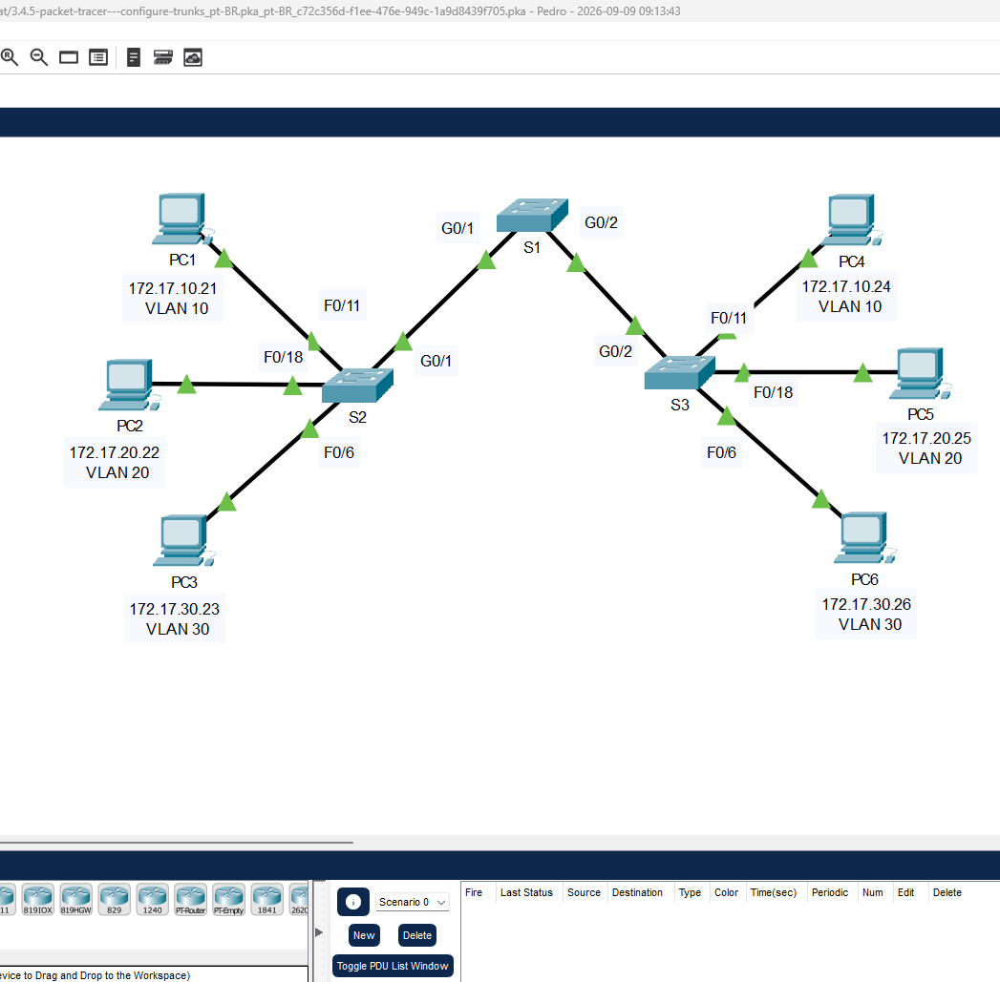
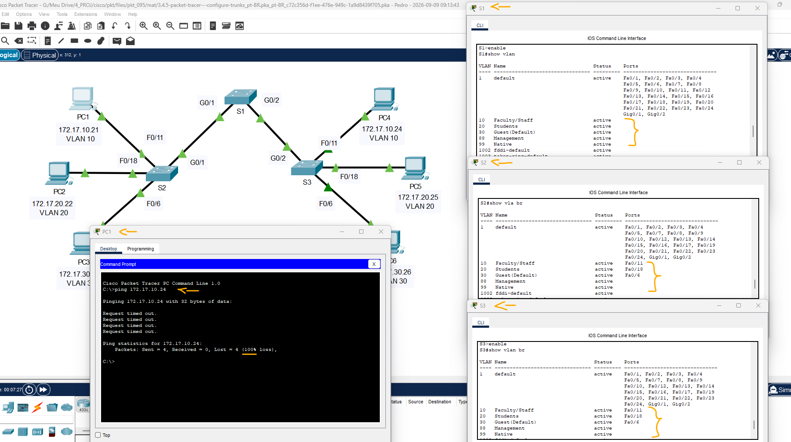
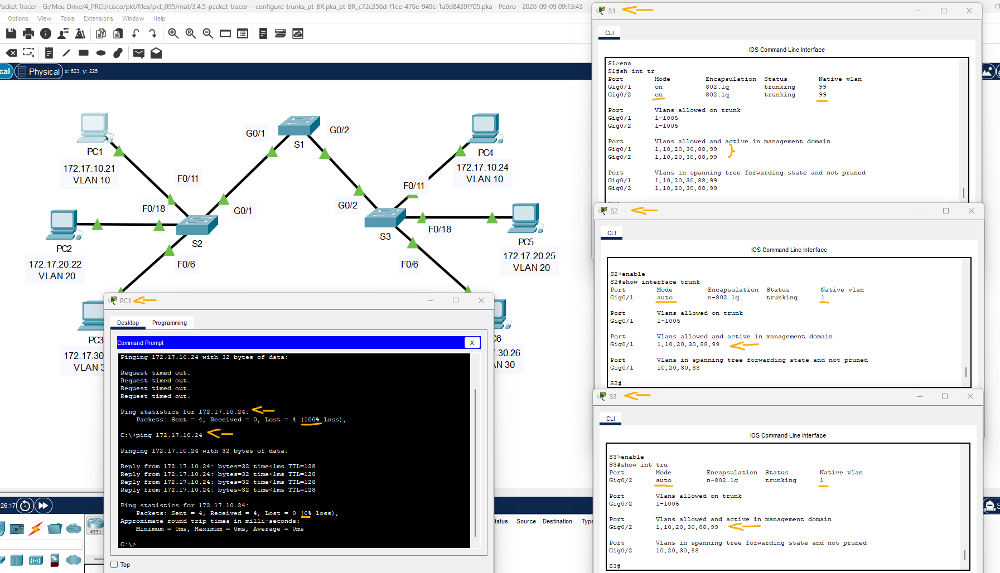
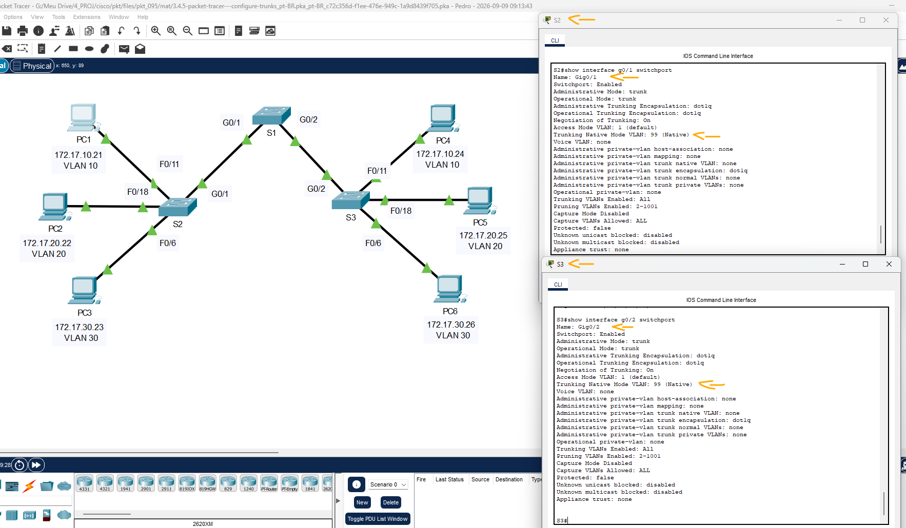

# Packet Tracer - Configurando troncos   

### Cisco: <a href="../../../">cisco   </a>
### Cisco Networking Academy: cna   </a>
### Training Category: <a href="../../../pkt/">pkt</a>
### Software/Subject: network   </a>
### Course: <a href="./">pkt_095 (Packet Tracer - Configurando troncos)   </a>

---

### Theme:
- Network

### Used Tools:
- Operating System (OS): 
  - Cisco Internetwork Operating System (Cisco IOS)   
  - Windows 11 
- Cloud Services:
  - Google Drive 
- Language:
  - HTML   
  - Markdown   
- Integrated Development Environment (IDE) and Text Editor:
  - Visual Studio Code (VS Code)   
- Versioning: 
  - Git   
- Repository:
  - GitHub   
- Network:
  - Cisco Packet Tracer   
  - ping   

---

<h3><a name="item00">Course Strcuture:</a></h3>

1. <a href="#item01">Parte 1: Verificar a implementação das VLANs</a> 
  1.1 <a href="#item01.01">Etapa 1: Exibir as VLANs atuais.</a> 
  1.2 <a href="#item01.02">Etapa 2: Verifique a perda da conectividade entre os PCs na mesma rede.</a> 
2. <a href="#item02">Parte 2: Configurar troncos</a> 
  2.1 <a href="#item02.01">Etapa 1: Configure o entroncamento em S1 e use VLAN 99 como a VLAN nativa.</a> 
  2.2 <a href="#item02.02">Etapa 2: Verifique se o entroncamento está habilitado em S2 e em S3.</a> 
  2.3 <a href="#item02.03">Etapa 3: Corrija a incompatibilidade de VLAN nativa em S2 e S3.</a> 
  2.4 <a href="#item02.04">Etapa 4: Verificar configurações em S2 e em S3.</a> 

---

### Objective:
O objetivo desta atividade foi implementar a configuração de trunk nos switches, utilizando uma VLAN específica como VLAN nativa e permitindo o transporte das demais VLANs entre os diferentes switches interligados.

### Folder Structure:
- [README.md](./README.md): Este documento de README, escrito em **Markdown**, com o conteúdo desta atividade.
- [0-aux](./0-aux/): Pasta auxiliar com imagens utilizadas na construção dos arquivos de README desse curso.

### Development:

<a name="item01"><h4>1. Parte 1: Verificar a implementação das VLANs</h4></a>[Back to summary](#item00)

A imagem 01 mostra a topologia inicial.

<figure>
     
    <figcaption>Imagem 01.</figcaption>
</figure>
 

<a name="item01.01"><h4>1.1 Etapa 1: Exibir as VLANs atuais.</h4></a>[Back to summary](#item00)

- a. Em S1, emita o comando que exibirá todas as VLANs configuradas. No total, devem existir dez VLANs. Observe que todas as 26 portas de acesso no switch estão atribuídas à VLAN 1.
  - `enable` -> `show vlan`.
- b. Em S2 e S3, visualize e verifique se todas as VLANs estão configuradas e atribuídas às portas de switch corretas de acordo com a Tabela de endereçamento.
  - `enable` -> `show vlan brief`.

<a name="item01.02"><h4>1.2 Etapa 2: Verifique a perda da conectividade entre os PCs na mesma rede.</h4></a>[Back to summary](#item00)

- a. Ping entre hosts na mesma VLAN nos diferentes switches. Embora PC1 e PC4 estejam na mesma rede, não podem executar ping um do outro. Isso ocorre porque as portas que conectam os switches são atribuídas à VLAN 1 por padrão. Para fornecer conectividade entre os PCs na mesma rede e VLAN, os troncos devem ser configurados.
  - `ping 172.17.10.24`.

A imagem 02 apresenta as configurações das VLANs nos switches antes da configuração das portas como trunk.

<figure>
     
    <figcaption>Imagem 02.</figcaption>
</figure>
 

<a name="item02"><h4>2. Parte 2: Configurar os troncos</h4></a>[Back to summary](#item00)

<a name="item02.01"><h4>2.1 Etapa 1: Configure o entroncamento em S1 e use VLAN 99 como a VLAN nativa.</h4></a>[Back to summary](#item00)

- a. Configurar as interfaces G0/0 e G1/2 em S1 para tronco.
  - `configure terminal` -> `interface range g0/1 - 2` -> `switchport mode trunk`.
- b. Configure a VLAN 99 como a VLAN nativa para as interfaces G0/0 e G1/2 em S1.
  - `switchport trunk native vlan 99`.
- b. A porta de tronco leva um tempo curto para se tornar ativa devido ao Spanning Tree Protocol. Clique em Avançar o tempo para acelerar o processo. Depois que as portas ficam ativas, você receberá periodicamente as seguintes mensagens de syslog:
  - %CDP-4-NATIVE_VLAN_MISMATCH: Native VLAN mismatch discovered on GigabitEthernet0/2 (99), with S3 GigabitEthernet0/2 (1). 
  - %CDP-4-NATIVE_VLAN_MISMATCH: Native VLAN mismatch discovered on GigabitEthernet0/1 (99), with S2 GigabitEthernet0/1 (1). 
- b. Você configurou VLAN 99 como a VLAN nativa em S1. No entanto, S2 e S3 estão usando VLAN 1 como VLAN nativa padrão, conforme indicado pela mensagem de syslog. Embora você tenha uma incompatibilidade de VLAN nativa, os pings entre PCs na mesma VLAN são agora feitos com êxito. Explique.
  - Os pings foram realizados com êxito porque, apesar da incompatibilidade entre as VLANs nativas, as demais VLANs continuam sendo transportadas pelo enlace trunk utilizando a identificação 802.1Q. A VLAN nativa é utilizada para quadros não marcados, portanto a diferença entre a VLAN nativa 99 do S1 e a VLAN 1 dos S2 e S3 não impede o transporte das VLANs utilizadas pelos PCs.

<a name="item02.02"><h4>2.2 Etapa 2: Verifique se o entroncamento está habilitado em S2 e em S3.</h4></a>[Back to summary](#item00)

- a. Em S2 e S3, emita o comando show interface trunk para confirmar se o DTP negociou com êxito o entroncamento com S1 em S2 e S3. A saída também exibe informações sobre as interfaces de tronco em S2 e em S3. Você aprenderá mais sobre DTP mais tarde no curso.
  - `show interface trunk`.
- a. Quais VLANs ativas estão autorizadas para todo o tronco?
  - As VLANs ativas e autorizadas nos enlaces trunk dos switches S2 e S3 são as VLANs 1, 10, 20, 30, 88 e 99.

A imagem 03 mostra que essas VLANs estão ativas e permitidas nos enlaces trunk, possibilitando a comunicação entre dispositivos pertencentes à mesma VLAN, mesmo quando conectados a switches diferentes.

<figure>
     
    <figcaption>Imagem 03.</figcaption>
</figure>
 

<a name="item02.03"><h4>2.3 Etapa 3: Corrija a incompatibilidade de VLAN nativa em S2 e S3.</h4></a>[Back to summary](#item00)

- a. Configure a VLAN 99 como a VLAN nativa para as interfaces apropriadas em S2 e em S3. 
  - S2: `configure terminal` -> `interface g0/1` -> `switchport mode trunk` -> `switchport trunk native vlan 99` -> `end`.
  - S3: `configure terminal` -> `interface g0/2` -> `switchport mode trunk` -> `switchport trunk native vlan 99` -> `end`.
- b. Emita o comando show interface trunk para verificar a configuração de VLAN nativa correta.
  - `show interface trunk`.

<a name="item02.04"><h4>2.4 Etapa 4: Verificar configurações em S2 e em S3.</h4></a>[Back to summary](#item00)

- a. Emita o comando show interface interface switchport para verificar se a VLAN nativa agora é 99.
  - S2: `show interface g0/1 switchport`.
  - S2: `show interface g0/2 switchport`.
- b. Use o comando show vlan para exibir informações sobre as VLANs configuradas.
  - `show vlan`.
- b. Por que a porta G0/1 em S2 não está mais atribuída não à VLAN 1? 
  - Porque a porta G0/1 foi configurada como trunk e a VLAN 99 foi definida como sua VLAN nativa. Essa configuração evita o uso da VLAN padrão 1 como VLAN nativa, contribuindo para uma configuração mais segura da rede.

A imagem 04 exibe as configurações das portas trunk nos switches S2 e S3, evidenciando que a VLAN 99 está configurada como VLAN nativa dos enlaces trunk.

<figure>
     
    <figcaption>Imagem 04.</figcaption>
</figure>
 