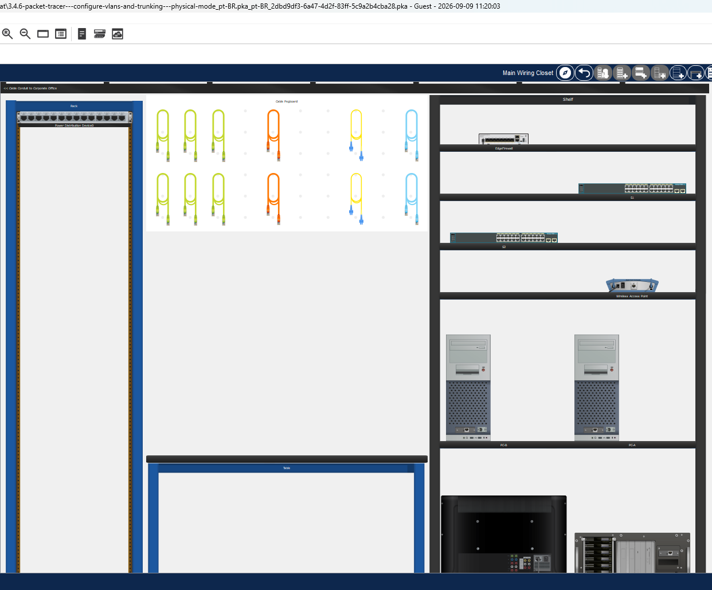
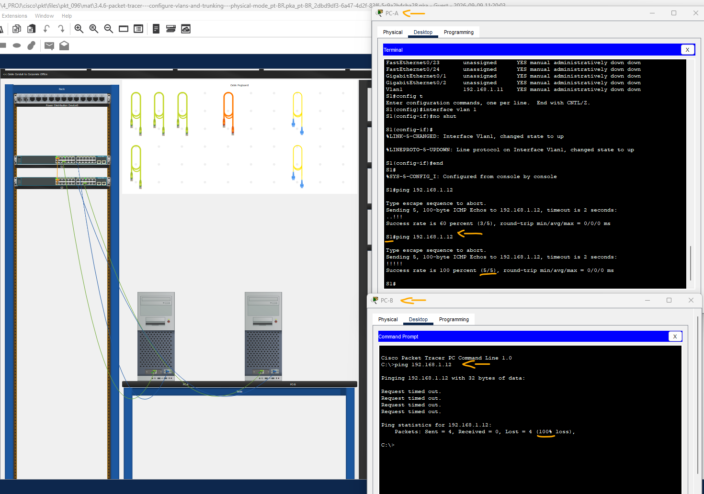
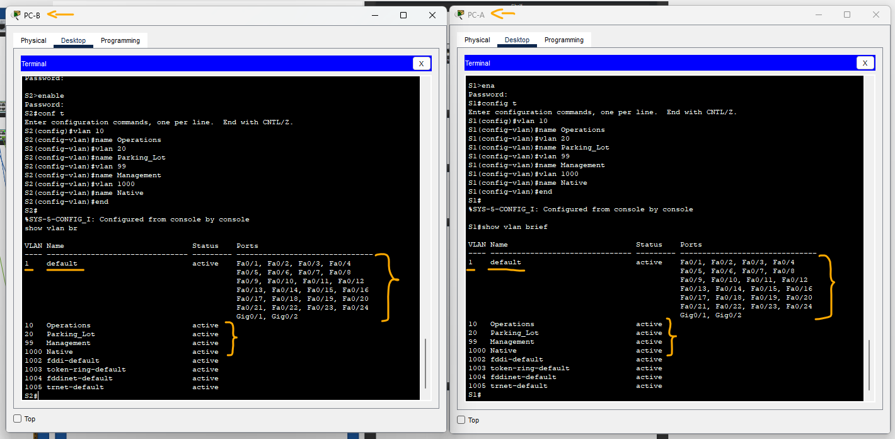
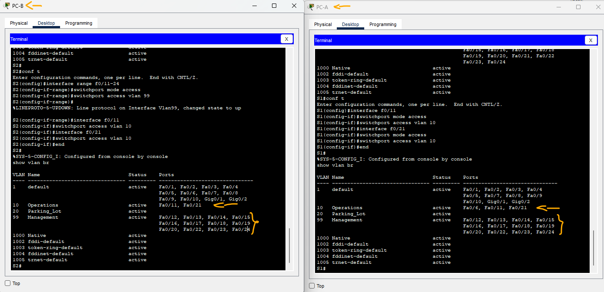
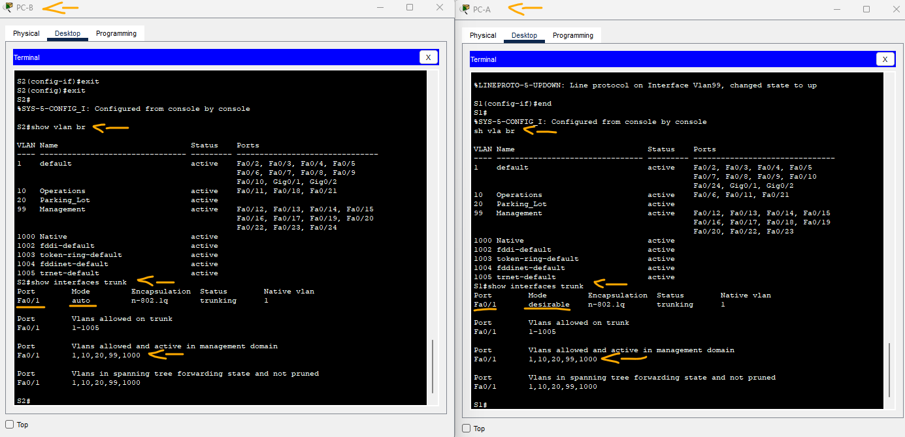
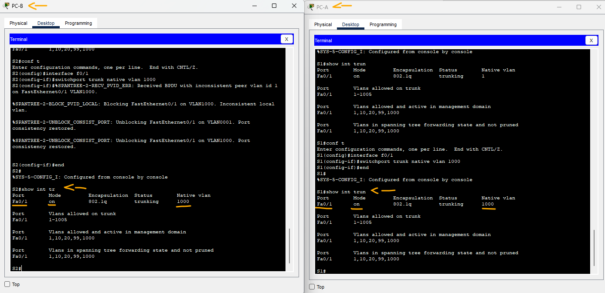
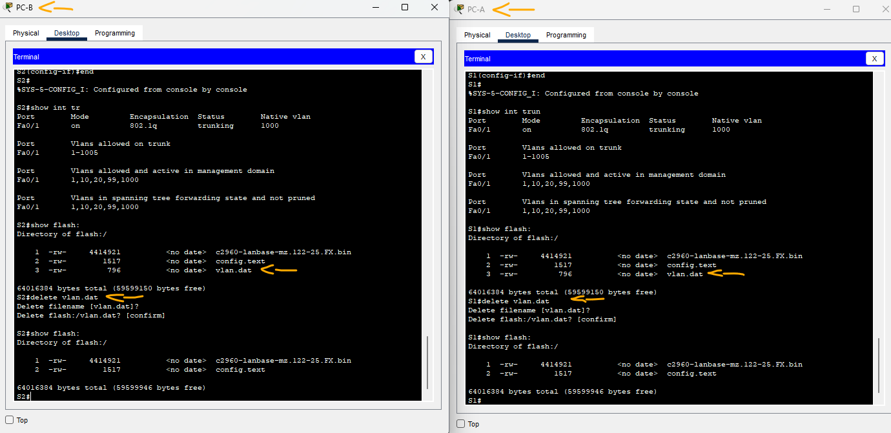

# Packet Tracer - Configurar VLAN e entroncamento - modo físico   

### Cisco: <a href="../../../">cisco   </a>
### Cisco Networking Academy: cna   </a>
### Training Category: <a href="../../../pkt/">pkt</a>
### Software/Subject: network   </a>
### Course: <a href="./">pkt_096 (Packet Tracer - Configurar VLAN e entroncamento - modo físico)   </a>

---

### Theme:
- Network

### Used Tools:
- Operating System (OS): 
  - Cisco Internetwork Operating System (Cisco IOS)   
  - Windows 11 
- Cloud Services:
  - Google Drive 
- Language:
  - HTML   
  - Markdown   
- Integrated Development Environment (IDE) and Text Editor:
  - Visual Studio Code (VS Code)   
- Versioning: 
  - Git   
- Repository:
  - GitHub   
- Network:
  - Cisco Packet Tracer   
  - ping   
  
---

<h3><a name="item00">Course Strcuture:</a></h3>

1. <a href="#item01">Parte 1: criar a rede e implementar as configurações básicas do dispositivo</a> 
  1.1 <a href="#item01.01">Etapa 1: Instale os cabos da rede conforme mostrado na topologia.</a> 
  1.2 <a href="#item01.02">Etapa 2: Defina as configurações básicas de cada switch.</a> 
  1.3 <a href="#item01.03">Etapa 3: Configure os PCs hosts.</a> 
  1.4 <a href="#item01.04">Etapa 4: Teste a conectividade.</a> 
2. <a href="#item02">Parte 2: Crie VLANs e atribua portas de switch</a> 
  2.1 <a href="#item02.01">Etapa 1: Crie VLANs nos switches.</a> 
  2.2 <a href="#item02.02">Etapa 2: Atribua VLANs às interfaces corretas do switch.</a> 
3. <a href="#item03">Parte 3: Mantenha as atribuições de porta de VLAN e o banco de dados de VLANs</a> 
  3.1 <a href="#item03.01">Etapa 1: Atribua uma VLAN a várias interfaces.</a> 
  3.2 <a href="#item03.02">Etapa 2: Remova uma atribuição de VLAN de uma interface.</a> 
  3.3 <a href="#item03.03">Etapa 3: Remova o ID da VLAN do banco de dados de VLANs.</a> 
4. <a href="#item04">Parte 4: Configure um tronco de 802.1Q entre os switches</a> 
  4.1 <a href="#item04.01">Etapa 1: Use o DTP para iniciar o entroncamento em F0/1.</a> 
  4.2 <a href="#item04.02">Etapa 2: Configure manualmente a interface de tronco F0/1.</a> 
5. <a href="#item05">Parte 5: Exclua o banco de dados de VLANs</a> 
  5.1 <a href="#item05.01">Etapa 1: Determine se o banco de dados de VLANs existe.</a> 
  5.2 <a href="#item05.02">Etapa 2: Exclua o banco de dados de VLANs.</a> 
6. <a href="#item06">Perguntas para reflexão</a> 

---

### Objective:
O objetivo desta atividade foi construir uma pequena rede do zero, composta por dois switches interconectados, realizando as configurações básicas dos dispositivos e o endereçamento dos hosts. A atividade teve como foco a criação e análise de VLANs, a verificação e validação das configurações e, por fim, a configuração de um enlace trunk para permitir o transporte das VLANs entre os switches e a comunicação entre hosts conectados a switches diferentes.

### Folder Structure:
- [README.md](./README.md): Este documento de README, escrito em **Markdown**, com o conteúdo desta atividade.
- [0-aux](./0-aux/): Pasta auxiliar com imagens utilizadas na construção dos arquivos de README desse curso.

### Development:

<a name="item01"><h4>1. Parte 1: criar a rede e implementar as configurações básicas do dispositivo</h4></a>[Back to summary](#item00)

A imagem 01 mostra a topologia inicial.

<figure>
     
    <figcaption>Imagem 01.</figcaption>
</figure>
 

Na Parte 1, você configurará a topologia de rede e as configurações básicas nos hosts e switches do PC.

<a name="item01.01"><h4>1.1 Etapa 1: Instale os cabos da rede conforme mostrado na topologia.</h4></a>[Back to summary](#item00)

Conecte os dispositivos como mostrado no diagrama da topologia e cabei-os se necessário.

- a. Clique e arraste o interruptor S1 e S2 para o Rack. Nota: Esta atividade será aberta com 37% de conclusão porque as portas do switch estão todas 
fechadas. Quando você instala os switches no rack, as portas serão ativadas automaticamente. Após cerca de um minuto, a pontuação cairá para 1%. Mais tarde na atividade, você desligará as portas não utilizadas.
- b. Clique e arraste PC-A e PC-B para a mesa e use o botão liga/desliga para ligá-los.
- c. Forneça conectividade de rede conectando cabos retos de cobre, conforme mostrado na topologia.
- d. Conecte o cabo do console do dispositivo PC-A ao S1 e do dispositivo PC-B ao S2.

<a name="item01.02"><h4>1.2 Etapa 2: Defina as configurações básicas de cada switch.</h4></a>[Back to summary](#item00)

- a. Na guia Desktop em cada PC, use o Terminal para acessar o console em cada switch e habilite o modo EXEC privilegiado.
  - `enable`.
- b. Entre no modo de configuração.
  - `configure terminal`.
- c. Atribua um nome de dispositivo a cada switch. 
  - S1: `hostname S1`.
  - S2: `hostname S2`.
- d. Atribua class como a senha criptografada do EXEC privilegiado.
  - `enable secret class`.
- e. Atribua cisco como a senha de console e habilite o login.
  - `line console 0` -> `password cisco` -> `login` -> `exit`.
- f. Atribua cisco como a senha de vty e habilite o login.
  - `line vty 0 15` -> `password cisco` -> `login` -> `exit`.
- g. Criptografe as senhas de texto sem formatação.
  - `service password-encryption`.
- h. Crie um banner para avisar às pessoas que o acesso não autorizado é proibido.
  - `banner motd #Unauthorized access is prohibited.#`.
- i. Configure o endereço IP listado na Tabela de Endereçamento para a VLAN 1 no switch. Nota: O endereço VLAN 1 não é avaliado porque você o removerá mais tarde na atividade. Contudo, você precisará do VLAN 1 para testar a conectividade mais tarde nesta parte.
  - S1: `interface vlan 1` -> `ip address 192.168.1.11 255.255.255.0` -> `no shutdown` -> `exit`.
  - S2: `interface vlan 1` -> `ip address 192.168.1.12 255.255.255.0` -> `no shutdown` -> `exit`.
- j. Desligue todas as interfaces que não serão usadas.
  - S1: `interface range f0/2-5,f0/7-24,g0/1-2` -> `shutdown` -> `end`.
  - S2: `interface range f0/2-17,f0/19-24,g0/1-2` -> `shutdown` -> `end`.
- k. Acerte o relógio no switch. Nota: A configuração do relógio não pode ser avaliada no Packet Tracer.
  - `clock set 11:00:00 09 Sep 2026`.
- l. Salve a configuração atual no arquivo de configuração inicial.
  - `copy running-config startup-config`.

<a name="item01.03"><h4>1.3 Etapa 3: Configure os PCs hosts.</h4></a>[Back to summary](#item00)

- a. Da aba Desktop em cada PC, clique a configuração IP e incorpore a informação de endereçamento como indicado na tabela de endereçamento.
  - PC-A: `192.168.10.3` -> `255.255.255.0` -> `192.168.10.1`.
  - PC-B: `192.168.10.4` -> `255.255.255.0` -> `192.168.10.1`.

<a name="item01.04"><h4>1.4 Etapa 4: Teste a conectividade.</h4></a>[Back to summary](#item00)

- a. Teste a conectividade da rede ao tentar pingar entre cada um dos dispositivos a cabo. O PC-A pode fazer ping no PC-B?
  - PC-A - PC-B: `ping 192.168.10.4`. Sim. Ambos os PCs estão na mesma sub-rede (192.168.10.0/24), permitindo a comunicação direta entre eles.
- a. O PC-A pode fazer ping no S1? 
  - PC-A - S1: `ping 192.168.1.11`. Não. O PC-A e a interface de gerenciamento do S1 estão em sub-redes diferentes: o PC-A pertence à sub-rede 192.168.10.0/24, enquanto o S1 está na sub-rede 192.168.1.0/24.
- a. O PC-B pode fazer ping no S2? 
  - PC-B - S2: `ping 192.168.1.12`. Não. O PC-B e a interface de gerenciamento do S2 estão em sub-redes diferentes: o PC-B pertence à sub-rede 192.168.10.0/24, enquanto o S2 está na sub-rede 192.168.1.0/24.
- a. O S1 pode efetuar ping para o S2?
  - S1 - S2: `ping 192.168.1.12`. Sim. O ping foi realizado com sucesso, pois as interfaces de gerenciamento dos switches estão na mesma sub-rede (192.168.1.0/24) e estão ativas.
- a. Se você respondeu não para alguma das perguntas acima, por que os pings falharam?
  - Os pings falharam porque os dispositivos estão em sub-redes diferentes, e não há um dispositivo de camada 3 configurado para realizar o roteamento entre essas redes.

A imagem 02 apresenta alguns dos testes de conectividade realizados por meio de pings entre os dispositivos.

<figure>
     
    <figcaption>Imagem 02.</figcaption>
</figure>
 

<a name="item02"><h4>2. Parte 2: Crie VLANs e atribua portas de switch</h4></a>[Back to summary](#item00)

Na parte 2, você criará VLANs de gerenciamento, operações, estacionamento e nativas nos dois switches. Em seguida, você atribuirá as VLANs à interface apropriada. O comando show vlan é usado para verificar suas definições de configuração.

<a name="item02.01"><h4>2.1 Etapa 1: Crie VLANs nos switches.</h4></a>[Back to summary](#item00)

Na aba Desktop em cada PC, use o Terminal para continuar configurando ambos os switches de rede.

- a. Crie as VLANs em S1.
  - `cisco` -> `enable` -> `class` -> `configure terminal`.
  - `vlan 10` -> `name Operations`.
  - `vlan 20` -> `name Parking_Lot`.
  - `vlan 99` -> `name Management`.
  - `vlan 1000` -> `name Native` -> `end`.
- b. Crie as mesmas VLANs em S2.
- c. Emita o comando show vlan brief para exibir a lista das VLANs em S1.
  - `show vlan brief`.
- c. Qual é a VLAN padrão?
  - A VLAN padrão é a 1.
- c. Quais portas estão atribuídas à VLAN padrão?
  - Inicialmente, todas as portas estão atribuídas à VLAN padrão (VLAN 1).

A imagem 03 exibe as VLANs criadas nos dois switches.

<figure>
     
    <figcaption>Imagem 03.</figcaption>
</figure>
 

<a name="item02.02"><h4>2.2 Etapa 2: Atribua VLANs às interfaces corretas do switch.</h4></a>[Back to summary](#item00)

- a. Atribua VLANs às interfaces em S1. Atribua PC-A à operação VLAN.
  - `configure terminal` -> `interface f0/6` -> `switchport mode access` -> `switchport access vlan 10`.
- a. Da VLAN 1, remova o endereço IP de gerenciamento e configure-o no VLAN 99.
  - `interface vlan 1` -> `no ip address`.
  - `interface vlan 99` -> `ip address 192.168.1.11 255.255.255.0` -> `end`.
- b. Emita o comando show vlan brief e verifique se as VLANs estão atribuídas às interfaces corretas.
  - `show vlan brief`.
- c. Emita o comando show ip interface brief.
  - `show ip interface brief`.
- c. Qual é o status da VLAN 99? Explique.
  - O status da VLAN 99 é up na camada física e down na camada de enlace, pois não há nenhuma interface física ativa associada a essa VLAN.
- d. Atribua PC-B à VLAN de operações no S2.
  - `configure terminal` -> `interface f0/18` -> `switchport mode access` -> `switchport access vlan 10`.
- e. Da VLAN 1, remova o endereço IP de gerenciamento e configure-o no VLAN 99 de acordo com a tabela de endereçamento.
  - `interface vlan 1` -> `no ip address`.
  - `interface vlan 99` -> `ip address 192.168.1.12 255.255.255.0` -> `end`.
- f. Use o comando show vlan brief para verificar se as VLANs estão atribuídas às interfaces corretas.
  - `show vlan brief`.
- f. O S1 consegue fazer ping no S2? Explique.
  - S1 - S2: `ping 192.168.1.12`. Não. Embora o S1 e o S2 estejam na mesma sub-rede (192.168.1.0/24), ambas as interfaces VLAN 99 estão com status up/down, pois não há uma interface física ativa associada à VLAN 99.
- f. O PC-A consegue fazer ping no PC-B? Explique.
  - PC-A - PC-B: `ping 192.168.10.4`. Não. Embora ambos os PCs pertençam à mesma VLAN e estejam na mesma sub-rede, eles estão conectados a switches diferentes e não há um enlace trunk configurado entre os switches para transportar a VLAN entre eles.

<a name="item03"><h4>3. Parte 3: Mantenha as atribuições de porta de VLAN e o banco de dados de VLANs</h4></a>[Back to summary](#item00)

Na Parte 3, você alterará as atribuições de VLAN às portas e removerá as VLANs do banco de dados de VLANs.

<a name="item03.01"><h4>3.1 Etapa 1: Atribua uma VLAN a várias interfaces.</h4></a>[Back to summary](#item00)

Na aba Desktop em cada PC, use o Terminal para continuar configurando ambos os switches de rede. 

- a. Em S1, atribua as interfaces F0 / 11 - 24 à VLAN99.
  - `configure terminal` -> `interface range f0/11-24` -> `switchport mode access` -> `switchport access vlan 99` -> `end`.
- b. Emita o comando show vlan brief para verificar as atribuições de VLAN.
  - `show vlan brief`.
- c. Reatribua F0 / 11 e F0 / 21 à VLAN 10.
  - `configure terminal` -> `interface f0/11` -> `switchport mode access` -> `switchport access vlan 10` -> `exit`.
  - `interface f0/21` -> `switchport mode access` -> `switchport access vlan 10` -> `end`.
d. Verifique se as atribuições de VLAN estão corretas.
  - `show vlan brief`.

A imagem 04 exibe como ficaram configuradas as VLANs em ambos os switches.

<figure>
     
    <figcaption>Imagem 04.</figcaption>
</figure>
 

<a name="item03.02"><h4>3.2 Etapa 2: Remova uma atribuição de VLAN de uma interface.</h4></a>[Back to summary](#item00)

- a. Use o comando no switchport access vlan para remover a atribuição da VLAN 99 para a F0/24.
  - `configure terminal` -> `interface f0/24` -> `no switchport access vlan 99` -> `end`.
- b. Verifique se foi feita a alteração na VLAN.
  - `show interface f0/24 switchport`.
- b. Qual VLAN está agora associada à F0/24?
  - A VLAN padrão (VLAN 1) voltou a ser associada à interface F0/24.

<a name="item03.03"><h4>3.3 Etapa 3: Remova o ID da VLAN do banco de dados de VLANs.</h4></a>[Back to summary](#item00)

- a. Adicione a VLAN 30 à interface F0 / 24 sem emitir o comando global da VLAN.
  - `configure terminal` -> `interface f0/24` -> `switchport access vlan 30` -> `end`.
- a. Observação: a tecnologia atual do switch não exige o comando vlan para adicionar uma VLAN ao banco de dados. Ao atribuir uma VLAN desconhecida a uma porta, a VLAN será criada e adicionada ao banco de dados da VLAN.
- b. Verifique se a nova VLAN é exibida na tabela de VLANs.
  - `show vlan brief`.
- b. Qual é o nome padrão da VLAN 30?
  - O nome padrão da VLAN é VLAN0030.
- c. Use o comando no vlan 30 para remover a VLAN 30 do banco de dados de VLANs.
  - `configure terminal` -> `no vlan 30` -> `end`.
- d. Emita o comando show vlan brief. F0/24 foi atribuída à VLAN 30.
  - `show vlan brief`.
- d. Depois de excluir o VLAN 30 do banco de dados VLAN, por que o F0/24 não é mais exibido na saída do comando show vlan brief? 
  - Porque a VLAN 30 foi removida do banco de dados de VLANs. Como a F0/24 estava associada a essa VLAN, ela deixa de ser exibida na tabela de VLANs.
- d. A que VLAN é a porta F0/24 agora atribuída?
  - A nenhuma VLAN. A F0/24 ficou sem uma VLAN válida atribuída após a remoção da VLAN 30 do banco de dados.
- d. O que acontece com o tráfego destinado ao host associado à F0/24?
  - O tráfego destinado ao host não será encaminhado pela F0/24, pois a porta está associada à VLAN 30, que foi removida do banco de dados de VLANs.
- e. Emita o comando no switchport access vlan na interface F0/24.
  - `configure terminal` -> `interface f0/24` -> `no switchport access vlan` -> `end`.
- f. Emita o comando show vlan brief para determinar a atribuição de VLAN para F0/24.
  - `show vlan brief`.
- f. À qual VLAN a F0/24 é atribuída?
  - A F0/24 é atribuída à VLAN padrão (VLAN 1).
- f. Observação: antes de remover uma VLAN do banco de dados, é recomendável que você atribua a outras portas todas as portas atribuídas anteriormente àquela VLAN.
- f. Por que você deve reatribuir uma porta a outra VLAN antes de remover a VLAN do banco de dados de VLANs?
  - Porque, se uma VLAN for removida enquanto ainda houver portas atribuídas a ela, essas portas permanecerão associadas a uma VLAN que não existe mais e deixarão de encaminhar tráfego.

<a name="item04"><h4>4. Parte 4: Configure um tronco de 802.1Q entre os switches</h4></a>[Back to summary](#item00)

Na Parte 4, você configurará a interface F0/1 para usar o Dynamic Trunking Protocol (DTP) a fim de permitir que ela negocie o modo de tronco. Uma vez realizado e conferido esse processo, você desabilitará o DTP na interface F0/1 e, manualmente, configurará a interface como um tronco.

<a name="item04.01"><h4>4.1 Etapa 1: Use o DTP para iniciar o entroncamento em F0/1.</h4></a>[Back to summary](#item00)

O modo DTP padrão de uma porta de switch 2960 é o dynamic auto (automático dinâmico). Isso permite à interface converter o link para um tronco se a interface vizinha estiver definida como um modo desejável dinâmico ou de tronco.

- a. Defina F0/1 em S1 para negociar o modo de tronco. Você também deve receber mensagens de status de link em S2.
  - `configure terminal` -> `interface f0/1` -> `switchport mode dynamic desirable` -> `end`.
- b. Na S1 e S2, emita o comando show vlan brief. A interface F0/1 não está mais atribuída à VLAN 1. As interfaces de tronco não estão listadas na tabela de VLANs.
  - `show vlan brief`.
- c. Emita o comando show interfaces trunk para exibir as interfaces de tronco. Observe que o modo em S1 está definido como desirable (desejável) e o modo em S2 está definido como auto (automático).
  - `show interfaces trunk`.
- c. Observação: por padrão, todas as VLANs são permitidas em um tronco. O comando switchport trunk lhe permite controlar quais VLANs têm acesso ao tronco. Para esta atividade, mantenha as configurações padrão. Isto permite que todos os VLAN atravessem F0/1.
- d. Verifique se o tráfego da VLAN está passando pela interface de tronco F0/1. O S1 pode efetuar ping para o S2?
  - S1 - S2: `ping 192.168.1.12`. Sim. Ambos estão na mesma sub-rede (192.168.1.0/24) e pertencem à mesma VLAN (VLAN 10), que está sendo transportada pelo enlace trunk.
- d. O PC-A pode fazer ping no PC-B?
  - PC-A - PC-B: `ping 192.168.10.4`. Sim. Ambos estão na mesma sub-rede (192.168.10.0/24) e pertencem à mesma VLAN (VLAN 10), que é transportada pelo enlace trunk entre os switches.
- d. O PC-A pode fazer ping no S1?
  - PC-A - S1: `ping 192.168.1.11`. Não. O PC-A pertence à VLAN 10 (Operations), enquanto a interface virtual do S1 está configurada na VLAN 99 (Management).
- d. O PC-B pode fazer ping no S2?
  - PC-B - S2: `ping 192.168.1.12`. Não. O PC-B pertence à VLAN 10 (Operations), enquanto a interface virtual do S2 está configurada na VLAN 99 (Management).
- d. Se você respondeu não a alguma das perguntas acima, explique abaixo o motivo.
  - Os pings entre dispositivos de VLANs diferentes falharam porque não há um dispositivo de camada 3 realizando o roteamento entre essas VLANs.

A imagem 05 apresenta as portas atribuídas a cada VLAN e a configuração das interfaces trunk, evidenciando que, no S1, a porta F0/1 estava configurada no modo desirable, enquanto, no S2, estava no modo auto, permitindo a negociação do enlace trunk por meio do DTP. Além disso, a imagem mostra as VLANs permitidas no enlace trunk.

<figure>
     
    <figcaption>Imagem 05.</figcaption>
</figure>
 

<a name="item04.02"><h4>4.2 Etapa 2: Configure manualmente a interface de tronco F0/1.</h4></a>[Back to summary](#item00)

O comando switchport mode trunk é usado para configurar manualmente uma porta como um tronco. Esse comando deve ser emitido em ambas as extremidades do link.

- a. Altere o modo switchport na interface F0/1 para forçar o entroncamento. Certifique-se de fazer isso em ambos os switches.
  - `configure terminal` -> `interface f0/1` -> `switchport mode trunk` -> `end`.
- b. Emita o comando show interfaces trunk para visualizar o modo de tronco. Observe que o modo mudou de desirable para on.
  - `show interfaces trunk`.
- c. Modifique a configuração do tronco em ambos os switches alterando a VLAN nativa de VLAN 1 para VLAN 1000.
  - `configure terminal` -> `interface f0/1` -> `switchport trunk native vlan 1000` -> `end`.
- d. Emita o comando show interfaces trunk para visualizar o tronco. Observe que as informações da VLAN nativa são atualizadas.
  - `show interfaces trunk`.
- d. Por que você desejaria configurar manualmente uma interface para o modo de tronco, em vez de usar o DTP?
  - Porque o DTP é um protocolo proprietário da Cisco e pode não ser compatível com equipamentos de outros fabricantes. Configurar manualmente o modo de tronco evita depender da negociação do DTP.
- d. Por que você pode querer alterar a VLAN nativa em um tronco?
  - Para evitar o uso da VLAN padrão 1 como VLAN nativa e reduzir os riscos de segurança associados ao tráfego não marcado no enlace trunk.

A imagem 06 mostra a VLAN nativa criada e configurada como trunk e as interfaces trunk configuradas em modo trunk, sem uso do DTP.

<figure>
     
    <figcaption>Imagem 06.</figcaption>
</figure>
 

<a name="item05"><h4>5. Parte 5: Exclua o banco de dados de VLANs</h4></a>[Back to summary](#item00)

Na Parte 5, você excluirá o banco de dados de VLANs do switch. Esse procedimento é necessário quando se inicializa um switch com suas configurações padrão, originais.

<a name="item05.01"><h4>5.1 Etapa 1: Determine se o banco de dados de VLANs existe.</h4></a>[Back to summary](#item00)

- a. Emita o comando show flash para determinar se existe um arquivo vlan.dat na memória flash.
  - `show flash:`.
- a. Observação: se houver um arquivo vlan.dat na memória flash, o banco de dados de VLANs não contém as configurações padrão dele.

<a name="item05.02"><h4>5.2 Etapa 2: Exclua o banco de dados de VLANs.</h4></a>[Back to summary](#item00)

- a. Emita o comando delete vlan.dat para excluir o arquivo vlan.dat da memória flash e redefina o banco de dados de VLANs de volta às configurações padrão. Você será solicitado duas vezes a confirmar se deseja excluir o arquivo vlan.dat. Nas duas vezes, pressione Enter.
  - `delete vlan.dat`.
- b. Emita o comando show flash para verificar se o arquivo vlan.dat foi excluído.
  - `show flash:`.
- b. Para inicializar um switch de volta às configurações padrão, que outros comandos são necessários?
  - É necessário apagar a configuração de inicialização com o comando `erase startup-config` e, em seguida, reiniciar o switch com o comando `reload`.

A imagem 07 evidencia a exclusão do arquivo vlan.dat em ambos os switches.

<figure>
     
    <figcaption>Imagem 07.</figcaption>
</figure>
 

<a name="item06"><h4>6. Perguntas para reflexão</h4></a>[Back to summary](#item00)

- a. O que é necessário para permitir que os hosts na VLAN 10 se comuniquem com os hosts na VLAN 99?
  - É necessário um dispositivo de camada 3, como um roteador ou um switch multicamada, para realizar o roteamento entre as VLANs.
- b. Quais são alguns dos principais benefícios que uma organização pode obter com o uso efetivo de VLANs?
  - As VLANs permitem segmentar a rede em diferentes domínios de broadcast, melhorando o desempenho, a segurança e o gerenciamento da rede, além de reduzir o tráfego de broadcast desnecessário.