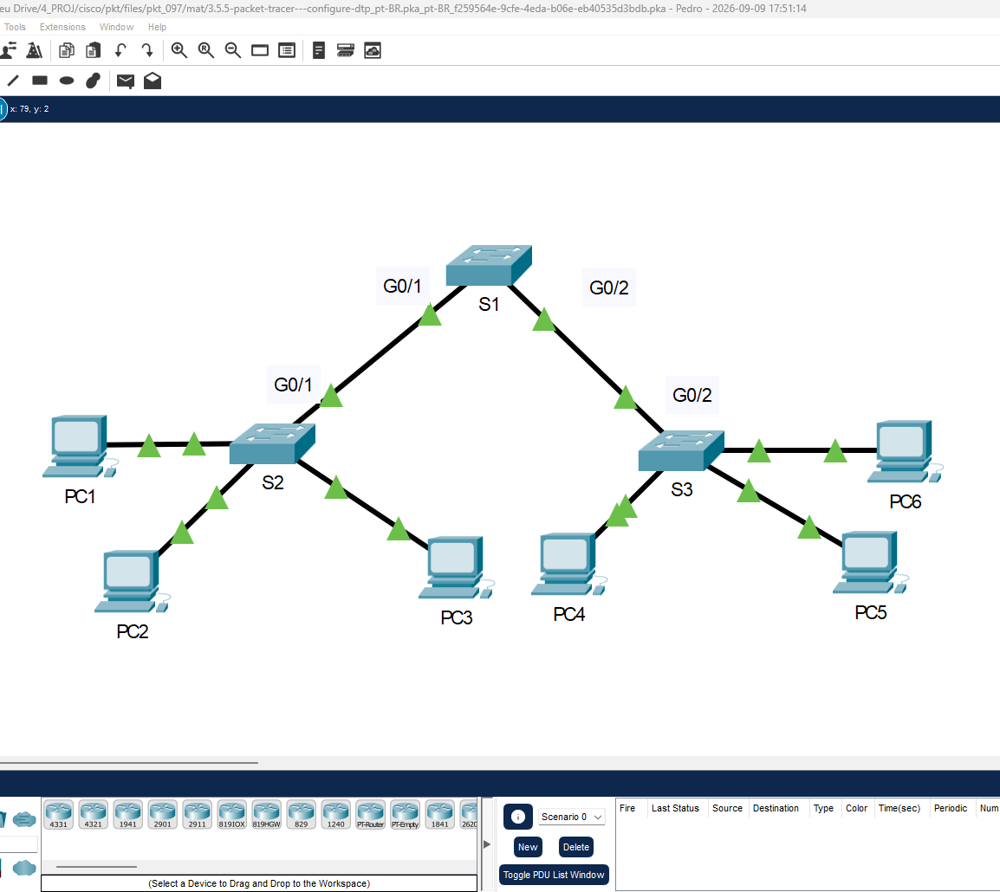
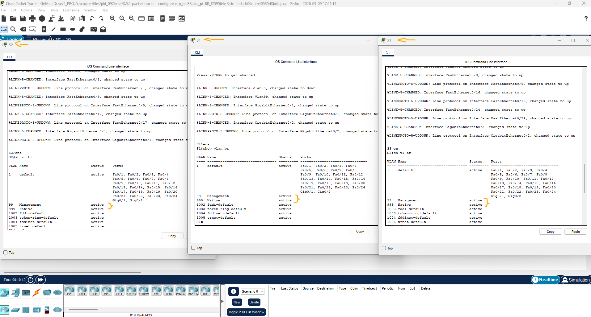
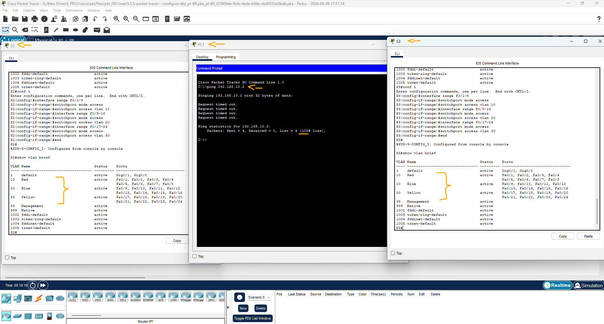
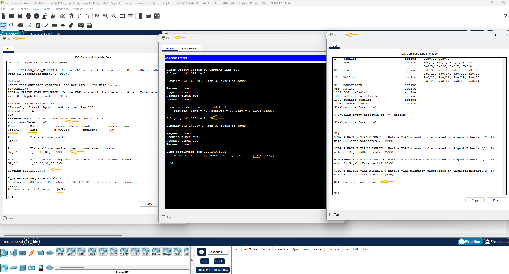
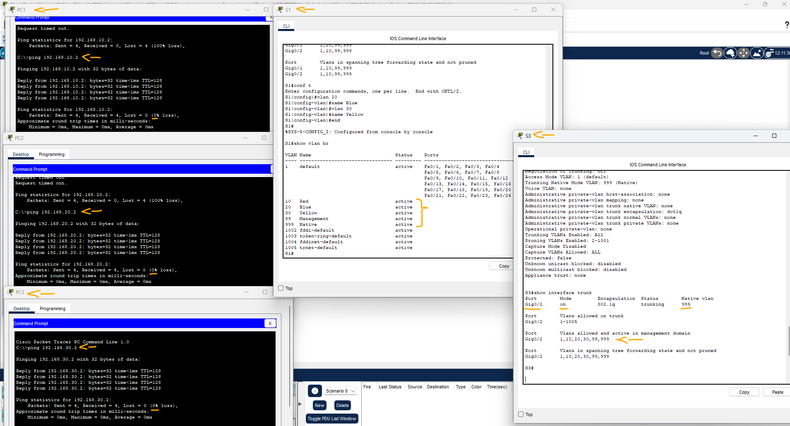

# Packet Tracer: Configurar o VTP e DTP   

### Cisco: <a href="../../../">cisco   </a>
### Cisco Networking Academy: cna   </a>
### Training Category: <a href="../../../pkt/">pkt</a>
### Software/Subject: network   </a>
### Course: <a href="./">pkt_097 (Packet Tracer: Configurar o VTP e DTP)   </a>

---

### Theme:
- Network

### Used Tools:
- Operating System (OS): 
  - Cisco Internetwork Operating System (Cisco IOS)   
  - Windows 11 
- Cloud Services:
  - Google Drive 
- Language:
  - HTML   
  - Markdown   
- Integrated Development Environment (IDE) and Text Editor:
  - Visual Studio Code (VS Code)   
- Versioning: 
  - Git   
- Repository:
  - GitHub   
- Network:
  - Cisco Packet Tracer   
  - ping   

---

<h3><a name="item00">Course Strcuture:</a></h3>

1. <a href="#item01">Parte 1: Verificar a configuração de VLAN.</a> 
2. <a href="#item02">Parte 2: Crie VLANs adicionais em S2 e S3.</a> 
3. <a href="#item03">Parte 3: Atribua VLANs às portas</a> 
4. <a href="#item04">Parte 4: Configure os troncos em S1, S2 e S3.</a> 
5. <a href="#item05">Parte 5: Reconfigure o tronco no S3.</a> 
6. <a href="#item06">Parte 6: Verifique a conectividade ponta a ponta.</a> 

---

### Objective:
O objetivo desta atividade foi implementar VLANs em uma pequena rede composta por três switches, utilizando dois enlaces trunk: um configurado dinamicamente por meio do DTP (Dynamic Trunking Protocol) e outro configurado manualmente, de forma estática.

### Folder Structure:
- [README.md](./README.md): Este documento de README, escrito em **Markdown**, com o conteúdo do laboratório.
- [0-aux](./0-aux/): Pasta auxiliar com imagens utilizadas na construção dos arquivos de README desse curso.

### Development:

<a name="item01"><h4>1. Parte 1: Verificar a configuração de VLAN.</h4></a>[Back to summary](#item00)

A imagem 01 mostra a topologia inicial.

<figure>
     
    <figcaption>Imagem 01.</figcaption>
</figure>
 

- a. Em S1, vá para o modo EXEC privilegiado e digite o comando show vlan brief para verificar as VLANs que estão presentes.
  - `enable` -> `show vlan brief`.
- b. Repita a etapa 1a em S2 e S3. Quais VLANs estão configuradas nos switches?
  - Além das VLANs padrão, estão configuradas as VLANs Management (99) e Native (999).

A imagem 02 exibe as VLANs existentes em cada um dos três switches.

<figure>
     
    <figcaption>Imagem 02.</figcaption>
</figure>
 

<a name="item02"><h4>2. Parte 2: Crie VLANs adicionais em S2 e S3.</h4></a>[Back to summary](#item00)

- a. No S2, crie a VLAN 10 e chame-a de vermelho.
  - `configure terminal` -> `vlan 10` -> `name Red`.
- b. Crie as VLANs 20 e 30 conforme a tabela abaixo.
  - `vlan 20` -> `name Blue`.
  - `vlan 30` -> `name Yellow` -> `end`.
- c. Verifique a adição de novas VLANs. Insira show vlan brief no modo EXEC privilegiado.
  - `show vlan brief`.
- c. Além das VLANs padrão, quais VLANs são configuradas no S2?
  -  Foram configuradas as VLANs Red (10), Blue (20) e Yellow (30).
- d. Repita as etapas anteriores para criar as VLANs adicionais no S3.

<a name="item03"><h4>3. Parte 3: Atribua VLANs às portas</h4></a>[Back to summary](#item00)

Use o comando switchport mode access para definir o modo dos links de acesso. Use o comando switchport access vlan vlan-id para atribuir uma VLAN a uma porta de acesso. 

- a. Atribua VLANs a portas no S2 usando as atribuições da tabela acima.
  - `configure terminal` -> `interface range f0/1-8` -> `switchport mode access` -> `switchport access vlan 10`.
  - `interface range f0/9-16` -> `switchport mode access` -> `switchport access vlan 20`.
  - `interface range f0/17-24` -> `switchport mode access` -> `switchport access vlan 30`.
- b. Atribua VLANs às portas no S3 usando as atribuições da tabela acima. Agora que você tem as portas atribuídas às VLANs, tente fazer ping de PC1 para PC6. 
  - `ping 192.168.10.2`.
- b. O ping obteve sucesso? Explique.
  - Não. O ping não foi bem-sucedido porque o switch intermediário não possui enlaces trunk configurados com os outros dois switches. Dessa forma, as VLANs não podem ser transportadas entre os switches, impedindo a comunicação entre hosts pertencentes à mesma VLAN, mas conectados a switches diferentes.

A imagem 03 comprova que o ping não foi bem-sucedido, mas evidencia que as interfaces foram devidamente atribuídas às suas respectivas VLANs nos switches S2 e S3.

<figure>
     
    <figcaption>Imagem 03.</figcaption>
</figure>
 

<a name="item04"><h4>4. Parte 4: Configure os troncos em S1, S2 e S3.</h4></a>[Back to summary](#item00)

O Dynamic trunking protocol (DTP) gerencia os links de tronco entre os switches Cisco. Atualmente, todas as portas de switch estão no modo de entroncamento padrão, que é dynamic auto. Nesta etapa, você alterará o modo de entroncamento para dynamic desirable para o link entre os switches S1 e S2. O link entre os comutadores S1 e S3 será definido como um tronco estático. Use a VLAN 999 como a VLAN nativa nesta topologia. 

- a. No switch S1, configure o link de tronco como dynamic desirable na interface GigabitEthernet 0/1. A configuração do S1 é mostrada abaixo.
  - `configure terminal` -> `interface g0/1` -> `switchport mode dynamic desirable` -> `end`.
- a. Qual será o resultado da negociação de tronco entre S1 e S2?
  - O entroncamento será negociado com sucesso, pois o S1 está configurado no modo dynamic desirable, enquanto o S2 está no modo dynamic auto. O DTP permitirá que as interfaces negociem e estabeleçam o enlace trunk entre os switches.
- b. No switch S2, verifique se o tronco foi negociado digitando o comando show interfaces trunk. Interface GigabitEthernet 0/1 deve aparecer na saída.
  - `show interfaces trunk`.
- b. Qual é o modo e o status desta porta?
  - No switch S2, a porta está no modo dynamic auto e apresenta o status trunking, indicando que o enlace trunk foi negociado com sucesso por meio do DTP.
- c. Para o link de tronco entre S1 e S3, configure a interface GigabitEthernet 0/2 como um link de tronco estático no S1. Além disso, desative a negociação DTP na interface G0/2 em S1.
  - `configure terminal` -> `interface g0/2` -> `switchport mode trunk` -> `switchport nonegotiate` -> `end`.
- d. Use o comando show dtp para verificar o status do DTP.
  - `show dtp`.
- e. Verifique se o entroncamento está ativado em todos os switches com o comando show interfaces trunk.
  - `show interfaces trunk`.
- e. Qual é a VLAN nativa para esses troncos no momento?
  - A VLAN nativa dos enlaces trunk entre S1 e S2 e entre S1 e S3 é a VLAN 1.
- f. Configure a VLAN 999 como a VLAN nativa para os links de tronco no S1.
  - `configure terminal` -> `interface range g0/1-2` -> `switchport trunk native vlan 999` -> `end`.
- f. Quais mensagens você recebeu no S1? Como você corrigiria isso?
  - Foi exibida a mensagem "%SPANTREE-2-BLOCK_PVID_LOCAL: Blocking GigabitEthernet0/1 on VLAN0999. Inconsistent local vlan.". Isso ocorreu porque a VLAN nativa do S1 foi alterada para 999, enquanto nos switches vizinhos ela ainda estava configurada como VLAN 1. Para corrigir, é necessário configurar a VLAN 999 como VLAN nativa nos enlaces trunk dos switches S2 e S3, mantendo a mesma VLAN nativa em ambas as extremidades de cada enlace.
- g. Em S2 e S3, configure a VLAN 999 como a VLAN nativa.
  - S2: `configure terminal` -> `interface g0/1` -> `switchport trunk native vlan 999` -> `end`.
  - S3: `configure terminal` -> `interface g0/2` -> `switchport trunk native vlan 999` -> `end`.
- h. Verifique se o entroncamento foi configurado com êxito em todos os switches. 
  - `show interfaces trunk`.
- h. Você deve conseguir executar ping em um switch de outro switch na topologia usando os endereços IP configurados no SVI.
  - S1 - S3: `ping 192.168.99.3`.
- i. Tente fazer ping do PC1 para o PC6.
  - `ping 192.168.20.2`.
- i. Por que o ping não teve êxito? (Dica: Veja a saída 'show vlan brief' dos três switches. Compare as saídas do 'show interface trunk' em todos os switches.)
  - `show vlan brief` -> `show interface trunk`.
  - O ping não teve êxito devido a um problema no enlace trunk entre o S1 e o S3. Como esse enlace foi configurado manualmente no modo trunk, sem utilizar o DTP, é necessário configurar manualmente a outra extremidade do enlace, no S3. Enquanto o S3 não estiver configurado como trunk, nenhuma das VLANs poderá ser transportada corretamente entre os switches.
- j. Corrija a configuração conforme necessário.

A imagem 04 evidencia que o ping entre os switches S1 e S3 não foi bem-sucedido e que as interfaces trunk do S3 não eram exibidas na saída do comando de verificação.

<figure>
     
    <figcaption>Imagem 04.</figcaption>
</figure>
 

<a name="item05"><h4>5. Parte 5: Reconfigure o tronco no S3.</h4></a>[Back to summary](#item00)

- a. Emita o comando "show interface trunk" no S3.
  - `show interface trunk`.
- a. Qual é o modo e encapsulamento no G0/2?
  - Não é possível determinar essas informações pelo `show interfaces trunk` no S3, pois a interface G0/2 não é exibida na saída do comando, indicando que ela não está operando como trunk.
- b. Configure o G0/2 para corresponder ao G0/2 no S1.
  - `configure terminal` -> `interface g0/2` -> `switchport mode trunk` -> `switchport nonegotiate` -> `end`.
- b. Qual é o modo e encapsulamento no G0/2 após a alteração?
  - O modo é on e o encapsulamento é 802.1Q, padrão utilizado para identificar as VLANs nos enlaces trunk. Diferentemente do ISL, o 802.1Q utiliza uma tag inserida no quadro Ethernet para identificar a VLAN à qual ele pertence.
- c. Execute o comando 'show interface G0/2 switchport' no switch S3.
  - `show interface g0/2 switchport`.
- c. Qual é o estado 'Negociação de entroncamento' exibido?
  - O estado de Negociação de entroncamento é On, indicando que a interface está configurada para operar como trunk de forma estática, sem depender da negociação do DTP.

<a name="item06"><h4>6. Parte 6: Verifique a conectividade ponta a ponta.</h4></a>[Back to summary](#item00)

- a. De PC1 ping PC6.
  - `ping 192.168.10.2`.
- b. De PC2 ping PC5.
  - `ping 192.168.20.2`.
- c. De PC3 ping PC4.
  - `ping 192.168.30.2`.
- d. Foi necessário criar as três VLANs 10, 20 e 30 no switch S1 para que pudesse ser transportada.
  - `configure terminal` -> `vlan 10` -> `name Red`.
  - `vlan 20` -> `name Blue`.
  - `vlan 30` -> `name Yellow` -> `end`.

A imagem 05 apresenta o S3 com a interface configurada como trunk no modo estático, além de evidenciar o sucesso dos pings entre PCs pertencentes à mesma VLAN, porém conectados a switches diferentes. A imagem também mostra as VLANs criadas no switch S1.

<figure>
     
    <figcaption>Imagem 05.</figcaption>
</figure>
 