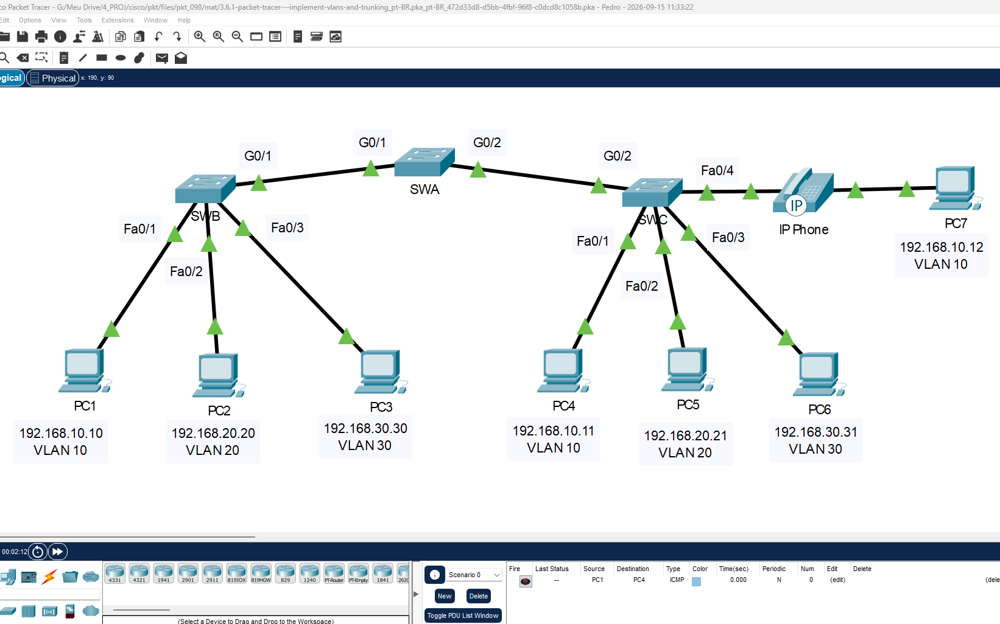
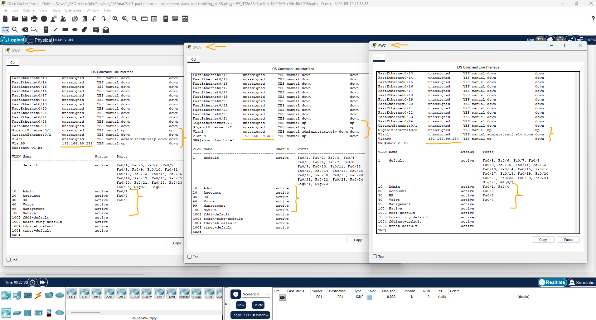
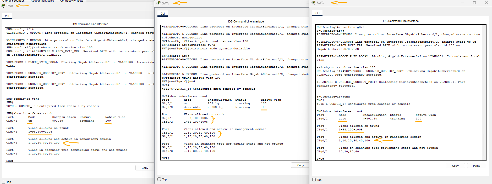

# Packet Tracer - Implementar VLANs e entroncamento   

### Cisco: <a href="../../../">cisco   </a>
### Cisco Networking Academy: cna   </a>
### Training Category: <a href="../../../pkt/">pkt</a>
### Software/Subject: network   </a>
### Course: <a href="./">pkt_098 (Packet Tracer - Implementar VLANs e entroncamento)   </a>

---

### Theme:
- Network

### Used Tools:
- Operating System (OS): 
  - Cisco Internetwork Operating System (Cisco IOS)   
  - Windows 11 
- Cloud Services:
  - Google Drive 
- Language:
  - HTML   
  - Markdown   
- Integrated Development Environment (IDE) and Text Editor:
  - Visual Studio Code (VS Code)   
- Versioning: 
  - Git   
- Repository:
  - GitHub   
- Network:
  - Cisco Packet Tracer   

---

<h3><a name="item00">Course Strcuture:</a></h3>

1. <a href="#item01">Parte 1: Configurar VLANs</a> 
  1.1 <a href="#item01.01">Etapa 1: Ligue a rede e ligue os dispositivos.</a> 
  1.2 <a href="#item01.02">Etapa 2: Configurar o roteador.</a> 
  1.3 <a href="#item01.03">Etapa 3: Configure o switch.</a> 
2. <a href="#item02">Parte 2: Atribuir portas às VLANs</a> 
  2.1 <a href="#item02.01">Etapa 1: Atribuir portas de acesso a VLANs</a> 
  2.2 <a href="#item02.02">Etapa 2: Configurar a porta VLAN de voz</a> 
  2.3 <a href="#item02.03">Etapa 3: Configurar as interfaces de gerenciamento virtual</a> 
  2.4 <a href="#item02.04">Etapa 4: Atribua endereços IPv6 estáticos aos computadores.</a> 
3. <a href="#item03">Parte 3: Configurando o entroncamento estático.</a> 
4. <a href="#item04">Parte 4: Configurar entroncamento dinâmico</a> 

---

### Objective:
O objetivo desta atividade foi implementar uma configuração completa de VLANs, criando e atribuindo as VLANs às respectivas portas dos switches, configurando os enlaces entre os switches como interfaces trunk, de forma estática e dinâmica, definindo uma VLAN nativa e impedindo o compartilhamento da VLAN de gerenciamento. Também foram configuradas as interfaces de gerenciamento, com endereçamento IP e associação à respectiva VLAN de gerenciamento em cada switch.

### Folder Structure:
- [README.md](./README.md): Este documento de README, escrito em **Markdown**, com o conteúdo do laboratório.
- [0-aux](./0-aux/): Pasta auxiliar com imagens utilizadas na construção dos arquivos de README desse curso.

### Development:

<a name="item01"><h4>1. Parte 1: Configurar VLANs</h4></a>[Back to summary](#item00)

A imagem 01 mostra a topologia inicial.

<figure>
     
    <figcaption>Imagem 01.</figcaption>
</figure>
 

- a. Configure VLANs em todos os três switches. Consulte a tabela VLAN. Observe que os nomes de VLAN devem corresponder exatamente aos valores na tabela.
  - `enable` -> `configure terminal`.
  - `vlan 10` -> `name Admin` -> `exit`.
  - `vlan 20` -> `name Accounts` -> `exit`.
  - `vlan 30` -> `name HR` -> `exit`.
  - `vlan 40` -> `name Voice` -> `exit`.
  - `vlan 99` -> `name Management` -> `exit`.
  - `vlan 100` -> `name Native` -> `exit`.

<a name="item02"><h4>2. Parte 2: Atribuir portas às VLANs</h4></a>[Back to summary](#item00)

<a name="item02.01"><h4>2.1 Etapa 1: Atribuir portas de acesso a VLANs</h4></a>[Back to summary](#item00)

- a. Em SWB e SWC, atribua portas às VLANs. Consulte a Tabela de Endereçamento.
  - `interface f0/1` -> `switchport mode access` -> `switchport access vlan 10` -> `exit`.
  - `interface f0/2` -> `switchport mode access` -> `switchport access vlan 20` -> `exit`.
  - `interface f0/3` -> `switchport mode access` -> `switchport access vlan 30` -> `exit`.

<a name="item02.02"><h4>2.2 Etapa 2: Configurar a porta VLAN de voz</h4></a>[Back to summary](#item00)

- a. Configure a porta apropriada no SWC do switch para a funcionalidade VLAN de voz.
  - SWC: `interface f0/4` -> `switchport mode access` -> `switchport access vlan 10` -> `switchport voice vlan 40` -> `exit`.

<a name="item02.03"><h4>2.3 Etapa 3: Configurar as interfaces de gerenciamento virtual</h4></a>[Back to summary](#item00)

- a. Crie as interfaces de gerenciamento virtual, em todos os três switches.
  - `interface vlan 99`.
- b. Resolver as interfaces de gerenciamento virtual de acordo com a Tabela de Endereçamento.
  - SWA: `ip address 192.168.99.252 255.255.255.0` -> `no shutdown` -> `exit`.
  - SWB: `ip address 192.168.99.253 255.255.255.0` -> `no shutdown` -> `exit`.
  - SWC: `ip address 192.168.99.254 255.255.255.0` -> `no shutdown` -> `exit`.
- c. Os switches não devem ser capazes de fazer ping uns aos outros. 
  - SWA e SWB: `interface g0/1` -> `switchport trunk allowed vlan remove 99` -> `end`.
  - SWA e SWC: `interface g0/2` -> `switchport trunk allowed vlan remove 99` -> `end`.

A imagem 02 apresenta as VLANs criadas e atribuídas às respectivas portas, além das interfaces de gerenciamento configuradas e isoladas em cada switch.

<figure>
     
    <figcaption>Imagem 02.</figcaption>
</figure>
 

<a name="item03"><h4>3. Parte 3: Configurando o entroncamento estático.</h4></a>[Back to summary](#item00)

- a. Configure o link entre SWA e SWB como um tronco estático. Desative o entroncamento dinâmico nesta porta.
  - `interface g0/1` -> `switchport mode trunk`. 
- b. Desative o DTP na porta do switch em ambas as extremidades do link do tronco.
  - `switchport nonegotiate`.
- c. Configure o tronco com a VLAN nativa e elimine conflitos de VLAN nativa, se houver.
  - `switchport trunk native vlan 100`.

<a name="item04"><h4>4. Parte 4: Configurar entroncamento dinâmico</h4></a>[Back to summary](#item00)

- a. Suponha que a porta de tronco no SWC está definida para o modo DTP padrão para 2960 switches. Configure o G0/2 no SWA para que ele negocie com êxito o entroncamento com o SWC. 
  - SWA: `interface g0/2` -> `switchport mode dynamic desirable`
- b. Configure o tronco com a VLAN nativa e elimine conflitos de VLAN nativa, se houver.
  - SWA: `switchport trunk native vlan 100` -> `exit`.
  - SWC: `interface g0/2` -> `switchport trunk native vlan 100` -> `exit`.

A imagem 03 evidencia as interfaces trunk devidamente configuradas, ambas com VLAN nativa, sendo um enlace definido estaticamente e o outro dinamicamente, demonstrando ainda que a VLAN de gerenciamento não é compartilhada pelo tronco.

<figure>
     
    <figcaption>Imagem 03.</figcaption>
</figure>
 