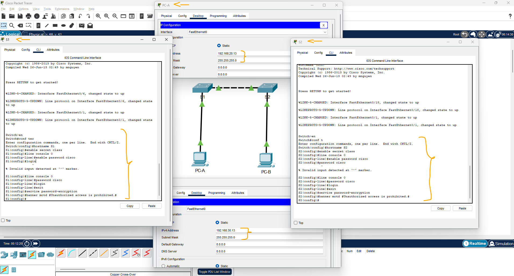
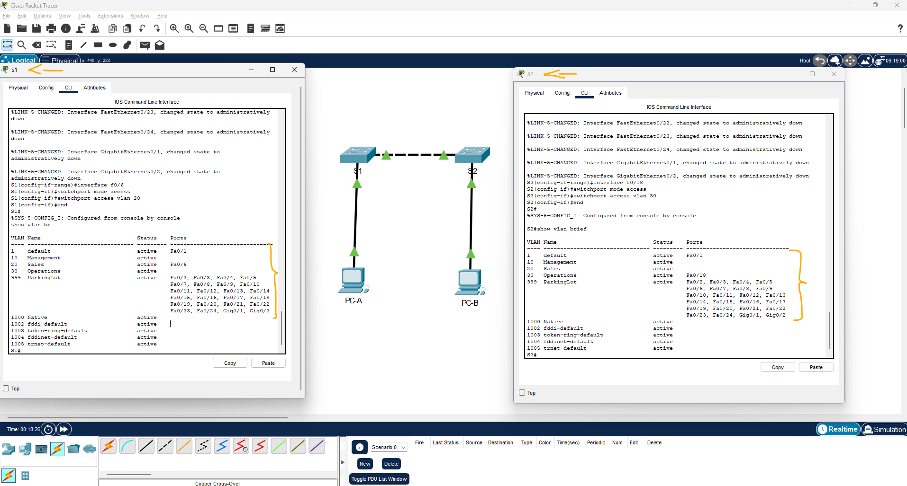
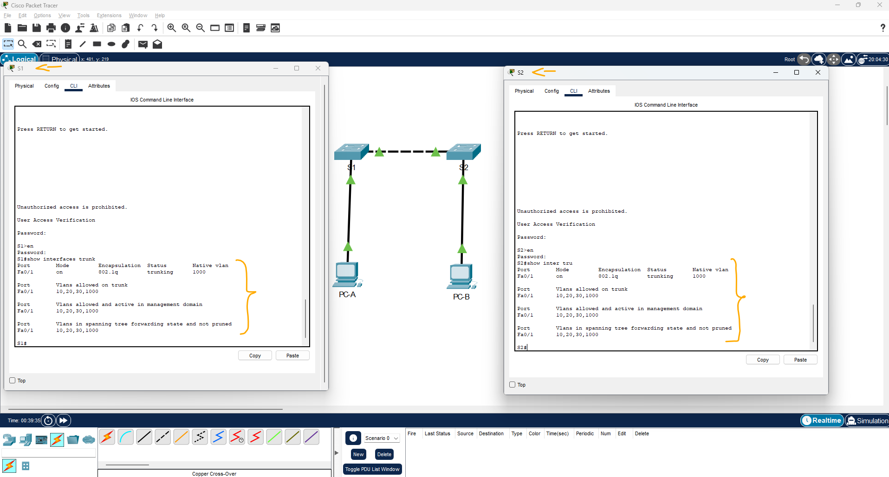

# Packet Tracer - Implementar VLANs e entroncamento (Lab)   

### Cisco: <a href="../../../">cisco   </a>
### Cisco Networking Academy: cna   </a>
### Training Category: <a href="../../../pkt/">pkt</a>
### Software/Subject: network   </a>
### Course: <a href="./">pkt_099 (Packet Tracer - Implementar VLANs e entroncamento (Lab))   </a>

---

### Theme:
- Network

### Used Tools:
- Operating System (OS): 
  - Cisco Internetwork Operating System (Cisco IOS)   
  - Windows 11 
- Cloud Services:
  - Google Drive 
- Language:
  - HTML   
  - Markdown   
- Integrated Development Environment (IDE) and Text Editor:
  - Visual Studio Code (VS Code)   
- Versioning: 
  - Git   
- Repository:
  - GitHub   
- Network:
  - Cisco Packet Tracer 
  - ping   

---

<h3><a name="item00">Course Strcuture:</a></h3>

1. <a href="#item01">Parte 1: criar a rede e implementar as configurações básicas do dispositivo</a> 
  1.1 <a href="#item01.01">Etapa 1: Instale os cabos da rede conforme mostrado na topologia.</a> 
  1.2 <a href="#item01.02">Etapa 2: Defina as configurações básicas de cada switch.</a> 
  1.3 <a href="#item01.03">Etapa 3: Configure os PCs hosts.</a> 
2. <a href="#item02">Parte 2: Crie VLANs e atribua portas de switch</a> 
  2.1 <a href="#item02.01">Etapa 1: Crie VLANs nos dois comutadores.</a> 
  2.2 <a href="#item02.02">Etapa 2: Atribua VLANs às interfaces corretas do switch.</a> 
3. <a href="#item03">Parte 3: Configurar um tronco 802.1Q entre os comutadores</a> 
  3.1 <a href="#item03.01">Etapa 1: Configure manualmente a interface de tronco F0/1.</a> 
  3.2 <a href="#item03.02">Etapa 2: Verifique a conectividade.</a> 

---

### Objective:   
Esta atividade teve como objetivo criar uma pequena rede composta por dois switches, cada um conectado a um host, realizando as configurações básicas dos switches, a criação e atribuição das VLANs às respectivas portas e a configuração de uma interface trunk para permitir o transporte das VLANs entre os switches. Também foram realizadas verificações de conectividade para validar as configurações. Como os hosts foram configurados em VLANs diferentes e não havia roteamento entre essas VLANs, não foi possível estabelecer comunicação entre os dispositivos pertencentes a diferentes VLANs.

### Folder Structure:
- [README.md](./README.md): Este documento de README, escrito em **Markdown**, com o conteúdo desta atividade.
- [0-aux](./0-aux/): Pasta auxiliar com imagens utilizadas na construção dos arquivos de README desse curso.

### Development:

<a name="item01"><h4>1. Parte 1: criar a rede e implementar as configurações básicas do dispositivo</h4></a>[Back to summary](#item00)

Na Parte 1, você configurará a topologia de rede e as configurações básicas nos hosts e switches do PC.

<a name="item01.01"><h4>1.1 Etapa 1: Instale os cabos da rede conforme mostrado na topologia.</h4></a>[Back to summary](#item00)

- a. Conecte os dispositivos como mostrado no diagrama da topologia e cabei-os se necessário.

<a name="item01.02"><h4>1.2 Etapa 2: Defina as configurações básicas de cada switch.</h4></a>[Back to summary](#item00)

- a. Use o console para se conectar ao switch e ative o modo EXEC privilegiado. 
  - `enable`.
- b. Atribua um nome de dispositivo ao comutador. 
  - S1: `configure terminal` -> `hostname S1`.
  - S2: `configure terminal` -> `hostname S2`.
- c. Desative a pesquisa de DNS. 
  - `no ip domain-lookup`.
- d. Atribua class como a senha criptografada do EXEC privilegiado.
  - `enable secret class`.
- e. Atribua cisco como a senha de console e habilite o login.
  - `line console 0` -> `password cisco` -> `login` -> `exit`.
- f. Atribua cisco como a senha VTY e ative o login. 
  - `line vty 0-15` -> `password cisco` -> `login` -> `exit`.
- g. Criptografe as senhas em texto simples.
  - `service password-encryption`.
- h. Crie um banner para avisar às pessoas que o acesso não autorizado é proibido. 
  - `banner motd #Unauthorized access is prohibited.#`.
- i. Copie a configuração atual para a configuração de inicialização.
  - `copy running-config startup-config`.

<a name="item01.03"><h4>1.3 Etapa 3: Configure os PCs hosts.</h4></a>[Back to summary](#item00)

- a. Consulte a Tabela de Endereçamento para obter informações de endereço do PC.
  - PC-A: `192.168.20.13` -> `255.255.255.0`.
  - PC-B: `192.168.30.13` -> `255.255.255.0`.

A imagem 01 apresenta as configurações básicas realizadas nos switches, bem como o endereçamento IP configurado nos hosts.

<figure>
     
    <figcaption>Imagem 01.</figcaption>
</figure>
 

<a name="item02"><h4>2. Parte 2: Crie VLANs e atribua portas de switch</h4></a>[Back to summary](#item00)

Na Parte 2, você criará VLANs conforme especificado na tabela acima em ambos os switches. Em seguida, você atribuirá as VLANs à interface apropriada. O comando show vlan brief é usado para verificar suas definições de configuração. Conclua as seguintes tarefas em cada switch.

<a name="item02.01"><h4>2.1 Etapa 1: Crie VLANs nos dois comutadores.</h4></a>[Back to summary](#item00)

- a. Crie e nomeie as VLANs necessárias em cada switch a partir da tabela acima.
  - `enable` -> `configure terminal`.
  - `vlan 10` -> `name Management` -> `exit`.
  - `vlan 20` -> `name Sales` -> `exit`.
  - `vlan 30` -> `name Operations` -> `exit`.
  - `vlan 999` -> `name ParkingLot` -> `exit`.
  - `vlan 1000` -> `name Native` -> `exit`.
- b. Configure a interface de gerenciamento em cada switch usando as informações de endereço IP na Tabela de Endereçamento.
  - S1: `interface vlan 10` -> `ip address 192.168.10.11 255.255.255.0` -> `no shutdown` -> `exit`.
  - S2: `interface vlan 10` -> `ip address 192.168.10.12 255.255.255.0` -> `no shutdown` -> `exit`.
- c. Atribua todas as portas não utilizadas no switch à VLAN ParkingLot, configure-as para o modo de acesso estático e desative-as administrativamente. 
  - S1: `interface range f0/2-5,f0/7-24,g0/1-2` -> `switchport mode access` -> `switchport access vlan 999` -> `shutdown` -> `exit`.
  - S2: `interface range f0/2-17,f0/19-24,g0/1-2` -> `switchport mode access` -> `switchport access vlan 999` -> `shutdown` -> `exit`.

<a name="item02.02"><h4>2.2 Etapa 2: Atribua VLANs às interfaces corretas do switch.</h4></a>[Back to summary](#item00)

- a. Atribua portas usadas à VLAN apropriada (especificada na tabela VLAN acima) e configure-as para o modo de acesso estático.
  - S1: `interface f0/6` -> `switchport mode access` -> `switchport access vlan 20` -> `end`.
  - S2: `interface f0/18` -> `switchport mode access` -> `switchport access vlan 30` -> `end`.
- b. Verifique se as VLANs estão atribuídas às interfaces corretas.
  - `exit` -> `show vlan brief`.

A imagem 02 mostra a criação das VLANs e sua atribuição às respectivas portas em cada switch.

<figure>
     
    <figcaption>Imagem 02.</figcaption>
</figure>
 

<a name="item03"><h4>3. Parte 3: Configurar um tronco 802.1Q entre os comutadores</h4></a>[Back to summary](#item00)

Na Parte 3, você configurará manualmente a interface F0/1 como um tronco.

<a name="item03.01"><h4>3.1 Etapa 1: Configure manualmente a interface de tronco F0/1.</h4></a>[Back to summary](#item00)

- a. Altere o modo switchport na interface F0/1 para forçar o entroncamento. Certifique-se de fazer isso em ambos os switches.
  - `interface f0/1` -> `switchport mode trunk`.
- b. Defina a VLAN nativa como 1000 em ambos os switches.
  - `switchport trunk native vlan 1000`.
- c. Como outra parte da configuração do tronco, especifique que somente as VLANs 10, 20, 30 e 1000 podem atravessar o tronco. 
  - `switchport trunk allowed vlan 10,20,30,1000`.
- d. Execute o comando show interfaces trunk para verificar as portas de entroncamento, a VLAN nativa e as VLANs permitidas no tronco.
  - `end` -> `show interfaces trunk`.

A imagem 03 evidencia a interface trunk configurada no enlace entre os switches, com a definição de uma VLAN nativa e a especificação das VLANs permitidas no tronco.

<figure>
     
    <figcaption>Imagem 03.</figcaption>
</figure>
 

<a name="item03.02"><h4>3.2 Etapa 2: Verifique a conectividade.</h4></a>[Back to summary](#item00)

- a. Verifique a conectividade em uma VLAN. Por exemplo, PC-A deve ser capaz de executar ping S1 VLAN 20 com êxito. 
  - `ping 192.168.20.11`.
- b. Os pings do PC-B para o S2 foram bem-sucedidos?
  - `ping 192.168.10.12`.
- b. Explique.
  - Os pings não foram bem-sucedidos porque, conforme as configurações apresentadas nas etapas anteriores, o PC-A está conectado à VLAN 20 e o PC-B à VLAN 30, enquanto as interfaces de gerenciamento dos switches foram configuradas apenas na VLAN 10. Como não há roteamento entre essas VLANs, os hosts não conseguem alcançar a interface de gerenciamento configurada na VLAN 10.
  - No caso do PC-A, há ainda uma inconsistência nas instruções da atividade. O teste solicita que ele alcance o endereço 192.168.20.11, apresentado na tabela de endereçamento como sendo a interface VLAN 20 do S1. Entretanto, nas etapas anteriores, foi configurada somente a SVI da VLAN 10 (interface vlan 10). A atribuição da VLAN 20 à porta F0/6 do S1 apenas coloca essa porta no domínio Layer 2 da VLAN 20 e não cria automaticamente uma interface Layer 3 ou um endereço IP para o switch nessa VLAN.
  - Dessa forma, a atividade demonstra a criação das VLANs, a atribuição das VLANs às portas de acesso e a configuração do enlace trunk entre os switches. O trunk permite o transporte das VLANs entre os switches, mas não realiza o roteamento entre elas. A comunicação entre dispositivos pertencentes a VLANs diferentes exigiria uma configuração de roteamento, como um roteador ou um switch multilayer.