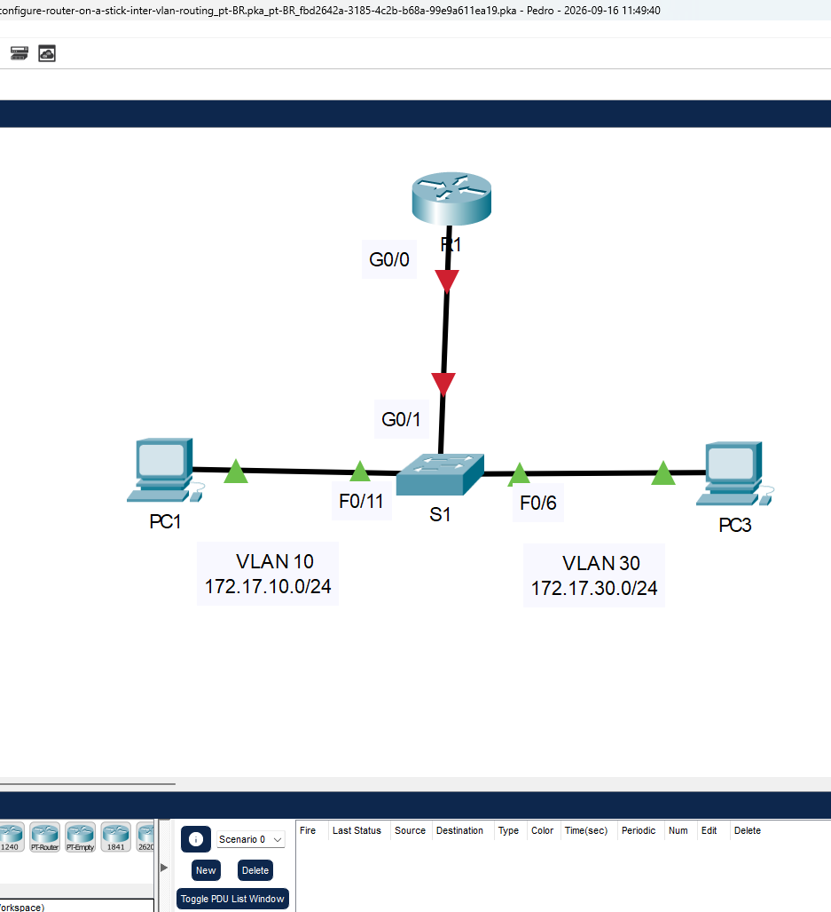
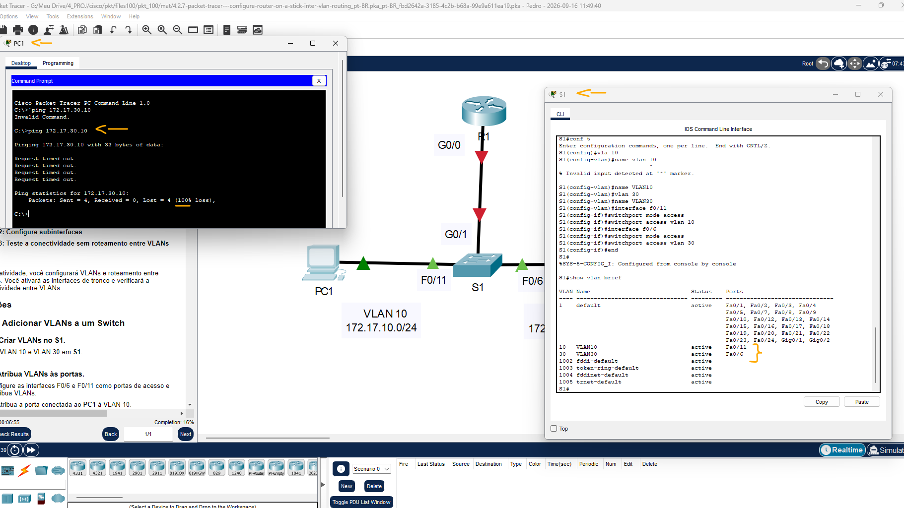
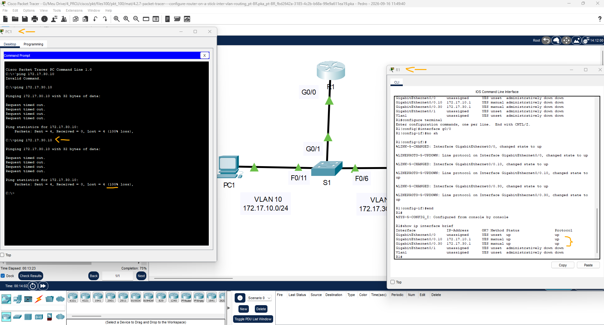
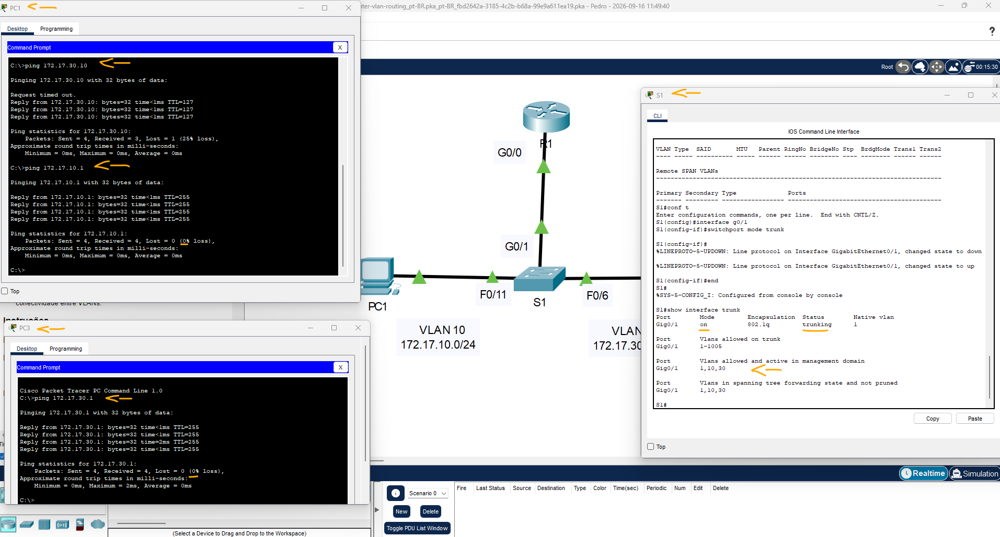

# Packet Tracer - Configurar o roteamento entre VLANs do roteador no stick   

### Cisco: <a href="../../../">cisco   </a>
### Cisco Networking Academy: cna   </a>
### Training Category: <a href="../../../pkt/">pkt</a>
### Software/Subject: network   </a>
### Course: <a href="./">pkt_100 (Packet Tracer - Configurar o roteamento entre VLANs do roteador no stick)   </a>

---

### Theme:
- Network

### Used Tools:
- Operating System (OS): 
  - Cisco Internetwork Operating System (Cisco IOS)   
  - Windows 11 
- Cloud Services:
  - Google Drive 
- Language:
  - HTML   
  - Markdown   
- Integrated Development Environment (IDE) and Text Editor:
  - Visual Studio Code (VS Code)   
- Versioning: 
  - Git   
- Repository:
  - GitHub   
- Network:
  - Cisco Packet Tracer   
  - ping   

---

<h3><a name="item00">Course Strcuture:</a></h3>

1. <a href="#item01">Parte 1: Adicione VLANs em um switch</a> 
  1.1 <a href="#item01.01">Etapa 1: Crie VLANs em S1.</a> 
  1.2 <a href="#item01.02">Etapa 2: Atribuir VLANs às portas.</a> 
  1.3 <a href="#item01.03">Etapa 3: Teste a conectividade entre PC1 e PC3.</a> 
2. <a href="#item02">Parte 2: Configure subinterfaces</a> 
  2.1 <a href="#item02.01">Etapa 1: Configure subinterfaces em R1 usando o encapsulamento 802.1Q.</a> 
  2.2 <a href="#item02.02">Etapa 2: Verifique a configuração.</a> 
3. <a href="#item03">Parte 3: Teste a conectividade sem roteamento entre VLANs</a> 
  3.1 <a href="#item03.01">Etapa 1: Ping entre PC1 e PC3</a> 
  3.2 <a href="#item03.02">Etapa 2: Ative o entroncamento.</a> 
  3.3 <a href="#item03.03">Etapa 3: Testar a conectividade</a> 

---

### Objective:
O objetivo desta atividade foi implementar o roteamento entre VLANs utilizando o método Router-on-a-Stick, criando as VLANs no switch e atribuindo-as às respectivas portas, configurando o enlace trunk para o transporte das VLANs e criando e configurando as subinterfaces do roteador com seus respectivos endereços IP. Por fim, foram realizados testes de conectividade para verificar o funcionamento da comunicação entre as VLANs.

### Folder Structure:
- [README.md](./README.md): Este documento de README, escrito em **Markdown**, com o conteúdo do laboratório.
- [0-aux](./0-aux/): Pasta auxiliar com imagens utilizadas na construção dos arquivos de README desse curso.

### Development:

<a name="item01"><h4>1. Parte 1: Adicione VLANs em um switch</h4></a>[Back to summary](#item00)

A imagem 01 mostra a topologia inicial.

<figure>
     
    <figcaption>Imagem 01.</figcaption>
</figure>
 

<a name="item01.01"><h4>1.1 Etapa 1: Crie VLANs em S1.</h4></a>[Back to summary](#item00)

- a. Crie a VLAN 10 e VLAN 30 em S1.
  - `enable` -> `configure terminal`.
  - `vlan 10` -> `exit`.
  - `vlan 30` -> `exit`.

<a name="item01.02"><h4>1.2 Etapa 2: Atribuir VLANs às portas.</h4></a>[Back to summary](#item00)

- a. Configure as interfaces F0/6 e F0/11 como portas de acesso e atribua VLANs.
- a. Atribua a porta conectada ao PC1 à VLAN 10.
  - `interface f0/11` -> `switchport mode access` -> `switchport access vlan 10` -> `exit`.
- a. Atribua a porta conectada ao PC3 à VLAN 30.
  - `interface f0/6` -> `switchport mode access` -> `switchport access vlan 30` -> `exit`.
- b. Emita o comando show vlan brief para verificar a configuração de VLAN.
  - `end` -> `show vlan brief`.

<a name="item01.03"><h4>1.3 Etapa 3: Teste a conectividade entre PC1 e PC3.</h4></a>[Back to summary](#item00)

- a. Do PC1, faça ping para o PC3.
  - `ping 172.17.30.10`.
- a. Os pings foram bem-sucedidos? Por que você conseguiu esse resultado? 
  - Não. Como cada host está conectado a uma VLAN diferente e não foi configurado nenhum mecanismo de roteamento entre VLANs, não é possível estabelecer comunicação entre eles.

A imagem 02 apresenta as VLANs criadas e atribuídas às respectivas portas do switch, além do teste de conectividade entre o PC1 e o PC3, demonstrando que a comunicação entre eles ainda não era possível.

<figure>
     
    <figcaption>Imagem 02.</figcaption>
</figure>
 

<a name="item02"><h4>2. Parte 2: Configure subinterfaces</h4></a>[Back to summary](#item00)

<a name="item02.01"><h4>2.1 Etapa 1: Configure subinterfaces em R1 usando o encapsulamento 802.1Q.</h4></a>[Back to summary](#item00)

- a. Crie a subinterface G0/0.10. Defina o tipo de encapsulamento para 802.1Q e atribua VLAN 10 à subinterface. 
  - `enable` -> `configure terminal`.
  - `interface g0/0.10` -> `encapsulation dot1q 10`.
- a. Consulte a  Tabela de Endereços e atribua o endereço IP correto à subinterface. 
  - `ip address 172.17.10.1 255.255.255.0`.
- b. Repita para a subinterface G0/0.30.
  - `interface g0/0.30` -> `encapsulation dot1q 30`.  
  - `ip address 172.17.30.1 255.255.255.0`.

<a name="item02.02"><h4>2.2 Etapa 2: Verifique a configuração.</h4></a>[Back to summary](#item00)

- a. Use o comando show ip interface brief para verificar a configuração da subinterface. Ambos as subinterfaces estão inoperantes. As subinterfaces são as interfaces virtuais que estão associadas a uma interface física. Portanto, para ativar subinterfaces, você deve ativar a interface física a qual elas estão associadas. 
  - `end` -> `show ip interface brief`.
- b. Ative a interface G0/0. Verifique se as subinterfaces estão ativas agora.
  - `configure terminal` -> `interface g0/0` -> `no shutdown` -> `exit`.

<a name="item03"><h4>3. Parte 3: Teste a conectividade sem roteamento entre VLANs</h4></a>[Back to summary](#item00)

<a name="item03.01"><h4>3.1 Etapa 1: Ping entre PC1 e PC3</h4></a>[Back to summary](#item00)

- a. Do PC1, faça ping para o PC3.
  - `ping 172.17.30.10`.
- a. Os pings ainda devem falhar. Explique.
  - Apesar de o roteamento entre VLANs já estar configurado no roteador, as VLANs criadas ainda não estão sendo transportadas pelo enlace entre o switch e o roteador, pois essa interface permanece no modo padrão access. É necessário configurá-la como trunk, permitindo o transporte das duas VLANs pelo enlace.

A imagem 03 exibe as subinterfaces configuradas com endereçamento IP e ativas, além do teste de conectividade entre os PCs, que ainda evidencia a ausência de comunicação.

<figure>
     
    <figcaption>Imagem 03.</figcaption>
</figure>
 

<a name="item03.02"><h4>3.2 Etapa 2: Ative o entroncamento.</h4></a>[Back to summary](#item00)

- a. Em S1, emita o comando show vlan.
  - `enable` -> `show vlan`.
- a. A quais VLANs o G0/1 foi atribuído?
  - A interface G0/1 foi atribuída à VLAN padrão (VLAN 1), conforme indicado pelo comando show vlan.
- b. Como o roteador foi configurado com várias subinterfaces atribuídas à VLANs diferentes, a porta do switch conectado com o roteador deve ser configurada como um tronco. Ativar o tronco na interface G0/1. 
  - `configure terminal` -> `interface g0/1` -> `switchport mode trunk`.
- b. Como você pode determinar que a interface é uma porta de tronco usando o comando show vlan?
  - Quando a interface não aparece na saída do comando show vlan, isso indica que ela não está atribuída a uma VLAN de acesso. Nesse caso, a interface pode estar configurada como porta trunk ou estar associada a uma VLAN que foi removida.
- c. Emita o comando show interface trunk para verificar se a interface está configurada como um tronco. 
  - `end` -> `show interface trunk`.

<a name="item03.03"><h4>3.3 Etapa 3: Testar a conectividade</h4></a>[Back to summary](#item00)

- a. Se as configurações estiverem corretas, PC1 e PC3 devem ser capazes de executar ping em seus gateways padrão e entre si. 
  - PC1 - PC3: `ping 172.17.30.10`.
  - PC1 - GTW: `ping 172.17.10.1`.
  - PC3 - GTW: `ping 172.17.30.1`.
- a. Quais endereços PC1 e PC3 usam como endereços de gateway padrão? 
  - Os endereços de gateway padrão utilizados pelo PC1 e pelo PC3 correspondem aos endereços IP das respectivas subinterfaces configuradas no roteador, cada uma associada à sua VLAN.

A imagem 04 exibe o enlace entre o switch e router configurado como interface trunk permitindo a passagem das duas vlans criadas, além disso os três testes ping comprovando a conectividade entre os dispositivos.

<figure>
     
    <figcaption>Imagem 04.</figcaption>
</figure>
 