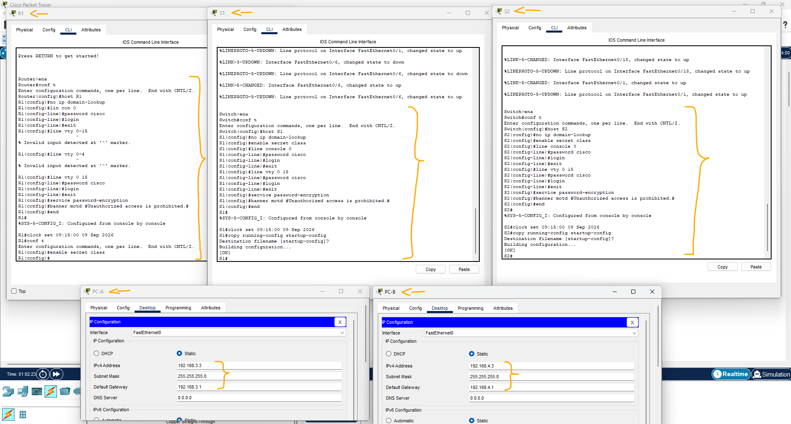
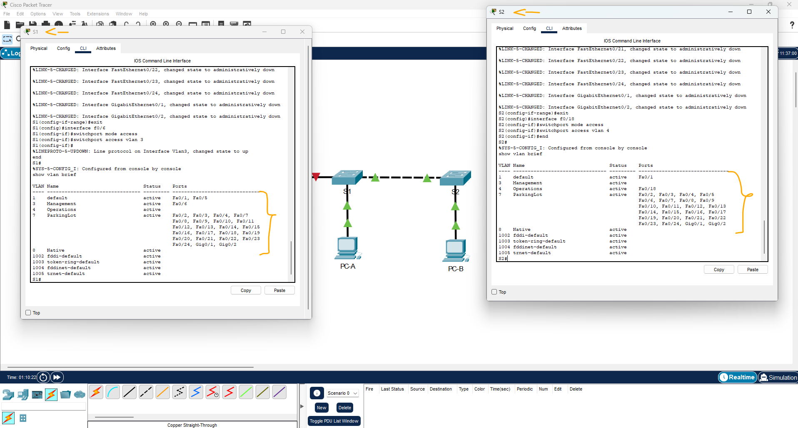
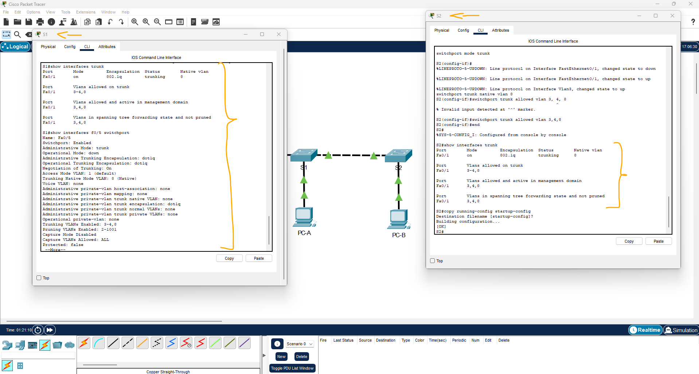
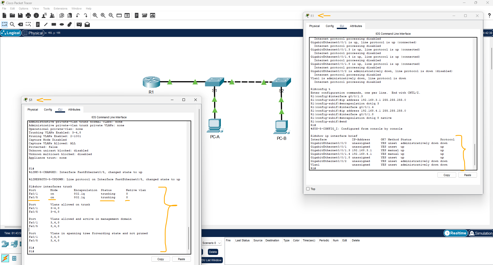
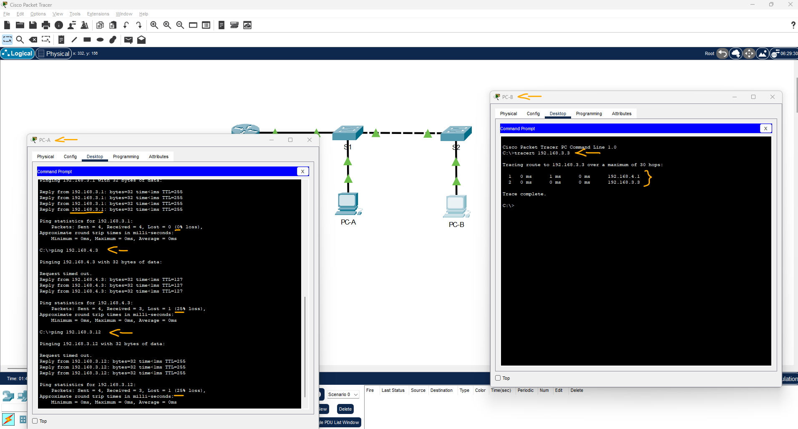

# Packet Tracer - Configurar o roteamento inter-VLAN do roteador no stick (Lab)   

### Cisco: <a href="../../../">cisco   </a>
### Cisco Networking Academy: cna   </a>
### Training Category: <a href="../../../pkt/">pkt</a>
### Software/Subject: network   </a>
### Course: <a href="./">pkt_101 (Packet Tracer - Configurar o roteamento inter-VLAN do roteador no stick (Lab))   </a>

---

### Theme:
- Network

### Used Tools:
- Operating System (OS): 
  - Cisco Internetwork Operating System (Cisco IOS)   
  - Windows 11 
- Cloud Services:
  - Google Drive 
- Language:
  - HTML   
  - Markdown   
- Integrated Development Environment (IDE) and Text Editor:
  - Visual Studio Code (VS Code)   
- Versioning: 
  - Git   
- Repository:
  - GitHub   
- Network:
  - Cisco Packet Tracer   
  - ping   
  - Trace Route (tracert)   

---

<h3><a name="item00">Course Strcuture:</a></h3>

1. <a href="#item01">Parte 1: criar a rede e implementar as configurações básicas do dispositivo</a> 
  1.1 <a href="#item01.01">Etapa 1: Instale os cabos da rede conforme mostrado na topologia.</a> 
  1.2 <a href="#item01.02">Etapa 2: Defina as configurações básicas do roteador.</a> 
  1.3 <a href="#item01.03">Etapa 3: Defina as configurações básicas de cada switch.</a> 
  1.4 <a href="#item01.04">Etapa 4: Configure os PCs hosts.</a> 
2. <a href="#item02">Parte 2: Crie VLANs e atribua portas de switch</a> 
  2.1 <a href="#item02.01">Etapa 1: Crie VLANs nos dois comutadores.</a> 
  2.2 <a href="#item02.02">Etapa 2: Atribua VLANs às interfaces corretas do switch.</a> 
3. <a href="#item03">Parte 3: Configurar um tronco 802.1Q entre os comutadores</a> 
  3.1 <a href="#item03.01">Etapa 1: Configure manualmente a interface de tronco F0/1.</a> 
  3.2 <a href="#item03.02">Etapa 2: Configurar manualmente a interface de tronco do S1 F0/5</a> 
4. <a href="#item04">Parte 4: Configurar o roteamento entre VLANs no roteador</a> 
5. <a href="#item05">Parte 5: Verificar se o Roteamento Inter-VLAN está funcionando</a> 
  5.1 <a href="#item05.01">Etapa 1: Conclua os seguintes testes a partir do PC-A. Todos devem ser bem sucedidos.</a> 
  5.2 <a href="#item05.02">Etapa 2: Concluir o seguinte teste a partir do PC-B.</a> 

---

### Objective:
O objetivo desta atividade foi implementar uma pequena rede do zero, realizando as configurações básicas dos dispositivos de rede e o endereçamento IP dos hosts, além de criar e atribuir VLANs às respectivas portas. Também foram configurados os enlaces trunk entre os dispositivos de rede e o roteamento entre VLANs por meio da criação e configuração de subinterfaces no roteador, permitindo a comunicação entre dispositivos de VLANs distintas.

### Folder Structure:
- [README.md](./README.md): Este documento de README, escrito em **Markdown**, com o conteúdo do laboratório.
- [0-aux](./0-aux/): Pasta auxiliar com imagens utilizadas na construção dos arquivos de README desse curso.

### Development:

<a name="item01"><h4>1. Parte 1: criar a rede e implementar as configurações básicas do dispositivo</h4></a>[Back to summary](#item00)

Na Parte 1, você configurará a topologia de rede e as configurações básicas nos hosts e switches do PC.

<a name="item01.01"><h4>1.1 Etapa 1: Instale os cabos da rede conforme mostrado na topologia.</h4></a>[Back to summary](#item00)

- a. Conecte os dispositivos como mostrado no diagrama da topologia e cabei-os se necessário.

<a name="item01.02"><h4>1.2 Etapa 2: Defina as configurações básicas do roteador.</h4></a>[Back to summary](#item00)

- a. Use o console para se conectar ao roteador e ative o modo EXEC privilegiado.
  - `enable`.
- b. Entre no modo de configuração.
  - `configure terminal`.
- c. Atribua um nome de dispositivo ao roteador.
  - `hostname R1`.
- d. Desative a pesquisa do DNS para evitar que o roteador tente converter comandos inseridos incorretamente como se fossem nomes de host.
  - `no ip domain-lookup`.
- e. Atribua class como a senha criptografada do EXEC privilegiado.
  - `enable secret class`.
- f. Atribua cisco como a senha de console e habilite o login.
  - `line console 0` -> `password cisco` -> `login` -> `exit`.
- g. Atribua cisco como a senha VTY e ative o login.
  - `line vty 0 15` -> `password cisco` -> `login` -> `exit`.
- h. Criptografe as senhas em texto simples.
  - `service password-encryption`.
- i. Crie um banner para avisar às pessoas que o acesso não autorizado é proibido.
  - `banner motd #Unauthorized access is prohibited.#`.
- j. Configure o relógio do roteador. Nota: Use o ponto de interrogação (?) Para ajudar na seqüência correta de parâmetros necessários para executar este comando.
  - `end` -> `clock set 09:15:00 09 Sep 2026`.

<a name="item01.03"><h4>1.3 Etapa 3: Defina as configurações básicas de cada switch.</h4></a>[Back to summary](#item00)

- a. Use o console para se conectar ao switch e ative o modo EXEC privilegiado.
  - `enable`.
- b. Entre no modo de configuração.
  - `configure terminal`.
- c. Atribua um nome de dispositivo ao comutador.
  - S1: `hostname S1`.
  - S2: `hostname S2`.
- d. Desative a pesquisa do DNS para evitar que o roteador tente converter comandos inseridos incorretamente como se fossem nomes de host.
  - `no ip domain-lookup`.
- e. Atribua class como a senha criptografada do EXEC privilegiado.
  - `enable secret class`.
- f. Atribua cisco como a senha de console e habilite o login.
  - `line console 0` -> `password cisco` -> `login` -> `exit`.
- g. Atribua cisco como a senha de vty e habilite o login.
  - `line vty 0 15` -> `password cisco` -> `login` -> `exit`.
- h. Criptografe as senhas em texto simples.
  - `service password-encryption`.
- i. Crie um banner para avisar às pessoas que o acesso não autorizado é proibido.
  - `banner motd #Unauthorized access is prohibited.#`.
- j. Acerte o relógio no interruptor. Nota: Use o ponto de interrogação (?) Para ajudar na seqüência correta de parâmetros necessários para executar este comando. 
  - `end` -> `clock set 09:15:00 09 Sep 2026`.
- k. Copie a configuração atual para a configuração de inicialização.
  - `copy running-config startup-config`.

<a name="item01.04"><h4>1.4 Etapa 4: Configure os PCs hosts.</h4></a>[Back to summary](#item00)

- a. Consulte a Tabela de Endereçamento para obter informações de endereço do PC.
  - PC-A: `192.168.3.3` -> `255.255.255.0` -> `192.168.3.1`.
  - PC-B: `192.168.4.3` -> `255.255.255.0` -> `192.168.4.1`.

A imagem 01 apresenta os dispositivos intermediários com suas configurações básicas realizadas, além dos hosts com o respectivo endereçamento IP configurado.

<figure>
     
    <figcaption>Imagem 01.</figcaption>
</figure>
 

<a name="item02"><h4>2. Parte 2: Crie VLANs e atribua portas de switch</h4></a>[Back to summary](#item00)

Na Parte 2, você criará VLANs, conforme especificado na tabela acima, em ambos os switches. Em seguida, você atribuirá as VLANs à interface apropriada. O comando show vlan é usado para verificar suas definições de configuração. Conclua as seguintes tarefas em cada comutador.

<a name="item02.01"><h4>2.1 Etapa 1: Crie VLANs nos dois comutadores.</h4></a>[Back to summary](#item00)

- a. Crie e nomeie as VLANs necessárias em cada switch da tabela acima.
  - `enable` -> `configure terminal`.
  - `vlan 3` -> `name Management` -> `exit`.
  - `vlan 4` -> `name Operations` -> `exit`.
  - `vlan 7` -> `name ParkingLot` -> `exit`.
  - `vlan 8` -> `name Native` -> `exit`.
- b. Configure a interface de gerenciamento e o gateway padrão em cada switch usando as informações de endereço IP na Tabela de Endereçamento.
  - S1: `interface vlan 3` -> `ip address 192.168.3.11 255.255.255.0` -> `no shutdown` -> `exit` -> `ip default-gateway 192.168.3.1`.
  - S2: `interface vlan 3` -> `ip address 192.168.3.12 255.255.255.0` -> `no shutdown` -> `exit` -> `ip default-gateway 192.168.3.1`.
- c. Atribua todas as portas não utilizadas em ambos os switches à VLAN ParkingLot, configure-as para o modo de acesso estático e desative-as administrativamente. Observação: O comando interface range é útil para realizar esta tarefa com o menor número de comandos necessário.
  - S1: `interface range f0/2-4,f0/7-24,g0/1-2` -> `switchport mode access` -> `switchport access vlan 7` -> `shutdown` -> `exit`.
  - S2: `interface range f0/2-17,f0/19-24,g0/1-2` -> `switchport mode access` -> `switchport access vlan 7` -> `shutdown` -> `exit`.

<a name="item02.02"><h4>2.2 Etapa 2: Atribua VLANs às interfaces corretas do switch.</h4></a>[Back to summary](#item00)

- a. Atribua portas usadas à VLAN apropriada (especificada na tabela VLAN acima) e configure-as para o modo de acesso estático. Certifique-se de fazer isso em ambos os switches.
  - S1: `interface f0/6` -> `switchport mode access` -> `switchport access vlan 3` -> `exit`.
  - S2: `interface f0/18` -> `switchport mode access` -> `switchport access vlan 4` -> `exit`.
- b. Emita o comando show vlan brief e verifique se as VLANs estão atribuídas às interfaces corretas.
  - `end` -> `show vlan brief`.

A imagem 02 exibe as VLANs criadas e atribuídas às respectivas portas em cada switch.

<figure>
     
    <figcaption>Imagem 02.</figcaption>
</figure>
 

<a name="item03"><h4>3. Parte 3: Configurar um tronco 802.1Q entre os comutadores</h4></a>[Back to summary](#item00)

Na parte 3, você configurará manualmente a interface F0/1 como um tronco.

<a name="item03.01"><h4>3.1 Etapa 1: Configure manualmente a interface de tronco F0/1.</h4></a>[Back to summary](#item00)

- a. Altere o modo switchport na interface F0/1 para forçar o entroncamento. Certifique-se de fazer isso em ambos os switches.
  - `enable` -> `configure terminal`.
  - `interface f0/1` -> `switchport mode trunk`.
- b. Como parte da configuração do tronco, defina a VLAN nativa como 8 em ambos os switches. Você pode ver mensagens de erro temporariamente enquanto as duas interfaces estão configuradas para VLANs nativas diferentes.
  - `switchport trunk native vlan 8`.
- c. Como outra parte da configuração do tronco, especifique que as VLANs 3, 4 e 8 só podem atravessar o tronco.
  - `switchport trunk allowed vlan 3,4,8`.
- d. Execute o comando show interfaces trunk para verificar as portas de entroncamento, a VLAN nativa e as VLANs permitidas no tronco.
  - `end` -> `show interfaces trunk`.

<a name="item03.02"><h4>3.2 Etapa 2: Configurar manualmente a interface de tronco do S1 F0/5</h4></a>[Back to summary](#item00)

- a. Salve a configuração em execução no arquivo de configuração de inicialização em S1 e S2.
  - `copy running-config startup-config`.
- b. Emita o comando show interfaces trunk para verificar entroncamento.
  - `show interfaces trunk`.
- b. Por que F0/5 não aparece na lista de troncos?
  - Porque a interface F0/5 não foi configurada como uma porta trunk, permanecendo em modo de acesso.
- c0. Configurar a interface f0/5 como tronco.
  - `configure terminal` -> `interface f0/5` -> `switchport mode trunk` -> `switchport trunk native vlan 8` -> `switchport trunk allowed vlan 3,4,8`.
  - `end` -> `show interfaces trunk`.

A imagem 03 evidencia as interfaces F0/1 e F0/5 do S1 e a interface F0/1 do S2 configuradas como trunk, com as respectivas VLANs permitidas e a VLAN nativa definida. A interface F0/5, entretanto, ainda não aparece como ativa, pois a interface correspondente no roteador está desativada.

<figure>
     
    <figcaption>Imagem 03.</figcaption>
</figure>
 

<a name="item04"><h4>4. Parte 4: Configurar o roteamento entre VLANs no roteador</h4></a>[Back to summary](#item00)

- a. Ative a interface G0/0/1 no roteador.
  - `cisco` -> `enable` -> `class` -> `configure terminal`.
  - `interface g0/0/1` -> `no shutdown` -> `exit`.
- b. Configure subinterfaces para cada VLAN conforme especificado na tabela de endereçamento IP. Todas as sub-interfaces usam encapsulamento 802.1Q. Certifique-se de que a subinterface da VLAN nativa não tenha um endereço IP atribuído. Inclua uma descrição para cada sub-interface.
  - `interface g0/0/1.3` -> `description Link to VLAN 3` -> `encapsulation dot1q 3` -> `ip address 192.168.3.1 255.255.255.0` -> `exit`.
  - `interface g0/0/1.4` -> `description Link to VLAN 4` -> `encapsulation dot1q 4` -> `ip address 192.168.4.1 255.255.255.0` -> `exit`.
  - `interface g0/0/1.8` -> `description Link to VLAN 8` -> `encapsulation dot1q 8 native` -> `no ip address` -> `exit`.
- c. Use o comando show ip interface brief para verificar se as subinterfaces estão operacionais.
  - `end` -> `show ip interface brief`.

A imagem 04 exibe as subinterfaces configuradas no roteador, cada uma com seu respectivo endereço IP, permitindo o roteamento entre as diferentes VLANs. Além disso, a interface F0/5 do switch S1 passa a ser exibida como trunk, após a ativação da interface correspondente na outra extremidade do enlace, no roteador.

<figure>
     
    <figcaption>Imagem 04.</figcaption>
</figure>
 

<a name="item05"><h4>5. Parte 5: Verificar se o Roteamento Inter-VLAN está funcionando</h4></a>[Back to summary](#item00)

<a name="item05.01"><h4>5.1 Etapa 1: Conclua os seguintes testes a partir do PC-A. Todos devem ser bem sucedidos.</h4></a>[Back to summary](#item00)

Nota: Pode ser necessário desativar o firewall do PC para que os pings sejam bem-sucedidos. 

- a. Faça ping do PC-A para o gateway padrão. 
  - `ping 192.168.3.1`.
- b. Ping de PC-A para PC-B.
  - `ping 192.168.4.3`.
- c. Ping do PC-A para o S2.
  - `ping 192.168.3.12`.

<a name="item05.02"><h4>5.2 Etapa 2: Concluir o seguinte teste a partir do PC-B.</h4></a>[Back to summary](#item00)

- a. No prompt de comando no PC-B, emita o comando tracert para o endereço de PC-A.
  - `tracert 192.168.3.3`.
- a. Quais endereços IP intermediários são mostrados nos resultados?
  - Os endereços IP identificados no resultado foram o endereço do gateway da VLAN 4, pertencente a subinterface do roteador (192.168.4.1), e o endereço IP do host de destino, PC-A (192.168.3.3).

A imagem 05 comprova que todos os testes de conectividade foram realizados com sucesso, além de apresentar o caminho percorrido pelo PC-B até o PC-A, evidenciando cada salto realizado.

<figure>
     
    <figcaption>Imagem 05.</figcaption>
</figure>
 