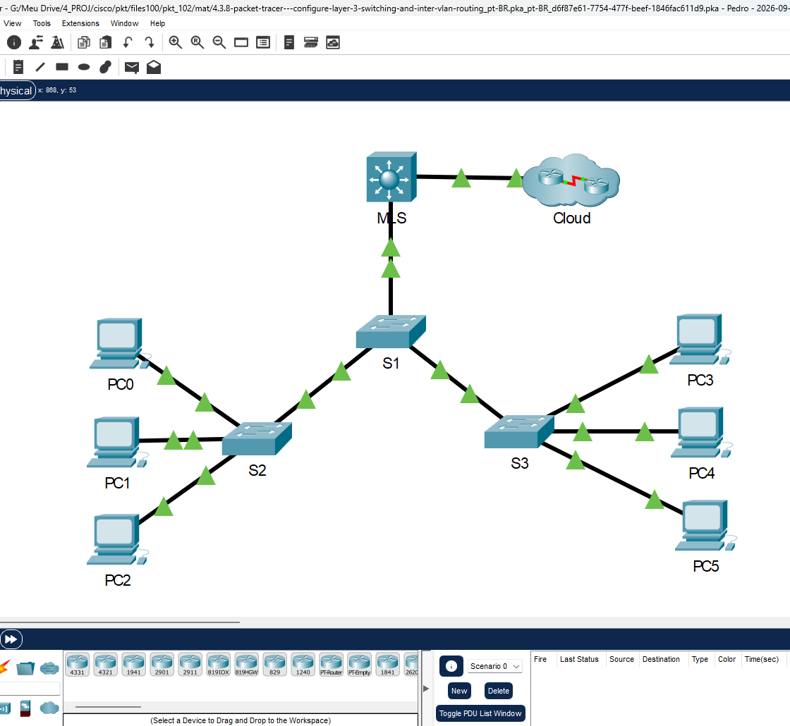
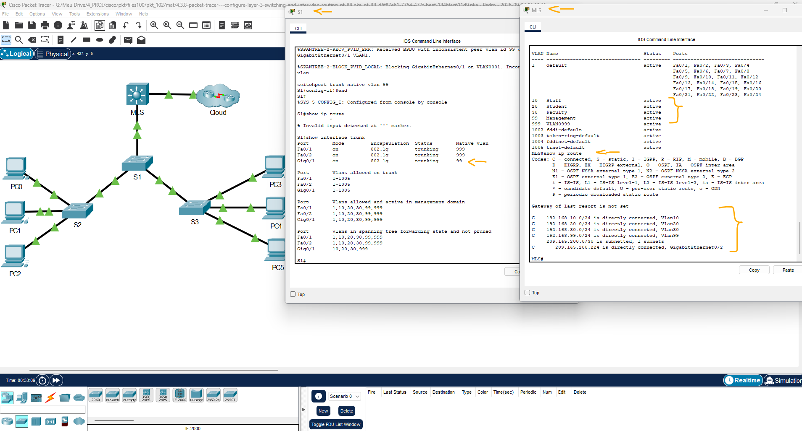
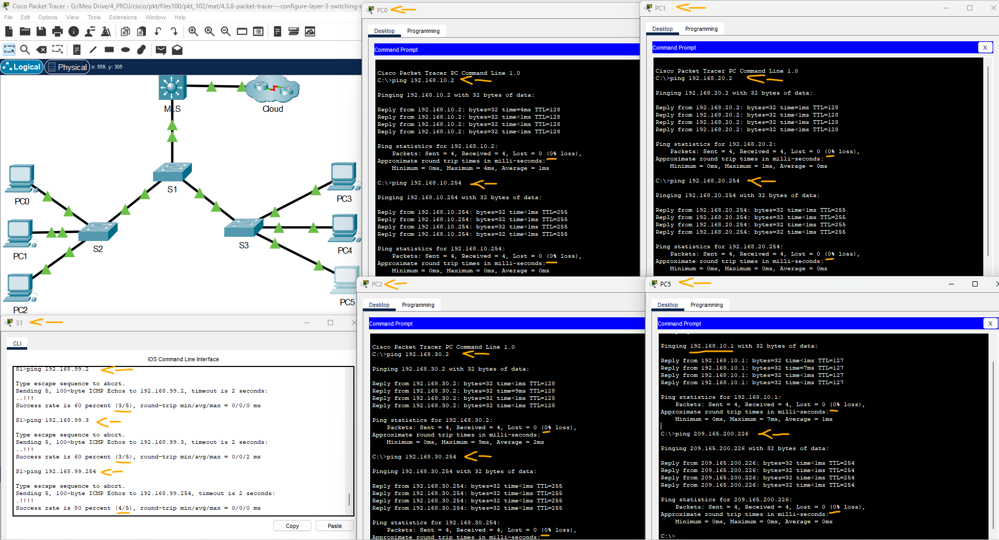
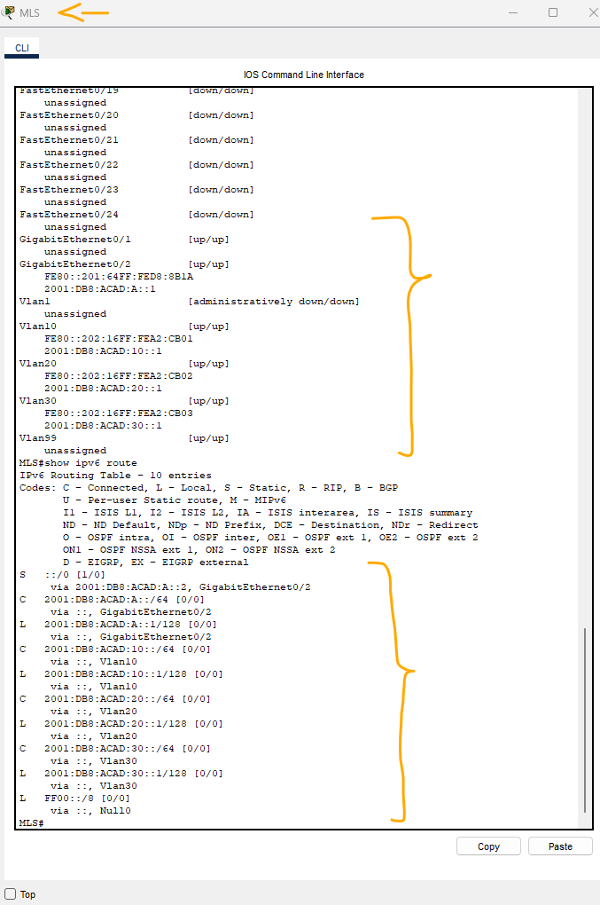
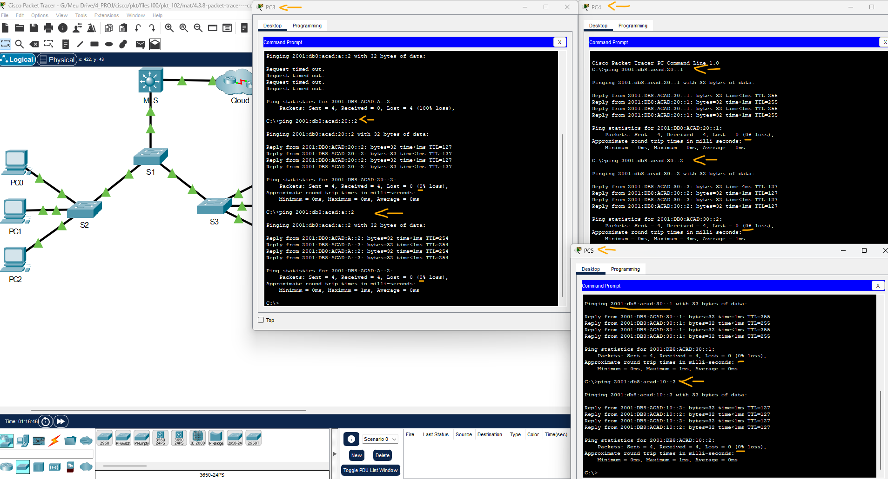

# Packet Tracer - Configurar comutação de camada 3 e roteamento entre VLANs   

### Cisco: <a href="../../../">cisco   </a>
### Cisco Networking Academy: cna   </a>
### Training Category: <a href="../../../pkt/">pkt</a>
### Software/Subject: network   </a>
### Course: <a href="./">pkt_102 (Packet Tracer - Configurar comutação de camada 3 e roteamento entre VLANs)   </a>

---

### Theme:
- Network

### Used Tools:
- Operating System (OS): 
  - Cisco Internetwork Operating System (Cisco IOS)   
  - Windows 11 
- Cloud Services:
  - Google Drive 
- Language:
  - HTML   
  - Markdown   
- Integrated Development Environment (IDE) and Text Editor:
  - Visual Studio Code (VS Code)   
- Versioning: 
  - Git   
- Repository:
  - GitHub   
- Network:
  - Cisco Packet Tracer   
  - ping   

---

<h3><a name="item00">Course Strcuture:</a></h3>

1. <a href="#item01">Parte 1: configuração do switching de camada 3</a> 
2. <a href="#item02">Parte 2: configuração do roteamento entre VLANs</a> 
  2.1 <a href="#item02.01">Etapa 1: Adicione VLANs.</a> 
  2.2 <a href="#item02.02">Etapa 2: Configure SVI em MLS.</a> 
  2.3 <a href="#item02.03">Etapa 3: Configure o entroncamento no MLS.</a> 
  2.4 <a href="#item02.04">Etapa 4: Configure o entroncamento em S1.</a> 
  2.5 <a href="#item02.05">Etapa 5: Ative o roteamento.</a> 
  2.6 <a href="#item02.06">Etapa 6: Verifique a conectividade fim a fim.</a> 
3. <a href="#item03">Parte 3: Configurar o roteamento IPv6 entre VLANs</a> 
  3.1 <a href="#item03.01">Etapa 1: Ative o roteamento IPv6.</a> 
  3.2 <a href="#item03.02">Etapa 2: Configure o SVI para IPv6 no MLS.</a> 
  3.3 <a href="#item03.03">Etapa 3: Configure o G0/2 com IPv6 em MLS.</a> 
  3.4 <a href="#item03.04">Etapa 4: Verifique a conectividade IPv6.</a> 

---

### Objective:
O objetivo desta atividade foi implementar o roteamento utilizando interfaces virtuais de switch (SVI) em um switch de camada 3, configurando uma porta roteada para comunicação com a Internet, além da criação e atribuição das VLANs às respectivas SVIs, com endereçamento IPv4 e IPv6. Também foi configurada a interface trunk no enlace entre o MLS e o S1, definindo a VLAN nativa e o método de encapsulamento do tronco. Por fim, foram realizados testes de conectividade entre os hosts, as SVIs e a nuvem, utilizando os protocolos IPv4 e IPv6.

### Folder Structure:
- [README.md](./README.md): Este documento de README, escrito em **Markdown**, com o conteúdo do laboratório.
- [0-aux](./0-aux/): Pasta auxiliar com imagens utilizadas na construção dos arquivos de README desse curso.

### Development:

<a name="item01"><h4>1. Parte 1: configuração do switching de camada 3</h4></a>[Back to summary](#item00)

A imagem 01 mostra a topologia inicial.

<figure>
     
    <figcaption>Imagem 01.</figcaption>
</figure>
 

Na Parte 1, você configurará a porta GigabitEthernet 0/2 no switch MLS como uma porta roteada e verificará se pode fazer o ping em outro endereço de camada 3.

- a. No MLS, configure G0/2 como uma porta roteada e atribua um endereço IP de acordo com a tabela de endereçamento.
  - `enable` -> `configure terminal`.
  - `interface g0/2` -> `no switchport` -> `ip address 209.165.200.225 255.255.255.252` -> `end`.
- b. Verifique a conectividade com a nuvem enviando um ping para 209.165.200.226.
  - `ping 209.165.200.226`.

<a name="item02"><h4>2. Parte 2: configuração do roteamento entre VLANs</h4></a>[Back to summary](#item00)

<a name="item02.01"><h4>2.1 Etapa 1: Adicione VLANs.</h4></a>[Back to summary](#item00)

- a. Adicione VLANs ao MLS de acordo com a tabela a seguir. A pontuação do Rastreador de Pacotes diferencia maiúsculas de minúsculas, então digite os nomes exatamente como mostrado.
  - `enable` -> `configure terminal`.
  - `vlan 10` -> `name Staff` -> `exit`.
  - `vlan 20` -> `name Student` -> `exit`.
  - `vlan 30` -> `name Faculty` -> `exit`.

<a name="item02.02"><h4>2.2 Etapa 2: Configure SVI em MLS.</h4></a>[Back to summary](#item00)

- a. Configure e ative as interfaces SVI para VLANs 10, 20, 30 e 99 de acordo com a Tabela de Endereçamento. A configuração para VLAN 10 é mostrada a seguir.
  - `interface vlan 10` -> `ip address 192.168.10.254 255.255.255.0` -> `no shutdown` -> `exit`.
  - `interface vlan 20` -> `ip address 192.168.20.254 255.255.255.0` -> `no shutdown` -> `exit`.
  - `interface vlan 30` -> `ip address 192.168.30.254 255.255.255.0` -> `no shutdown` -> `exit`.
  - `interface vlan 99` -> `ip address 192.168.99.254 255.255.255.0` -> `no shutdown` -> `exit`.

<a name="item02.03"><h4>2.3 Etapa 3: Configure o entroncamento no MLS.</h4></a>[Back to summary](#item00)

A configuração do tronco difere ligeiramente em um switch da Camada 3. No switch da Camada 3, a interface de entroncamento precisa ser encapsulada com o protocolo dot1q, no entanto, não é necessário especificar números de VLAN como estão ao trabalhar com um roteador e subinterfaces.

- a. No MLS, configure a interface g0/1.
  - `interface g0/1`.
- b. Torne a interface uma porta de tronco estática.
  - `switchport mode trunk`.
- c. Especifique a VLAN nativa como 99.
  - `switchport trunk native vlan 99`.
- d. Encapsular o link com o protocolo dot1q. Observação: O Rastreador de Pacotes pode não marcar o encapsulamento do tronco.
  - `switchport trunk encapsulation dot1q`.

<a name="item02.04"><h4>2.4 Etapa 4: Configure o entroncamento em S1.</h4></a>[Back to summary](#item00)

- a. Configure a interface g0/1 de S1 como um tronco estático.
  - `enable` -> `configure terminal`.
  - `interface g0/1`.
- b. Configure a VLAN nativa no tronco.
  - `switchport mode trunk`.
  - `switchport trunk native vlan 99`.

<a name="item02.05"><h4>2.5 Etapa 5: Ative o roteamento.</h4></a>[Back to summary](#item00)

- a. Use novamente o comando show ip route.
  - `end` -> `show ip route`.
- a. Há alguma rota ativa?
  - Não. A saída do comando show ip route não apresenta nenhuma rota ativa ou gateway padrão configurado no dispositivo.
- b. Insira o comando ip routing para ativar o roteamento em um modo de configuração global.
  - `configure terminal` -> `ip routing`.
- c. Use o comando show ip route para verificar se o roteamento está ativado.
  - `end` -> `show ip route`.

A imagem 02 evidencia a criação das VLANs e a configuração das respectivas SVIs no MLS, além da configuração da interface trunk no enlace entre o MLS e o S1, com a definição da VLAN nativa e do método de encapsulamento. Além disso, o roteamento IPv4 no MLS é ativado, e as rotas na tabela de roteamento são exibidas.

<figure>
     
    <figcaption>Imagem 02.</figcaption>
</figure>
 

<a name="item02.06"><h4>2.6 Etapa 6: Verifique a conectividade fim a fim.</h4></a>[Back to summary](#item00)

- a. De PC0, faça o ping de PC3 ou MLS para verificar a conectividade na VLAN 10.
  - PC3: `ping 192.168.10.2`.
  - MLS - VLAN 10: `ping 192.168.10.254`.
- b. De PC1, faça o ping de PC4 ou MLS para verificar a conectividade na VLAN 20.
  - PC4: `ping 192.168.20.2`.
  - MLS - VLAN 20: `ping 192.168.20.254`.
- c. De PC2, faça o ping de PC5 ou MLS para verificar a conectividade na VLAN 30.
  - PC5: `ping 192.168.30.2`.
  - MLS - VLAN 30: `ping 192.168.30.254`.
- d. De S1, faça o ping do S2, S3 ou MLS para verificar a conectividade com a VLAN 99.
  - S2: `ping 192.168.99.2`.
  - S3: `ping 192.168.99.3`.
  - MLS - VLAN 99: `ping 192.168.99.254`.
- e. Para verificar o roteamento entre VLANs, faça o ping dos dispositivos fora da VLAN do remetente.
  - PC5-PC0: `ping 192.168.10.1`.
- f. Em qualquer dispositivo, execute ping neste endereço dentro da Nuvem, 209.165.200.226. O switch de camada 3 agora está roteando entre VLANs e fornecendo conectividade roteada para a nuvem.
  - `ping 209.165.200.226`.

A imagem 03 exibe os testes de conectividade realizados, todos concluídos com sucesso, demonstrando que os dispositivos em VLANs distintas conseguiam se comunicar entre si e também com a nuvem.

<figure>
     
    <figcaption>Imagem 03.</figcaption>
</figure>
 

<a name="item03"><h4>3. Parte 3: Configurar o roteamento IPv6 entre VLANs</h4></a>[Back to summary](#item00)

Os switches de camada 3 também roteiam entre redes IPv6.

<a name="item03.01"><h4>3.1 Etapa 1: Ative o roteamento IPv6.</h4></a>[Back to summary](#item00)

- a. Digite o comando ipv6 unicast-routing para ativar o roteamento IPv6 no modo de configuração global.
  - `ipv6 unicast-routing`.

<a name="item03.02"><h4>3.2 Etapa 2: Configure o SVI para IPv6 no MLS.</h4></a>[Back to summary](#item00)

- a. Configure o endereçamento IPv6 no SVI para VLANs 10, 20 e 30, de acordo com a Tabela de Endereçamento. A configuração para VLAN 10 é mostrada a seguir.
  - `interface vlan 10` -> `ipv6 address 2001:db8:acad:10::1/64` -> `exit`.
  - `interface vlan 20` -> `ipv6 address 2001:db8:acad:20::1/64` -> `exit`.
  - `interface vlan 30` -> `ipv6 address 2001:db8:acad:30::1/64` -> `exit`.

<a name="item03.03"><h4>3.3 Etapa 3: Configure o G0/2 com IPv6 em MLS.</h4></a>[Back to summary](#item00)

- a. Configure o endereçamento IPv6 no G0/2.
  - `interface g0/2` -> `ipv6 address 2001:db8:acad:a::1/64` -> `end`.
  - `interface g0/2` -> `no ipv6 address 2001:db8:acad::1/64` -> `end`.
- b. Use o comando show ipv6 route para verificar as redes conectadas IPv6.
  - `show ipv6 route`.

A imagem 04 apresenta as configurações das SVIs, com seus respectivos endereços IPv6 e VLANs associadas, além da tabela de roteamento do MLS, que exibe as rotas para as redes IPv6 diretamente conectadas às respectivas SVIs.

<figure>
     
    <figcaption>Imagem 04.</figcaption>
</figure>
 

<a name="item03.04"><h4>3.4 Etapa 4: Verifique a conectividade IPv6.</h4></a>[Back to summary](#item00)

Os dispositivos PC3, PC4 e PC5 foram configurados com endereços IPv6. Verifique o roteamento IPv6 Inter-VLAN e a conectividade com a Nuvem.

- a. No PC0, execute ping no PC3 ou no MLS para verificar a conectividade na VLAN 10.
  - PC3: `ping 2001:db8:acad:10::2`.
  - MLS - VLAN 10: `ping 2001:db8:acad:10::1`.
  - Aqui, os testes não serão bem-sucedidos, pois o PC0 foi configurado somente com endereçamento IPv4, assim como os PCs 1 e 2. Os únicos hosts configurados com endereçamento IPv6 são os PCs 3, 4 e 5. Dessa forma, o PC0 não possui um endereço IPv6 na VLAN 10 para realizar os testes de conectividade IPv6 propostos pela atividade.
- b. No PC4, execute ping no MLS para verificar a conectividade na VLAN 20. 
  - MLS - VLAN 20: `ping 2001:db8:acad:20::1`.
- c. No PC5, execute ping no MLS para verificar a conectividade na VLAN 30. 
  - MLS - VLAN 30: `ping 2001:db8:acad:30::1`.
- d. Para verificar o roteamento entre VLAN, faça ping entre dispositivos PC3, PC4 e PC5.
  - PC3-P4: `ping 2001:db8:acad:20::2`.
  - PC4-P5: `ping 2001:db8:acad:30::2`.
  - PC5-P6: `ping 2001:db8:acad:10::2`.
- e. A partir do PC3, ping o endereço dentro da nuvem, 2001:db8:acad:a::2.
  - `ping 2001:db8:acad:a::2`.

A imagem 05 exibe todos os testes de conectividade IPv6 realizados com sucesso, comprovando a comunicação entre dispositivos de diferentes VLANs e também com a nuvem.

<figure>
     
    <figcaption>Imagem 05.</figcaption>
</figure>
 