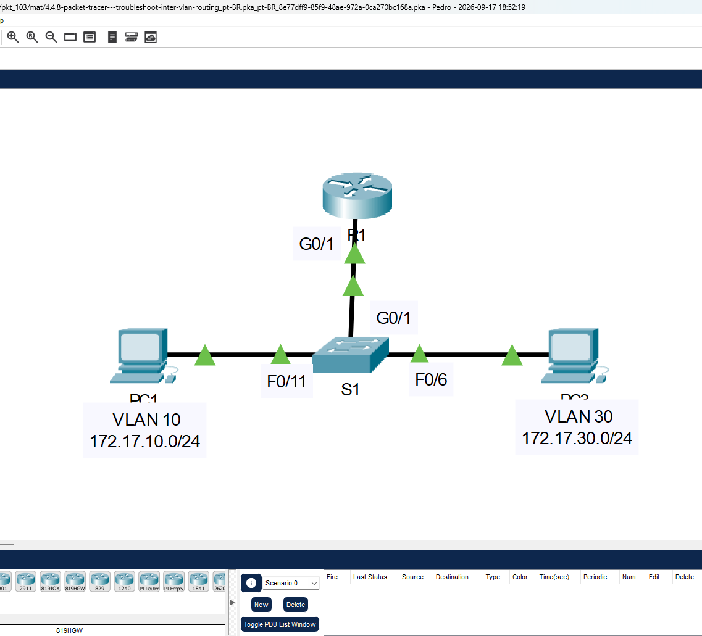
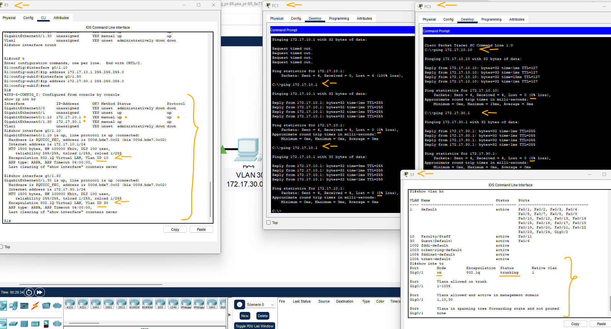

# Packet Tracer - Pesquise defeitos o roteamento Inter-VLAN   

### Cisco: <a href="../../../">cisco   </a>
### Cisco Networking Academy: cna   </a>
### Training Category: <a href="../../../pkt/">pkt</a>
### Software/Subject: network   </a>
### Course: <a href="./">pkt_103 (Packet Tracer - Pesquise defeitos o roteamento Inter-VLAN)   </a>

---

### Theme:
- Network

### Used Tools:
- Operating System (OS): 
  - Cisco Internetwork Operating System (Cisco IOS)   
  - Windows 11 
- Cloud Services:
  - Google Drive 
- Language:
  - HTML   
  - Markdown   
- Integrated Development Environment (IDE) and Text Editor:
  - Visual Studio Code (VS Code)   
- Versioning: 
  - Git   
- Repository:
  - GitHub   
- Network:
  - Cisco Packet Tracer   
  - ping   

---

<h3><a name="item00">Course Strcuture:</a></h3>

1. <a href="#item01">Parte 1: Identificar os problemas da rede</a> 
2. <a href="#item02">Parte 2: Implementar a solução</a> 
3. <a href="#item03">Parte 3: Verificar a conectividade</a> 

---

### Objective:
Esta atividade teve como objetivo realizar o troubleshooting em uma pequena rede composta por quatro dispositivos, com foco no roteamento inter-VLAN utilizando o método Router-on-a-Stick. Foram identificados e corrigidos problemas relacionados às subinterfaces do roteador, à configuração da interface trunk no switch e ao gateway padrão de um dos hosts.

### Folder Structure:
- [README.md](./README.md): Este documento de README, escrito em **Markdown**, com o conteúdo do laboratório.
- [0-aux](./0-aux/): Pasta auxiliar com imagens utilizadas na construção dos arquivos de README desse curso.

### Development:

<a name="item01"><h4>1. Parte 1: Identificar os problemas da rede</h4></a>[Back to summary](#item00)

A imagem 01 mostra a topologia inicial.

<figure>
     
    <figcaption>Imagem 01.</figcaption>
</figure>
 

- a. Examine a rede e localize a fonte dos problemas de conectividade. Os comandos que você pode achar úteis incluem: 
  - `show ip interface brief` -> `show interface g0/1.10` -> `show interface g0/1.30` -> `show interface trunk`.
- b. Teste a conectividade e use os comandos show necessários para verificar as configurações.  
  - PC1: `ping 172.17.30.10` -> `ping 172.17.10.1`.
  - PC3: `ping 172.17.10.10` -> `ping 172.17.30.1`.
- c. Verifique se todas as configurações configuradas correspondem aos requisitos mostrados na Tabela de Endereçamento.
- d. Liste todos os problemas e possíveis soluções na Tabela de Documentação.
  - 

#### Tabela 1 — Problemas Encontrados

| Número | Local |                      Problema                      |
|:------:|:-----:|:--------------------------------------------------:|
| 1      | PC3   | Default Gateway com IP Errado                      |
| 2      | R1    | Subinterface G0/1.10 desativada                    |
| 3      | R1    | Subinterfaces G0/1.10 e G0/1.30 com VLANs trocadas |
| 4      | R1    | Subinterfaces sem endereçamento IPv4               |
| 5      | S1    | Interface trunk não configurada no enlace com R1   |

<a name="item02"><h4>2. Parte 2: Implementar a solução</h4></a>[Back to summary](#item00)

- a. Implemente suas soluções recomendadas.
  - 1 - IP do Default Gateway alterado de 172.17.10.1 para 172.17.30.1.
  - 2 - Ativar a subinterface G0/1.10: `enable` -> `configure terminal` -> `interface g0/1.10` -> 
  - 3 - Trocar VLAN da interface G0/1.10 de VLAN 30 para VLAN 10: `interface g0/1.10` -> `no encapsulation dot1q 30` -> `encapsulation dot1q 10` -> `exit`.
  - 3 - Trocar VLAN da interface G0/1.30 de VLAN 10 para VLAN 30: `interface g0/1.30` -> `no encapsulation dot1q 10` -> `encapsulation dot1q 30` -> `exit`.
  - 4 - Atribuir endereçamento IPv4 as interfaces: `interface g0/1.10` -> `ip address 172.17.10.1 255.255.255.0` -> `exit`.
  - 4 - Atribuir endereçamento IPv4 as interfaces: `interface g0/1.30` -> `ip address 172.17.30.1 255.255.255.0` -> `exit`.
  - 5 - Configurar a interface trunk do S1 com R1: `enable` -> `configure terminal` -> `interface g0/1` -> `switchport mode trunk` -> `exit`.

<a name="item03"><h4>3. Parte 3: Verificar a conectividade</h4></a>[Back to summary](#item00)

- a. Verifique se os PCs podem executar ping um no outro e R1. Se isso não acontecer, continue a identificar e solucionar problemas até que os pings tenham êxito.
  - PC1: `ping 172.17.30.10` -> `ping 172.17.10.1`.
  - PC3: `ping 172.17.10.10` -> `ping 172.17.30.1`.

A imagem 02 apresenta a execução de todas as configurações necessárias para corrigir os problemas identificados, comprovando também que os hosts conseguiam se comunicar entre VLANs distintas por meio do roteamento realizado pelo roteador.

<figure>
     
    <figcaption>Imagem 02.</figcaption>
</figure>
 