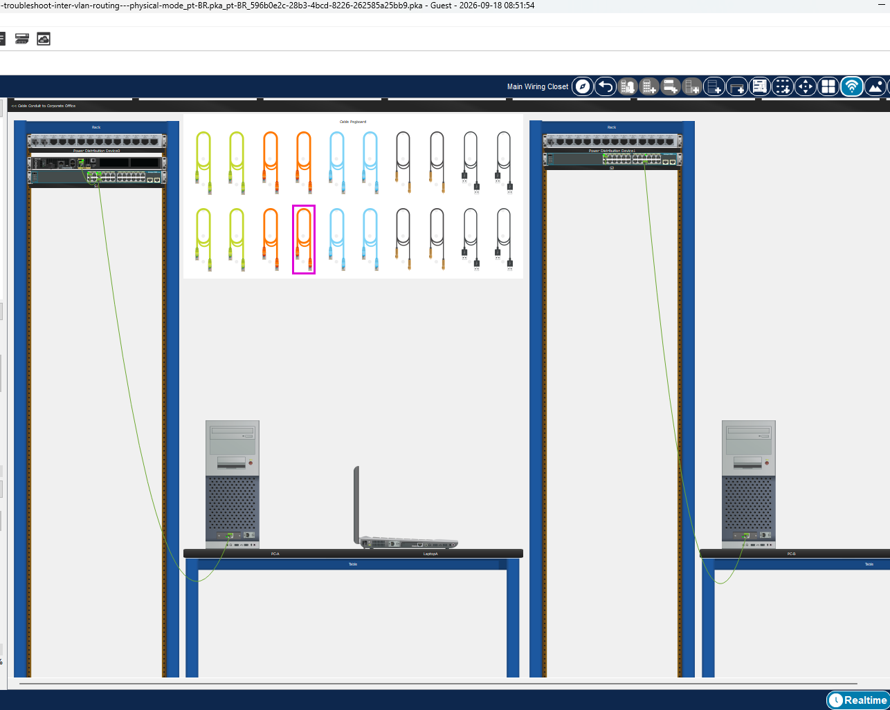
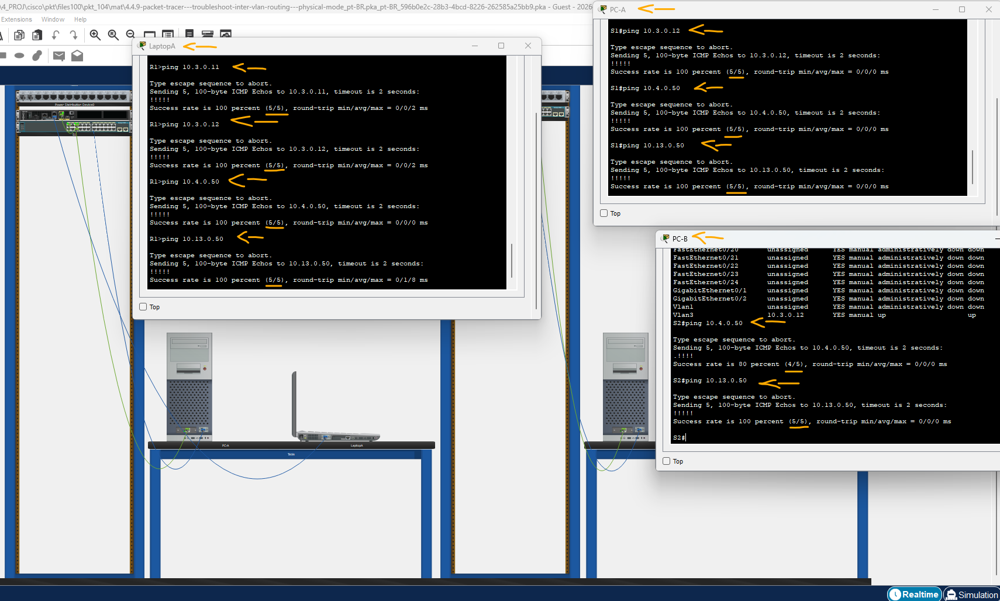

# Packet Tracer - Solucionar Problemas de Roteamento Inter-VLAN – Modo Físico   

### Cisco: <a href="../../../">cisco   </a>
### Cisco Networking Academy: cna   </a>
### Training Category: <a href="../../../pkt/">pkt</a>
### Software/Subject: network   </a>
### Course: <a href="./">pkt_104 (Packet Tracer - Solucionar Problemas de Roteamento Inter-VLAN – Modo Físico)   </a>

---

### Theme:
- Network

### Used Tools:
- Operating System (OS): 
  - Cisco Internetwork Operating System (Cisco IOS)   
  - Windows 11 
- Cloud Services:
  - Google Drive 
- Language:
  - HTML   
  - Markdown   
- Integrated Development Environment (IDE) and Text Editor:
  - Visual Studio Code (VS Code)   
- Versioning: 
  - Git   
- Repository:
  - GitHub   
- Network:
  - Cisco Packet Tracer   
  - ping   

---

<h3><a name="item00">Course Strcuture:</a></h3>

1. <a href="#item01">Parte 1: Avaliar a operação da rede</a> 
2. <a href="#item02">Parte 2: Reúna Informações, Crie um Plano de Ação e Implemente Correções</a> 

---

### Objective:
Esta atividade teve como objetivo realizar o troubleshooting de uma pequena rede que utilizava o roteamento entre VLANs pelo método Router-on-a-Stick, executando testes de conectividade para identificar os problemas existentes e, posteriormente, elaborar e executar um plano de ação para corrigi-los.

### Folder Structure:
- [README.md](./README.md): Este documento de README, escrito em **Markdown**, com o conteúdo do laboratório.
- [0-aux](./0-aux/): Pasta auxiliar com imagens utilizadas na construção dos arquivos de README desse curso.

### Development:

<a name="item01"><h4>1. Parte 1: Avaliar a operação da rede</h4></a>[Back to summary](#item00)

A imagem 01 mostra a topologia inicial.

<figure>
     
    <figcaption>Imagem 01.</figcaption>
</figure>
 

- Requisitos: 
  - Nenhum tráfego VLAN 7 é permitido nos troncos porque não há dispositivos na VLAN 7.
  - A VLAN 8 é a VLAN nativa.
  - Todos os troncos são estáticos.
  - Conectividade End to End.

- a. Use o computador portátil e o cabo apropriado para consolar nos dispositivos de rede para fins de teste e configuração. A senha do início de uma sessão em todos os dispositivos de rede é “cisco” e a senha da possibilidade é “class”. Você pode clicar e arrastar a conexão do console da porta do console de um dispositivo para outro, mas você terá que iniciar uma nova sessão de terminal.
  - `cisco` -> `enable` -> `class`.
b. Use o comando ping para testar os seguintes critérios e registrar os resultados na tabela abaixo.

#### Tabela 1 — Teste de Conectividade

| Ordem | Origem |     Destino     |         Comando        |   Status    |
|:-----:|:------:|:---------------:|:----------------------:|:-----------:|
| 1     | R1     | S1 VLAN 3       | `ping 10.3.0.11`       | Inacessível |
| 2     | R1     | S2 VLAN 3       | `ping 10.3.0.12`       | Inacessível |
| 3     | R1     | PC-A            | `ping 10.4.0.50`       | Inacessível |
| 4     | R1     | PC-B            | `ping 10.13.0.50`      | Inacessível |
| 5     | S1     | S2 VLAN 3       | `ping 10.3.0.12`       | Inacessível |
| 6     | S1     | PC-A            | `ping 10.4.0.50`       | Inacessível |
| 7     | S1     | PC-B            | `ping 10.13.0.50`      | Inacessível |
| 8     | S2     | PC-A            | `ping 10.4.0.50`       | Inacessível |
| 9     | S2     | PC-B            | `ping 10.13.0.50`      | Inacessível |

<a name="item02"><h4>2. Parte 2: Reúna Informações, Crie um Plano de Ação e Implemente Correções</h4></a>[Back to summary](#item00)

- a. Para cada requisito que não seja atingido, colete informações examinando a configuração em execução e as tabelas de roteamento para desenvolver uma hipótese para o que está causando o mau funcionamento. 

#### Tabela 2 — Problemas Encontrados

| Número | Local |                                              Problema                                              |
|:------:|:-----:|:--------------------------------------------------------------------------------------------------:|
| 1      | S1    | A interface F0/5, utilizada no enlace trunk com o R1, não estava configurada como trunk.           |
| 2      | S1    | A VLAN nativa configurada na interface F0/1, utilizada no enlace trunk com o S2, estava incorreta. |
| 3      | S1    | Ao alterar a interface f0/5 de access para trunk, todas as VLANs foram permitidas por padrão.      |
| 4      | S1    | A VLAN 13 não estava criada no S1.                                                                 |
| 5      | R1    | A VLAN 8 não estava configurada como VLAN nativa na subinterface correspondente do roteador.       |
| 6      | S2    | As VLANs 3 e 13 não estavam incluídas na lista de VLANs permitidas no enlace trunk do S2.          |
| 7      | S2    | A SVI da VLAN 3 estava administrativamente desativada.                                             |

- b. Crie um plano de ação que você acha que resolverá o problema. Desenvolva uma lista de todos os comandos que pretende emitir para corrigir o problema e uma lista de todos os comandos necessários para reverter a configuração, caso o seu plano de ação não consiga corrigir o problema.
- b. Dica: Se você precisar redefinir uma configuração de comutação para a configuração padrão, use os comandos default interface interface name. Como exemplo para F0/10: default interface f0/10.
- c. Execute seus planos de ação um de cada vez para cada critério que falha e registre as ações de correção. 
  - 1 - Configurar a interface trunk no enlace com R1: `configure terminal` -> `interface f0/5` -> `switchport mode trunk` -> `switchport trunk native vlan 8` -> `exit`.
  - 2 - Corrigir a VLAN nativa da interface trunk no enlace com S2: `interface f0/1` -> `switchport trunk native vlan 8` -> `exit`.
  - 3 - Corrigir a lista de VLANs permitidas no enlace trunk com R1: `interface f0/1` -> `switchport trunk allowed vlan 3,4,7,8,13` -> `exit`.
  - 4 - Criar a VLAN 13 no S1: `vlan 13` -> `name Maintenance` -> `exit`.
  - 5 - Configurar a VLAN 8 como VLAN nativa na interface do roteador: `interface g0/0/1.8` -> `encapsulation dot1q 8 native` -> `exit`.
  - 6 - Adicionar as VLANs 3 e 13 como VLANs permitidas no enlace trunk do S2: `interface f0/1` -> `switchport trunk allowed vlan add 3` -> `switchport trunk allowed vlan add 13` -> `exit`.
  - 7 - Ativar a SVI da VLAN 3 no S2: `interface vlan 3` -> `no shutdown` -> `exit`.

A imagem 02 demonstra que, após a execução das ações previstas no plano de ação, todos os testes de conectividade que anteriormente haviam falhado foram realizados com sucesso, comprovando que os dispositivos da rede, mesmo pertencentes a VLANs distintas, conseguiram se comunicar.

<figure>
     
    <figcaption>Imagem 02.</figcaption>
</figure>
 