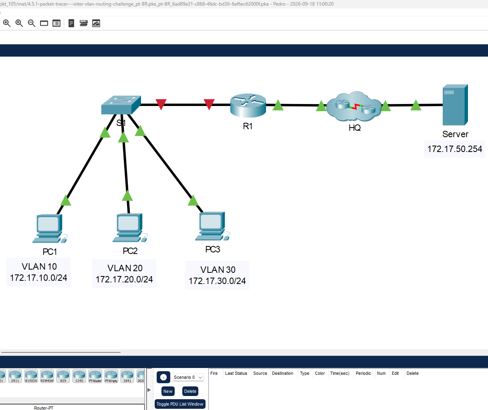
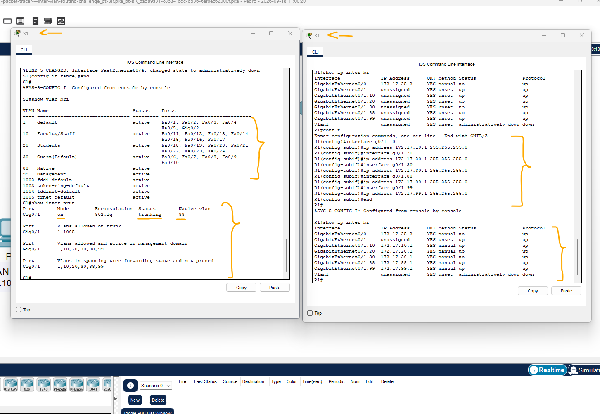
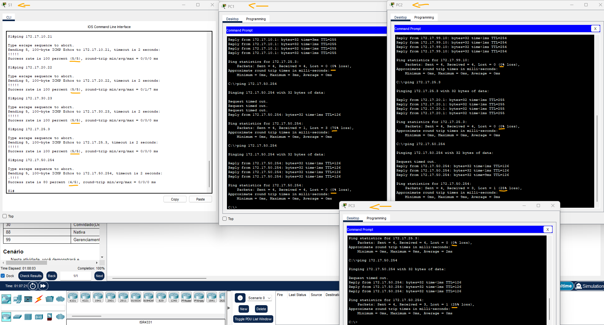

# Packet Tracer - Desafio do roteamento entre VLANs   

### Cisco: <a href="../../../">cisco   </a>
### Cisco Networking Academy: cna   </a>
### Training Category: <a href="../../../pkt/">pkt</a>
### Software/Subject: network   </a>
### Course: <a href="./">pkt_105 (Packet Tracer - Desafio do roteamento entre VLANs)   </a>

---

### Theme:
- Network

### Used Tools:
- Operating System (OS): 
  - Cisco Internetwork Operating System (Cisco IOS)   
  - Windows 11 
- Cloud Services:
  - Google Drive 
- Language:
  - HTML   
  - Markdown   
- Integrated Development Environment (IDE) and Text Editor:
  - Visual Studio Code (VS Code)   
- Versioning: 
  - Git   
- Repository:
  - GitHub   
- Network:
  - Cisco Packet Tracer   
  - ping   

---

<h3><a name="item00">Course Strcuture:</a></h3>

1. <a href="#item01">Desafio do roteamento entre VLANs</a> 

---

### Objective:
O objetivo desta atividade de desafio foi implementar o roteamento entre VLANs utilizando o método Router-on-a-Stick, criando as VLANs e atribuindo-as às respectivas interfaces, configurando o enlace trunk e criando e configurando as subinterfaces do roteador com seus respectivos endereços IP. Por fim, foram realizados testes de conectividade entre todos os dispositivos para validar a comunicação entre hosts de diferentes VLANs e com o servidor.

### Folder Structure:
- [README.md](./README.md): Este documento de README, escrito em **Markdown**, com o conteúdo do laboratório.
- [0-aux](./0-aux/): Pasta auxiliar com imagens utilizadas na construção dos arquivos de README desse curso.

### Development:

<a name="item01"><h4>1. Desafio do roteamento entre VLANs</h4></a>[Back to summary](#item00)

A imagem 01 mostra a topologia inicial.

<figure>
     
    <figcaption>Imagem 01.</figcaption>
</figure>
 

Cenário: Nesta atividade, você demonstrará e reforçará sua capacidade de implementar o roteamento entre VLANs, incluindo a configuração de endereços IP, VLANs, entroncamento e subinterfaces. 

Instruções: Configure os dispositivos para atender aos seguintes requisitos:
  - a. Atribua o endereçamento IP a R1 e S1 com base na Tabela de Endereçamento. Obs>: Fazer o item f antes desse.
    - `enable` -> `configure terminal`.
    - R1: `interface g0/0` -> `ip address 172.17.25.2 255.255.255.252` -> `no shutdown` -> `exit`.
    - R1: `interface g0/1` -> `no shutdown` -> `exit`.
    - R1: `interface g0/1.10` -> `ip address 172.17.10.1 255.255.255.0` -> `exit`.
    - R1: `interface g0/1.20` -> `ip address 172.17.20.1 255.255.255.0` -> `exit`.
    - R1: `interface g0/1.30` -> `ip address 172.17.30.1 255.255.255.0` -> `exit`.
    - R1: `interface g0/1.88` -> `ip address 172.17.88.1 255.255.255.0` -> `exit`.
    - R1: `interface g0/1.99` -> `ip address 172.17.99.1 255.255.255.0` -> `exit`.
    - S1: `interface vlan 99` -> `ip address 172.17.99.10 255.255.255.0` -> `no shutdown` -> `exit`.
  - b. Configurar o gateway padrão em S1.
    - S1: `ip default-gateway 172.17.99.1`.
  - c. Crie, nomeie e atribua VLANs em S1 com base na Tabela de VLAN e atribuições de porta. As portas devem estar no modo de acesso. Seus nomes de VLAN devem corresponder exatamente aos nomes na tabela.
    - S1: `vlan 10` -> `name Faculty/Staff` -> `exit` -> `interface range f0/11-17` -> `switchport mode access` -> `switchport access vlan 10` -> `exit`.
    - S1: `vlan 20` -> `name Students` -> `exit` -> `interface range f0/18-24` -> `switchport mode access` -> `switchport access vlan 20` -> `exit`.
    - S1: `vlan 30` -> `name Guest(Default)` -> `exit` -> `interface range f0/6-10` -> `switchport mode access` -> `switchport access vlan 30` -> `exit`.
    - S1: `vlan 88` -> `name Native` -> `exit`.
    - S1: `vlan 99` -> `name Management` -> `exit`.
  - d. Configure o G0/1 de S1 como um tronco estático e atribua a VLAN nativa.
    - S1: `interface g0/1` -> `switchport mode trunk` -> `switchport trunk native vlan 88` -> `exit`.
  - e. Todas as portas não atribuídas a VLANs devem ser desativadas.
    - S1: `interface range f0/1-5,g0/2` -> `shutdown` -> `exit`.
  - f. Configure o roteamento entre VLANs em R1 com base na Tabela de Endereçamento.
    - R1: `interface g0/1.10` -> `encapsulation dot1q 10` -> `exit`.
    - R1: `interface g0/1.20` -> `encapsulation dot1q 20` -> `exit`.
    - R1: `interface g0/1.30` -> `encapsulation dot1q 30` -> `exit`.
    - R1: `interface g0/1.88` -> `encapsulation dot1q 88 native` -> `exit`.
    - R1: `interface g0/1.99` -> `encapsulation dot1q 99` -> `exit`.
  - g. Verifique a conectividade. R1, S1 e todos os PCs devem ser capazes de executar ping uns para os outros e para o servidor cisco.pka.

#### Tabela 1 — Teste de Conectividade

| Ordem | Origem | VLAN | PC1                 | PC2                 | PC3                 | S1 (SVI)            | R1 (G0/0)          | Servidor            |
|:-----:|:------:|:----:|:-------------------:|:-------------------:|:-------------------:|:-------------------:|:------------------:|:-------------------:|
| 1     | PC1    | 10   | -                   | `ping 172.17.20.22` | `ping 172.17.30.23` | `ping 172.17.99.10` | `ping 172.17.25.3` | `ping 172.17.50.254`|
| 2     | PC2    | 20   | `ping 172.17.10.21` | -                   | `ping 172.17.30.23` | `ping 172.17.99.10` | `ping 172.17.25.3` | `ping 172.17.50.254`|
| 3     | PC3    | 30   | `ping 172.17.10.21` | `ping 172.17.20.22` | -                   | `ping 172.17.99.10` | `ping 172.17.25.3` | `ping 172.17.50.254`|
| 4     | S1-SVI | 99   | `ping 172.17.10.21` | `ping 172.17.20.22` | `ping 172.17.30.23` | -                   | `ping 172.17.25.3` | `ping 172.17.50.254`|

A imagem 02 apresenta as configurações realizadas no switch e no roteador, comprovando a criação das VLANs e sua atribuição às respectivas portas, a configuração do enlace trunk e das subinterfaces no roteador.

<figure>
     
    <figcaption>Imagem 02.</figcaption>
</figure>
 

A imagem 03 evidencia que os testes de conectividade entre os dispositivos de diferentes VLANs e o servidor foram realizados com sucesso.

<figure>
     
    <figcaption>Imagem 03.</figcaption>
</figure>
 