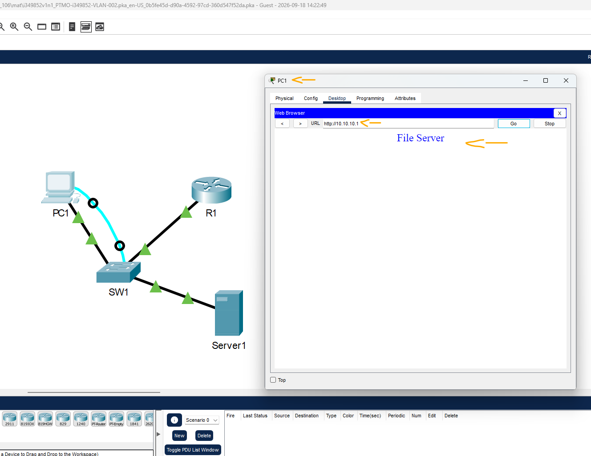

# CCNA: SRWE - Módulo 4 - Exam - Q7   

### Cisco: <a href="../../../">cisco   </a>
### Cisco Networking Academy: cna   </a>
### Training Category: <a href="../../../pkt/">pkt</a>
### Software/Subject: network   </a>
### Course: <a href="./">pkt_106 (CCNA: SRWE - Módulo 4 - Exam - Q7)   </a>

---

### Theme:
- Network

### Used Tools:
- Operating System (OS): 
  - Cisco Internetwork Operating System (Cisco IOS)   
  - Windows 11 
- Cloud Services:
  - Google Drive 
- Language:
  - HTML   
  - Markdown   
- Integrated Development Environment (IDE) and Text Editor:
  - Visual Studio Code (VS Code)   
- Versioning: 
  - Git   
- Repository:
  - GitHub   
- Network:
  - Cisco Packet Tracer   

---

<h3><a name="item00">Course Strcuture:</a></h3>

1. <a href="#item01">CCNA: SRWE - Módulo 4 - Exam - Q7</a> 

---

### Objective:
O objetivo deste PTSA foi corrigir a configuração do enlace entre o S1 e o roteador, alterando-o do modo de acesso para o modo trunk, a fim de permitir o roteamento entre VLANs e possibilitar o acesso do PC ao site hospedado no servidor.

### Folder Structure:
- [README.md](./README.md): Este documento de README, escrito em **Markdown**, com o conteúdo do laboratório.
- [0-aux](./0-aux/): Pasta auxiliar com imagens utilizadas na construção dos arquivos de README desse curso.

### Development:

<a name="item01"><h4>1. CCNA: SRWE - Módulo 4 - Exam - Q7</h4></a>[Back to summary](#item00)

O PC1 está na VLAN 5 e conectado à interface FastEthernet 0/5 do switch SW1. O Server1 está na VLAN 10 e conectado à interface FastEthernet 0/10 do switch SW1. A interface GigabitEthernet 0/0/0 do roteador R1 está conectada à interface GigabitEthernet 0/1 do switch SW1.

- a. Abra o aplicativo Terminal no PC1 para acessar o switch SW1 e examinar a configuração do SW1. Execute o comando de configuração de interface apropriado no switch SW1 para habilitar a comunicação entre o PC1 e o Server1.
  - `show interface trunk`.
  - `enable` -> `configure terminal` -> `interface g0/1` -> `switchport mode trunk` -> `end`.
- a. Qual mensagem é exibida quando 10.10.10.1 é inserido na barra de endereços do navegador da Web do PC1?
  - Ao inserir o endereço `10.10.10.1` na barra de endereços do navegador do PC1, é exibida a mensagem "File Server", conforme apresentado na imagem 01.

<figure>
     
    <figcaption>Imagem 01.</figcaption>
</figure>
 