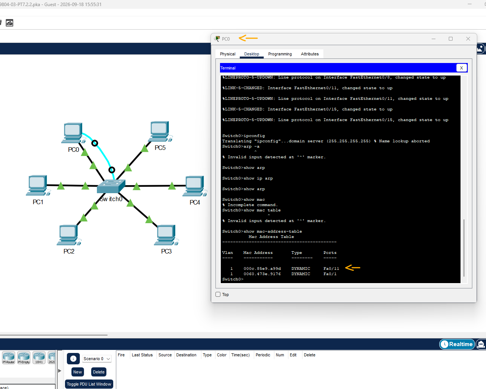

# CCNA: ITN - Módulo 7 - Exam - Q30   

### Cisco: <a href="../../../">cisco   </a>
### Cisco Networking Academy: cna   </a>
### Training Category: <a href="../../../pkt/">pkt</a>
### Software/Subject: network   </a>
### Course: <a href="./">pkt_108 (CCNA: ITN - Módulo 7 - Exam - Q30)   </a>

---

### Theme:
- Network

### Used Tools:
- Operating System (OS): 
  - Cisco Internetwork Operating System (Cisco IOS)   
  - Windows 11 
- Cloud Services:
  - Google Drive 
- Language:
  - HTML   
  - Markdown   
- Integrated Development Environment (IDE) and Text Editor:
  - Visual Studio Code (VS Code)   
- Versioning: 
  - Git   
- Repository:
  - GitHub   
- Network:
  - Cisco Packet Tracer   
  - ping   

---

<h3><a name="item00">Course Strcuture:</a></h3>

1. <a href="#item01">CCNA: ITN - Módulo 7 - Exam - Q30</a> 

---

### Objective:
O objetivo deste PTSA foi utilizar a tabela de endereços MAC do switch para identificar a porta física pela qual o quadro é encaminhado ao destino, bem como determinar o endereço MAC correspondente ao dispositivo de destino.

### Folder Structure:
- [README.md](./README.md): Este documento de README, escrito em **Markdown**, com o conteúdo do laboratório.
- [0-aux](./0-aux/): Pasta auxiliar com imagens utilizadas na construção dos arquivos de README desse curso.

### Development:

<a name="item01"><h4>1. CCNA: ITN - Módulo 7 - Exam - Q30</h4></a>[Back to summary](#item00)

- a. Abra a área de trabalho PC0. Use a Linha de Comando para determinar o endereço IPv4 e o endereço MAC do PC0. Na linha de comando PC0, execute ping no endereço IPv4 10.1.1.5. Use o aplicativo Terminal no PC0 para acessar o Switch0 e examinar a tabela de endereços MAC.
  - `ipconfig /all` -> `ping 10.1.1.5` -> `show mac-address-table`.
  - O endereço IPv4 do PC0 é 10.1.1.1 e seu endereço MAC é 0060.473E.9176.
- a. Qual porta o Switch0 usa para enviar quadros para o host com o endereço IPv4 10.1.1.5?
  - O Switch0 utiliza a interface Fa0/11 para encaminhar quadros destinados ao host com o endereço IPv4 10.1.1.5, conforme indicado na tabela de endereços MAC.

A imagem 01 apresenta a tabela de endereços MAC, contendo os registros correspondentes ao PC0 e ao host de destino.

<figure>
     
    <figcaption>Imagem 01.</figcaption>
</figure>
 