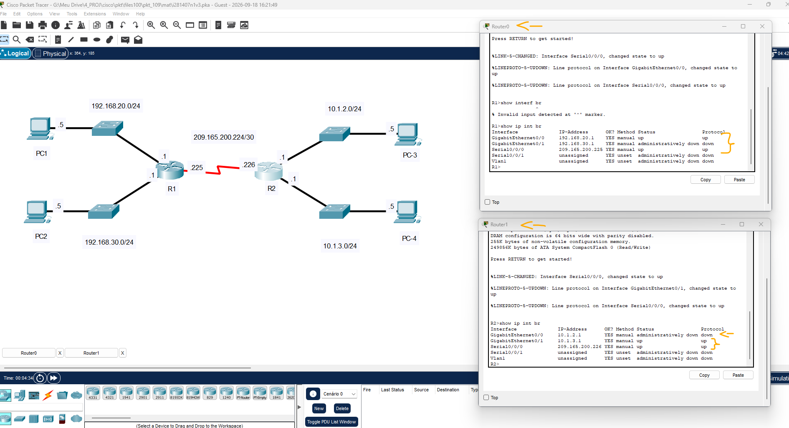

# CCNA: ITN - Módulo 10 - Exam - Q27   

### Cisco: <a href="../../../">cisco   </a>
### Cisco Networking Academy: cna   </a>
### Training Category: <a href="../../../pkt/">pkt</a>
### Software/Subject: network   </a>
### Course: <a href="./">pkt_109 (CCNA: ITN - Módulo 10 - Exam - Q27)   </a>

---

### Theme:
- Network

### Used Tools:
- Operating System (OS): 
  - Cisco Internetwork Operating System (Cisco IOS)   
  - Windows 11 
- Cloud Services:
  - Google Drive 
- Language:
  - HTML   
  - Markdown   
- Integrated Development Environment (IDE) and Text Editor:
  - Visual Studio Code (VS Code)   
- Versioning: 
  - Git   
- Repository:
  - GitHub   
- Network:
  - Cisco Packet Tracer   

---

<h3><a name="item00">Course Strcuture:</a></h3>

1. <a href="#item01">CCNA: ITN - Módulo 10 - Exam - Q27</a> 

---

### Objective:
O objetivo deste PTSA foi verificar e identificar o status operacional das interfaces dos roteadores.

### Folder Structure:
- [README.md](./README.md): Este documento de README, escrito em **Markdown**, com o conteúdo do laboratório.
- [0-aux](./0-aux/): Pasta auxiliar com imagens utilizadas na construção dos arquivos de README desse curso.

### Development:

<a name="item01"><h4>1. CCNA: ITN - Módulo 10 - Exam - Q27</h4></a>[Back to summary](#item00)

- a. As interfaces dos roteadores R1 e R2 foram configuradas. Use um comando para verificar a configuração das interfaces em ambos os roteadores.
  - `show ip interface brief`.
- a. Quais interfaces em cada roteador estão ativas e operacionais?
  - No roteador R0 as interfaces ativas são: g0/0 e s0/0/0. A interface g0/1 está desativada.
  - No roteador R1 as interfaces ativas são: g0/1 e s0/0/0. A interface g0/0 está desativada.

A imagem 01 apresenta o status das interfaces de cada roteador.

<figure>
     
    <figcaption>Imagem 01.</figcaption>
</figure>
 