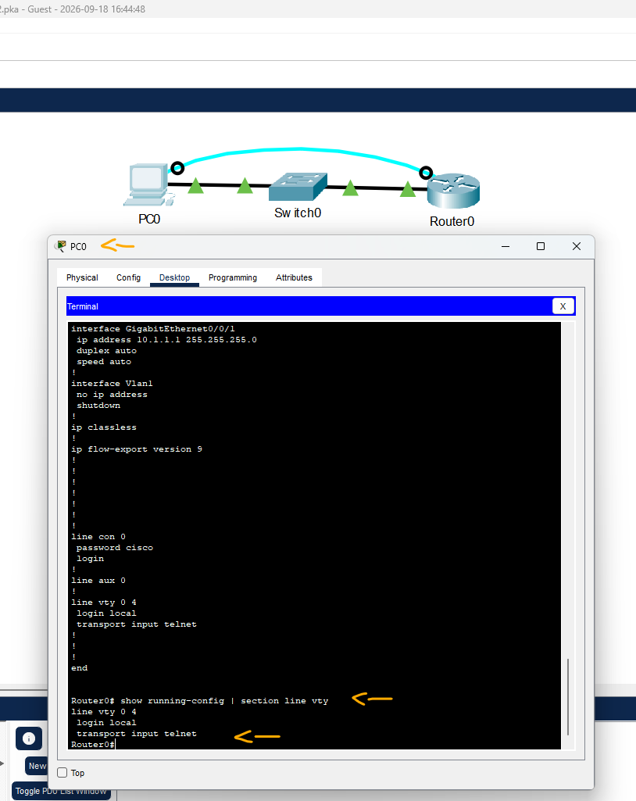

# CCNA: ITN - Módulo 17 - Exam - Q31   

### Cisco: <a href="../../../">cisco   </a>
### Cisco Networking Academy: cna   </a>
### Training Category: <a href="../../../pkt/">pkt</a>
### Software/Subject: network   </a>
### Course: <a href="./">pkt_111 (CCNA: ITN - Módulo 17 - Exam - Q31)   </a>

---

### Theme:
- Network

### Used Tools:
- Operating System (OS): 
  - Cisco Internetwork Operating System (Cisco IOS)   
  - Windows 11 
- Cloud Services:
  - Google Drive 
- Language:
  - HTML   
  - Markdown   
- Integrated Development Environment (IDE) and Text Editor:
  - Visual Studio Code (VS Code)   
- Versioning: 
  - Git   
- Repository:
  - GitHub   
- Network:
  - Cisco Packet Tracer   

---

<h3><a name="item00">Course Strcuture:</a></h3>

1. <a href="#item01">CCNA: ITN - Módulo 17 - Exam - Q31</a> 

---

### Objective:
O objetivo deste PTSA foi revisar a configuração das linhas VTY, identificando a definição necessária para permitir o acesso remoto de forma adequada.

### Folder Structure:
- [README.md](./README.md): Este documento de README, escrito em **Markdown**, com o conteúdo do laboratório.
- [0-aux](./0-aux/): Pasta auxiliar com imagens utilizadas na construção dos arquivos de README desse curso.

### Development:

<a name="item01"><h4>1. CCNA: ITN - Módulo 17 - Exam - Q31</h4></a>[Back to summary](#item00)

- a. Use o aplicativo Terminal na guia Área de trabalho no PC0 para acessar o Roteador 0. Observe que todas as senhas são configuradas como cisco. Determine a configuração parcial do SSH atual no Roteador 0.
  - `cisco` -> `enable` -> `cisco` -> `show running-config | section line vty`.
- b. Qual comando deve ser configurado no roteador para concluir a configuração SSH?
  - O comando que deve ser configurado é `transport input ssh`, que altera o método de acesso remoto das linhas VTY de Telnet para SSH. O SSH fornece uma conexão criptografada, enquanto o Telnet transmite as informações em texto claro, sendo menos seguro.

A imagem 01 mostra as configurações das linhas VTY exibidas no arquivo de configuração em execução do dispositivo.

<figure>
     
    <figcaption>Imagem 01.</figcaption>
</figure>
 