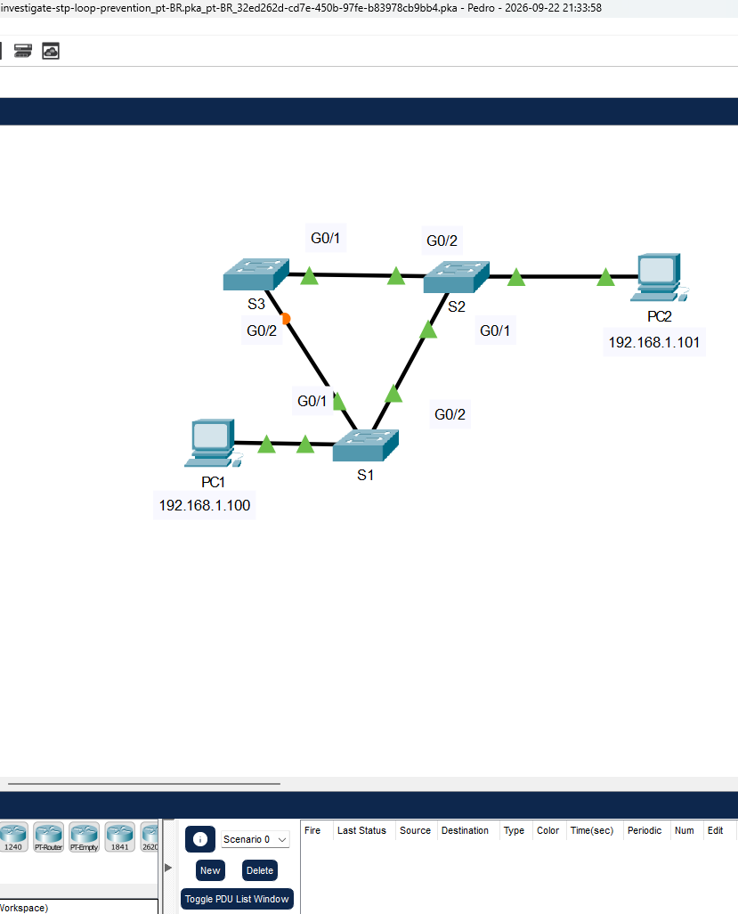
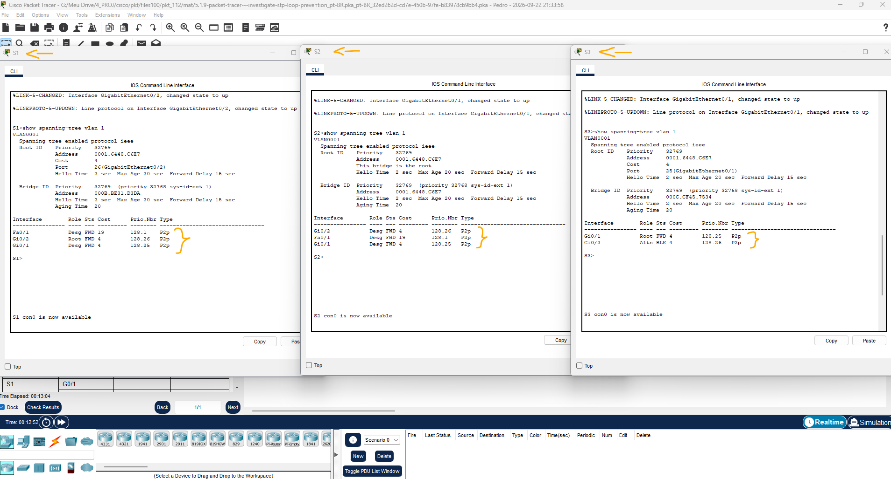
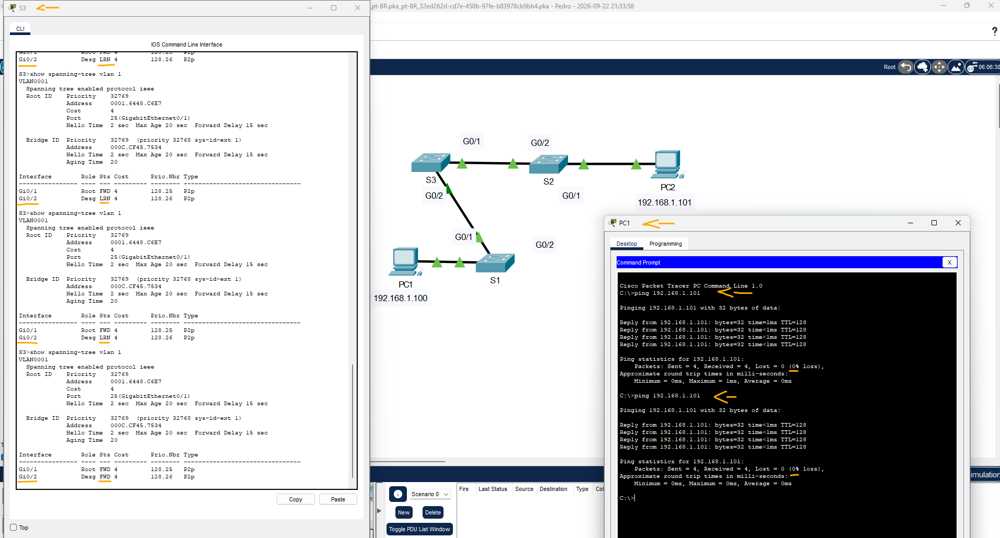

# Packet Tracer - Investigar a Prevenção de Loop de STP   

### Cisco: <a href="../../../">cisco   </a>
### Cisco Networking Academy: cna   </a>
### Training Category: <a href="../../../pkt/">pkt</a>
### Software/Subject: network   </a>
### Course: <a href="./">pkt_112 (Packet Tracer - Investigar a Prevenção de Loop de STP)   </a>

---

### Theme:
- Network

### Used Tools:
- Operating System (OS): 
  - Cisco Internetwork Operating System (Cisco IOS)   
  - Windows 11 
- Cloud Services:
  - Google Drive 
- Language:
  - HTML   
  - Markdown   
- Integrated Development Environment (IDE) and Text Editor:
  - Visual Studio Code (VS Code)   
- Versioning: 
  - Git   
- Repository:
  - GitHub   
- Network:
  - Cisco Packet Tracer   
  - ping   

---

<h3><a name="item00">Course Strcuture:</a></h3>

1. <a href="#item01">Parte 1: Observar uma instância de árvore de abrangência convergente</a> 
  1.1 <a href="#item01.01">Etapa 1: Verificar a conectividade.</a> 
  1.2 <a href="#item01.02">Etapa 2: Exibir o status da árvore de abrangência em cada switch.</a> 
2. <a href="#item02">Parte 2: Observar convergência de árvore de abrangência</a> 
  2.1 <a href="#item02.01">Etapa 1: Remova a conexão entre S1 e S2.</a> 
  2.2 <a href="#item02.02">Etapa 2: Observe a convergência da árvore de abrangência.</a> 

---

### Objective:
Esta atividade teve como objetivo compreender o funcionamento do protocolo Spanning Tree Protocol (STP) no processo de convergência da árvore de abrangência, verificando como ele determina os estados e os papéis das interfaces dos switches, calcula os custos até a Root Bridge e previne loops de camada 2. Além disso, foi verificado como o STP reage a modificações na topologia, realizando os ajustes necessários para manter a conectividade da rede.

### Folder Structure:
- [README.md](./README.md): Este documento de README, escrito em **Markdown**, com o conteúdo do laboratório.
- [0-aux](./0-aux/): Pasta auxiliar com imagens utilizadas na construção dos arquivos de README desse curso.

### Development:

<a name="item01"><h4>1. Parte 1: Observar uma instância de árvore de abrangência convergente</h4></a>[Back to summary](#item00)

A imagem 01 mostra a topologia inicial.

<figure>
     
    <figcaption>Imagem 01.</figcaption>
</figure>
 

<a name="item01.01"><h4>1.1 Etapa 1: Verificar a conectividade.</h4></a>[Back to summary](#item00)

- a. Ping de PC1 para PC2 para verificar a conectividade entre os hosts. O ping deve obter êxito.
  - `ping 192.168.1.101`.

<a name="item01.02"><h4>1.2 Etapa 2: Exibir o status da árvore de abrangência em cada switch.</h4></a>[Back to summary](#item00)

- a. Use o comando show spanning-tree vlan 1 para coletar informações sobre o status da árvore de abrangência de cada switch. Preencha a tabela. Para fins da atividade, considere apenas informações sobre as portas de tronco Gigabit. As portas Fast Ethernet são portas de acesso com dispositivos finais conectados e não fazem parte da árvore de abrangência baseada em troncos entre switches.
  - `show spanning-tree vlan 1`.

#### Tabela 1 — Estado das Portas e Root Bridge

| Switch | Porta | State | Role |
|:------:|:-----:|:-----:|:----:|
| S1     | G0/1  | FWD   | Desg |
| S1     | G0/2  | FWD   | Root |
| S2     | G0/1  | FWD   | Desg |
| S2     | G0/2  | FWD   | Desg |
| S3     | G0/1  | FWD   | Root |
| S3     | G0/2  | BLK   | Altn |

- a. O Packet Tracer usa uma luz de link diferente em uma das conexões entre os switches. O que você acha que esta luz de ligação significa?
  - A luz verde indica que o enlace está no estado forwarding, permitindo o encaminhamento de quadros. Já a luz laranja indica que a porta está no estado blocking, impedindo o encaminhamento de quadros para evitar loops.
- a. Qual caminho os quadros tomarão do PC1 para o PC2?
  - Os quadros serão encaminhados do PC1 para o S1, em seguida para o S2 e, por fim, chegarão ao PC2.
- a. Por que os quadros não viajam pelo S3?
  - Porque a porta G0/2 do S3 encontra-se no estado blocking pelo Spanning Tree Protocol (STP), impedindo que os quadros sejam encaminhados por esse enlace.
- a. Por que a árvore de abrangência colocou uma porta no estado de bloqueio?
  - Para evitar loops de camada 2 causados pela existência de caminhos redundantes entre os switches. O STP bloqueia um dos caminhos redundantes, mantendo uma topologia lógica sem loops.

A imagem 02 apresenta as configurações das interfaces de cada switch no Spanning Tree Protocol (STP) para a VLAN 1, considerando que, nessa arquitetura, todas as portas pertencem à mesma VLAN.

<figure>
     
    <figcaption>Imagem 02.</figcaption>
</figure>
 

<a name="item02"><h4>2. Parte 2: Observar convergência de árvore de abrangência</h4></a>[Back to summary](#item00)

<a name="item02.01"><h4>2.1 Etapa 1: Remova a conexão entre S1 e S2.</h4></a>[Back to summary](#item00)

- a. Abra uma janela da CLI no switch S3 e emita o comando show spanning-tree vlan 1. Deixe a janela da CLI aberta.
  - `show spanning-tree vlan 1`.
- b. Selecione a ferramenta de exclusão na barra de menus e clique no cabo que conecta S1 e S2.

<a name="item02.02"><h4>2.2 Etapa 2: Observe a convergência da árvore de abrangência.</h4></a>[Back to summary](#item00)

- a. Retorne rapidamente ao prompt da CLI no switch S3 e emita o comando show spanning-tree vlan 1.
  - `show spanning-tree vlan 1`.
- b. Use a tecla de seta para cima para recuperar o comando show spanning-tree vlan 1 e emita repetidamente até que a luz de link laranja no cabo fique verde. Observe o status da porta G0/2.
  - `show spanning-tree vlan 1`.
- b. O que você vê acontecer com o status da porta G0/2 durante esse processo?
  - O status da porta G0/2 passa para Forwarding, permitindo o encaminhamento de quadros, e a luz de link muda de laranja para verde.
- b. Você observou a transição no status da porta que ocorre quando uma porta de árvore de abrangência passa do bloqueio para o estado de encaminhamento.
- c. Verifique a conectividade por ping de PC1 para PC2. O ping deve obter êxito.
  - `ping 192.168.1.101`.
- c. Há alguma porta mostrando uma luz de link laranja que indica que a porta está em um estado de árvore de abrangência diferente do encaminhamento?
  - Não. Neste momento, não há nenhuma porta com a luz de link laranja, pois não existem caminhos redundantes na topologia.
- c. Por que usar esse cabo ou por que não usar esse cabo?
  - Estamos nos referindo ao enlace que foi mantido em relação ao enlace removido? Como todos os enlaces são Gigabit Ethernet de 1000 Mb/s, cada enlace possui custo STP igual a 4. Dessa forma, o caminho S1 → S2 → PC2 possui custo total de 8, enquanto o caminho alternativo S1 → S3 → S2 → PC2 possui custo total de 12. Portanto, o STP prefere o caminho de menor custo, utilizando o enlace direto entre S1 e S2.

A imagem 03 evidencia que, após a exclusão do enlace de menor custo, o S3, por meio do STP, alterou o papel da porta de alternativo para designado. O estado da porta também foi alterado sequencialmente de BLK para LSN, depois LRN, até permanecer em FWD, momento em que a luz do enlace mudou para verde.

<figure>
     
    <figcaption>Imagem 03.</figcaption>
</figure>
 