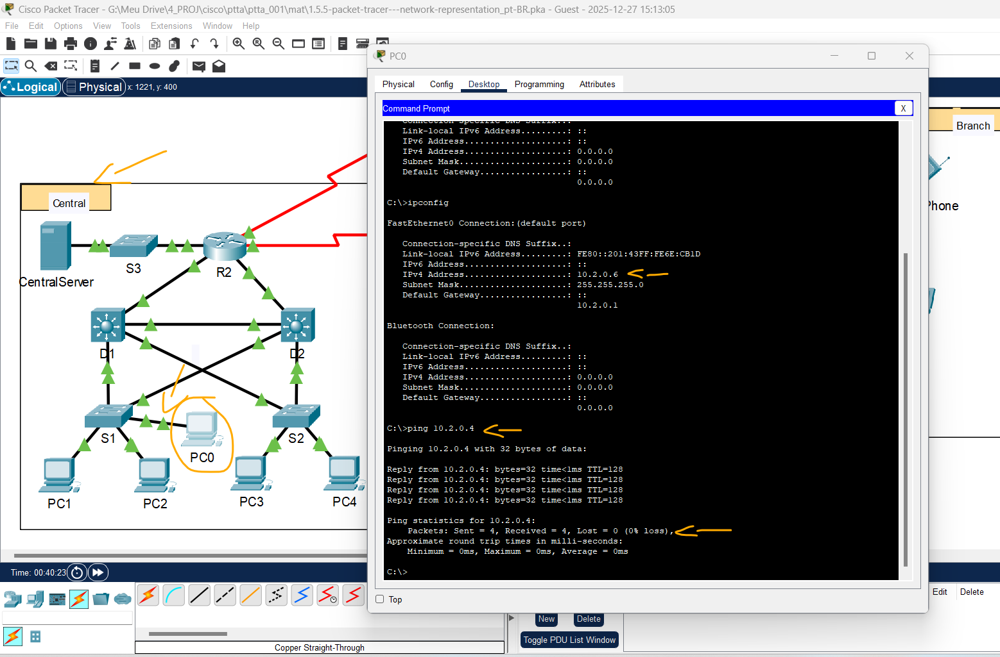
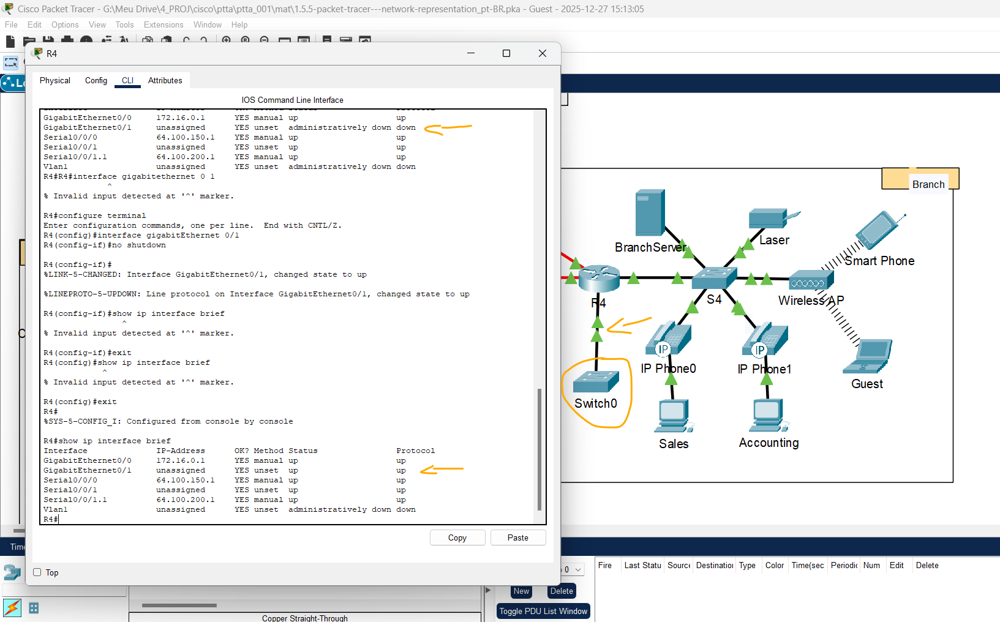
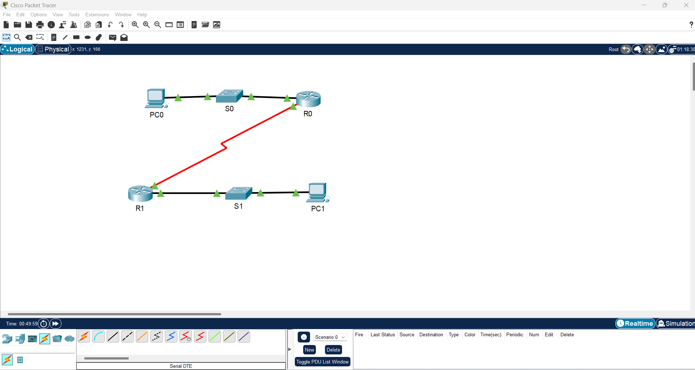

# Packet Tracer: representação da Rede   

### Cisco: <a href="../../">cisco   </a>
### Cisco Networking Academy: cna   </a>
### Training Category: <a href="../../ptta/">ptta</a>
### Software/Subject: network   </a>
### Course: <a href="./">ptta_001 (Packet Tracer: representação da Rede)   </a>

---

### Theme:
- Network

### Used Tools:
- Operating System (OS): 
  - Windows 11 
- Cloud Services:
  - Google Drive 
- Language:
  - HTML   
  - Markdown   
- Integrated Development Environment (IDE) and Text Editor:
  - Visual Studio Code (VS Code)   
- Versioning: 
  - Git   
- Repository:
  - GitHub   
- Network:
  - Cisco Internetwork Operating System (Cisco IOS)   
  - Cisco Packet Tracer 

---

<h3><a name="item00">Course Strcuture:</a></h3>

1. <a href="#item01">Etapa 1: Identificar os componentes comuns de uma rede tal como representados no Packet Tracer.</a> 
2. <a href="#item02">Etapa 2: Explicar o objetivo dos dispositivos.</a> 
3. <a href="#item03">Etapa 3: Comparar e contrastar LANs e WANs.</a> 
4. <a href="#item04">Pergunta do Desafio</a> 

---

### Objective:
O objetivo deste PTTA foi promover a familiarização com o software **Cisco Packet Tracer**, compreendendo as formas de representação de uma rede e explorando suas principais funcionalidades.

### Folder Structure:
- [README.md](./README.md): Este documento de README, escrito em **Markdown**, com o conteúdo desta atividade.
- [0-aux](../0-aux/): Pasta auxiliar com imagens utilizadas na construção dos arquivos de README desse curso.

### Development:

<a name="item01"><h4>1. Etapa 1: Identificar os componentes comuns de uma rede tal como representados no Packet Tracer.</h4></a>[Back to summary](#item00)

- a. Liste as categorias intermediárias de dispositivo.
  - Routers; Switches; Hubs; Wireless Devices; Security; WAN Emulation.
- b. Sem entrar na nuvem da Internet ou na intranet, quantos ícones na topologia representam dispositivos de terminal (apenas uma conexão levando a eles)? 
  - 4 (Home Office) + 5 (Central) + 6 (Branch) = 15.
- c. Sem contar as duas nuvens, quantos ícones na topologia representam dispositivos intermediários (várias conexões que levam a eles)? 
  - 2 (Home Office) + 5 (Central) + 3 (Branch) = 10.
- d. Quantos dispositivos finais não são computadores de mesa? 
  - 15 - 7 = 8.
- e. Quantos tipos diferentes de conexões de meio físico são usados nesta topologia de rede? 
  - Cabo Ethernet (Preto Sólido) + Cabo Serial (Vermelho Zig-Zag) + Cabo Coaxial (Azul Curvo) + Sem-Fio (Ondas/Pontilhado) = 4.

<a name="item02"><h4>2. Etapa 2: Explicar o objetivo dos dispositivos.</h4></a>[Back to summary](#item00)

- a. No Packet Tracer, somente o dispositivo servidor PT pode atuar como um servidor. Os computadores desktop e laptop não podem atuar como um servidor. Com base em seus estudos até agora, explique o modelo cliente-servidor.
  - O modelo cliente-servidor é uma arquitetura de rede onde o cliente (um computador ou celular) inicia a comunicação enviando solicitações de serviços ou dados. Em resposta, o servidor recebe esses pedidos, processa as informações necessárias e devolve o resultado para o dispositivo que o solicitou.
- b. Liste de pelo menos duas funções de dispositivos intermediários.
  - Rotear e Comutar.
- c. Liste pelo menos dois critérios para escolher um tipo de meio físico de rede.
  - Ambiente, Custo, Distância e Largura da Banda.

<a name="item03"><h4>3. Etapa 3: Comparar e contrastar LANs e WANs.</h4></a>[Back to summary](#item00)

- a. Explique a diferença entre uma LAN e uma WAN. Dê exemplos de cada uma. 
  - A principal diferença está na abrangência geográfica: a LAN conecta dispositivos em uma área restrita e controlada, enquanto a WAN interconecta essas redes locais por vastas distâncias, atravessando cidades ou países através de provedores de telecomunicações. Como exemplos práticos, a rede Wi-Fi da sua casa é uma LAN, ao passo que a Internet é a maior e mais conhecida WAN do mundo.
- b. Na rede do Packet Tracer, quantas WANs você vê? 
  - Internet + Intranet = 2.
- c. Quantas LANs você vê? 
  - Home Office + Central + Branch = 3.
- d. A internet nesta rede Packet Tracer é excessivamente simplificada e não representa a estrutura e a forma da internet real. Descreva brevemente a internet. 
  - A internet é uma rede global de redes interconectadas, formada por uma malha complexa e descentralizada de infraestruturas físicas geridas por diversos Provedores de Serviços de Internet (ISPs). Ao contrário da simplificação do simulador, ela não possui um dono central e depende da cooperação entre milhares de empresas e cabos (terrestres e submarinos) para permitir a comunicação mundial.
- e. Quais são algumas das maneiras comuns de um usuário doméstico se conectar à Internet? 
  - Cabo de Cobre; Fibra Óptica; DSL; Torre de Rádio; Satélite.
- f. Quais são alguns métodos comuns que as empresas usam para se conectar à Internet em sua área? 
  - Link Dedicado; Metro Ethernet; SD-WAN.

<a name="item04"><h4>4. Pergunta do Desafio</h4></a>[Back to summary](#item00)

- Adicione um dispositivo final à topologia e conecte-o a uma das redes locais com uma conexão de meio físico. O que mais esse dispositivo precisa para enviar os dados a outros usuários finais? Você pode fornecer essas informações? Há uma maneira de confirmar se você conectou adequadamente o dispositivo? 
  - PC0 conectado ao Switch S1 na LAN Central com cabo Ethernet. Foi necessário realizar a configuração de IP que incluíu: endereço IP, Máscara de sub-rede e Gateway Padrão. Essa configuração podia ser manual ou automática via DHCP.
    - PC0 -> Desktop -> IP Configuration -> Ativar DHCP.
    - PC0 -> Desktop -> Command Prompt -> Executar um Ping para o PC1 -> `ping 10.2.0.4` (Imagem 01).

<figure>
     
    <figcaption>Imagem 01.</figcaption>
</figure>
 

- Adicione um novo dispositivo intermediário a uma das redes e conecte-o a uma das LANs ou WANs com uma conexão de meio físico. O que mais esse dispositivo precisa para servir como um intermediário para outros dispositivos na rede? 
  - Switch0 conectado ao Roteador R4 via cabo Ethernet. Foi necessário ativar a porta conectada no roteador.
    - R4 -> CLI -> `enable` -> `class` -> `show ip interface brief` -> `configure terminal` -> `interface gigabitEthernet 0/1` -> `no shutdown` -> `exit` -> `exit` -> `show ip interface brief` (Imagem 02).
  - Laptop0 adicionado ao Switch0 via cabo Ethernet. Para servir como intermediário foi necessário adicionar um dispositivo final.

<figure>
     
    <figcaption>Imagem 02.</figcaption>
</figure>
 

- Abra uma nova instância do Packet Tracer. Crie uma nova rede com pelo menos duas redes locais conectadas por WAN. Conecte todos os dispositivos. Investigue a atividade original do Packet Tracer para ver o que mais você precisa fazer para tornar sua nova rede funcional. Registre seus pensamentos e salve o seu arquivo do Packet Tracer. Pode ser interessante rever a sua rede mais tarde, depois de adquirir mais algumas habilidades. (Imagem 03)
  - Criar R0, S0 e PC0 do lado esquerdo conectados via cabo Ethernet.
  - Criar R1, S1 e PC1 do lado direito conectados via cabo Ethernet.
  - Desligar routers R0 e R1 e adicionar o módulo NIM-2T em ambos.
  - Conectar R0 e R1 via cabo Serial (DTE).
  - Configurar os routers R0 e R1:
    - Would you like to enter the initial configuration dialog? [yes/no]: `yes`.
    - Would you like to enter basic management setup? [yes/no]: `yes`.
    - Enter host name [Router]: `r0` e `r1`
    - Enter enable secret: `cisco`.
    - Enter enable password: `class`.
    - Enter virtual terminal password: `class`.
    - Configure SNMP Network Management? [no]: `no`.
    - Enter interface name used to connect to the management network from the above interface summary: `Vlan1`.
    - Configuring interface Vlan1:
      - Configure IP on this interface? [yes]: `yes`.
      - IP address for this interface: `192.168.1.2`.
      - Subnet mask for this interface [255.255.255.0]: `255.255.255.0`.
    - Enter your selection [2]: [2] Save this configuration to nvram and exit: `2`.
  - Ativar as interfaces dos routers R0 e R1:
    - CLI -> `enable` -> `cisco/class` -> `show ip interface brief` -> `configure terminal` -> `interface gigabitethernet 0/0/0` -> `no shutdown` -> `end` -> `show ip interface brief`.
    - CLI -> `enable` -> `cisco/class` -> `show ip interface brief` -> `configure terminal` -> `interface serial 0/1/0` -> `no shutdown` -> `end` -> `show ip interface brief`.

<figure>
     
    <figcaption>Imagem 03.</figcaption>
</figure>
 
